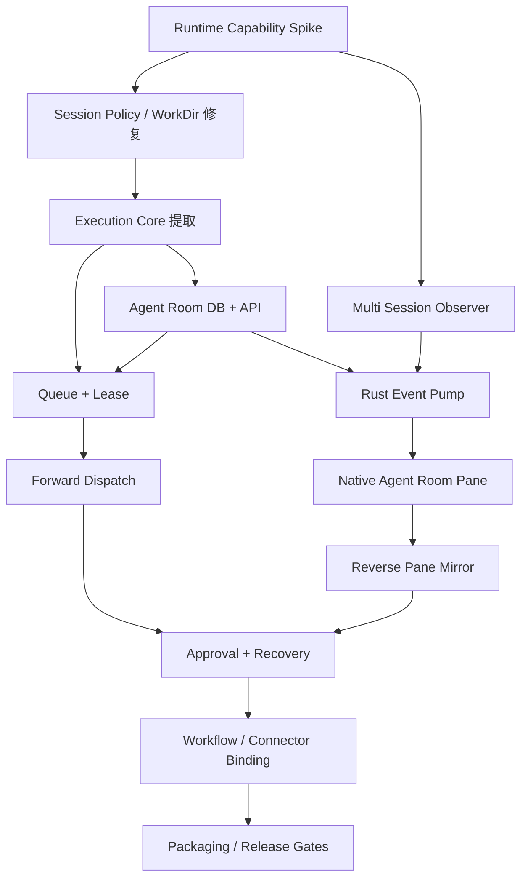

# Agent Room 实施计划（PLAN）

- 仓库：`endearqb/kimi-app`
- 基线：`main@1cc7dbaca9405d055bd237e2b6f6db83b1cc86cf`
- 文档日期：2026-07-18
- 文档状态：Draft v1.1（v1.0 经仓库逐项核对后修订；核对记录见 §32）
- 产品依据：`PRD.md`
- 技术依据：`SPEC.md`
- 排序原则：先保证 Workspace/Session 正确性，再上观察，再上调度，最后上协作编排

---

## 1. 实施目标

在不破坏现有 Workspace Grid、Kimi Code Web、飞书/微信 Bridge 和发布流程的前提下，分阶段交付：

1. 可持久化的 Agent Profile 与 Agent Room；
2. Agent Room 原生 Pane；
3. 现有 1–6 个 Code Pane Session 的反向镜像；
4. 从 Room 向指定 Agent Session 正向分派任务；
5. 准确打开/聚焦 Session Pane；
6. Session Queue、Lease、Abort、Approval；
7. 重启恢复和能力降级；
8. 并行与多阶段协作；
9. Agent 与外部 Connector 解耦绑定。

---

## 2. 实施原则

### 2.1 小 PR、可回滚

不得以一个大 PR 同时修改 Grid Schema、Bridge Store、Runtime Observer、UI 和 Connector。

### 2.2 Schema 先行但 UI 后置

数据库和类型可以先合入，Feature Flag 默认关闭，避免半成品入口暴露。

### 2.3 先解决现有正确性缺口

Agent Room 依赖以下前置：

- per-connector WorkDir 真正传到 Go Adapter；
- exact Session Policy；
- 不再隐式复用 `sessions[0]`；
- Session Lease/Queue；
- Server Provider 可用性明确。

### 2.4 Observer 先于 Forward Dispatch

先证明已有 Pane Session 可以被稳定识别、观察、重连和打开，再允许 Agent Room 主动创建更多 Session 和 Run。

### 2.5 React 不持有 token

任何为了快速实现而让 React 直连 Sidecar 或 Runtime 的方案不得进入主分支。

### 2.6 不假设未验证 Runtime API

Transcript、用户 Prompt Event、动态订阅、Abort 和 Follow-up 必须先做 Capability Spike。

---

## 3. 工作流与里程碑

```text
M0 规格与 Capability Spike
 ↓
M1 Session 正确性与 Sidecar 通用化
 ↓
M2 Agent Room 数据层与 API
 ↓
M3 Observer-only MVP
 ↓
M4 Native Agent Room Pane
 ↓
M5 Forward Dispatch MVP
 ↓
M6 双向控制、Approval 与恢复
 ↓
M7 Workflow 与 Connector 绑定
 ↓
M8 发布与安装包验证
```

---

## 4. 关键路径



---

## 5. Phase 0：基线、契约与 Runtime Capability Spike

### 目标

在改动产品代码前，关闭所有 Runtime 协议不确定性，并建立可重复测试夹具。

### AR-000：锁定基线

- [x] 在实施分支记录起始 commit（`main@1cc7dbaca9405d055bd237e2b6f6db83b1cc86cf`；未切换、reset 或清理工作树）。
- [ ] 运行现有 Gate：
  - `go test ./...` in `apps/kimi-im-bridge`
  - `cargo test --manifest-path apps/kimi-shell/src-tauri/Cargo.toml`
  - `pnpm -C apps/kimi-shell build`
  - 仓库现有前端测试命令
- [x] 保存当前 Workspace Grid、Bridge Admin、Server Adapter 测试结果（Go 全包、前端 134 tests/build 通过；Rust test binary 与 Go race 的既有环境失败已单列）。
- [ ] 保存 1、2、6 Pane 手工基线截图/日志，不提交凭据。

交付：

- 基线测试记录；
- 已知失败清单；
- 不把旧失败归因于 Agent Room。

### AR-001：Runtime Capability Probe

新增开发期 Probe，不进入最终 UI：

- [x] 验证 `/api/v1/ws` 可否同时订阅 2、6、12 个 Session（真实 Runtime hello/ack 均接受）。
- [x] 验证 Cursor 是全局还是 per-session（per-Session `{seq, epoch}`）。
- [x] 验证断线重连是否补发（durable journal 按 per-Session Cursor replay）。
- [x] 验证 `resync_required`（旧 epoch / 无效 Cursor 触发并返回服务端 Cursor）。
- [x] 记录所有实际 Event Type 与 Payload 样例，脱敏（以 0.27.0 可执行 event schema 为准；报告不保存 Session ID/token）。
- [x] 验证是否存在用户消息事件（`prompt.submitted` 含 content）。
- [x] 验证 Session Transcript/Message Endpoint（真实 GET `/messages` 返回 200）。
- [x] 验证 Abort Endpoint 和完成确认（端点/`prompt.aborted` 契约存在；真实完成时限未执行写探测，能力按 false 降级，禁止 Abort 未确认替代）。
- [x] 验证同一 Session Prompt 并发/排队语义（Runtime 暴露 active/queued FIFO 与 steer；Agent Room 仍使用本地 FIFO + Lease）。
- [x] 验证 Approval 一次/Session 范围（wire 支持 Session scope；跨重启范围未获证据，V1 降级为 one-shot）。
- [x] 验证 Session 状态枚举与 `last_seq`（真实列表读取；0.27.0 session schema 冻结实际字段）。
- [x] 验证 Prompt 相关事件是否总携带 `prompt_id`（结论：否；仅 Prompt 事件稳定携带，Observer 不得复用缺失即放行的过滤器）。
- [x] 验证 `wsCursor.epoch` 语义与 Runtime 重启的关系（正常重启保持 epoch/seq；journal 重建才换 epoch 并 resync）。
- [x] 验证 `POST /sessions/{id}/prompts` 是否接受附件及请求体格式（支持 image/video/file content parts；AR-104 映射）。
- [x] 验证 Server WS 是否产生 artifact 类事件（结论：0.27.0 没有；移除 Room artifact 事件承诺）。
- [x] 验证 Prompt `metadata` 是否会在 WS 事件中回带（结论：0.27.0 不回带，不能作为归属依据）。

注：Abort 的 REST 端点与幂等允许码已存在于 `server_adapter.go`（`:abort`），Probe 只需验证 `turn.ended(reason=aborted)` 确认与超时行为，不必从零探测端点。

建议文件：

```text
apps/kimi-im-bridge/cmd/runtime-probe/
apps/kimi-im-bridge/internal/runtime/capabilities.go
apps/kimi-im-bridge/internal/runtime/capabilities_test.go
```

验收：

- [x] 形成机器可读 `RuntimeCapabilities`；
- [x] `SPEC.md` 中 CG-001～CG-009 均有实际结论；
- [x] 未支持能力有明确降级方案。

当前证据（2026-07-18）：只读 Probe 与脱敏测试已实现；官方 Runtime 0.27.0 临时启动后完成只读 2/6/12 hello/ack 与 Transcript 验证并已停止。未执行的写入型时序能力以 `supported=false` 与明确 degradation 收口，不能用 Fake Runtime 结果冒充真实支持。

### AR-002：建立 Fake Runtime Harness

- [x] Fake `/workspaces`。
- [x] Fake `/sessions` 列表/查单/创建。
- [x] Fake `/sessions/{id}/prompts`。
- [x] Fake `/api/v1/ws`。
- [x] 支持 Sequence、Duplicate、Out-of-order、Reconnect。
- [x] 支持 Approval 与 Abort。
- [x] 支持 Runtime restart epoch。
- [x] 支持 Transcript on/off。

验收：

- Go Observer 和 Coordinator 的集成测试不依赖真实凭据；
- Rust Event Pump 可用本地 Fake Sidecar 测试。

### Phase 0 Gate

- [x] 现有测试基线清楚；
- [x] Runtime 能力报告完成；
- [x] Fake Runtime 可覆盖关键事件；
- [x] 未修改用户数据 schema；
- [x] 未暴露 UI。

---

## 6. Phase 1：Session 正确性与 Sidecar 通用化

### 目标

先解决当前与 Agent Room 直接冲突的 Workspace/Session 问题。

### AR-100：Go ConnectorConfig 接收 per-connector WorkDir

修改：

```text
apps/kimi-im-bridge/internal/config/config.go
apps/kimi-im-bridge/internal/app/app.go
apps/kimi-im-bridge/internal/config/config_test.go
apps/kimi-im-bridge/internal/app/app_test.go
```

任务：

- [x] `ConnectorConfig` 增加 `defaultWorkDir`。
- [x] 增加 `resetBindingSessionOnStart`，如 Go 侧需要读取。
- [x] normalization 保留 Connector override。
- [x] Adapter 使用 Connector WorkDir，空值回退 Bridge 全局 WorkDir。
- [x] Feishu/Weixin/Telegram 一致（Shell UI 当前仅提供飞书/微信并会幂等删除 Shell 管理的 Telegram connector；Telegram 仅需在 Go 层保持一致）。
- [x] 配置 round-trip 测试。
- [x] Legacy settings 兼容测试。

验收：

- 4 个 Connector 可解析 4 个不同 WorkDir；
- 不配置 override 时行为与当前一致；
- Go 与 Rust JSON 字段完全匹配。

### AR-101：明确 Session Create Mode

修改：

```text
apps/kimi-im-bridge/internal/runtime/types.go
apps/kimi-im-bridge/internal/runtime/server_adapter.go
apps/kimi-im-bridge/internal/providers/runtimeadapter/provider.go
相关测试
```

任务：

- [x] 增加 `SessionCreateMode`。
- [x] `resume_exact` 只接受准确 Session ID。
- [x] `always` 强制创建新 Session。
- [x] `if_missing` 只在明确兼容路径使用。
- [x] `reuse_latest` 如保留，必须显式调用。
- [x] 删除 Agent Room 路径中的 `sessions[0]` 默认语义。
- [x] Server Adapter 返回 Workspace ID/Root/Session Source。
- [x] Workspace 多 Session 测试。

验收：

- `new_per_task` 两次调用产生两个 Session；
- `resume_exact` 不存在时明确失败；
- 未显式复用时不会选择 Workspace 第一条 Session。

### AR-102：Session 唯一性审计

- [x] 查询现有 `channel_bindings` 是否有重复 Kimi Session。
- [x] 决定 IM Binding 是否允许跨 Connector 共享 Session。
- [x] 保留当前 Router “一个 Session 一个机器人 Binding”规则。
- [x] 为 Agent Room 使用独立表，不把 synthetic Connector 写入 `channel_bindings`。
- [x] 添加 Store 层防重复测试。

注意：

不建议立即对所有 `channel_bindings.kimi_session_id` 添加全局唯一索引，除非迁移审计确认不会破坏合法历史数据。可先通过 Store 事务保证。

### AR-103：Sidecar 启动语义拆分

修改：

```text
apps/kimi-shell/src-tauri/src/bridge_manager.rs
apps/kimi-shell/src-tauri/src/app_state.rs
apps/kimi-shell/src-tauri/src/types.rs
apps/kimi-im-bridge/internal/app/app.go
```

目标：

```text
Sidecar Core Running
├── Agent Room Core
└── External IM Adapters（可独立禁用）
```

任务：

- [ ] `BridgeSettings.Enabled` 只控制外部 Adapter。
- [ ] Agent Room 使用时可懒启动 Sidecar。
- [ ] 外部 IM 未启用也能启动 Admin/Runtime/Agent Room。
- [ ] Sidecar 状态中区分 Core 与 Connector。
- [ ] 保持旧 `start_bridge` Tauri Command 兼容。
- [ ] 日志文案逐步使用 `orchestration service`，二进制名暂不改。

验收：

- 无飞书/微信配置时 Agent Room 可用；
- Agent Room 关闭且外部 IM 不需要时 Sidecar 可停止；
- Connector 行为无回归。

### AR-104：Server 路径附件透传修复

前置：AR-001 中 CG-007 结论。

修改：

```text
apps/kimi-im-bridge/internal/runtime/server_adapter.go
apps/kimi-im-bridge/internal/runtime/server_adapter_test.go
```

任务：

- [ ] 按 CG-007 验证结论把 `AdapterPromptRequest.Attachments` 序列化进 `/prompts` 请求体。
- [x] Runtime 不支持附件时：`SubmitPrompt` 返回明确错误 `attachments_unsupported`，不静默丢弃。
- [x] IM（飞书图片/文件）与 Agent Room 附件共用 Server Provider 路径，附回归测试。
- [x] 该缺口同时影响现有 IM 功能，修复不依赖 Agent Room Feature Flag。

验收：

- 带附件的 Server Provider Turn 要么携带附件成功提交，要么显式失败；
- 纯文本 Turn 行为不变。

### Phase 1 Gate

- [x] per-connector WorkDir 通过；
- [x] Session Create Mode 通过；
- [x] Agent Room 不依赖 synthetic Connector Binding；
- [x] Sidecar 可在 External IM Disabled 下运行；
- [x] 附件在 Server 路径显式失败（AR-104；真实附件 wire contract 未验证前 fail closed）；
- [x] Go/Rust/前端现有测试通过。

---

## 7. Phase 2：Execution Core、Lease 与 Queue

### 目标

建立 Agent Room 和外部 IM 共享的安全执行内核。

### AR-200：提取 ExecutionService

修改：

```text
apps/kimi-im-bridge/internal/bridgecore/orchestrator.go
apps/kimi-im-bridge/internal/bridgecore/execution_service.go
apps/kimi-im-bridge/internal/bridgecore/execution_types.go
相关测试
```

任务：

- [x] 从 `HandleInbound` 提取 Turn/Runtime/Event/Approval/Session 主链。
- [x] 保持现有 IM 行为完全兼容。
- [x] `ExecutionTarget` 支持 Room/Member/Agent/Run metadata。
- [x] Event Sink 可同时写 Turn Event 与 Room Projection。
- [x] Duplicate Inbound 仍由 IM Orchestrator 负责。
- [x] Rebind 到真实 Server Session 的行为保留。
- [x] Approval Ticket 可携带可选 Agent Room 关联。

验收：

- 现有 Orchestrator tests 不变或仅适配接口；
- 新 ExecutionService 有直接单测；
- Feishu/Weixin Adapter 回归。

### AR-201：实现 Session Lease Store

修改：

```text
apps/kimi-im-bridge/internal/store/session_leases.go
apps/kimi-im-bridge/internal/store/store_test.go
apps/kimi-im-bridge/internal/domain/agent_room.go
```

任务：

- [x] 原子 Acquire。
- [x] Renew。
- [x] Release。
- [x] Expired cleanup。
- [x] Owner match。
- [x] Runtime running but no lease 状态。
- [x] 并发 goroutine 测试。
- [x] SQLite busy/retry 测试。

参数：

- TTL 30 秒；
- Heartbeat 10 秒；
- 可配置仅用于测试。

### AR-202：实现 Session FIFO Queue

修改：

```text
migrations/0016_agent_room_observation_and_queue.sql
internal/store/agent_room_queue.go
internal/agentroom/queue.go
```

任务：

- [x] Queue position 原子分配。
- [x] `enqueue`。
- [x] 取消排队。
- [x] 出队执行。
- [x] Run 完成后触发下一条。
- [x] Queue 上限 50。
- [x] Sidecar 重启恢复。
- [x] Session 不存在时失败策略。
- [x] `follow_up` capability fallback（降级为本地 FIFO）。
- [x] `abort_and_replace` 状态机（Abort 完成确认未验证时 fail closed，不提交替代 Run）。

### AR-203：Runtime Busy 协调

- [x] 提交前查询 Session 状态。
- [x] Observer 状态优先于旧本地 Lease（仅同 generation 且 freshness 有效；否则回退 REST）。
- [x] Runtime Running 时不并发提交。
- [x] 外部 Turn 开始时更新 Control Origin。
- [x] Room UI 所需 `session_busy` details。

### Phase 2 Gate

- [x] ExecutionService 通过；
- [x] IM 回归通过；
- [x] Lease 并发测试通过；
- [x] Queue 恢复通过；
- [x] 同一 Session 不会由 Agent Room 主动并发提交。

---

## 8. Phase 3：Agent Room 数据库与 Admin API

### 目标

实现无 UI 也可通过 Admin API 完整操作的 Agent Room Core。

### AR-300：Migration 0014–0018

任务：

- [x] 创建 Agent、Room、Member、Message、Run、Event、Cursor、Pane Projection、Queue 表。
- [x] `userVersion` 更新。
- [x] Fresh DB 测试。
- [x] 13→18 Migration 测试（0014–0016 core；0017 Pane runtime state/pins；0018 Observer generation checkpoint）。
- [x] Migration 失败回滚测试。
- [x] Connector prune 测试确认不触碰 Agent Room 表。
- [x] 删除规则测试。

### AR-301：Agent Profile Store/Service

- [x] CRUD。
- [x] normalization。
- [x] revision/updatedAt 乐观锁。
- [x] Workspace 校验。
- [x] Session Policy 校验。
- [x] Runtime Controls 白名单。
- [x] 删除 Profile 后 Member 快照保留。

### AR-302：Room/Member Store/Service

- [x] Room CRUD/Archive。
- [x] Agent Member。
- [x] Pinned Session Member。
- [x] Followed Pane Member。
- [x] Member unique。
- [x] Workspace mismatch。
- [x] 删除 Room 不删除 Session。

### AR-303：Message/Run Store

- [x] 保存 Message。
- [x] 每 Target Member 创建 Run。
- [x] 部分成功。
- [x] Run status update。
- [x] Run 与 Turn/Prompt/Session 关联。
- [x] Retry/Abort。
- [x] Timeline query。

### AR-304：Room Event Store

- [x] AUTOINCREMENT Sequence。
- [x] Event ID unique。
- [x] 按 Room/Session 查询。
- [x] Long Poll wait/notify。
- [x] Page limit。
- [x] Cursor too old/invalid。
- [x] Delta batch。
- [x] Event compaction policy预留。

### AR-305：Admin Routes

新增：

```text
internal/admin/agent_room_routes.go
```

任务：

- [x] Agents。
- [x] Rooms。
- [x] Members。
- [x] Messages/Dispatch（Observer Gate 前仅持久化 Message/Run，不提交 Runtime）。
- [x] Runs/Abort/Retry（running Abort 返回 `abort_unconfirmed`；`new_session` 明确未开放）。
- [x] Pane Sync。
- [x] Observations。
- [x] Events Long Poll。
- [x] Capabilities。
- [x] Body limit。
- [x] Error code。
- [x] Admin auth。
- [x] Handler tests。

### AR-306：Service Status/Diagnostics

- [x] Bridge Status 增加 Agent Room summary。
- [x] Core running、Observer、Active Runs、Queue、Observed Sessions。
- [x] Runtime Provider 不为 Server 时明确 `server_provider_required`。

### Phase 3 Gate

使用 curl/测试 Client 可完成：

- [x] 创建 Agent；
- [x] 创建 Room；
- [x] 添加 Member；
- [x] 发消息并创建 Run；
- [x] 查询 Timeline；
- [x] Long Poll Event；
- [x] Abort；
- [x] 删除 Room；
- [x] 无 React 依赖。

---

## 9. Phase 4：Multi Session Observer

### 目标

先交付 Observer-only 能力，支持反向镜像当前 Pane。

### AR-400：Runtime SessionObserver

新增：

```text
internal/runtime/session_observer.go
internal/runtime/session_observer_test.go
```

任务：

- [x] 一个 Runtime Generation 一个连接。
- [x] 多 Session subscriptions。
- [x] per-session Cursor。
- [x] 动态集合变化重连。
- [x] ping/pong。
- [x] read deadline。
- [x] resync_required。
- [x] duplicate sequence。
- [x] unknown event 保留脱敏诊断（不保存未知原始 payload）。
- [x] cancel/restart。
- [x] no sessions 时关闭连接。

### AR-401：Observer Event Decoder

- [x] 解析 Session ID。
- [x] Prompt ID。
- [x] Turn ID（string/number）。
- [x] Status。
- [x] Assistant Delta。
- [x] Thinking policy（不持久化 thinking 明细）。
- [x] Approval。
- [x] Artifact capability 降级（0.27.0 无 artifact event，不伪造）。
- [x] Turn ended。
- [x] Prompt completed。
- [x] Runtime epoch。

### AR-402：Run/Event 归属

- [x] metadata runId（兼容；0.27.0 不依赖回带）。
- [x] promptId。
- [x] turnId。
- [x] current session 唯一 active run。
- [x] unmatched external 采用 runless Observation/Event，不伪造外键 Run。
- [x] `pane_manual` / `runtime_external` origin。
- [x] 不伪造用户 Prompt。

### AR-403：Cursor Persistence

- [x] `session_watch_cursors`。
- [x] 每个连续事件批次原子提交 Event/Run/Approval/Observation/Cursor/generation。
- [x] Sidecar restart 恢复。
- [x] Cursor/generation/epoch 回退保护。
- [x] Runtime resync 后 REST snapshot/reconcile。

### AR-404：Observer Projection

- [x] Session State。
- [x] Latest Reply（32 KiB UTF-8 bounded）。
- [x] Current Turn/Prompt。
- [x] Approval count。
- [x] Control Origin。
- [x] Room Event。
- [x] 无 Room 的 Session 仍进入 Observation API。

### AR-405：Transcript/User Prompt Capability Adapter

根据 Phase 0 结果：

- [x] Transcript API 通过 Server adapter 按需读取，不复制进 Room。
- [x] `prompt.submitted` User Prompt WS Event 映射为投影，不伪造 Room Message。
- [x] Capability 只在实际 Server/locator/Observer 可用时开启。
- [x] Room 明确 `server_provider_required` / `runtime_unavailable` / `observer_not_running` 降级。

### Phase 4 Gate

Fake Runtime 与真实 Runtime：

- [x] 1 Session（Fake transport；真实 0.27.0 新 SessionObserver 只读 hello/ack）。
- [x] 6 Session（Fake coordinator；真实 0.27.0 新 SessionObserver 只读 hello/ack）。
- [x] 增加/删除 Session（携 Cursor 重连，零集合关闭连接）。
- [x] 断线/read-deadline 重连。
- [x] 重复与乱序事件。
- [x] Approval requested/resolved、乱序与持久关联。
- [x] Runtime epoch restart/resync。
- [x] 未匹配 Pane Manual runless Observation/Event。

---

## 10. Phase 5：Rust Agent Room Manager 与 Event Pump

### 目标

建立安全的 Sidecar→Tauri→React 通道。

### AR-500：Rust Types

修改：

```text
apps/kimi-shell/src-tauri/src/types.rs
apps/kimi-shell/src/app/types.ts
```

- [x] AgentProfile。
- [x] AgentRoom。
- [x] Member。
- [x] Message。
- [x] Run。
- [x] Room Event。
- [x] Observation。
- [x] Capability。
- [x] Pane Sync。
- [x] Status summary。
- [x] serde camelCase 一致。

### AR-501：BridgeHttpClient 扩展

- [x] Agent Room endpoints。
- [x] Long Poll timeout 大于 waitMs。
- [x] Envelope decode。
- [x] Typed error code/details。
- [x] Request ID。
- [x] Token redaction。
- [x] Mock server tests（Rust test harness 已补 Common Controls v6 manifest dependency；实际运行通过）。

### AR-502：Tauri Commands

新增：

```text
src-tauri/src/commands/agent_room.rs
```

- [x] CRUD。
- [x] Dispatch（Observer capability fail-closed；未开放 Forward）。
- [x] Runs。
- [x] Approval。
- [x] Pane Sync。
- [x] Capabilities。
- [x] Open Session。
- [x] Command registry。
- [x] Capability permissions。
- [x] Main Window only。

### AR-503：Event Pump

新增：

```text
agent_room_event_pump.rs
```

- [x] Start/Stop conditions。
- [x] Long Poll。
- [x] Cursor。
- [x] Backoff。
- [x] Generation。
- [x] Sidecar restart。
- [x] Emit to main。
- [x] Pump status。
- [x] App shutdown cancel。
- [x] Unit tests（Cursor、去重、退避与事件名实际运行通过）。

### AR-504：Sidecar Ensure Running

- [x] Agent Room command 自动 ensure Sidecar。
- [x] Runtime locator ready 前返回明确状态。
- [x] Sidecar crash 由共享 Bridge manager 按 Agent Room 显式意图恢复。
- [x] Agent Room 打开不自动启用外部 Connector。

### Phase 5 Gate

- [x] React 可通过 Tauri CRUD；
- [x] Event Pump 连续运行（Rust 单测通过；隔离 Tauri 主窗口内跨 Sidecar crash/restart 连续恢复）。
- [x] React 不可获得 Admin Token；
- [x] Sidecar 停止/重启 UI 正确降级（隔离 Tauri 演练实际观察 degraded -> ready）。
- [x] command registry check 通过。

---

## 11. Phase 6：Workspace Grid V2 与 Native Agent Room Pane

### 目标

把 Agent Room 作为可布局的本地 Pane 交付。

### AR-600：Grid V2 Types

修改：

```text
gridTypes.ts
gridMigration.ts
gridMigration.test.ts
```

- [x] `agent_room` kind。
- [x] `local` carrier。
- [x] `roomId`。
- [x] State version 2。
- [x] V1→V2。
- [x] Sanitizer。
- [x] fixture tests。
- [x] 6 visible / 12 total 不变。
- [x] 采用独立 storage key `kimi-workspace-grid-state-v2`：读取先 v2、缺失则从 v1 迁移，不回写不删除 v1（旧加载器 `version !== 1` 会重置布局，同 key 升版会破坏回滚）。
- [x] saved layouts 内嵌 state 同步迁移到 `…-saved-layouts-v2`，v1 键保留原样。

### AR-601：Grid Store

- [x] 添加 Agent Room Pane。
- [x] 不允许同一 Room 重复 Pane，或默认聚焦已有。
- [x] configure Pane 保持合法 carrier。
- [x] Pane Shelf 显示 Agent Room。
- [x] Local Pane 不创建 storageNamespace 或使用稳定本地 namespace。
- [x] 恢复 Room 不存在时显示可修复 Empty State。

### AR-602：PaneFrame Local Rendering

- [x] 分离 iframe/local。
- [x] AgentRoomPane。
- [x] Local Pane Header。
- [x] Maximize/Remove/Drag/Theme。
- [x] Suspend 策略。
- [x] 不触发 Code iframe session observation。

### AR-603：泛化 Session Open Action

把 Explorer 专用 `openPaneFromExplorer` 抽象为：

```text
openSessionInWorkspaceGrid
```

- [x] focus existing。
- [x] new pane。
- [x] replace active。
- [x] 6 Pane swap。
- [x] 12 Pane dialog。
- [x] workDir 更新。
- [x] requestId dedupe。
- [x] 已有 Pane 匹配改为按 effective session（`activeSessionId ?? sessionId`；现实现仅比较持久化 `sessionId`，运行期导航后会开重复 Pane），附测试。
- [x] Explorer 旧调用适配。

### AR-604：Agent Room Pane Shell

新增基本 UI：

- [x] Header。
- [x] Empty State。
- [x] Room Selector。
- [x] Member Rail 占位。
- [x] Timeline 占位。
- [x] Pane Sessions 占位。
- [x] Pump/Runtime 健康。
- [x] 键盘与可访问性。

### Phase 6 Gate

- [x] 旧 Grid 状态无损；
- [x] Agent Room Pane 可添加、移动、最大化、收纳、恢复；
- [x] Code/Chat/External 无回归；
- [x] 从 Agent Room 打开准确 Session；
- [x] 6/12 Pane 策略通过。

---

## 12. Phase 7：Pane Session Registry 与 Reverse Mirror UI

### 目标

完成用户提出的“反过来流程”。

### AR-700：PaneSessionRegistry

建议从 `useShellController.ts` 拆出：

```text
usePaneSessionRegistry.ts
```

- [x] 读取 Grid Panes/Slots。
- [x] `activeSessionId` 优先。
- [x] visible/active/maximized/shelved。
- [x] 同 Session 去重。
- [x] primary Pane。
- [x] 250 ms sync。
- [x] Runtime Generation。
- [x] Tauri command error recovery。

### AR-701：Pane Session Section

UI：

- [x] 当前可见 Pane。
- [x] 已收纳 Pane Session。
- [x] 无 Pane 的固定 Session。
- [x] Session State。
- [x] Pane State。
- [x] Workspace。
- [x] 最近回复。
- [x] Approval。
- [x] Control Origin。
- [x] 聚焦/新 Pane 打开。
- [x] 加入 Room。
- [x] 保存为 Agent。
- [x] 固定/跟随。

### AR-702：Observation Store

- [x] Session ID 去重。
- [x] Pane IDs 列表。
- [x] Room Membership。
- [x] Event Delta。
- [x] last activity。
- [x] capability degradation。
- [x] closed Pane Session 保留。

### AR-703：Pane Manual Run 投影

- [x] Observer 未匹配 Turn 以 runless Observation/Event 展示，不伪造 Message/Member/Run。
- [x] 标记来源。
- [x] 用户 Prompt 可用时展示。
- [x] 不可用时显示未知。
- [ ] 完成后可“加入 Room 记录”。
- [x] 不自动把所有外部 Session 永久写入 Room。

### AR-704：Focus/Open

- [x] 聚焦已有 Pane。
- [x] 多 Pane 同 Session 时选择。
- [x] 关闭 Pane 后重新打开。
- [x] 12 Pane 上限对话框。
- [x] Session 不存在错误。

### Observer MVP Gate

- [x] 打开 1–6 个 Code Pane；
- [x] Room 自动显示所有去重 Session；
- [x] 状态/回复/审批更新；
- [x] Same Session Multi-pane 去重；
- [x] Pane 关闭后固定 Session 仍在；
- [x] 可准确重新打开；
- [x] Sidecar/Runtime 重连后恢复（Go fake/真实 Runtime reconnect；隔离 Tauri 主窗口强杀 Sidecar 后新 PID/端口恢复，Pane degraded -> ready）。

---

## 13. Phase 8：Agent Profile、Room Member 与 Forward Dispatch UI

### 目标

交付完整正向 Agent Room。

### AR-800：Agent Profile UI

- [x] Agent 列表。
- [x] 新建/编辑/复制/删除。
- [x] Role Prompt。
- [x] Workspace Picker。
- [x] Session Policy。
- [x] Pinned Session Picker。
- [x] Runtime Controls。
- [x] AutoApprove 高风险提示。
- [x] Connector Binding 占位。
- [x] Validation。

### AR-801：Room CRUD UI

- [x] 创建/重命名/归档/删除。
- [x] Shared Brief。
- [x] Mode。
- [x] Room 恢复。
- [x] 删除不删除 Session 提示。

### AR-802：Member UI

- [x] 从 Agent 添加。
- [x] 从 Pane Session 添加。
- [x] 固定已有 Session。
- [x] Follow Pane。
- [x] Member 状态。
- [x] Remove。
- [x] Workspace mismatch 修复。

### AR-803：Composer

- [x] `@` 自动完成。
- [x] 多目标。
- [x] `@all`。
- [x] direct/parallel。
- [x] queue policy。
- [x] attachments（本地选择/预览；Server wire contract 未验证时提交明确失败）。
- [x] shared result picker。
- [x] 发送前目标预览。
- [x] busy conflict dialog（返回 queued/abort_unconfirmed 后显示安全处理结果与可用策略）。
- [x] keyboard shortcuts。

### AR-804：Timeline

- [x] User Message。
- [x] Agent Run Card。
- [x] Streaming Reply。
- [x] Status。
- [x] Approval。
- [x] Artifact。
- [x] Error。
- [x] Retry/Abort（同 Session Retry；排队取消原子移除 Queue；活动 Abort 未确认时 fail closed）。
- [x] Open Session。
- [x] Virtualization（最近 100 条内按 40 条有界窗口增量渲染）。
- [x] Auto-scroll control。
- [x] Accessibility（语义化 Timeline、dialog、live status 与键盘原生控件；完整读屏手工 QA 留在 Release Gate）。

### AR-805：Prompt Assembly UI Diagnostics

在高级详情显示：

- Role 是否注入；
- Shared Brief；
- Shared Run refs；
- Controls；
- Session Policy；
- WorkDir；
- 不显示 token。

以上诊断已在 Run Card 的折叠详情中实现；Controls 仅显示白名单字段，不显示完整 Prompt、未知字段或 token。

### Forward MVP Gate

确定性 Fake Runtime Gate 已验证 4 Agent / 4 Workspace / `@all` 4 个独立 Session、WebSocket Reply 投影、精确打开与同 Session continuation，无串线。真实 Runtime 0.27.0 已验证精确创建和 `/prompts` 成功接收，但当前活动 Runtime 返回 `model.not_configured`；因此本 Gate 的真实执行证据保持 blocked，以下发布级条目暂不勾选。

- [ ] 创建 4 Agent；
- [ ] 4 Workspace；
- [ ] `@all` 产生 4 独立 Session；
- [ ] Room 实时显示；
- [ ] 可打开每个 Session；
- [ ] Pane 继续对话后 Room 后续任务延续上下文；
- [ ] 不串 Session。

---

## 14. Phase 9：双向控制、Approval 与恢复 UI

### AR-900：Queue UI

- [x] queued 状态。
- [x] position。
- [ ] reorder 可选，首版可不支持。
- [x] cancel queued。
- [x] current run completion 自动更新。

### AR-901：Takeover UI

- [x] Session busy dialog。
- [x] enqueue。
- [x] follow-up（Runtime 未验证时明确降级 FIFO）。
- [x] abort and replace（可选但安全阻塞，未确认时不提交 replacement）。
- [x] record only。
- [x] abort unconfirmed。
- [x] audit event（Queue 删除、Run 状态与 control Event 同事务）。

### AR-902：Approval Inbox

- [x] Room Header count。
- [x] Timeline card。
- [x] 全局 Agent Room Approval panel。
- [x] approve once。
- [x] approve session（跨重启能力未验证，UI 显式禁用且不伪造支持）。
- [x] reject。
- [x] resolved state。
- [x] duplicate click idempotent。
- [x] permission warning。

Session-scope Approval 仍因跨重启能力未验证而明确禁用；V1 只承诺 one-shot。

### AR-903：Recovery UI

- [x] orphaned。
- [x] retry same/new Session（same 可执行；new 显式禁用并说明未验证契约）。
- [x] runtime unavailable。
- [x] observer degraded。
- [x] sidecar restarting。
- [x] transcript unsupported。
- [x] stale Pane projection。
- [x] capability badges。

### AR-904：Doctor/Diagnostics

- [x] Agent Room Core。
- [x] DB version。
- [x] Event Pump。
- [x] Observer。
- [x] Active Runs。
- [x] Queue/Lease。
- [x] Capability。
- [x] Redacted logs（安全报告不包含原始日志或 Bridge lastError）。
- [x] Safe copy report。

### Phase 9 Gate

- [x] Queue；
- [x] Abort（queued 本地确认；active 明确 `abort_unconfirmed`，禁止 replacement）；
- [x] Approval（Agent Room one-shot；Session scope 降级关闭）；
- [x] Sidecar restart；
- [x] Runtime restart；
- [x] Shell restart；
- [x] orphaned recovery；
- [x] no token leak。

---

## 15. Phase 10：Workflow 与 Connector 绑定

### AR-1000：Workflow Engine

- [x] DAG validation。
- [x] Stage。
- [x] dependencies。
- [x] result summary refs。
- [x] failure policy。
- [x] max stage/run limit。
- [x] no recursive bot loop。
- [x] UI progress graph。

### AR-1001：内置模板

- [x] Parallel Review。
- [x] Architect → Developer → Reviewer。
- [x] Research → Critic → Synthesizer。
- [x] Custom explicit stage。

### AR-1002：Agent ↔ Connector Binding

数据模型：

```text
connector_id → agent_id
```

任务：

- [x] Connector 设置选择 Agent。
- [x] Agent Profile 不存 Secret。
- [x] Connector WorkDir 默认取 Agent，但可 override。
- [ ] 外部来源在 Run 中显示。
- [x] 同 Session/独立 Session 策略。
- [x] 删除 Connector 不删除 Agent。
- [x] 删除 Agent 不删除 Connector，回退未绑定。

实际契约：外部 Turn 已通过 `bridge_turn_origins` 保存不可变 Connector/Agent 来源；在没有明确 Room mapping 时不得猜测并创建 Agent Room Run，因此“外部来源在 Run 中显示”与 AR-1004 一并保持未完成，且不阻塞 V1。

### AR-1003：飞书精确 Mention

- [x] 获取/缓存本机器人 Open ID。
- [x] mention-self。
- [x] ignore bot sender。
- [ ] 多机器人同群真实测试。
- [x] 防回环。

本地双机器人身份矩阵已验证同一事件仅命中被精确 mention 的机器人；真实群测试 blocked 于本机 Feishu Connector 关闭且无可用凭据，解除条件为提供两个隔离测试 Bot 与测试群。

### AR-1004：桌面/飞书 Room 镜像 Spike

后续评估：

- [ ] Room mapping。
- [ ] 消息去重。
- [ ] 来源。
- [ ] Thread。
- [ ] 编辑/删除。
- [ ] Approval。
- [ ] 安全。

不阻塞 V1。

---

## 16. PR 切分建议

### PR-01：Runtime Capability Harness

范围：

- Probe；
- Fake Runtime；
- 不改用户行为。

### PR-02：Connector WorkDir Contract

范围：

- Go Config；
- Adapter；
- Tests。

### PR-03：Session Create Mode

范围：

- Runtime types；
- Server Adapter；
- Provider；
- Tests。

### PR-04：ExecutionService Extraction

范围：

- bridgecore；
- Orchestrator adaptation；
- IM regression。

### PR-05：Agent Room DB Schema

范围：

- migrations；
- domain；
- store；
- no routes。

### PR-06：Lease + Queue

范围：

- Store；
- worker；
- recovery tests。

### PR-07：Agent Room Admin API

范围：

- service；
- routes；
- capabilities；
- handler tests。

### PR-08：SessionObserver

范围：

- runtime observer；
- event decoder；
- cursor；
- fake runtime tests。

### PR-09：Rust Client + Event Pump

范围：

- types；
- HTTP client；
- commands；
- permissions；
- pump。

### PR-10：Grid V2

范围：

- types/migration/store；
- no Agent Room complex UI。

### PR-11：Agent Room Native Pane Skeleton

范围：

- local carrier；
- pane shell；
- room list/health。

### PR-12：Pane Session Registry + Mirror

范围：

- registry；
- observation UI；
- focus/open。

### PR-13：Agent/Room CRUD UI

范围：

- settings/editor；
- members。

### PR-14：Forward Dispatch

范围：

- composer；
- timeline；
- direct/parallel。

### PR-15：Queue/Takeover/Approval UI

### PR-16：Recovery/Doctor/Packaging

### PR-17：Workflow

### PR-18：Connector Binding

每个 PR 必须：

- 有单一主要目的；
- 有迁移/兼容说明；
- 有测试；
- 不同时改变无关 UI；
- 更新 `.ai/changes/<date>.md` 或仓库当前变更记录约定；
- 更新 `.ai/architecture/current-state.md` 在能力真正落地后。

单向门 ADR 要求（依据 `.ai/CONSTITUTION.md` 第二章）：以下变更在对应 PR 合入前必须有 accepted 状态的 `.ai/decisions/` ADR——Grid persisted state V2 与 storage key（PR-10）、Bridge migrations 0014–0016（PR-05/06）、`/api/v1/agent-room/*` Admin 契约（PR-07）、新增 Tauri commands 与序列化类型（PR-09）、`EnsureSessionRequest.CreateMode` 契约扩展（PR-03）。双向门变更记入 `.ai/changes/` 即可。

---

## 17. 详细文件清单

### 17.1 Go 现有文件

| 文件 | 改动 |
|---|---|
| `internal/config/config.go` | Connector WorkDir/Reset 字段 |
| `internal/app/app.go` | Adapter WorkDir、Agent Room Service wiring |
| `internal/bridgecore/orchestrator.go` | 调用 ExecutionService |
| `internal/providers/runtimeadapter/provider.go` | Session Create Mode、metadata |
| `internal/runtime/server_adapter.go` | exact/create mode、observer |
| `internal/runtime/types.go` | capabilities/observer types |
| `internal/admin/server.go` | mount Agent Room routes |
| `internal/store/store.go` | migration version、service wiring |
| `internal/domain/domain.go` | optional relation fields，或拆文件 |
| `migrations/*` | 0014–0016 |

### 17.2 Go 新文件

```text
internal/agentroom/*
internal/bridgecore/execution_service.go
internal/bridgecore/execution_types.go
internal/runtime/session_observer.go
internal/runtime/capabilities.go
internal/runtime/transcript.go
internal/admin/agent_room_routes.go
internal/store/agent_room.go
internal/store/agent_room_events.go
internal/store/agent_room_queue.go
internal/store/session_leases.go
internal/domain/agent_room.go
```

### 17.3 Rust 现有文件

| 文件 | 改动 |
|---|---|
| `src-tauri/src/types.rs` | Agent Room DTO、settings schema |
| `src-tauri/src/bridge_http_client.rs` | Agent Room Client |
| `src-tauri/src/bridge_manager.rs` | Core Sidecar lifecycle |
| `src-tauri/src/app_state.rs` | Pump state |
| `src-tauri/src/commands.rs` | register domain |
| `src-tauri/permissions/command-access.toml` | permissions |
| `scripts/check_command_registry.mjs` | registry |
| `src/app/types.ts` | frontend DTO |

### 17.4 Rust 新文件

```text
src-tauri/src/agent_room_manager.rs
src-tauri/src/agent_room_event_pump.rs
src-tauri/src/commands/agent_room.rs
```

### 17.5 React 现有文件

| 文件 | 改动 |
|---|---|
| `gridTypes.ts` | V2 kind/carrier/roomId |
| `gridMigration.ts` | V1→V2 |
| `gridStore.ts` | Agent Room Pane、open session 泛化 |
| `PaneFrame.tsx` | local carrier |
| `WorkspaceGridView.tsx` | add/configure Agent Room |
| `useShellController.ts` | 拆出 registry/controller |
| `App.tsx` | Agent Room entry |
| `App.css` | Agent Room styles |

### 17.6 React 新文件

```text
features/agent-room/*
app/useAgentRoomController.ts
app/usePaneSessionRegistry.ts
services/agentRoomService.ts
```

---

## 18. Migration 计划

### 18.1 Bridge DB

- [x] Migration 每一步幂等。
- [x] 升级前 userVersion 13；当前 userVersion 18。
- [x] 先写 13→14、14→15、15→16、16→17、17→18。
- [x] 不直接修改旧 migration。
- [x] Upgrade fixture 包含有 Connector、Binding、Approval、Turn、Session 的 DB。
- [x] Downgrade 不支持，但 Feature Flag 关闭可忽略新表。

### 18.2 Shell Settings

如果增加 `agent_room_enabled` 或 UI preference：

- [ ] `CURRENT_SETTINGS_SCHEMA_VERSION` 10→11。
- [ ] Default。
- [ ] Existing settings migration。
- [ ] 不把 Agent/Room 数据放 settings JSON。
- [ ] AppSettings Mirror 不重复存 Room 内容。

### 18.3 Grid State

- [ ] 决策：使用新 key `kimi-workspace-grid-state-v2`（理由：现有加载器对 `version !== 1` 回退 legacy 默认布局，同 key 升版会让回滚版本静默重置用户布局；键名本身含 `-v1` 也不宜复用）。
- [ ] 读取顺序：v2 → 从 v1 迁移；迁移不回写、不删除 v1；v1 清理延后到 V2 稳定一个发布周期后单独变更。
- [ ] `kimi-workspace-grid-saved-layouts-v1` 内嵌 persisted state，同步迁移到 v2 键并保留 v1 原样。
- [ ] V1 fixture。
- [ ] Agent Room Pane roomId missing repair。
- [ ] 不截断现有 12 Pane。

---

## 19. 测试矩阵

### 19.1 Session Isolation

| Case | 预期 |
|---|---|
| 4 Agent / 4 Workspace | 4 Session |
| 4 Agent / same Workspace / per_room | 4 Session |
| persistent same Agent two Rooms | 1 Session，仅显式 |
| new_per_task two messages | 2 Session |
| resume_selected missing | fail，不替代 |
| workspace mismatch | require confirm |

### 19.2 Pane Mirror

| Case | 预期 |
|---|---|
| 1 Pane | 1 observation |
| 6 Pane / 6 Session | 6 observation |
| 2 Pane / same Session | 1 observation + 2 paneIds |
| Pane switches Session | follow changes; pin unchanged |
| Pane closes | pinned remains |
| Pane shelved | state shelved; observation remains if referenced |
| activeSessionId stale async response | ignored |
| code Pane 打开 Web 根页（无 session） | 不产生 observation，显示“未绑定 Session” |

### 19.3 Event

| Case | 预期 |
|---|---|
| duplicate seq | once |
| duplicate eventId | once |
| reconnect | resume |
| resync_required | snapshot/reconcile |
| out-of-order | buffer or reconcile |
| unknown event | diagnostic, no crash |
| assistant delta | merged |
| thinking delta | policy applied |
| approval | correct run |
| external prompt | pane_manual/runtime_external |

### 19.4 Queue/Lease

| Case | 预期 |
|---|---|
| session idle | immediate |
| session running | queued |
| 3 queued | FIFO |
| lease expires runtime idle | next |
| lease expires runtime running | no steal |
| abort confirmed | replacement |
| abort unconfirmed | no concurrent submit |
| sidecar restart | queue restored |

### 19.5 Security

- [ ] React state snapshot。
- [ ] localStorage。
- [ ] Room DB。
- [ ] app.log。
- [ ] backend.log。
- [ ] bridge.log。
- [ ] crash report。
- [ ] Admin errors。
- [ ] clipboard diagnostics。

---

## 20. 手工 E2E 脚本

### E2E-01 Observer-only

1. 启动 Kimi 小助手。
2. 打开 6 个 Code Pane。
3. 每个 Pane 创建/进入不同 Session。
4. 打开 Agent Room Pane。
5. 检查 6 个 Session。
6. 在 Pane 1 发 Prompt。
7. 检查 Room 状态/回复。
8. 关闭 Pane 1。
9. 从 Room 重新打开。
10. 重启 Sidecar。
11. 检查 Cursor 恢复。

### E2E-02 Forward

1. 创建 4 个 Agent。
2. 选择 4 个不同 Workspace。
3. 创建 Room。
4. 添加 4 Agent。
5. `@all` 发任务。
6. 检查 4 Run/4 Session。
7. 打开每个 Session。
8. 在 Pane 内补充对话。
9. 回 Room 再发任务。
10. 检查上下文延续与隔离。

### E2E-03 Queue/Takeover

1. Agent A 开始长任务。
2. Room 再发送任务。
3. 检查 queued。
4. 在 Pane 中发手动任务。
5. 检查 control origin。
6. 选择 abort and replace。
7. 检查旧 Run 与新 Run。

### E2E-04 Approval

1. 触发文件写入/命令审批。
2. Room 批准。
3. Runtime 继续。
4. 重启 Shell 后重复。
5. 检查 reconcile。

### E2E-05 Connector Coexistence

1. 启用 2 个飞书机器人。
2. 每个绑定不同 Agent/Workspace。
3. 同一群分别 @。
4. 桌面 Room 观察。
5. 检查来源、Session 和回复不串线。

---

## 21. CI 与 Gate 命令

基础：

```bash
cd apps/kimi-im-bridge
go test ./...
go test -race ./...
```

Rust：

```bash
cargo test --manifest-path apps/kimi-shell/src-tauri/Cargo.toml
```

前端：

```bash
pnpm -C apps/kimi-shell test
pnpm -C apps/kimi-shell build
```

注册表/命令/能力（新增 Tauri command 时三项都会变化）：

```bash
node apps/kimi-shell/scripts/check_command_registry.mjs
node apps/kimi-shell/scripts/check_capabilities.mjs
node apps/kimi-shell/scripts/check_bundle_resources.mjs
```

前端完整 Gate（已核实存在；脚本内 tsc 使用 Windows 专用路径，非 Windows CI 需直接调用 tsc）：

```bash
pnpm -C apps/kimi-shell verify
```

打包：

```bash
pnpm -C apps/kimi-shell tauri build
```

若仓库实际脚本名称不同，以 `package.json` 为准并更新本文。

---

## 22. 发布策略

### 22.1 Internal Flag

首个合入版本：

```text
agent_room_core=true
agent_room_native_pane=false
agent_room_session_observer=false
agent_room_forward_dispatch=false
```

### 22.2 Observer Preview

- Native Pane；
- Reverse Mirror；
- Read-only；
- Open Session；
- 不允许 Dispatch。

### 22.3 Dispatch Preview

- Agent/Room CRUD；
- direct/parallel；
- queue；
- approval；
- feature flag。

### 22.4 Stable

必须通过：

- 1–6 Pane；
- 4 Agent；
- restart；
- package；
- token scan；
-真实 Runtime；
- Connector coexistence。

### 22.5 Workflow Preview

Workflow 与 Connector Binding 可单独 Flag，不阻塞 Agent Room Stable。

---

## 23. 回滚策略

### 23.1 UI Rollback

关闭：

```text
agent_room_native_pane
agent_room_forward_dispatch
agent_room_session_observer
```

新表保留，不影响旧功能。

### 23.2 Observer Rollback

停止 Event Pump 和 Runtime Observer。Room 退化为历史只读，Pane/Bridge 继续正常工作。

### 23.3 Dispatch Rollback

禁止创建新 Run，保留已有 Room 数据和 Session 导航。

### 23.4 Schema

不做自动 downgrade。新表与旧表隔离，旧版本应忽略新表。若 Grid V2 回滚版本不能读取，必须在发布前确认旧版本兼容策略或使用独立 Storage Key。

### 23.5 Sidecar

保留现有 Bridge Admin Endpoint 与 Connector 行为。Agent Room 路由关闭不影响外部 IM。

---

## 24. 风险登记

| ID | 风险 | 概率 | 影响 | Owner | 缓解 |
|---|---|---:|---:|---|---|
| R-01 | Runtime 无多 Session订阅 | 中 | 高 | Runtime/Go | 重连完整订阅；必要时受限多连接 |
| R-02 | 无 Transcript/User Prompt | 高 | 中 | Runtime/Rust | 明确降级 + Enhanced iframe bridge |
| R-03 | ExecutionService 重构回归 IM | 中 | 高 | Go | Golden tests + 小 PR |
| R-04 | Sidecar 生命周期复杂 | 中 | 高 | Rust | Core/Connector 状态分离 |
| R-05 | Grid V2 破坏旧布局或回滚重置布局 | 中 | 高 | React | 独立 v2 key + v1 保留原样 + saved layouts 迁移 + fixture |
| R-06 | Session 并发不可完全阻止 | 高 | 高 | Go/Runtime | Lease + Runtime state + visible conflict |
| R-07 | Event 量过大 | 中 | 中 | Go/React | Batch/compact/virtualize |
| R-08 | Approval 错绑 | 低 | 极高 | Go | run/session metadata + idempotency |
| R-09 | Connector prune 误删 | 低 | 极高 | Go | 独立表 + regression |
| R-10 | Token 泄露 | 低 | 极高 | Rust/Go | no direct React + scan |
| R-11 | Installer Sidecar binary 未更新 | 中 | 高 | Release | beforeBuild + hash/smoke |
| R-12 | Official/Enhanced 模式差异 | 高 | 中 | Rust/QA | capability matrix |
| R-13 | Server 路径附件丢失（现有缺口） | 高 | 中 | Go | CG-007 验证 + AR-104 修复；不支持时显式失败 |
| R-14 | Abort 确认语义未验证即接线 | 中 | 高 | Go/Runtime | 端点已知；先 Spike `turn.ended(aborted)` 与超时，再建调用链（AR-202 状态机守护） |

---

## 25. Definition of Done：Observer MVP

- [x] Agent Room Native Pane 可持久化。
- [x] 自动发现 1–6 Code Pane。
- [x] `activeSessionId` 优先。
- [x] 同 Session 多 Pane 去重。
- [x] 显示 Workspace、Pane、Session、运行状态。
- [x] 显示 Reply/Approval/Error。
- [x] Cursor 重连无重复。
- [x] Pane 关闭后固定 Session 可继续观察。
- [x] 可打开/聚焦准确 Session。
- [x] React 无 token。
- [x] Grid V1 无损迁移（含 saved layouts；回滚到旧版本布局不重置）。
- [x] 无 Session 的 Code Pane（Web 根页）显示为未绑定，不产生虚假 observation。
- [ ] 安装包 Smoke 通过。

---

## 26. Definition of Done：Forward MVP

- [x] Agent Profile CRUD。
- [x] Room CRUD。
- [x] Member CRUD。
- [x] 默认 `per_room`。
- [x] `@Agent`。
- [x] 多目标与 `@all`。
- [x] 4 Agent 独立 Session（Fake Runtime Gate；真实 Runtime 执行 blocked 于 model 配置）。
- [x] Queue。
- [x] Abort（排队取消已确认；活动 Abort 能力降级为 `abort_unconfirmed`，不替代执行）。
- [x] Approval（one-shot；Session scope 明确禁用）。
- [x] Timeline（当前 100 条投影、有界渲染；统一历史分页不在首版契约）。
- [x] Pane 继续对话使用同一 Session（精确 Session continuation Gate）。
- [x] 重启恢复（Queue/Lease/Observer/Approval/Pane generation 自动化与 Sidecar 实机恢复证据）。
- [x] Workspace/Session 不串线。
- [x] Server Provider 不可用时明确降级。

---

## 27. Definition of Done：V1

- [x] Forward MVP。
- [x] Observer MVP。
- [x] Pane Session 加入 Room。
- [x] 临时 Session 保存为 Agent。
- [x] follow_pane / pin_session。
- [x] pane_manual Run。
- [x] Recovery/Doctor。
- [x] Connector Agent binding。
- [x] Parallel Review Workflow。
- [ ] 真实飞书多机器人共存测试。
- [ ] NSIS/MSI 安装版测试。
- [x] Release Notes。
- [x] `.ai/architecture/current-state.md` 更新。

---

## 28. 首批开发顺序

严格按以下顺序开始，避免返工：

1. Runtime Capability Spike。
2. per-connector WorkDir。
3. Session Create Mode。
4. ExecutionService。
5. Agent Room migrations/store。
6. Lease/Queue。
7. Admin API。
8. SessionObserver。
9. Rust Client/Event Pump。
10. Grid V2。
11. Native Pane。
12. Pane Registry/Reverse Mirror。
13. Agent/Room UI。
14. Forward Dispatch。
15. Approval/Recovery。
16. Workflow/Connector。

不得提前做复杂 Agent Room UI，再反向修改 Session 与事件模型。

---

## 29. 建议首个可交付纵切

最小但有用户价值的纵切应是 **Observer Preview**：

```text
Agent Room Native Pane
+
自动发现当前 Code Pane Session
+
粗粒度 isRunning
+
多 Session Reply/Approval Observer
+
打开/聚焦 Session
```

该纵切：

- 不需要先完成 Agent Profile；
- 不需要自动创建 Session；
- 能验证反向流程；
- 能验证 Event Pump；
- 能验证 Grid V2；
- 能提前发现 Runtime 协议问题；
- 不会立即引入多 Agent 调度风险。

Observer Preview 稳定后，再打开 Forward Dispatch。

---

## 30. 文档维护

每个 Phase 完成后：

- [x] 更新 `PRD.md` 已交付范围；
- [x] 更新 `SPEC.md` 实际 API/Schema；
- [x] 更新本 `PLAN.md` Checklist；
- [x] 更新 `.ai/architecture/current-state.md`；
- [x] 新增 `.ai/decisions/<date>-*.md` 记录重大偏差；
- [x] 新增 release note；
- [x] 删除失效的假设；
- [x] 不让文档继续描述不存在的 Runtime 能力。

---

## 31. 最终发布检查

### Product

- [x] 正向/反向流程均有入口。
- [x] 用户知道当前 Agent、Workspace、Session。
- [x] 用户知道控制来源。
- [x] Busy 时有选择。
- [x] Approval 可理解。
- [x] 降级状态明确。

### Architecture

- [x] Session Source of Truth 唯一。
- [x] Agent/Connector 解耦。
- [x] Room 不复制完整 Session。
- [x] Agent Room 不写 IM Binding。
- [x] Observer Cursor 持久化。
- [x] Lease/Queue 原子。

### Security

- [x] Token scan。
- [x] Secret redaction。
- [x] Body limits。
- [x] Path validation。
- [x] AutoApprove default off。
- [x] Thinking policy。

### Reliability

- [x] Sidecar restart。
- [x] Runtime restart。
- [x] Shell restart。
- [x] Event duplicate/out-of-order。
- [x] Approval reconcile。
- [x] Queue recovery。
- [x] Grid restore。

### Release

- [x] Go binary rebuilt。
- [x] Tauri beforeBuild。
- [x] Package version。
- [x] NSIS。
- [x] MSI。
- [ ] Updater manifest。
- [x] Release notes。
- [ ] Manual credentials matrix。

Release Gate 实际状态（2026-07-19）：NSIS/MSI 已由正式 `pnpm tauri build` 生成且 bundled sidecar smoke 通过；命令在生成安装器后因缺少 `TAURI_SIGNING_PRIVATE_KEY` 退出，未产生签名 updater manifest。为避免覆盖现有正式安装与用户 AppData，本机未执行 installer lifecycle；该项须在隔离 Windows VM 以旧 NSIS/MSI 各升级一次后解除 blocked。Manual credentials matrix 同样 blocked 于 Connector 关闭且无 Feishu/Weixin 测试凭据。

---

## 32. 仓库核对记录（v1.1）

v1.1 已对照 `main@1cc7dbaca9405d055bd237e2b6f6db83b1cc86cf` 核对本计划的全部前置假设：

- **成立并保留**：per-connector WorkDir 缺口（Go `ConnectorConfig` 无该字段、`json.Unmarshal` 静默丢弃，Rust 已有 `defaultWorkDir` 与 `resetBindingSessionOnStart`）；`sessions[0]` 隐式复用（`server_adapter.go EnsureSession`）；单 Prompt 临时 WS 订阅；lease 字段存在但无机制；`userVersion=13` 与 0014–0016 编号；Connector prune 表清单不含 `bridge_sessions`；`CURRENT_SETTINGS_SCHEMA_VERSION=10`；`check_command_registry.mjs` / `permissions/command-access.toml`；`.ai/changes` 与 `.ai/architecture/current-state.md` 约定；Binding Router 的 Session 冲突检查（AR-102 前提）；`beforeBuildCommand` 已含 `build:bridge-sidecar`（R-11 前提）；飞书触发仅前缀 at-tag、未校验 mention-self（AR-1003 前提）。
- **因核对而修订**：AR-001 新增 6 项探测（prompt_id 覆盖率、epoch、附件、artifact 事件、metadata 回带）并注明 Abort 端点已知；新增 AR-104（附件透传，同时修复现有 IM 缺口）；AR-600/§18.3 明确“独立 v2 storage key + saved layouts 迁移”决策（依据：现有加载器 `version !== 1` 回退默认布局）；AR-603 增加 effective session 匹配修正；§21 补 `check_capabilities.mjs` / `check_bundle_resources.mjs` / `pnpm verify`；§16 增加单向门 ADR 要求（依据 `.ai/CONSTITUTION.md`）；风险表新增 R-13/R-14 并强化 R-05。
- **证据明细**：见 `PRD.md` §27 证据表与 `SPEC.md` §42 契约对照。
> 归档：Agent Room 实验已由 `.ai/decisions/2026-07-23-agent-room-decommission.md` 终止；以下计划不再执行。
