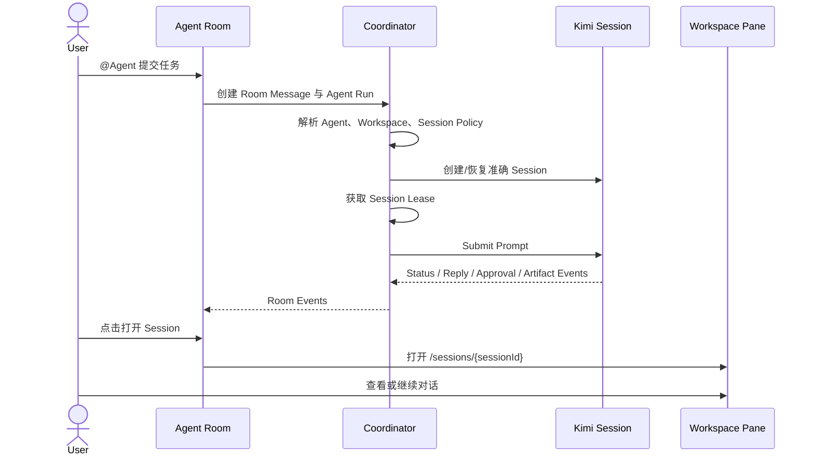
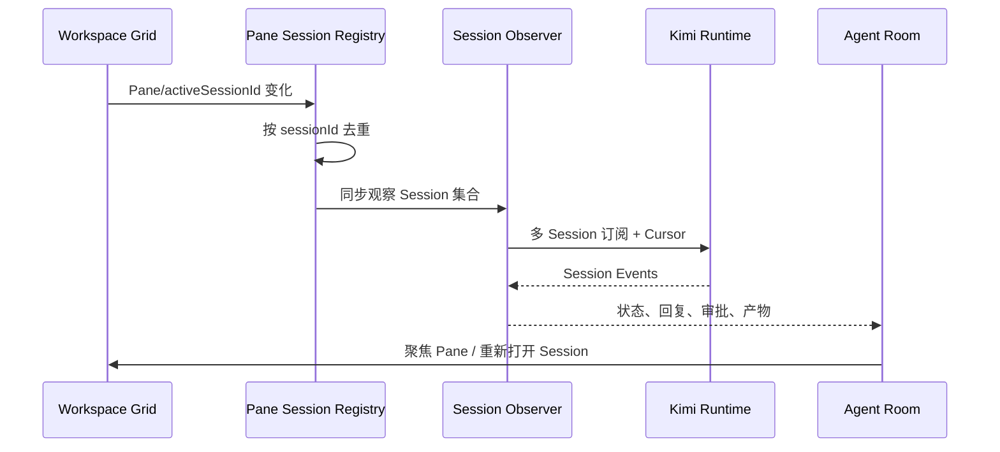

# Agent Room 产品需求文档（PRD）

- 仓库：`endearqb/kimi-app`
- 基线：`main@1cc7dbaca9405d055bd237e2b6f6db83b1cc86cf`
- 文档日期：2026-07-18
- 文档状态：Draft v1.1（v1.0 经仓库逐项核对后修订；核对记录与修订清单见 §27）
- 目标平台：Windows 桌面端（Tauri v2 + React）与本机 Kimi Code Runtime
- 配套文档：`SPEC.md`、`PLAN.md`
- 交付性质：产品定义与验收基线；本文不代表代码已经实现

---

## 1. 文档目的

本文定义 **Agent Room（智能体工作群）** 的产品目标、用户体验、功能边界、验收标准和分阶段范围。

Agent Room 不是另一个普通聊天页，也不是把飞书界面复制到桌面端。它是 Kimi 小助手内部面向多工作区、多 Session、多 Agent 的统一控制面，必须同时支持两条方向相反但共享同一数据模型的工作流：

1. **正向调度**：用户先在 Agent Room 中组织 Agent、分派任务，Agent 再进入各自指定 Workspace 的独立 Kimi Code Session 执行。
2. **反向镜像**：用户先打开 1–6 个 Kimi Code Pane 并独立工作，Agent Room 自动发现这些 Pane 当前对应的 Session，统一显示运行状态、回复、审批和产物，并允许把 Session 加入 Room 或保存为 Agent。

最终产品应形成以下闭环：

```text
Agent Room 统一安排任务
        ↓
每个 Agent 在独立 Workspace + Session 中执行
        ↓
Room 汇总状态、回复、审批与产物
        ↓
用户可一键进入对应 Pane Session 查看或继续对话
        ↓
用户也可先在 Pane 中工作，再反向汇聚到 Room
```

---

## 2. 产品摘要

Agent Room 是一个可嵌入 Workspace Grid 的桌面原生 Pane。它提供：

- 多 Agent 成员管理；
- `@Agent`、`@all`、并行或编排式任务分发；
- 每个 Agent 的 Workspace 与 Kimi Code Session 隔离；
- 当前 1–6 个可见 Code Pane 的 Session 自动发现；
- Session 运行状态、可展示回复、审批、错误和产物的实时镜像；
- 从 Room 打开、聚焦、恢复具体 Session Pane；
- 从 Pane 直接继续对话、排队、接管或中止任务；
- Agent Room、Pane、飞书/微信 Connector 复用同一 Kimi Code Runtime Session；
- 本机优先、令牌不进入 React、事件可恢复、操作可审计。

Agent Room 的定位是：

| 层级 | 职责 |
|---|---|
| Agent Room | 任务分派、成员组织、状态汇总、审批与协作编排 |
| Kimi Code Session | 实际对话历史、Agent 上下文、工具执行与产物 |
| Workspace | 文件、Skill、代码和项目边界 |
| Workspace Grid Pane | 进入具体 Session 的查看与直接交互窗口 |
| IM Connector | 飞书/微信等外部消息传输入口，不再等同于 Agent 身份 |

---

## 3. 仓库现状与机会

### 3.1 已有能力

当前仓库已经具备实现 Agent Room 的主要底座：

1. `apps/kimi-shell` 是 Tauri v2 + React 桌面壳。
2. Workspace Grid 已有 Pane/Slot 分离模型，支持 1、2、3、4、5、6 个可见 Pane，并保留最多 12 个 Pane 元数据。
3. Code Pane 已可携带 `sessionId`、`workDir`，并在运行时观测 iframe 内实际 `activeSessionId`。
4. Shell 已提供 `grid_list_sessions`、`grid_get_session`、`grid_create_session`，可通过 `/api/v1` 精确查询和创建 Kimi Code Session。
5. Code Pane 可通过 `/sessions/{sessionId}` 打开准确 Session。
6. `apps/kimi-im-bridge` 已有 Kimi Code Server Adapter，可创建 Workspace/Session、提交 Prompt、订阅 `/api/v1/ws`、列出与解决审批，并已实现 `POST /sessions/{id}/prompts/{promptId}:abort` 中止方法（带幂等允许码），但该方法当前没有任何 Provider/Orchestrator/Admin 调用链。
7. Bridge Orchestrator 已有 Binding、Turn、Event、Approval、Session 持久化主链路。
8. Bridge SQLite 已有 Session lease 字段，可以扩展为并发所有权机制。
9. Shell 已有本机 Admin Token、runtime locator、日志脱敏和 Tauri capability 分层。
10. Shell 写入的 `kimi_runtime_locator.json` 已包含 `origin`、`tokenPath`、redacted token、`generation`、`ownership` 和 `health`；Bridge 状态已按 locator 报告 Server Adapter `ready/degraded/unavailable`，可直接复用为 Agent Room 的 Runtime Generation 与健康信号来源。
11. Server Provider 已实现 pending approval reconcile（启动时按本地 pending 与 Runtime 实际状态对账），可被 Agent Room 恢复流程直接复用。

### 3.2 当前缺口

当前实现尚未形成 Agent Room 产品闭环：

- Shell 没有桌面原生多 Agent Prompt Composer。
- 没有全局 Approval Inbox。
- 没有 Room、Agent Profile、Room Member、Run 和 Room Timeline 领域模型。
- 没有针对任意现有 Pane Session 的长期多 Session Observer。
- 当前 Server Adapter 的 WebSocket 订阅是单 Prompt 临时订阅，不是动态 Session 观察。
- 当前 Pane 只知道 Session 身份与粗粒度运行状态，不知道完整回复事件。
- 当前 Connector 与 Agent 角色概念耦合。
- 基线时 Go `ConnectorConfig` 尚未接收 Shell 已存在的 per-connector `defaultWorkDir`；AR-100 已修复并保留全局回退兼容。
- Server Adapter 在只指定 Workspace 时可能复用该 Workspace 的第一条 Session，无法保证新 Agent Binding 的 Session 独立性。
- 当前 Session Import 创建新的本地 ID，并不等于继续桌面端原始 Session。
- 用户在 Pane 内直接提交消息时，当前仓库不能保证 Shell 获得原始用户消息正文。
- 同一 Session 的 Room 调度与 Pane 手动对话缺少明确排队和接管规则。
- Server Adapter 的 `SubmitPrompt` 未把 `Attachments` 写入 `/sessions/{id}/prompts` 请求体：Server Provider 路径下 IM 附件（飞书图片/文件等）实际被丢弃。
- 当前单 Prompt 事件流在 payload 缺少 `prompt_id` 时默认按匹配处理，同一 Session 并发时可能把无关事件归入当前 Prompt 聚合。
- Grid UI 新建 Code Pane 或将现有 Pane 切换为 Code 时不再自动创建 Session，而是打开 Kimi Code Web 根页面：可见 Code Pane 可能长期处于“无 Session”状态。
- 飞书群聊触发仅按文本前缀 at-tag 判定，未校验被 @ 的对象是否为本连接器机器人：多机器人同群会互相误触发（对应 FR-CONNECTOR-005）。
- Server Adapter `listSessions` 仅读取第一页（`page_size=100`，忽略 `has_more`），Workspace 下 Session 超过 100 条时枚举不完整。

### 3.3 产品机会

Agent Room 可以补齐当前仓库已明确存在的“Shell 自有 Prompt Composer”和“统一 Approval Inbox”缺口，同时最大化复用现有 Runtime、Grid、Bridge、Session 和 Approval 能力。

该功能不要求重做 Kimi Code Web，而是在其上方增加一个本机编排与观测层。

---

## 4. 产品愿景

> 让用户把多个独立 Kimi Code Session 组织成一个可观察、可分派、可进入、可接管的桌面智能体团队。

用户不应被迫选择唯一工作模式：

- 可以先创建 Agent Room，再由 Room 打开各个 Session；
- 可以先自由打开多个 Pane，再让 Room 自动汇聚；
- 可以同时使用 Room、Pane 和飞书入口，而不复制或割裂 Session；
- 可以只看摘要，也可以进入任何 Session 查看完整细节；
- 可以让 Agent 独立思考，也可以显式组织多阶段协作；
- 可以随时人工介入，但不会无意中让同一 Session 并发执行冲突任务。

---

## 5. 产品目标

### 5.1 核心目标

**G1：独立上下文**

每个 Room Member 默认拥有独立的 Kimi Code Session，并明确绑定 Workspace。不同 Agent、不同 Room 不得因默认行为意外复用同一 Session。

**G2：正向调度**

用户可在 Agent Room 中通过 `@Agent`、多选成员或 `@all` 分配任务。目标 Agent 在其 Session 中执行，Room 实时展示结果。

**G3：反向镜像**

Agent Room 能自动发现当前 Workspace Grid 中 1–6 个可见 Code Pane 的实际 Session，并显示状态、回复摘要、审批和错误。

**G4：Session 可进入**

每一条 Agent Run、Room Member 和观察到的 Pane Session 都能一键打开或聚焦准确的 `/sessions/{sessionId}` Pane。

**G5：双向继续对话**

用户可以在 Agent Room 中继续向 Session 发消息，也可以进入 Pane 直接对话。两种入口必须落到同一 Session。

**G6：可控并发**

同一 Session 在任意时刻只有一个明确执行所有者。Room 调度、Pane 手动任务和外部 IM Prompt 必须通过排队、追加、中止或接管策略协调。

**G7：审批统一**

Room 应显示其成员 Session 的待审批操作，并允许用户批准一次、批准当前 Session 或拒绝。

**G8：恢复可靠**

应用、Sidecar 或 Runtime 重启后，Room、成员、Session 绑定、队列、已完成消息和可恢复事件不丢失；无法恢复的任务必须明确标为中断或孤儿状态。

**G9：本机安全**

Runtime token、Bridge admin token 和平台凭据不得进入 React 状态、localStorage、Room 消息或日志明文。

### 5.2 次级目标

- 支持把当前 Pane Session 保存为长期 Agent。
- 支持 Agent Profile 与飞书/微信 Connector 绑定。
- 支持并行、评审、汇总等显式编排模式。
- 支持 Pane 关闭后继续观察 Session，并从 Room 重新打开。
- 支持一个 Session 同时在多个 Pane 中打开时去重显示。
- 支持 Room 消息、Run、Session 和产物之间的可追溯引用。

---

## 6. 非目标

首版不包含以下能力：

1. 不提供操作系统进程、容器或账户级安全沙箱。首版是逻辑上下文隔离。
2. 不把不同 Agent 的完整 Session 历史自动互相共享。
3. 不允许 Agent 通过群聊消息无限互相触发，避免递归循环。
4. 不创建新的模型推理引擎，继续使用 Kimi Code Runtime。
5. 不替代 Kimi Code Web 的完整 Session 详情页面。
6. 不承诺展示模型内部隐藏推理。Room 只展示 Runtime 明确标记为用户可见的状态、回复和可展示思考摘要。
7. 不在首版实现多人云端协作、跨设备同步或远程 Room。
8. 不在首版将飞书群和桌面 Room 做双向完整消息镜像。
9. 不在首版自动修改多个 Agent Workspace 的代码合并策略。
10. 不在首版支持超过 6 个同时可见 Pane；超过部分继续使用现有 Pane Shelf/总数上限策略。

---

## 7. 核心概念

### 7.1 Agent Profile

长期可复用的智能体角色配置，包含：

- 名称和头像；
- 角色说明；
- 默认 Workspace；
- 模型、thinking、permission 等 Runtime Controls；
- 自动审批策略；
- Session 策略；
- 可选 Connector 绑定。

Agent Profile 不等同于飞书机器人。一个 Agent 可没有 Connector，也可绑定一个或多个 Connector。

### 7.2 Agent Room

本机持久化的智能体协作空间，包含：

- 标题；
- 成员；
- Room Timeline；
- 调度模式；
- Room 级共享 Brief；
- Run、审批、产物和事件引用。

### 7.3 Room Member

Agent 在某个 Room 中的实例。成员可以来自：

- Agent Profile；
- 当前 Pane Session；
- 固定的已有 Session；
- 临时观察 Session。

同一个 Agent Profile 在不同 Room 中默认使用不同 Session。

### 7.4 Kimi Code Session

执行与对话上下文的唯一事实来源。Session 中保存：

- 用户与 Agent 对话；
- 工具调用；
- 工作区；
- Runtime 状态；
- 审批；
- 产物；
- 历史上下文。

### 7.5 Pane Session

Workspace Grid 中某个 Code Pane 当前实际打开的 Session。Pane 是 UI 容器，不是 Session 本身。

### 7.6 Agent Run

一次由 Room、Pane 或外部 Connector 发起、并在某个 Session 中执行的任务实例。

### 7.7 Session Mirror

Agent Room 对一个已有 Session 的状态与可展示输出投影。Mirror 不复制 Session，只保存关联和事件游标。

### 7.8 Session Lease

同一 Session 当前由哪个 Run 或人工入口控制的短期所有权记录，用于避免并发冲突。

### 7.9 Connector

飞书或微信等外部消息入口。Connector 负责平台凭据和传输，不定义 Agent 的 Workspace、角色和长期上下文。

---

## 8. 用户角色

### 8.1 独立开发者

同时打开多个项目或多个功能分支，希望一个 Room 统一观察架构、实现、测试、审查等 Session。

### 8.2 技术负责人

需要给多个 Agent 分工，查看每个 Agent 的进度，并在关键审批或架构决策处介入。

### 8.3 研究与内容用户

希望多个 Agent 在不同资料目录和角色上下文中独立研究，再由指定 Agent 汇总。

### 8.4 自动化高级用户

需要通过飞书和桌面端共同调度同一组 Agent，并要求 Session 不重复、不串上下文。

---

## 9. 核心用户场景

### UC-01 创建 Agent Room 并添加 Agent

用户创建“版本发布”Room，加入：

- 架构师：`D:\repo\architecture`
- 开发者：`D:\repo\implementation`
- 审查员：`D:\repo\review`

系统为每个成员按策略创建或恢复独立 Session。

### UC-02 向单个 Agent 分派任务

用户输入：

```text
@架构师 评估当前插件系统的扩展边界。
```

只触发架构师 Session。Room 显示接受、运行、审批和完成状态。

### UC-03 并行分派

用户选择三个成员或输入：

```text
@all 分别检查这个发布方案的风险。
```

系统创建三个独立 Run，并行执行，不自动共享彼此完整上下文。

### UC-04 从 Room 打开 Agent Session

用户点击“打开 Session”，Workspace Grid：

- 已有对应 Pane：聚焦；
- 有空槽：新增 Code Pane；
- 可见槽已满：按现有 Pane Placement Policy 换入；
- Pane 元数据总数已满：要求用户选择替换、关闭或取消。

### UC-05 先开 Pane，再由 Room 自动发现

用户先打开 4 个 Code Pane。Agent Room 的“当前 Pane Sessions”自动显示：

- Pane 标题；
- Session ID；
- Workspace；
- 可见/焦点/后台/挂起状态；
- Session 运行状态；
- 最近回复摘要；
- 待审批数量。

### UC-06 把 Pane Session 加入 Room

用户对某个自动发现的 Session 选择：

- 只观察；
- 加入当前 Room；
- 绑定现有 Agent；
- 另存为新 Agent；
- 固定 Session；
- 跟随 Pane。

### UC-07 在 Pane 内直接继续对话

用户从 Room 进入架构师 Session，在 Pane 中补充：

```text
缓存层先不做，优先稳定接口。
```

后续 Room 再向该 Session 分派任务时，Agent 继续使用同一 Session 上下文。

### UC-08 Room 调度与 Pane 手动任务冲突

Session 正在执行时，用户从另一入口发送任务。系统提供：

- 排队；
- 追加为 follow-up；
- 中止并替换；
- 仅记录到 Room；
- 取消。

默认策略是排队。

### UC-09 审批处理

Room Timeline 显示：

```text
开发者请求写入 apps/kimi-shell/src/...
```

用户可批准一次、批准当前 Session 或拒绝。审批结果同步到原 Session 和对应外部 Connector 投影。

### UC-10 重启恢复

应用重启后：

- Room 与成员仍存在；
- 已固定 Session 可重新打开；
- 已完成 Run 可查看；
- 尚未完成的 Run 按 Runtime 与本地事件恢复；
- 无法恢复的 Run 标为 `orphaned`，并给出重试或新建任务入口。

### UC-11 多阶段协作

用户选择“评审流程”：

1. 架构师与研究员并行输出；
2. 审查员读取显式提供的阶段结果；
3. 总结 Agent 汇总；
4. Room 展示依赖关系与最终结论。

首版不允许 Agent 通过群聊消息自行递归触发。

### UC-12 外部 IM 复用 Agent

飞书机器人绑定到某个 Agent Profile。飞书消息与桌面 Room 可进入同一 Session 或按策略进入独立 Session，但必须明确显示来源。

---

## 10. 产品原则

### P1：Session 是上下文真相

Room 不维护一份独立的“影子对话历史”来替代 Session。Room 只保存任务、投影、引用和协作元数据。

### P2：Workspace 与 Session 同时明确

仅指定目录不足以保证独立上下文。每个正式 Room Member 必须能解析到准确 Session ID。

### P3：Pane 可替换，Session 不随 Pane 消失

关闭 Pane 不能自动删除 Session。Room 可继续观察并重新打开。

### P4：显式共享，不隐式污染

Agent A 的输出只有在用户或编排器显式传递时才进入 Agent B 的 Prompt。

### P5：控制权可见

用户必须看到当前 Session 是由 Room Run、Pane 手动任务、外部 IM 还是未知来源控制。

### P6：事件可恢复

Room Timeline 使用稳定 Event Sequence 和 Cursor，不能依赖 React 当前是否挂载。

### P7：默认安全

默认不自动审批敏感操作；默认不暴露 token；默认不显示不可验证的隐藏推理。

### P8：现有能力优先复用

复用 Workspace Grid、Session API、Bridge Runtime Adapter、Approval、Turn/Event Store 和日志体系。

---

## 11. 信息架构

### 11.1 Workspace Grid 中的 Agent Room Pane

Workspace Pane 类型扩展为：

```text
code | chat | agent_room | external
```

Agent Room 使用本地 React Carrier，不使用 iframe。

用户可布局：

```text
┌──────── Agent Room ────────┬──── Agent A Session ────┐
│ Room Timeline / Composer   │ Kimi Code Web           │
├────────────────────────────┼──── Agent B Session ────┤
│ Member / Pane Session List │ Kimi Code Web           │
└────────────────────────────┴──────────────────────────┘
```

### 11.2 Agent Room 页面结构

```text
Agent Room
├── Room Header
│   ├── Room 名称
│   ├── 调度模式
│   ├── 运行/审批摘要
│   └── Room 操作
├── Member Rail
│   ├── 正式 Agent
│   └── 当前 Pane Sessions
├── Timeline
│   ├── 用户消息
│   ├── Run Card
│   ├── Agent 回复
│   ├── Approval Card
│   ├── Artifact Card
│   └── 系统事件
└── Composer
    ├── @成员
    ├── 模式
    ├── 附件
    ├── 队列策略
    └── 发送
```

### 11.3 Room Header

必须展示：

- Room 标题；
- 成员数量；
- 正在运行数量；
- 排队数量；
- 待审批数量；
- Runtime/Sidecar 健康；
- `direct`、`parallel`、`workflow` 模式；
- 添加 Agent、添加 Pane Session、打开全部 Session、清空已完成提示。

### 11.4 Member Rail

每个成员卡片显示：

- 名称与角色；
- Workspace 最后一级与完整路径 tooltip；
- Session ID 脱敏简写；
- Session 状态；
- Pane 状态；
- 当前控制来源；
- 最近活动；
- 待审批；
- 打开/聚焦 Session；
- 暂停观察；
- 从 Room 移除。

### 11.5 Timeline

Timeline 必须按 Room Event Sequence 稳定排序。一个 Run 的流式增量在 UI 中合并展示，最终事件不可重复。

Room 不应默认逐字永久保存所有 `thinking_delta`。可展示状态和 Runtime 明确允许的摘要。

### 11.6 Composer

Composer 支持：

- `@Agent` 自动完成；
- 多目标选择；
- `@all`；
- 任务模式；
- 附件；
- 是否把 Room Brief 带入；
- 队列策略；
- 发送前目标预览；
- Session 正忙时的冲突提示。

---

## 12. 正向调度流程



### 12.1 发送前校验

- 目标成员存在；
- Workspace 可解析；
- Runtime 可用；
- Session Policy 可执行；
- Session 未被不兼容所有者占用；
- 附件可访问；
- 用户选择的审批策略合法。

### 12.2 角色上下文

Agent Profile 的 Role Prompt 在每次 Room Run 中作为结构化上下文加入，不得修改用户原始消息记录。

### 12.3 多目标

- `direct`：通常一个目标；
- `parallel`：多个独立 Run；
- `workflow`：按阶段和依赖执行；
- 多目标失败相互隔离，一个 Agent 失败不能取消其他独立 Run。

---

## 13. 反向镜像流程



### 13.1 自动发现范围

默认发现：

- 当前 Workspace Grid 中所有 `kind=code` Pane；
- 可见 Pane；
- 已收纳但仍有绑定 Session 的 Pane；
- iframe 实际 `activeSessionId` 优先于持久化 `sessionId`。

### 13.2 去重

同一 Session 在多个 Pane 打开时，Room 显示一条 Session 投影，并列出多个 Pane。

### 13.3 临时成员

自动发现的 Session 默认是临时观察对象，不自动写入正式 Room Member，直到用户选择加入。

### 13.4 跟随策略

- `follow_pane`：Pane 切换 Session 后观察对象随之切换；
- `pin_session`：固定 Session，不随 Pane 切换；
- 自动发现默认 `follow_pane`；
- 正式 Agent Member 默认 `pin_session`。

### 13.5 Pane 手动任务

当 Observer 发现一个非 Room 发起的新 Turn：

- 创建 `origin=pane_manual` 的临时 Run 投影；
- 显示运行状态与回复；
- 若无法获得原始用户 Prompt，显示“由 Pane 发起的任务”，不得伪造正文；
- 当 Runtime 支持历史消息读取或 iframe 提交事件后，补全原始消息。

---

## 14. Session 策略

### 14.1 `per_room`

```text
(roomId, agentId) → 唯一 Session
```

默认策略。适合长期团队协作。

### 14.2 `persistent`

Agent 在多个 Room 中使用一个固定 Session。必须明显警告上下文会跨 Room 共享。

### 14.3 `new_per_task`

每次 Run 创建新 Session。适合一次性高隔离任务。

### 14.4 `resume_selected`

用户明确选择现有 Session。系统必须验证 Session 存在且 Workspace 一致或由用户确认差异。

### 14.5 禁止隐式“第一条 Session”

当一个 Workspace 存在多个 Session 时，系统不得以 `sessions[0]` 作为新 Agent 的默认 Session。必须创建新 Session或使用明确选中的 Session。

---

## 15. 状态模型

### 15.1 Pane 状态

- `focused`
- `visible`
- `background`
- `suspended`
- `shelved`
- `closed`

### 15.2 Session 状态

- `unknown`
- `idle`
- `running`
- `waiting_approval`
- `completed`
- `failed`
- `aborted`
- `unreachable`

注：`completed / failed / aborted` 表示该 Session 最近一次 Turn 的终态投影，不代表 Session 本体关闭；Session 仍可继续接受新 Prompt。UI 文案与状态色应体现这一区分。

### 15.3 Run 状态

- `queued`
- `resolving_session`
- `waiting_for_lease`
- `submitting`
- `running`
- `waiting_approval`
- `completing`
- `abort_requested`
- `completed`
- `failed`
- `aborted`
- `orphaned`
- `blocked`
- `conflicted`

`abort_requested` 表示 Abort 已请求但 Runtime 尚未确认，此时禁止提交替代 Run；`conflicted` 表示执行归属冲突，需要人工恢复或明确重试。

### 15.4 控制来源

- `agent_room`
- `pane_manual`
- `feishu`
- `weixin`
- `runtime_external`
- `unknown`

### 15.5 UI 状态优先级

```text
failed > waiting_approval > running > queued > completed > idle > unknown
```

Pane 状态与 Session 状态必须分开展示，不能把“Pane 已关闭”误判为“Session 已停止”。

---

## 16. 并发与人工接管

### 16.1 默认规则

同一 Session 不允许 Agent Room 主动并发提交两个 Prompt。

### 16.2 Session 正忙时

用户从 Room 发送任务，提供：

| 策略 | 行为 |
|---|---|
| `enqueue` | 当前任务完成后提交，默认 |
| `follow_up` | 作为 Runtime 支持的后续消息排队 |
| `abort_and_replace` | 中止当前任务并执行新任务 |
| `record_only` | 只记录 Room 消息，不发送 |
| `cancel` | 取消操作 |

### 16.3 Pane 直接操作

官方 Kimi Code Web 可能允许用户直接发送消息，Shell 不一定能硬性阻止。产品必须：

- 在 Room 中显示当前控制来源；
- 观察到外部 Turn 时更新所有权；
- Room 不再向同一 Session 提交并发 Prompt；
- 若 Room Run 与 Pane Turn 冲突，明确标记 `conflicted` 或 `orphaned`，不得静默混合输出。

### 16.4 接管

“中止并接管”必须：

1. 请求 Runtime Abort；
2. 等待终止确认或超时；
3. 释放旧 Lease；
4. 创建新 Run；
5. 提交新 Prompt；
6. 在 Timeline 中保留接管审计记录。

---

## 17. 功能需求

### 17.1 Room 管理

| ID | 需求 | 优先级 |
|---|---|---|
| FR-ROOM-001 | 创建、重命名、归档和删除本地 Room | P0 |
| FR-ROOM-002 | Room 持久化成员、Timeline、模式和 Brief | P0 |
| FR-ROOM-003 | Room 删除前说明 Session 不会自动删除 | P0 |
| FR-ROOM-004 | Room Header 显示运行、排队、审批和错误摘要 | P0 |
| FR-ROOM-005 | 支持恢复最近打开的 Room | P1 |
| FR-ROOM-006 | 支持导出 Room 任务与结果摘要，不含 token | P2 |
| FR-ROOM-007 | 支持 Room 归档后只读查看 | P1 |

### 17.2 Agent Profile

| ID | 需求 | 优先级 |
|---|---|---|
| FR-AGENT-001 | 创建、编辑、复制和删除 Agent Profile | P0 |
| FR-AGENT-002 | Agent 必须配置名称、角色和默认 Workspace | P0 |
| FR-AGENT-003 | 支持模型、thinking、permission、autoApprove 等 Controls | P1 |
| FR-AGENT-004 | 支持 `per_room`、`persistent`、`new_per_task`、`resume_selected` | P0 |
| FR-AGENT-005 | 支持 Agent 与 Connector 独立绑定 | P1 |
| FR-AGENT-006 | Agent 删除前提示现有 Room Member 与 Session 影响 | P0 |
| FR-AGENT-007 | Agent Role Prompt 不在普通 Timeline 中泄露，设置页可查看 | P0 |

### 17.3 Room Member

| ID | 需求 | 优先级 |
|---|---|---|
| FR-MEMBER-001 | 从 Agent Profile 添加成员 | P0 |
| FR-MEMBER-002 | 从已有 Pane Session 添加临时或正式成员 | P0 |
| FR-MEMBER-003 | 显示 Workspace、Session、Pane、Run 和控制来源状态 | P0 |
| FR-MEMBER-004 | 支持 `follow_pane` 和 `pin_session` | P0 |
| FR-MEMBER-005 | 同一 Session 多 Pane 时去重 | P0 |
| FR-MEMBER-006 | 从 Room 移除成员不自动删除 Session | P0 |
| FR-MEMBER-007 | 支持将临时 Pane Session 另存为 Agent | P1 |

### 17.4 任务分派与 Run

| ID | 需求 | 优先级 |
|---|---|---|
| FR-RUN-001 | 支持 `@Agent` 与多选成员 | P0 |
| FR-RUN-002 | 支持 `@all` 并行独立执行 | P0 |
| FR-RUN-003 | 每个目标生成独立 Run ID | P0 |
| FR-RUN-004 | Run 必须引用 Room Message、Agent、Session、Turn 和 Prompt | P0 |
| FR-RUN-005 | 支持排队、中止、重试和重新分派 | P0 |
| FR-RUN-006 | 一个 Run 失败不影响并行的其他 Run | P0 |
| FR-RUN-007 | 支持附件传入目标 Session | P1 |
| FR-RUN-008 | 支持显式多阶段 Workflow | P1 |
| FR-RUN-009 | 禁止通过 Room 消息形成无界 Agent 自触发循环 | P0 |
| FR-RUN-010 | Role、Room Brief 和共享结果必须有可追溯 Prompt Assembly | P1 |

### 17.5 Pane Session 镜像

| ID | 需求 | 优先级 |
|---|---|---|
| FR-MIRROR-001 | 自动发现所有 Code Pane 的实际 Session | P0 |
| FR-MIRROR-002 | `activeSessionId` 优先于持久化 `sessionId` | P0 |
| FR-MIRROR-003 | 支持 1–6 个可见 Pane，兼容 Pane Shelf 中 Session | P0 |
| FR-MIRROR-004 | 显示 `isRunning`、Workspace、最近更新时间 | P0 |
| FR-MIRROR-005 | 实时显示可展示回复、状态、审批、失败和产物 | P0 |
| FR-MIRROR-006 | Observer 断线后按 Cursor 恢复，不重复事件 | P0 |
| FR-MIRROR-007 | Pane 关闭后仍可观察已固定 Session | P0 |
| FR-MIRROR-008 | 未获得用户原始 Prompt 时明确标记未知，不得猜测 | P0 |
| FR-MIRROR-009 | 支持暂停或移除观察 | P1 |

### 17.6 Pane 导航

| ID | 需求 | 优先级 |
|---|---|---|
| FR-PANE-001 | 从 Run、Member 和 Session Mirror 打开准确 Session | P0 |
| FR-PANE-002 | 已有 Session Pane 时复用并聚焦 | P0 |
| FR-PANE-003 | 没有 Pane 时按 Grid Placement Policy 新建 | P0 |
| FR-PANE-004 | 6 个可见 Pane 时换入并收纳被替换 Pane | P0 |
| FR-PANE-005 | 总 Pane 达上限时不静默丢弃 | P0 |
| FR-PANE-006 | 支持“聚焦当前 Pane”和“在新 Pane 打开” | P1 |

### 17.7 双向对话和控制权

| ID | 需求 | 优先级 |
|---|---|---|
| FR-CONTROL-001 | Room 可向固定 Session 继续发送消息 | P0 |
| FR-CONTROL-002 | Session 正忙时默认排队 | P0 |
| FR-CONTROL-003 | 支持 Abort and Replace | P0 |
| FR-CONTROL-004 | 显示当前 Lease Owner 和来源 | P0 |
| FR-CONTROL-005 | 观察到 Pane 手动 Turn 时更新控制权 | P0 |
| FR-CONTROL-006 | 冲突事件必须可见并可恢复 | P0 |
| FR-CONTROL-007 | 不允许同一 Session 被两个 Room Run 静默并发控制 | P0 |

### 17.8 Approval

| ID | 需求 | 优先级 |
|---|---|---|
| FR-APPROVAL-001 | Room 显示成员 Session 的待审批列表 | P0 |
| FR-APPROVAL-002 | 支持批准一次、批准当前 Session、拒绝 | P0 |
| FR-APPROVAL-003 | Approval 必须关联 Run、Session、Room 和来源 | P0 |
| FR-APPROVAL-004 | 解决状态同步到原始 Runtime | P0 |
| FR-APPROVAL-005 | 重启恢复 pending approval | P0 |
| FR-APPROVAL-006 | 自动审批必须有高风险提示与 Agent 级开关 | P0 |

### 17.9 恢复与历史

| ID | 需求 | 优先级 |
|---|---|---|
| FR-RECOVERY-001 | Room、成员、消息、Run 持久化 | P0 |
| FR-RECOVERY-002 | Event Cursor 持久化并支持断点恢复 | P0 |
| FR-RECOVERY-003 | 重启后检查 Runtime Session 与 Approval | P0 |
| FR-RECOVERY-004 | 不可恢复 Run 标记 `orphaned` | P0 |
| FR-RECOVERY-005 | 支持从 orphaned Run 重试到原 Session 或新 Session | P1 |
| FR-RECOVERY-006 | Timeline 事件幂等，按稳定 Sequence 排序 | P0 |

### 17.10 外部 Connector

| ID | 需求 | 优先级 |
|---|---|---|
| FR-CONNECTOR-001 | Agent Profile 与 Connector 解耦 | P0 |
| FR-CONNECTOR-002 | Connector 可选择绑定 Agent Profile | P1 |
| FR-CONNECTOR-003 | 外部消息来源在 Room/Session 中可见 | P1 |
| FR-CONNECTOR-004 | 多 Connector 使用各自 default Workspace | P0 |
| FR-CONNECTOR-005 | 飞书精确校验 mention-self，避免误触发其他机器人 | P1 |
| FR-CONNECTOR-006 | 外部 Room 镜像为后续能力，不阻塞桌面 MVP | P2 |

---

## 18. 非功能需求

### 18.1 性能

- Pane 变化到 Room 状态更新：目标 P95 ≤ 500 ms。
- Runtime Event 到 Room 投影：本机目标 P95 ≤ 1 s。
- 点击“打开 Session”到 Pane 路由开始：目标 P95 ≤ 500 ms。
- Room 首屏加载最近 200 条事件：目标 P95 ≤ 1 s。
- 1–6 个观察 Session 时不得为每个 Session 建立独立高频轮询线程。
- 流式增量 UI 合并刷新不高于 20 FPS，避免 React 抖动。

### 18.2 可靠性

- Event Sequence 单调递增。
- 同一 Runtime Event 至多投影一次。
- Observer 重连不丢失 Cursor 之后的事件。
- Sidecar 重启不清空 Room。
- Workspace Grid Pane 重挂载不改变 Session 绑定。
- 一个 Agent 失败不能导致 Room 事件泵停止。

### 18.3 数据完整性

- `(roomId, memberId)` 唯一。
- 正式 `per_room` Agent 在一个 Room 中只有一个当前 Session。
- 同一 Session 同时只有一个有效 Lease Owner。
- 删除 Connector 不得级联删除 Agent Room 数据。
- 删除 Room 不得自动删除 Runtime Session。
- Workspace 与 Session 不匹配时必须提示或阻止。

### 18.4 安全与隐私

- React 不接触 Runtime Token、Admin Token、App Secret。
- Room 数据仅保存在本机配置/SQLite。
- 日志必须脱敏 token、secret、authorization header。
- Workspace 路径操作复用现有路径校验与符号链接保护。
- 自动审批默认关闭。
- 原始模型隐藏推理不进入 Room 持久化。
- 可展示 `thinking` 内容必须来自 Runtime 明确标记的用户可见事件。

### 18.5 可访问性

- 全部 Agent、Room、Run 和 Approval 操作支持键盘。
- 状态不能只依赖颜色。
- 流式内容使用适当 `aria-live`，避免每个 token 都朗读。
- 动态事件可暂停自动滚动。
- Pane 和 Member 列表有明确焦点顺序。

### 18.6 兼容性

- 保持现有 Code/Chat/External Pane 兼容。
- 保持已有 Grid V1 状态迁移。
- 保持现有 Bridge Admin API 兼容。
- 现有飞书/微信 Connector 在 Agent Room 未启用时行为不变。
- Server Adapter 不可用时，Room 明确降级；不静默切到可能产生不同 Session 语义的 SDK Provider。

---

## 19. 成功指标

默认不上传消息内容或 Workspace 路径。指标可本地计算，并在用户启用匿名遥测时只上传聚合值。

### 19.1 核心质量指标

- Room 任务提交成功率 ≥ 99%。
- 目标 Agent 与实际 Session 绑定错误率 = 0。
- 观察事件重复率 = 0。
- 跨 Agent Session 意外复用率 = 0。
- 重启后 Room 数据恢复率 = 100%。
- Approval 错绑 Run/Session 率 = 0。
- 打开 Session 路由准确率 = 100%。

### 19.2 体验指标

- 从 Room 打开准确 Session 的成功率 ≥ 99%。
- Pane 自动发现成功率 ≥ 99%。
- 用户从 Room 找到正在运行 Session 的中位交互步数 ≤ 2。
- 1–6 Pane 场景下状态更新延迟 P95 ≤ 1 s。
- 用户可在一个 Room 中成功组织至少 4 个独立 Session。

### 19.3 采用指标

- 创建至少一个 Room 的用户比例。
- 将 Pane Session 加入 Room 的比例。
- 使用 `@all` 或多目标调度的 Room 比例。
- 从 Room 打开 Session 的次数。
- Room 内完成的 Approval 数量。

---

## 20. 分阶段范围

### 20.1 Foundation

- 修复 per-connector Workspace 透传；
- 明确 Session Policy；
- 实现 Lease 和 Queue；
- 提取可复用 Execution Core；
- Agent Room 数据模型和 API。

### 20.2 Observer MVP

- Native Agent Room Pane；
- 自动发现 1–6 Code Pane；
- 显示 Session、Workspace、isRunning、最近活动；
- 打开/聚焦准确 Session；
- 多 Session Event Observer；
- 显示回复、状态、审批和错误。

### 20.3 Dispatch MVP

- Agent Profile；
- Room Member；
- `@Agent`、多目标、`@all`；
- 每 Room Agent 独立 Session；
- Room Timeline；
- 排队、中止、重试；
- Approval Inbox。

### 20.4 V1

- Pane Session 加入 Room；
- 临时 Session 保存为 Agent；
- 跟随 Pane/固定 Session；
- Pane 手动 Run 投影；
- Runtime 重启恢复；
- Agent 与 Connector 绑定；
- 并行和评审 Workflow。

### 20.5 后续

- 桌面 Room 与飞书群双向镜像；
- 跨设备 Room；
- 可视化任务依赖图；
- Agent 产物合并；
- Room 模板；
- 可配置多阶段编排 DSL；
- 更完整 Session Transcript 同步。

---

## 21. 风险与缓解

| 风险 | 影响 | 缓解 |
|---|---|---|
| Kimi Runtime 不提供用户消息事件/历史 API | 反向镜像看不到 Pane 原始 Prompt | 增加能力探测；优先 Session Transcript API；Enhanced Web 下增加 iframe 提交桥；否则明确显示未知 |
| 同一 Session 被 Room 与 Pane 同时提交 | 输出交错、审批错绑 | Lease + Queue；Observer 检测外部 Turn；默认不并发提交 |
| Sidecar 仅为 IM Bridge 启动 | Agent Room 无编排服务 | 将 Sidecar 定义为本机 Orchestration Service，按 Agent Room 使用懒启动或常驻 |
| `sessions[0]` 隐式复用 | Agent 上下文串线 | 新 Binding 默认创建新 Session；仅 `resume_selected` 可复用 |
| 多 Session WS 动态订阅不被 Runtime 支持 | Observer 无法增删 Session | 订阅集合变化时带 Cursor 安全重连；必要时单连接重建 |
| Thinking 内容不适合持久化 | 隐私与体验风险 | 默认仅显示状态；只持久化 Runtime 明确允许的可展示摘要 |
| Room 事件量快速增长 | SQLite 与 UI 压力 | Delta 合并、事件压缩、分页、保留原始 Turn Event 引用 |
| Grid 状态 schema 升级 | 旧版本读到 V2 状态会静默重置布局（现有加载器 `version !== 1` 即回退 legacy 默认布局） | 使用独立 `…-v2` storage key、保留 V1 键原样不回写、saved layouts 内嵌 state 同步迁移、fixture 测试 |
| Connector 删除清理逻辑误删桌面绑定 | Room 数据丢失 | Agent Room 使用独立表；禁止纳入 Connector prune |
| Approval 重启恢复不完整 | 敏感任务悬空 | 复用 Server Provider reconcile，并增加 Room 投影重建 |
| Server 路径附件丢失 | 带附件任务在 Server Provider 下静默降级为纯文本 | 能力验证 `/prompts` 附件契约；修复 `SubmitPrompt` 透传；不支持时明确报错而非静默丢弃 |
| Abort 语义未验证 | 接管流程可能在“已中止”假象下并发提交 | 端点与幂等码已存在于适配器；Spike 验证 `turn.ended(reason=aborted)` 确认与超时行为后再接线 |

---

## 22. 端到端验收场景

### AC-E2E-01：四 Agent 独立 Session

1. 创建 Room。
2. 添加 4 个 Agent，分别指向 4 个 Workspace。
3. 发送 `@all` 任务。
4. 系统创建 4 个不同 Session ID。
5. 四个 Run 可并行，Workspace 与 Agent 配置一致。
6. 任意 Agent 的 Pane 对话不出现在其他 Agent Session。

### AC-E2E-02：六 Pane 反向镜像

1. 打开 6 个 Code Pane，各自进入不同 Session。
2. 打开 Agent Room。
3. Room 在 1 秒级目标内显示 6 个去重 Session。
4. 每个 Session 显示 Workspace、运行状态和 Pane 状态。
5. 其中一个 Pane 开始运行后，Room 状态更新。
6. Agent 回复在 Room 中逐步出现或以可接受的合并频率刷新。

### AC-E2E-03：同一 Session 多 Pane

1. 在两个 Pane 打开同一 Session。
2. Room 只显示一条 Session Mirror。
3. 卡片显示两个 Pane。
4. 用户可选择聚焦任意 Pane。

### AC-E2E-04：Pane 关闭后继续观察

1. 一个 Session 正在运行。
2. 关闭其 Pane。
3. Room 继续显示 Session Run。
4. 点击“重新打开”后恢复准确 Session。

### AC-E2E-05：排队

1. Session A 正在执行。
2. 从 Room 向 A 发送新任务。
3. 默认创建 `queued` Run，不并发提交。
4. 当前 Run 完成后自动执行队列首任务。
5. Timeline 顺序和归属正确。

### AC-E2E-06：人工接管

1. Room Run 正在执行。
2. 用户选择“中止并接管”。
3. 原 Run 标为 `aborted`。
4. Lease 转移。
5. 新 Run 提交成功。
6. 两个 Run 的输出与 Approval 不混淆。

### AC-E2E-07：Approval

1. Agent 请求敏感工具操作。
2. Room 显示 Approval Card。
3. 用户批准一次。
4. Runtime 继续执行。
5. Approval、Run 和 Session 关联正确。
6. 重复点击不重复解决。

### AC-E2E-08：重启恢复

1. Room 有完成、排队、运行和待审批任务。
2. 重启 Shell 与 Sidecar。
3. Room 和完成历史恢复。
4. Pending Approval 恢复。
5. 排队任务保留。
6. 无法恢复的运行任务明确标为 `orphaned`。

### AC-E2E-09：Workspace 不匹配

1. Agent 固定到 Workspace A。
2. 用户选择 Workspace B 的 Session 作为 `resume_selected`。
3. 系统提示不匹配。
4. 用户未确认时不绑定。

### AC-E2E-10：令牌安全

1. 完成上述任务。
2. 检查 React state dump、localStorage、Room SQLite、app/backend/bridge log。
3. 不存在 Runtime token、Admin token、App Secret 明文。

---

## 23. 产品决策

| ID | 决策 |
|---|---|
| PD-001 | Agent Room 是本地原生 Pane，而不是外部 iframe |
| PD-002 | Kimi Code Session 是完整对话与执行真相 |
| PD-003 | Room Timeline 是任务与事件投影，不复制完整 Session |
| PD-004 | 默认 Session 策略为 `per_room` |
| PD-005 | 自动发现 Pane 默认 `follow_pane`，正式成员默认 `pin_session` |
| PD-006 | 同一 Session 多 Pane 去重 |
| PD-007 | Session 正忙时默认排队 |
| PD-008 | Agent Profile 与 IM Connector 解耦 |
| PD-009 | Agent 间共享必须显式发生 |
| PD-010 | 首版不承诺展示 Pane 原始 Prompt，除非 Runtime 或 iframe 能可靠提供 |
| PD-011 | Thinking 默认只展示状态或可公开摘要，不持久化隐藏推理 |
| PD-012 | Room 删除不删除 Runtime Session |
| PD-013 | Pane 删除不删除 Runtime Session |
| PD-014 | Agent Room 复用本机 Sidecar 的 Runtime Adapter 与 Approval 能力 |
| PD-015 | 新 Agent Binding 禁止隐式选择 Workspace 第一条 Session |

---

## 24. 待确认事项

以下事项不阻塞 Foundation，但在 Observer MVP 进入验收前必须关闭。其中部分事项仓库已给出部分答案（标注为“部分已知”），Spike 只需补足剩余语义：

1. 当前 Kimi Code `/api/v1/ws` 是否支持一个连接动态观察多个 Session。
2. 是否存在稳定的 Session Transcript/Message API。
3. 是否存在用户 Prompt created/submitted 事件。
4. Runtime 对同一 Session Prompt Queue 的原生语义。
5. Abort 完成确认事件与超时语义（部分已知：适配器已实现 `POST /sessions/{id}/prompts/{promptId}:abort` 且允许幂等错误码；待验证 `turn.ended(reason=aborted)` 是否可靠到达、超时后的 Runtime 实际状态，以及为其新建 Provider→Admin 调用链）。
6. Runtime Session 删除、归档和失效后的错误码。
7. 官方 Web 与 Enhanced Local 模式下 iframe 消息桥能力是否一致。
8. `approved_for_session` 的有效范围和重启后语义。
9. Agent Room Sidecar 是应用启动常驻、按 Pane 懒启动，还是用户显式启用。
10. Room Timeline 对可展示 thinking 摘要的最终产品策略（现状：IM 路径已把 `thinking_delta` 持久化进 `turn_events`；是否收紧该既有行为需与本条一并决策）。
11. `POST /sessions/{id}/prompts` 是否接受附件及其请求体格式（现状：Server Adapter 未发送附件）。
12. Server WebSocket 是否存在 artifact 类事件（现状：`artifact_ready` 仅存在于 SDK Driver 路径，Server WS 帧处理无对应分支）。
13. WS Cursor `epoch` 字段与 Runtime 重启的关系（现状：Go 侧 `wsCursor` 已带可选 `epoch`，语义未验证）。
14. Prompt 相关 WS 事件是否总携带 `prompt_id`（现状：缺失时网关默认放行，影响事件归属可靠性）。

---

## 25. 体验示意

```text
┌──────────────────────── Agent Room：插件重构 ───────────────────────┐
│ 4 Agents · 3 Running · 1 Queued · 1 Approval      [打开全部 Session] │
├───────────────┬──────────────────────────────────────────────────────┤
│ 架构师 ●运行中 │ 你：@all 分别评估插件系统的重构方案                 │
│ 开发者 ●审批中 │                                                      │
│ 审查员 ○排队   │ 架构师 · 正在分析                                   │
│ 总结员 ○空闲   │ “当前模块边界存在三处循环依赖……”                   │
│               │ [打开 Session] [排队追问]                            │
│ Pane Sessions │                                                      │
│ Pane 1 ●      │ 开发者 · 等待审批                                    │
│ Pane 2 ●      │ 写入 apps/kimi-shell/src/...                         │
│ Pane 3 ○      │ [批准一次] [批准 Session] [拒绝]                     │
├───────────────┴──────────────────────────────────────────────────────┤
│ @成员 输入任务…           模式：并行     策略：排队         [发送]   │
└──────────────────────────────────────────────────────────────────────┘
```

---

## 26. 完成定义

Agent Room 产品达到 V1 完成，需要同时满足：

- 正向调度与反向镜像均可用；
- 每 Agent Workspace 与 Session 隔离已通过自动化测试；
- 1–6 Pane 的状态和回复可在 Room 中观察；
- Session 可准确打开、聚焦和恢复；
- Room 与 Pane 双向对话使用同一 Session；
- Queue、Abort、Lease 和 Approval 语义明确；
- 重启恢复通过；
- 令牌与凭据安全通过；
- 现有 Workspace Grid、飞书、微信和安装发布路径无回归；
- `SPEC.md` 中的能力门禁与 `PLAN.md` 中的发布 Gate 全部关闭。

---

## 27. 仓库核对记录（Verified Baseline）

v1.1 已对照 `main@1cc7dbaca9405d055bd237e2b6f6db83b1cc86cf` 逐项核对。下表为关键声明的证据映射；“结论”列中 ✅ 表示仓库证实、⚠️ 表示核对后修订了本文表述。

| 声明 | 仓库证据 | 结论 |
|---|---|---|
| Pane 类型 `code\|chat\|external`，Carrier 仅 `iframe`，`activeSessionId` 为内存态 | `features/workspace-grid/gridTypes.ts` | ✅ |
| 6 可见 / 12 总 Pane 上限 | `gridStore.ts` `WORKSPACE_GRID_MAX_VISIBLE_PANES=6` / `MAX_TOTAL_PANES=12` | ✅ |
| `grid_list_sessions / grid_get_session / grid_create_session` 与 `/sessions/{id}` Pane URL | `commands/workspace_grid.rs`、`paneUrl.ts` | ✅ |
| Rust 侧已有 per-connector `defaultWorkDir` 与 `resetBindingSessionOnStart`，Go `ConnectorConfig` 在核对基线缺失且普通 `json.Unmarshal` 静默丢弃 | `types.rs` `BridgeConnectorConfig` vs `internal/config/config.go` | ✅ 基线事实；AR-100 已修复 |
| 仅指定 Workspace 时隐式复用 `sessions[0]` | `internal/runtime/server_adapter.go` `EnsureSession` | ✅ |
| WS 为单 Prompt 临时订阅；`client_hello` 携带 `subscriptions[]` 与 per-session `cursors{seq}` | `server_adapter.go` `streamPromptEvents` / `waitForServerHelloAndSubscribe` | ✅ |
| `bridge_sessions` 已有 `lease_owner / lease_expires_at` 字段，但无 acquire/renew/release 机制 | `migrations/0005_session_leases.sql`、store 读写 | ✅ |
| Store `userVersion=13`，Connector prune 目标为 8 张 connector 表、不含 `bridge_sessions` | `store.go` | ✅ |
| Admin envelope `{ok,data,error,requestId}`、`X-Bridge-Admin-Token` 常量时间比较 | `internal/admin/server.go` | ✅ |
| Session Import 生成新的本地 UUID，仅把源 Session ID 记入 metadata | `internal/app/app.go` `ImportSession` | ✅ |
| Server Provider 不可用时静默回退 SDK Provider | `internal/app/app.go` `newRuntimeProvider` | ✅ |
| 仓库自述缺 “prompt composer” 与 “approval inbox”，且存在 Bridge Runtime Panel | `.ai/architecture/current-state.md`、`features/bridge/BridgeRuntimePanel.tsx` | ✅ |
| “处理审批和中止”原表述 | 审批 ✅；Abort 端点存在但零调用方 | ⚠️ 已改写 §3.1 |
| 附件、artifact 事件、`prompt_id` 覆盖率、无 Session Code Pane、飞书 mention、`listSessions` 分页 | 详见 §3.2 新增条目对应源码 | ⚠️ 新增缺口 |
| Grid 回滚风险 | 加载器 `parsed.version !== 1` 即回退 legacy 默认布局；storage key 名为 `kimi-workspace-grid-state-v1` | ⚠️ 已改写 §21 |

### v1.0 → v1.1 修订清单

1. §3.1：第 6 条精确化（Abort 已有端点、无调用链）；新增第 10、11 条（locator generation/ownership、approval reconcile 可复用）。
2. §3.2：新增 5 条缺口（附件丢弃、`prompt_id` 缺省放行、无 Session Code Pane、飞书 mention-self、`listSessions` 分页）。
3. §15.2：补 Session 终态为“最近一次 Turn 投影”的语义注释。
4. §21：Grid 风险改写（明确旧加载器回退行为与独立 storage key 缓解）；新增附件丢失、Abort 语义两条风险。
5. §24：第 5、10 条改写为“部分已知”；新增第 11–14 条待确认事项。
6. 本节（§27）为新增。

配套修订：`SPEC.md` v1.1（§2、§8.5、§10.4、§13.5、§16、§17.4、§18.2、§18.4、§19.9、§27.3、§35、§36 新增 CG-007/008/009、新增 §42 契约对照）；`PLAN.md` v1.1（AR-001 探测项扩充、新增 AR-104 附件修复、AR-600/603 补强、§18.3 Grid 存储决策、§21 命令补全、§24 风险 R-13/R-14、新增 §32 核对记录）。

### 已交付范围（2026-07-18）

- 已交付 Phase 0 开发基础：只读/脱敏 Runtime Capability Probe、机器可读能力报告和可注入 Fake Runtime Harness。
- 已验证官方 Runtime 0.27.0 的 2/6/12 Session subscription、per-Session Cursor、Transcript、Session 状态，以及可执行契约中的动态订阅、durable replay、用户 Prompt 事件、Prompt Queue/steer、附件和 epoch 语义。
- 明确降级：Abort 完成确认未做写入型时序探测，`abort_and_replace` 暂不开放；Approval Session scope 跨重启未验证，暂按 one-shot；无 artifact WS 事件；Prompt metadata 不回带。
- 已交付 AR-100：Go Connector 配置无损接收 per-connector WorkDir/reset 字段，三类 Adapter 统一使用 Connector override 并在空值时回退 Bridge 全局 WorkDir；4 Connector、round-trip 与 legacy fixture 已验证。
- 已交付 AR-101：Accepted ADR 冻结 `if_missing | always | resume_exact | reuse_latest`；Server Adapter 强制新建/准确恢复/显式复用语义及 Workspace mismatch 已验证，旧 IM 仅显式保留 `if_missing` 兼容重绑。
- 已交付 AR-102：只读用户库审计未发现重复 Binding Session；新 IM Binding 强制创建独立 Session，跨 Connector 共享明确禁止，Store 原子 DML/竞争写测试保证 Create/Rebind 的单 Session 所有权；未增加可能破坏其他历史安装的全局唯一索引。
- 已交付 AR-200：通用 ExecutionService 承接 Turn/Runtime/Event/Approval/Session 主链，IM Orchestrator 保留 Duplicate/Binding/Rebind；Room target projection、strict exact execution、PromptID、Approval 内存关联与 Runtime failure finalize 已直接验证。
- 已交付 AR-300～304：Accepted persistence ADR 冻结 0014–0016；Bridge DB 13→16 持久化 Agent/Profile/Room/Member/Message/Run/Event、Approval Link、`{seq,epoch}` Cursor、Session/Pane Observation 与 Queue；Profile revision、三类 Member 的 Workspace/Session 校验、Message 多目标部分成功、Run 关联/Retry/Abort、Timeline、Event sequence/幂等/长轮询均已验证。后续 0017/0018 分别追加 Pane runtime state/pins 与 Observer generation checkpoint；Forward Dispatch 仍未开放。
- 已交付 AR-201～203：Session Lease 原子 acquire/renew/owner-release/过期清理，跨 Store 并发与 SQLite busy 测试；每 Session 本地 FIFO Queue、50 上限、取消/claim/finalize/完成后推进及重启 reconcile；提交前以新鲜同 generation Observer 状态优先、否则查询 Runtime REST，Runtime busy/unknown 均 fail closed。`follow_up` 明确降级本地 FIFO；真实 Abort 完成确认仍未验证，因此 `abort_and_replace` 只进入 `abort_unconfirmed` blocked 状态且不会提交替代 Run。
- 已交付 AR-305～306：Accepted Admin API 与 runtime-state ADR；Bridge DB 16→17 增加持久 Pane generation/hash 与 Observation Pin；默认关闭的 `KIMI_AGENT_ROOM_ENABLED` 挂载 loopback/token-auth `/api/v1/agent-room/*`，覆盖 Agent/Room/Member/Message/Run/Timeline/Pane Sync/Observation/Event/Capability；Bridge Status 返回 Core/Observer/Active Runs/Queue/Observed Sessions 与真实 Provider degradation。Phase 3 Message 只持久化 Message/Run，running Abort 返回 `abort_unconfirmed`。
- 已交付 AR-400～405：Accepted Observer checkpoint ADR 与 migration 0018；一个 Runtime generation 一个多 Session WS，Pane/Member/Run/pending Approval/Pin watch-set，per-Session Cursor、duplicate/乱序/read-deadline reconnect、epoch resync、Run 精确归属、runless `pane_manual`/`runtime_external`、Reply/Status/Approval/Event 原子镜像、按需 Transcript 和 `prompt.submitted` 投影。Fake Runtime 1/6 Session 全矩阵与真实 Runtime 0.27.0 只读 1/6 Session transport 均已验证；未知 payload 不落库，完整 Session Transcript 不复制到 Room。
- 已交付 AR-500～504 的 Shell 实现：Accepted Shell Contract ADR、Rust/TS 类型、结构化脱敏 Client error、Agent/Room/Member CRUD 与 Run/Approval/Pane/Observation main-only commands、React Tauri service、Event Pump、显式 flag 下的 sidecar ensure/crash recovery 和准确 `focus_existing` Session 导航。Windows test harness 已声明 Common Controls v6 manifest dependency，Rust 全套 232 tests 与正式 dev binary 链接实际通过。
- 已交付 AR-600～604：Accepted Grid V2 ADR、独立 state/saved-layout V2 keys 与 V1 只读回滚迁移、`agent_room/local/roomId` sanitizer、唯一 Room Pane、无 iframe 的 Native Pane shell、Room selector/member/timeline/pane-session/health 占位，以及 effective-session 精确打开/聚焦。前端 20 files/146 tests、build/verify 与 163-command Gate 通过。
- 已交付 AR-700～704 的本地实现：Code Pane 1–6 全量 Registry、active Session 优先、visible/active/maximized/shelved、同 Session 去重与 primary、250ms sync、generation 冲突恢复；Observation Store 与 UI 展示状态/回复/审批/来源、固定/加入/跟随/保存 Agent、多 Pane 选择与验证后重开。Go 输入边界限制 12 Pane/合法枚举，Rust Pump demand 只计实际 Session。
- Observer MVP Gate 已通过：Go fake/真实 Runtime Observer reconnect、Rust Event Pump 单测，以及独立 identifier/app-data 的真实 Tauri 主窗口强杀 Sidecar 演练均完成；Sidecar 以新 PID/端口恢复，原生 Pane 实际经历 degraded -> ready。无 Room 历史回填 API，AR-703“完成后加入 Room 记录”保持未交付；安装包 Smoke 仍归 Release Gate。Forward Dispatch 现在允许按 AR-803 最小纵切开始实现，但 Feature Flag 仍缺省关闭。
- 已交付 AR-800：Native Pane 的 Agent 管理视图支持列表、新建/编辑/复制/删除、Role Prompt、注册/原生目录 Workspace Picker、四种 Session Policy、显式 Pinned Session、Runtime Controls、AutoApprove 风险提示、enabled 状态与 Connector Binding 占位；revision conflict 必须显式重新载入。Observer Session 的“保存为 Agent”只预填准确 Workspace/Session，不再直接创建空 Role Profile。Go 信任边界要求 Role Prompt 非空并继续执行 32 KiB、Workspace、Session Policy、Pinned Session 与 Runtime Controls 白名单校验。Forward Dispatch 仍未开放。
- 已交付 AR-801：Native Pane 房间管理支持创建、重命名、Direct/Parallel 模式、Shared Brief、归档、只读查看、恢复和删除；Pane 持久 `roomId` 继续作为最近房间恢复入口，删除明确提示只删除 Room 元数据/成员/Timeline、不删除 Kimi Session。Go 信任边界拒绝超过 64 KiB 的 Shared Brief，并禁止 archived Room 的成员变更、新消息、Retry 和归档状态下的配置修改；恢复与安全性 Abort/Approval 仍可执行。Workflow 选项仅显示未启用状态，Forward Dispatch 仍未开放。
- 已交付 AR-802：Native Pane 成员管理支持从 enabled Agent、明确选择的 observed Session 或明确 Pane 加入，支持 `pin_session`/`follow_pane`、移除与绑定修复；成员运行状态来自 Session Observation，Pane/Session/Workspace 失配显示“待配置”，不把持久化 `idle` 当作实时事实。Member PATCH 以可选 `binding` 原子校验并更新同一成员，失败保留旧绑定；Pane 快照与 followed Member 投影在同一 SQLite 事务内更新，Pane 消失或失配清空 effective Session 并给出稳定状态。归档 Room 保持只读，移除成员不删除 Kimi Session。Observer Gate 后已进入 AR-803 Forward。
- AR-804 已交付只读 Timeline 纵切：显示最近 User Message、Agent/pane_manual Run Card、按 event seq 合并的 reply delta、状态、只读 Approval、仅在真实 event artifact 存在时显示的产物引用、错误，以及使用 Run 明确 Session/workDir 的打开动作；Pump Cursor 前进时重读 Go 原子投影。当前 Admin Timeline 的 Messages/Runs/Events 仍是三组独立 limit，尚无统一历史 Cursor，因此 Virtualization、历史分页、Auto-scroll、完整可访问性验证，以及 Retry/Abort 均未交付，AR-804 整体保持未完成。该只读纵切不开放 Forward。
- 已交付 AR-803 最小纵切：Composer 支持 `@`、多目标、`@all`、direct/parallel、enqueue/follow_up/record_only、附件选择、shared completed Run 与目标预览；Dispatcher 严格按 Member Session Policy 精确创建/恢复 Session，并复用 Lease/FIFO Queue 与 ExecutionService。Fake Runtime 4 Agent 隔离和 continuation Gate 已通过；真实 Runtime 已接受 `/prompts`，但当前 model 未配置，真实执行 Gate 标记 blocked。Feature Flag 继续默认关闭，busy takeover/abort-and-replace 留在 Phase 9。
- 已交付 Phase 9 本地纵切：Queue 状态/position/取消、same-Session Retry、busy 结果提示、fail-closed abort-and-replace、Approval Inbox/Timeline card/one-shot resolve、Recovery 降级与 Agent Room Doctor；取消排队、Run 终态和审计 Event 原子提交，Dispatcher 启动恢复持久 Queue。Session-scope Approval、新 Session Retry 与真实活动 Abort 因 Runtime 能力证据不足在 UI 明确禁用；不会提交未确认 replacement。自动化覆盖 Queue/Lease/Observer/Approval/Pane generation 重启恢复，真实 Tauri Sidecar crash 恢复沿用 Observer Gate 证据；敏感标识扫描和 `pnpm verify` 通过。
- 已交付 Phase 10 本地纵切：migration 0019、严格显式 Workflow DAG、固定 Run 映射、32 Run/16 Stage 上限、结果引用、三类失败策略与人工 continue/stop、重启恢复，以及 Parallel Review/两类串行模板/Custom UI；Agent 与 Connector 通过独立关系表动态绑定，支持 WorkDir 优先级、独立/精确 pinned Session、删除解耦与不可变 Turn 来源；飞书启动时获取并仅在内存缓存本 Bot Open ID，群聊严格 mention-self 并忽略 bot/app/self sender。真实 Feishu 多机器人与 Weixin 共存测试因 Connector 关闭且无凭据 blocked；无明确 Room mapping 时不把外部 Turn 猜测为 Agent Room Run。
- 已交付 Release 本地 Gate：`0.1.16` 三处版本一致，正式 Tauri beforeBuild 重建 bundled sidecar 并生成 NSIS/MSI；sidecar token-file/Admin/DB/日志脱敏 smoke、产物绝对路径扫描与静态升级兼容核对通过。Updater 签名/manifest blocked 于缺少 Tauri 私钥；为保护当前正式安装与用户 AppData，NSIS/MSI 真实安装/旧版升级只允许在隔离 Windows VM 补跑，因此 V1 整体未达到已发布状态。
