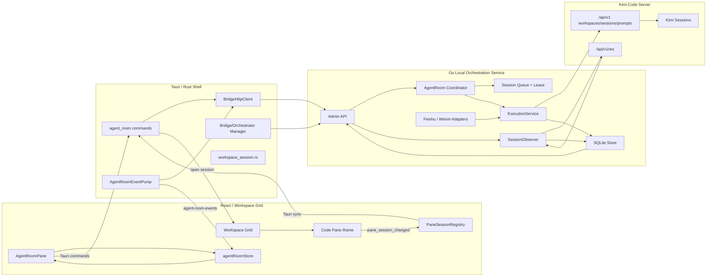
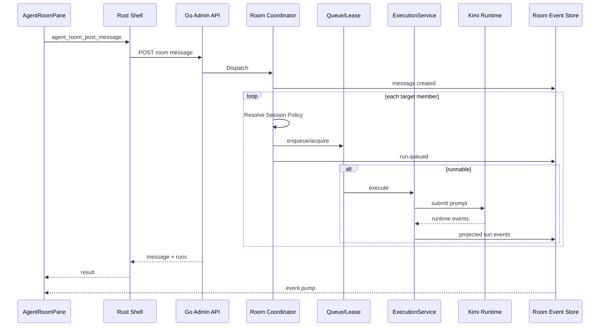
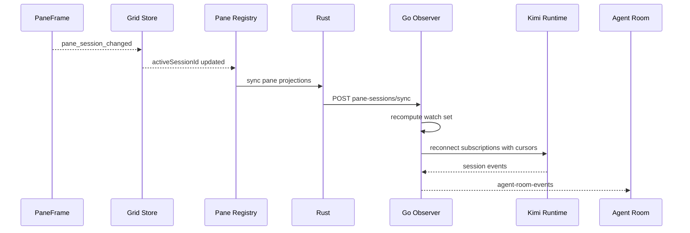

# Agent Room 技术规格（SPEC）

- 仓库：`endearqb/kimi-app`
- 基线：`main@1cc7dbaca9405d055bd237e2b6f6db83b1cc86cf`
- 文档日期：2026-07-18
- 文档状态：Draft v1.1（v1.0 经仓库逐项核对后修订；现有代码契约对照见 §42）
- 对应产品文档：`PRD.md`
- 对应实施计划：`PLAN.md`

---

## 1. 规格目标

本文定义 Agent Room 的目标架构、领域模型、数据库、接口、状态机、事件协议、Pane 集成、Session Observer、并发控制、恢复机制、安全边界和测试契约。

规格必须支持：

1. Agent Room 正向创建/恢复 Session 并分发 Prompt；
2. 反向发现现有 Workspace Grid Pane Session；
3. 长期观察 1–6 个或更多已固定 Session 的状态与回复；
4. Room、Pane、飞书/微信入口复用同一 Kimi Code Session；
5. Session 级排队、Lease、Abort、Approval 和恢复；
6. 不把 token 暴露给 React；
7. 不让 Connector 生命周期清理 Agent Room 数据；
8. 在 Kimi Runtime 某些能力尚未确认时安全降级。

---

## 2. 当前架构约束

### 2.1 Shell

- `apps/kimi-shell` 为 Tauri v2 + React。
- Workspace Grid 使用 Zustand，Pane 与 Slot 分离。
- 当前 `WorkspacePaneKind`：`code | chat | external`。
- 当前 `WorkspacePaneCarrier`：仅 `iframe`。
- Pane 可持久化 `sessionId`、`workDir`，运行期观测 `activeSessionId`。
- Grid 当前最多 6 个可见 Pane、12 个总 Pane。
- Shell 已通过 `/api/v1` 列表、查询和创建 Session。
- `/sessions/{sessionId}` 可打开准确 Session。
- Shell 已有 runtime locator、token resolver、API Client、命令 capability 和日志脱敏体系。
- Grid 持久化键为 `kimi-workspace-grid-state-v1`；加载器在 `parsed.version !== 1` 时回退 legacy 迁移（即重置为默认布局，而非报错）。`kimi-workspace-grid-saved-layouts-v1` 中每条 saved layout 内嵌完整 persisted state。
- `kimi_runtime_locator.json` 已含 `origin`、`tokenPath`、redacted token、`generation`、`ownership`、`health`；当前 Go 侧 locator snapshot 只读取 `origin/tokenPath/health`。
- Grid UI 新建 Code Pane 或切换为 Code 时不自动创建 Session，而是打开 Kimi Code Web 根页面：可见 Code Pane 可能没有任何 Session。
- `openPaneFromExplorer` 复用判定仅比较持久化 `sessionId`，不看运行期 `activeSessionId`。
- `WorkspaceSessionDisposition` 现仅有 `replace_active | new_pane`。

### 2.2 Go Sidecar

- `apps/kimi-im-bridge` 是 Shell 托管的 Go Sidecar。
- 已有 SQLite Store、Binding Router、Orchestrator、Turn/Event/Approval 记录。
- Server Adapter 可调用 Kimi Code `/api/v1`。
- 已有单 Prompt WebSocket 事件映射。
- Admin API 使用本机 token 和 envelope。
- 当前 Sidecar 的命名是 IM Bridge，但 Agent Room 需要把它扩展为本机 Orchestration Service。
- Server Adapter 在附件 wire contract 未经真实验证前对非空 `Attachments` 明确返回 `attachments_unsupported`，不再静默降级为纯文本；`AbortPrompt` 已实现（`:abort`，允许幂等码）并由 Queue/Takeover core 调用；`listSessions` 分页缺口仍存在。
- 单 Prompt 事件流的 `promptEventMatches` 在 payload 缺 `prompt_id` 时默认放行，同 Session 并发时可能误归属事件。
- `turn_events` 已含 `thinking_delta` 列并在 IM 路径持久化 thinking 增量。
- Runtime locator 不可用时 app wiring 静默回退 SDK Provider（对应 CG-001 需消除的行为）。

### 2.3 Runtime

- Kimi Code Server 是 Session、消息、工具执行和审批的源系统。
- Session ID 是跨 Room、Pane、Bridge 和 Runtime 的稳定关联键。
- Runtime WebSocket 当前代码可处理 Session ID、Prompt ID、Sequence 与若干事件类型。
- Runtime 多 Session 订阅、Transcript API 和用户 Prompt 事件仍需能力验证。

---

## 3. 架构决策

### AD-001：Agent Room 使用本地原生 Pane

Agent Room 不通过 iframe 渲染。Workspace Pane Carrier 扩展为：

```ts
export type WorkspacePaneCarrier = "iframe" | "local";
```

Agent Room Pane 使用 `carrier="local"`，直接渲染 React 组件。

### AD-002：Kimi Code Session 是执行真相

- 不复制完整 Session Transcript 到 Room。
- Room 保存任务、成员、Run、事件投影、Cursor、Approval 引用和 Artifact 引用。
- 进入完整上下文时打开准确 Session。

### AD-003：Go Sidecar 承担编排与观察

Go Sidecar 负责：

- Agent Room 数据库；
- Session 创建/恢复；
- Prompt 提交；
- Run Queue 与 Lease；
- Runtime Event Observer；
- Approval；
- Event Projection；
- 重启恢复。

Rust Shell 负责：

- Sidecar 生命周期；
- Admin API Client；
- Token 隔离；
- Pane Session Registry 同步；
- Event Pump；
- Tauri Commands 与事件；
- Window/Pane 路由。

React 负责：

- Agent Room UI；
- 本地状态；
- Pane 关联；
- 用户交互；
- 乐观状态与事件归并。

### AD-004：提取通用 Execution Core

不让 Agent Room 伪装成一个会被 Connector Prune 误删的普通 IM Connector。

从当前 `bridgecore.Orchestrator` 提取通用执行内核：

```go
type ExecutionService interface {
    Run(
        ctx context.Context,
        target ExecutionTarget,
        request ExecutionRequest,
        sink ExecutionEventSink,
    ) (ExecutionResult, error)
}
```

实际契约（2026-07-18，AR-200/AR-300）：实现采用单一具体 `bridgecore.ExecutionService`（避免为唯一实现新增接口），`NewOrchestrator` 保持原 wiring 签名并在内部复用该服务。`ExecutionEvent{Target, Event}` 先写既有 `turn_events`，再把同一 enriched EventID 与 Room/Member/Agent/Run target 交给可选 projection sink；双写有相同事件身份但当前不是跨表原子事务。IM Orchestrator 只保留 Binding 解析、Duplicate 对外语义、HandleResult 与真实 Session Rebind。`ExecutionRequest.RequireExactSession` 让 Room 路径的 Runtime Provider 使用 `resume_exact`，IM 兼容路径保持 `if_missing`；`ExecutionResult/TurnEvent` 显式携带 PromptID，避免后续 Abort/Run 归属猜测。Approval Ticket 的 Room 关联仍为 `json:"-"` 内部字段，但 Store 已通过 `agent_room_approval_links` 与 Approval 同事务持久化，Admin JSON 契约尚未开放。

现有 IM Orchestrator：

```text
Inbound → Resolve IM Binding → ExecutionService.Run
```

Agent Room：

```text
Room Message → Resolve Room Member Session → ExecutionService.Run
```

二者共享：

- Turn 创建；
- Runtime RunTurn；
- Event 持久化；
- Approval 创建；
- Session 更新；
- Artifact 收集；
- Rebind/真实 Session 校正。

### AD-005：Pane Session Observer 独立于 Run

Observer 不能只在 Agent Room 发起 Prompt 时存在。它必须观察：

- Room 发起的 Run；
- Pane 手动发起的 Turn；
- 飞书/微信发起的 Turn；
- Runtime 外部来源。

### AD-006：React 不直连 Runtime 或 Sidecar Token

React 只能调用 Tauri Command 和接收 Tauri Event。所有 token 由 Rust/Go 持有。

### AD-007：事件采用持久化 Sequence + 长轮询 Pump

首版推荐 Sidecar 提供可恢复 Long Poll API，而不是把 Admin Token 暴露给前端或立即引入另一条 Rust WebSocket 依赖：

```text
GET /api/v1/agent-room/events?afterSeq=123&limit=200&waitMs=25000
```

Rust 后台 Event Pump：

1. 持有 Admin Token；
2. 长轮询 Sidecar；
3. 收到事件后通过 Tauri `emit` 发给 `main` Window；
4. 保存内存 Cursor；
5. 断线重试；
6. React 按 Event Sequence 幂等归并。

后续可替换 SSE，而不改变 React 事件协议。

### AD-008：正式成员与临时观察分离

- 自动发现 Pane Session 是运行期 `PaneSessionProjection`；
- 用户加入 Room 后才创建持久化 `AgentRoomMember`；
- 关闭 Agent Room Pane 不删除 Room 或 Session。

---

## 4. 总体组件图



---

## 5. 事实来源与数据所有权

| 数据 | Source of Truth | 投影/缓存 |
|---|---|---|
| Session ID、Workspace ID、Session 状态 | Kimi Code Runtime | Go Store、Rust Session Record、React |
| 完整对话历史 | Kimi Code Runtime | Agent Room 仅保存引用/摘要 |
| Agent Profile | Go SQLite | React Store |
| Agent Room、Member、Message | Go SQLite | React Store |
| Agent Run | Go SQLite | React Store |
| Runtime Turn/Event | Runtime + Go `turn_events` | Agent Room Event Projection |
| Pane/Slot/可见性 | React Zustand Grid Store | Rust/Go 只接收投影 |
| Pane 当前实际 Session | iframe bridge + React | Go `pane_session_observations` 可选快照 |
| Approval | Runtime + Go Approval Store | Room Timeline |
| Session Lease/Queue | Go SQLite | React 状态 |
| Runtime/Admin Token | Rust/Go 内存或受控文件 | 不进入 React |
| Connector Credential | Bridge secrets file | 仅掩码进入 React |

---

## 6. 建议代码结构

### 6.1 Go

```text
apps/kimi-im-bridge/internal/
├── agentroom/
│   ├── service.go
│   ├── coordinator.go
│   ├── models.go
│   ├── prompt_builder.go
│   ├── queue.go
│   ├── recovery.go
│   ├── observer.go
│   ├── event_projector.go
│   └── *_test.go
├── bridgecore/
│   ├── execution_service.go
│   ├── execution_types.go
│   └── orchestrator.go
├── runtime/
│   ├── server_adapter.go
│   ├── session_observer.go
│   ├── transcript.go
│   └── capabilities.go
├── admin/
│   ├── server.go
│   └── agent_room_routes.go
├── store/
│   ├── agent_room.go
│   ├── agent_room_events.go
│   ├── session_leases.go
│   └── store.go
└── domain/
    ├── domain.go
    └── agent_room.go
```

### 6.2 Rust

```text
apps/kimi-shell/src-tauri/src/
├── agent_room_manager.rs
├── agent_room_event_pump.rs
├── bridge_http_client.rs
├── types.rs
└── commands/
    ├── agent_room.rs
    └── bridge.rs
```

### 6.3 React

```text
apps/kimi-shell/src/
├── features/agent-room/
│   ├── AgentRoomPane.tsx
│   ├── AgentRoomHeader.tsx
│   ├── AgentMemberRail.tsx
│   ├── PaneSessionSection.tsx
│   ├── AgentRoomTimeline.tsx
│   ├── AgentRoomComposer.tsx
│   ├── AgentRunCard.tsx
│   ├── AgentApprovalCard.tsx
│   ├── AgentArtifactCard.tsx
│   ├── agentRoomStore.ts
│   ├── eventReducer.ts
│   ├── selectors.ts
│   └── *.test.tsx
├── services/
│   └── agentRoomService.ts
└── features/workspace-grid/
    ├── gridTypes.ts
    ├── gridMigration.ts
    ├── gridStore.ts
    ├── PaneFrame.tsx
    └── WorkspaceGridView.tsx
```

---

## 7. 标识符与命名

所有 ID 使用不透明字符串，不在前端推断结构。

| 类型 | 建议格式 |
|---|---|
| Agent ID | `agent-<uuid>` |
| Room ID | `room-<uuid>` |
| Member ID | `member-<uuid>` |
| Room Message ID | `roommsg-<uuid>` |
| Run ID | `run-<uuid>` |
| Room Event ID | `roomevt-<uuid>` |
| Lease Owner | `room:<roomId>:member:<memberId>:run:<runId>` |
| Observation ID | `observe:<sessionId>` |

Kimi Session ID 保留 Runtime 原值，不加前缀或重写。

---

## 8. 领域模型

### 8.1 Agent Profile

```go
type AgentProfile struct {
    AgentID          string          `json:"agentId"`
    Name             string          `json:"name"`
    Avatar           string          `json:"avatar,omitempty"`
    Description      string          `json:"description,omitempty"`
    RolePrompt       string          `json:"rolePrompt"`
    DefaultWorkDir   string          `json:"defaultWorkDir"`
    SessionPolicy    SessionPolicy   `json:"sessionPolicy"`
    PinnedSessionID  string          `json:"pinnedSessionId,omitempty"`
    AutoApprove      bool            `json:"autoApprove"`
    RuntimeControls  json.RawMessage `json:"runtimeControls,omitempty"`
    Enabled          bool            `json:"enabled"`
    Revision         int64           `json:"revision"`
    CreatedAt        string          `json:"createdAt"`
    UpdatedAt        string          `json:"updatedAt"`
}
```

约束：

- `Name`：1–64 个 Unicode 字符；
- `RolePrompt`：trim 后非空，最大 32 KiB；
- `DefaultWorkDir`：必须标准化且非空；
- `PinnedSessionID` 仅在 `persistent` 或 `resume_selected` 使用；
- `RuntimeControls` 必须通过白名单 schema。

### 8.2 Agent Room

```go
type AgentRoom struct {
    RoomID             string            `json:"roomId"`
    Title              string            `json:"title"`
    Description        string            `json:"description,omitempty"`
    SharedBrief        string            `json:"sharedBrief,omitempty"`
    OrchestrationMode  OrchestrationMode `json:"orchestrationMode"`
    Archived           bool              `json:"archived"`
    CreatedAt          string            `json:"createdAt"`
    UpdatedAt          string            `json:"updatedAt"`
}
```

### 8.3 Room Member

```go
type AgentRoomMember struct {
    MemberID            string          `json:"memberId"`
    RoomID              string          `json:"roomId"`
    MemberKind          MemberKind      `json:"memberKind"`
    AgentID             string          `json:"agentId,omitempty"`
    DisplayName         string          `json:"displayName"`
    WorkspaceRoot       string          `json:"workspaceRoot,omitempty"`
    SessionPolicy       SessionPolicy   `json:"sessionPolicy"`
    FollowMode          FollowMode      `json:"followMode"`
    FollowedPaneID      string          `json:"followedPaneId,omitempty"`
    PinnedSessionID     string          `json:"pinnedSessionId,omitempty"`
    EffectiveSessionID  string          `json:"effectiveSessionId,omitempty"`
    RolePromptSnapshot  string          `json:"rolePromptSnapshot,omitempty"`
    RuntimeControls     json.RawMessage `json:"runtimeControls,omitempty"`
    AutoApprove         bool            `json:"autoApprove"`
    Status              MemberStatus    `json:"status"`
    CreatedAt           string          `json:"createdAt"`
    UpdatedAt           string          `json:"updatedAt"`
}
```

`MemberKind`：

```text
agent | pinned_session | followed_pane
```

`FollowMode`：

```text
pin_session | follow_pane
```

### 8.4 Room Message

```go
type AgentRoomMessage struct {
    MessageID        string          `json:"messageId"`
    RoomID           string          `json:"roomId"`
    SenderKind       SenderKind      `json:"senderKind"`
    SenderID         string          `json:"senderId,omitempty"`
    Content          string          `json:"content"`
    ReplyToMessageID string          `json:"replyToMessageId,omitempty"`
    TargetMemberIDs  []string        `json:"targetMemberIds,omitempty"`
    AttachmentsJSON  json.RawMessage `json:"attachments,omitempty"`
    MetadataJSON     json.RawMessage `json:"metadata,omitempty"`
    CreatedAt        string          `json:"createdAt"`
}
```

`SenderKind`：

```text
user | agent | system | connector
```

### 8.5 Agent Run

```go
type AgentRun struct {
    RunID             string          `json:"runId"`
    RoomID            string          `json:"roomId"`
    SourceMessageID   string          `json:"sourceMessageId"`
    MemberID          string          `json:"memberId"`
    AgentID           string          `json:"agentId,omitempty"`
    SessionID         string          `json:"sessionId,omitempty"`
    WorkDir           string          `json:"workDir,omitempty"`
    TurnID            string          `json:"turnId,omitempty"`
    PromptID          string          `json:"promptId,omitempty"`
    OriginKind        RunOriginKind   `json:"originKind"`
    QueuePolicy       QueuePolicy     `json:"queuePolicy"`
    QueuePosition     *int            `json:"queuePosition,omitempty"`
    Status            AgentRunStatus  `json:"status"`
    ErrorCode         string          `json:"errorCode,omitempty"`
    ErrorMessage      string          `json:"errorMessage,omitempty"`
    ControlsJSON      json.RawMessage `json:"controls,omitempty"`
    PromptAssemblyJSON json.RawMessage `json:"promptAssembly,omitempty"`
    CreatedAt         string          `json:"createdAt"`
    StartedAt         string          `json:"startedAt,omitempty"`
    CompletedAt       string          `json:"completedAt,omitempty"`
    UpdatedAt         string          `json:"updatedAt"`
}
```

### 8.6 Room Event

```go
type AgentRoomEvent struct {
    Seq           int64           `json:"seq"`
    EventID       string          `json:"eventId"`
    RoomID        string          `json:"roomId,omitempty"`
    MemberID      string          `json:"memberId,omitempty"`
    AgentID       string          `json:"agentId,omitempty"`
    RunID         string          `json:"runId,omitempty"`
    SessionID     string          `json:"sessionId,omitempty"`
    TurnID        string          `json:"turnId,omitempty"`
    PromptID      string          `json:"promptId,omitempty"`
    Kind          RoomEventKind   `json:"kind"`
    Status        string          `json:"status,omitempty"`
    TextDelta     string          `json:"textDelta,omitempty"`
    DisplayText   string          `json:"displayText,omitempty"`
    Artifact      *RuntimeArtifact `json:"artifact,omitempty"`
    ApprovalID    string          `json:"approvalId,omitempty"`
    PayloadJSON   json.RawMessage `json:"payload,omitempty"`
    CreatedAt     string          `json:"createdAt"`
}
```

### 8.7 Pane Session Projection

Pane Projection 主要存在于 React/Rust，同步到 Go 供 Observer 决定订阅集合：

```ts
interface PaneSessionProjection {
  paneId: string;
  persistedSessionId?: string;
  activeSessionId?: string;
  effectiveSessionId?: string;
  workDir?: string;
  visible: boolean;
  active: boolean;
  maximized: boolean;
  mountPolicy: "eager" | "on-focus" | "manual" | "suspended";
  loadState: string;
  updatedAt: number;
}
```

### 8.8 Session Observation

```go
type SessionObservation struct {
    SessionID       string `json:"sessionId"`
    WorkDir         string `json:"workDir,omitempty"`
    LastSeq         int64  `json:"lastSeq"`
    Epoch           string `json:"epoch,omitempty"`
    LastEventAt     string `json:"lastEventAt,omitempty"`
    SessionState    string `json:"sessionState"`
    ControlOrigin   string `json:"controlOrigin"`
    CurrentTurnID   string `json:"currentTurnId,omitempty"`
    CurrentPromptID string `json:"currentPromptId,omitempty"`
    LastReply       string `json:"lastReply,omitempty"`
    UpdatedAt       string `json:"updatedAt"`
}
```

### 8.9 Session Lease

复用 `bridge_sessions.lease_owner` 和 `lease_expires_at`，实现原子 Lease。

```go
type SessionLease struct {
    SessionID  string
    Owner      string
    ExpiresAt  string
    AcquiredAt string
}
```

参数：

- TTL：30 秒；
- Heartbeat：10 秒；
- 同一 Owner 可续租；
- Runtime 已显示 Session Running 但本地没有 Lease 时，Control Origin 为 `runtime_external`；
- Sidecar 重启后旧 Lease 过期，不立即强占正在运行的 Runtime Session。
- Heartbeat 连续失败达到 3 次（约 1 个 TTL）时，Run 进入 `blocked` 并产生 `system.warning`，不得在续租状态未知时继续提交后续 Prompt。

---

## 9. 数据库设计

当前 Store `userVersion=13`。建议新增：

```text
0014_agent_room_core.sql
0015_agent_room_events.sql
0016_agent_room_observation_and_queue.sql
```

### 9.1 `0014_agent_room_core.sql`

```sql
CREATE TABLE IF NOT EXISTS agent_profiles (
  agent_id TEXT PRIMARY KEY,
  name TEXT NOT NULL,
  avatar TEXT NULL,
  description TEXT NULL,
  role_prompt TEXT NOT NULL,
  default_work_dir TEXT NOT NULL,
  session_policy TEXT NOT NULL,
  pinned_session_id TEXT NULL,
  auto_approve INTEGER NOT NULL DEFAULT 0,
  runtime_controls_json TEXT NOT NULL DEFAULT '{}',
  enabled INTEGER NOT NULL DEFAULT 1,
  revision INTEGER NOT NULL DEFAULT 1,
  created_at TEXT NOT NULL,
  updated_at TEXT NOT NULL
);

CREATE TABLE IF NOT EXISTS agent_rooms (
  room_id TEXT PRIMARY KEY,
  title TEXT NOT NULL,
  description TEXT NULL,
  shared_brief TEXT NULL,
  orchestration_mode TEXT NOT NULL DEFAULT 'direct',
  archived INTEGER NOT NULL DEFAULT 0,
  created_at TEXT NOT NULL,
  updated_at TEXT NOT NULL
);

CREATE TABLE IF NOT EXISTS agent_room_members (
  member_id TEXT PRIMARY KEY,
  room_id TEXT NOT NULL,
  member_kind TEXT NOT NULL,
  agent_id TEXT NULL,
  display_name TEXT NOT NULL,
  workspace_root TEXT NULL,
  session_policy TEXT NOT NULL,
  follow_mode TEXT NOT NULL,
  followed_pane_id TEXT NULL,
  pinned_session_id TEXT NULL,
  effective_session_id TEXT NULL,
  role_prompt_snapshot TEXT NULL,
  runtime_controls_json TEXT NOT NULL DEFAULT '{}',
  auto_approve INTEGER NOT NULL DEFAULT 0,
  status TEXT NOT NULL DEFAULT 'idle',
  created_at TEXT NOT NULL,
  updated_at TEXT NOT NULL,
  FOREIGN KEY(room_id) REFERENCES agent_rooms(room_id) ON DELETE CASCADE,
  FOREIGN KEY(agent_id) REFERENCES agent_profiles(agent_id) ON DELETE SET NULL
);

CREATE UNIQUE INDEX IF NOT EXISTS idx_agent_room_member_agent
  ON agent_room_members(room_id, agent_id)
  WHERE agent_id IS NOT NULL AND trim(agent_id) <> '';

CREATE INDEX IF NOT EXISTS idx_agent_room_member_session
  ON agent_room_members(effective_session_id);

CREATE TABLE IF NOT EXISTS agent_room_messages (
  message_id TEXT PRIMARY KEY,
  room_id TEXT NOT NULL,
  sender_kind TEXT NOT NULL,
  sender_id TEXT NULL,
  content TEXT NOT NULL,
  reply_to_message_id TEXT NULL,
  target_member_ids_json TEXT NOT NULL DEFAULT '[]',
  attachments_json TEXT NOT NULL DEFAULT '[]',
  metadata_json TEXT NOT NULL DEFAULT '{}',
  created_at TEXT NOT NULL,
  FOREIGN KEY(room_id) REFERENCES agent_rooms(room_id) ON DELETE CASCADE
);

CREATE INDEX IF NOT EXISTS idx_agent_room_messages_room_created
  ON agent_room_messages(room_id, created_at);
```

### 9.2 `0015_agent_room_events.sql`

```sql
CREATE TABLE IF NOT EXISTS agent_runs (
  run_id TEXT PRIMARY KEY,
  room_id TEXT NOT NULL,
  source_message_id TEXT NOT NULL,
  member_id TEXT NOT NULL,
  agent_id TEXT NULL,
  session_id TEXT NULL,
  work_dir TEXT NULL,
  turn_id TEXT NULL,
  prompt_id TEXT NULL,
  origin_kind TEXT NOT NULL,
  queue_policy TEXT NOT NULL,
  status TEXT NOT NULL,
  queue_position INTEGER NULL,
  error_code TEXT NULL,
  error_message TEXT NULL,
  controls_json TEXT NOT NULL DEFAULT '{}',
  prompt_assembly_json TEXT NOT NULL DEFAULT '{}',
  created_at TEXT NOT NULL,
  started_at TEXT NULL,
  completed_at TEXT NULL,
  updated_at TEXT NOT NULL,
  FOREIGN KEY(room_id) REFERENCES agent_rooms(room_id) ON DELETE CASCADE,
  FOREIGN KEY(source_message_id) REFERENCES agent_room_messages(message_id) ON DELETE CASCADE,
  FOREIGN KEY(member_id) REFERENCES agent_room_members(member_id) ON DELETE CASCADE
);

CREATE INDEX IF NOT EXISTS idx_agent_runs_room_created
  ON agent_runs(room_id, created_at);

CREATE INDEX IF NOT EXISTS idx_agent_runs_session_status
  ON agent_runs(session_id, status);

CREATE TABLE IF NOT EXISTS agent_room_events (
  seq INTEGER PRIMARY KEY AUTOINCREMENT,
  event_id TEXT NOT NULL UNIQUE,
  room_id TEXT NULL,
  member_id TEXT NULL,
  agent_id TEXT NULL,
  run_id TEXT NULL,
  session_id TEXT NULL,
  turn_id TEXT NULL,
  prompt_id TEXT NULL,
  kind TEXT NOT NULL,
  status TEXT NULL,
  text_delta TEXT NULL,
  display_text TEXT NULL,
  approval_id TEXT NULL,
  artifact_json TEXT NULL,
  payload_json TEXT NOT NULL DEFAULT '{}',
  created_at TEXT NOT NULL
);

CREATE INDEX IF NOT EXISTS idx_agent_room_events_room_seq
  ON agent_room_events(room_id, seq);

CREATE INDEX IF NOT EXISTS idx_agent_room_events_session_seq
  ON agent_room_events(session_id, seq);

CREATE TABLE IF NOT EXISTS agent_room_event_state (
  singleton INTEGER PRIMARY KEY CHECK(singleton = 1),
  compacted_through_seq INTEGER NOT NULL DEFAULT 0,
  updated_at TEXT NOT NULL
);

INSERT OR IGNORE INTO agent_room_event_state (singleton, compacted_through_seq, updated_at)
VALUES (1, 0, '1970-01-01T00:00:00Z');

CREATE TABLE IF NOT EXISTS agent_room_approval_links (
  approval_id TEXT PRIMARY KEY,
  origin_kind TEXT NOT NULL,
  room_id TEXT NULL,
  member_id TEXT NULL,
  agent_id TEXT NULL,
  run_id TEXT NULL,
  session_id TEXT NOT NULL,
  created_at TEXT NOT NULL,
  updated_at TEXT NOT NULL,
  FOREIGN KEY(room_id) REFERENCES agent_rooms(room_id) ON DELETE CASCADE,
  FOREIGN KEY(member_id) REFERENCES agent_room_members(member_id) ON DELETE CASCADE,
  FOREIGN KEY(agent_id) REFERENCES agent_profiles(agent_id) ON DELETE SET NULL,
  FOREIGN KEY(run_id) REFERENCES agent_runs(run_id) ON DELETE CASCADE
);
```

### 9.3 `0016_agent_room_observation_and_queue.sql`

```sql
CREATE TABLE IF NOT EXISTS session_watch_cursors (
  session_id TEXT PRIMARY KEY,
  last_seq INTEGER NOT NULL DEFAULT 0,
  epoch TEXT NULL,
  last_event_at TEXT NULL,
  updated_at TEXT NOT NULL
);

CREATE TABLE IF NOT EXISTS session_observations (
  session_id TEXT PRIMARY KEY,
  work_dir TEXT NULL,
  last_seq INTEGER NOT NULL DEFAULT 0,
  epoch TEXT NULL,
  last_event_at TEXT NULL,
  session_state TEXT NOT NULL DEFAULT 'unknown',
  control_origin TEXT NOT NULL DEFAULT 'unknown',
  current_turn_id TEXT NULL,
  current_prompt_id TEXT NULL,
  last_reply TEXT NULL,
  updated_at TEXT NOT NULL
);

CREATE TABLE IF NOT EXISTS pane_session_observations (
  pane_id TEXT PRIMARY KEY,
  persisted_session_id TEXT NULL,
  active_session_id TEXT NULL,
  effective_session_id TEXT NULL,
  work_dir TEXT NULL,
  visible INTEGER NOT NULL DEFAULT 0,
  active INTEGER NOT NULL DEFAULT 0,
  maximized INTEGER NOT NULL DEFAULT 0,
  mount_policy TEXT NOT NULL,
  load_state TEXT NOT NULL,
  generation INTEGER NOT NULL,
  updated_at TEXT NOT NULL
);

CREATE INDEX IF NOT EXISTS idx_pane_session_observations_session
  ON pane_session_observations(effective_session_id);

CREATE TABLE IF NOT EXISTS session_prompt_queue (
  queue_id TEXT PRIMARY KEY,
  session_id TEXT NOT NULL,
  run_id TEXT NOT NULL UNIQUE,
  position INTEGER NOT NULL,
  status TEXT NOT NULL DEFAULT 'queued',
  created_at TEXT NOT NULL,
  updated_at TEXT NOT NULL,
  FOREIGN KEY(run_id) REFERENCES agent_runs(run_id) ON DELETE CASCADE
);

CREATE UNIQUE INDEX IF NOT EXISTS idx_session_prompt_queue_position
  ON session_prompt_queue(session_id, position);
```

### 9.4 数据删除规则

- 删除 Agent Profile：Room Member 保留快照，`agent_id` 置空。
- 删除 Room：级联删除 Room Member、Message、Run 与 Approval Link；Room Event 保留为不可执行的审计投影。
- 删除 Room 不删除 `bridge_sessions` 或 Runtime Session。
- 删除 Connector 不处理 `agent_*` 表。
- 清理旧 Session 时先检查 Room Member、Run、Approval 和 Pane Projection 引用。

实际持久化契约（2026-07-18，AR-300～304）：Accepted ADR 为 `.ai/decisions/2026-07-18-agent-room-persistence.md`。Store 使用单 SQLite 连接保证 connection-local PRAGMA 一致，每个 migration 独立事务并校验其 `user_version`；Profile 使用整数 `revision` 乐观锁。Approval 关联使用独立 Link 表且不对旧 Approval 表声明外键，避免 Connector prune 的间接级联。Event 使用持久化 compaction watermark 区分 invalid/too-old Cursor；V1 暂不执行实际 compaction。`session_watch_cursors` 与 `session_observations` 都保存 Runtime epoch。Room 删除保留无 Room 外键的 Event 审计，但不删除 `bridge_sessions`。

---

## 10. 枚举

### 10.1 Session Policy

```go
const (
    SessionPolicyPerRoom        = "per_room"
    SessionPolicyPersistent     = "persistent"
    SessionPolicyNewPerTask     = "new_per_task"
    SessionPolicyResumeSelected = "resume_selected"
)
```

### 10.2 Orchestration Mode

```text
direct | parallel | workflow
```

### 10.3 Queue Policy

```text
enqueue | follow_up | abort_and_replace | record_only
```

### 10.4 Run Origin

```text
agent_room | pane_manual | feishu | weixin | runtime_external | unknown
```

### 10.5 Event Kind

```text
room.created
room.updated
member.added
member.updated
member.removed
message.created
run.queued
run.session_resolved
run.started
run.step_started
run.status
run.reply_delta
run.reply_completed
run.approval_requested
run.approval_resolved
run.artifact_ready
run.completed
run.failed
run.aborted
run.orphaned
session.observed
session.status
session.pane_attached
session.pane_detached
session.control_changed
observer.connected
observer.disconnected
observer.resync_required
system.warning
```

AR-303 实际 Run 状态在 PRD 基础枚举上增加两个显式中间/冲突态：`abort_requested` 表示 Runtime 尚未确认 Abort，此时禁止 Retry 或替代 Run；`conflicted` 表示 Room Run 与外部 Pane/Runtime 控制发生归属冲突。二者均不得被当作终态。

---

## 11. 核心不变量

### INV-001

正式 `per_room` Agent Member 在一个 Room 中只能有一个当前有效 Session。

### INV-002

一个 Agent Run 只对应一个 Session。Session Rebind 时必须记录旧值和新值。

### INV-003

一个 Session 同一时刻只能有一个有效 Lease Owner。

### INV-004

同一 Runtime Event 不得生成两个具有不同语义的 Room Event。

### INV-005

Room Event `seq` 单调递增，React 只按 `seq` 应用。

### INV-006

Pane ID 不是 Session ID。关闭/替换 Pane 不改变 Session。

### INV-007

同一 Session 多 Pane 只生成一个 Session Mirror。

### INV-008

Agent Profile 与 Connector Credential 无级联依赖。

### INV-009

Connector Prune 不得删除 Agent Room Member、Run 或 Event。

### INV-010

`new_per_task` 必须创建新 Session，不能复用 Workspace 第一条 Session。

### INV-011

`resume_selected` 必须按准确 Session ID 获取，失败后不能静默选择其他 Session。

### INV-012

Room 消息正文、Role Prompt、Shared Brief、跨 Agent 结果在 Prompt Assembly 中分别记录来源。

### INV-013

React 和 localStorage 不得保存 token 或 Connector Secret。

### INV-014

未确认的 Pane 用户 Prompt 不得以推断文本写入 Timeline。

---

## 12. 通用 Execution Core

### 12.1 接口

```go
type ExecutionTarget struct {
    OriginKind  string
    ConnectorID string
    Platform    string
    ChatID      string
    ThreadID    string
    RoomID      string
    MemberID    string
    AgentID     string
    RunID       string
}

type ExecutionRequest struct {
    TurnID        string
    Prompt         string
    WorkDir       string
    KimiSessionID string
    AutoApprove   bool
    MetadataJSON  string
    Attachments   []domain.PromptAttachment
}

type ExecutionResult struct {
    TurnID        string
    KimiSessionID string
    Status        string
    ReplyText     string
    Artifacts     []domain.RuntimeArtifact
    Error         string
}

type ExecutionService interface {
    Run(
        context.Context,
        ExecutionTarget,
        ExecutionRequest,
        ExecutionEventSink,
    ) (ExecutionResult, error)
}
```

### 12.2 现有 Orchestrator 改造

当前 `HandleInbound` 中以下逻辑移到 `ExecutionService.Run`：

- Turn 建档；
- accepted event；
- Runtime `RunTurn`；
- Event 补全；
- Approval Ticket；
- Reply/Artifact 聚合；
- Turn 完成状态；
- Session Upsert。

`HandleInbound` 保留：

- Binding 解析；
- Duplicate Inbound；
- WorkDir/Session 选择；
- IM 返回目标信息。

### 12.3 Agent Room Coordinator

```go
func (s *Service) DispatchMessage(
    ctx context.Context,
    roomID string,
    input DispatchInput,
) (DispatchResult, error)
```

步骤：

1. 验证 Room；
2. 保存 Room Message；
3. 解析 Target Members；
4. 为每个 Member 创建 Agent Run；
5. 解析 Session；
6. 应用 Queue Policy；
7. 立即运行或排队；
8. 返回 Message + Runs；
9. 后台执行，事件持续写入 `agent_room_events`。

---

## 13. Session 解析

### 13.1 `per_room`

查询：

```text
agent_room_members.effective_session_id
```

若为空：

1. 标准化 Workspace；
2. `EnsureWorkspace(root)`；
3. **强制 `CreateSession`**；
4. 保存真实 Session ID；
5. Upsert `bridge_sessions`；
6. 产生 `run.session_resolved`。

### 13.2 `persistent`

使用 Agent Profile `pinned_session_id`。每次执行前：

- `GET session by ID`；
- 验证 Workspace；
- 不存在时返回 `session_not_found`；
- 不自动创建替代 Session，除非用户显式选择“重建”。

### 13.3 `new_per_task`

每个 Run 创建新 Session，并保存到 Run，不回写 Member 的长期 `effective_session_id`，或只记录 `last_session_id`。

### 13.4 `resume_selected`

按用户指定 Session ID 获取。Workspace 不一致时：

- 默认拒绝；
- API 返回 `workspace_mismatch`；
- 用户确认后以 Session 实际 Workspace 为准，并记录 override。

### 13.5 Server Adapter 改动

新增明确接口：

```go
type SessionCreateMode string

const (
    SessionCreateIfMissing  SessionCreateMode = "if_missing"
    SessionCreateAlways     SessionCreateMode = "always"
    SessionResumeExact      SessionCreateMode = "resume_exact"
    SessionReuseLatest      SessionCreateMode = "reuse_latest"
)

type EnsureSessionRequest struct {
    KimiCodeSessionID string
    WorkspaceID       string
    WorkspaceRoot     string
    SessionSource     string
    CreateMode        SessionCreateMode
}
```

Agent Room 默认：

- `per_room` 首次：`always`
- `new_per_task`：`always`
- `persistent/resume_selected`：`resume_exact`

现有 IM 可在迁移期使用 `if_missing`，但不得继续隐式 `sessions[0]` 作为新 Binding 默认。

兼容性：`CreateMode` 是对现有 `EnsureSessionRequest`（字段见 §42）的新增字段，缺省值必须等价于当前行为（`if_missing`），符合仓库宪法“序列化契约只增不改”。`reuse_latest` 即当前 `sessions[0]` 语义的显式命名，仅允许显式调用。

实际契约（2026-07-18，AR-101/102）：`.ai/decisions/2026-07-18-session-create-mode.md` 已 Accepted。Go JSON 字段为 `createMode`；Server Adapter 对 `always` 跳过 Session 列表并强制创建，对 `resume_exact` 要求准确 ID 且校验调用方提供的 Workspace ID/Root，不存在或不匹配分别明确失败，对 `reuse_latest` 才显式选择多 Session 列表首项。新 IM Binding 显式使用 `always`；既有 Binding 的 Turn 恢复显式传 `if_missing`，且只有该模式允许失效旧 ID 的兼容重绑；ACP/SDK 不作为 Agent Room 严格隔离降级路径。

---

## 14. Prompt Assembly

### 14.1 结构

```json
{
  "version": 1,
  "roomId": "room-...",
  "memberId": "member-...",
  "agentId": "agent-...",
  "rolePromptHash": "...",
  "sharedBriefIncluded": true,
  "sharedResultRefs": ["run-..."],
  "userMessageId": "roommsg-...",
  "controls": {
    "model": "...",
    "thinking": "...",
    "permission_mode": "..."
  }
}
```

### 14.2 Prompt 文本

推荐模板：

```text
[Agent Room Context]
Room: <room title>
Agent: <agent name>
Role:
<role prompt>

Room shared brief:
<brief or "(none)">

Explicitly shared prior results:
<selected summaries only>

[User Task]
<original user content>
```

要求：

- 用户原文保持可追溯；
- 不自动注入其他 Agent 完整 Session；
- Shared Brief 有长度上限；
- 引用结果按用户或 Workflow 显式选择；
- Prompt Assembly JSON 不保存 token。

### 14.3 Runtime Metadata

```json
{
  "agent_room": {
    "room_id": "...",
    "member_id": "...",
    "agent_id": "...",
    "run_id": "...",
    "source_message_id": "..."
  },
  "runtime_controls": {
    "model": "...",
    "thinking": "...",
    "permission_mode": "...",
    "plan": "...",
    "swarm": "...",
    "goal": "..."
  }
}
```

---

## 15. Queue 与 Lease

### 15.1 Acquire Lease

原子 SQL 语义：

```sql
UPDATE bridge_sessions
SET lease_owner = ?,
    lease_expires_at = ?,
    updated_at = ?
WHERE kimi_session_id = ?
  AND (
    ifnull(trim(lease_owner), '') = ''
    OR lease_expires_at < ?
    OR lease_owner = ?
  );
```

受影响行数为 1 表示成功。

### 15.2 Runtime Running 优先

即使本地 Lease 为空，只要 Runtime Session 表示 Running：

- 不主动提交并发 Prompt；
- 将状态标为 `runtime_external`；
- 根据 Queue Policy 排队或请求 Abort。

### 15.3 Queue

每个 Session 单独 FIFO。

```text
session_prompt_queue(session_id, position)
```

处理器：

1. 当前无有效 Run/Runtime idle；
2. 取最小 position；
3. Acquire Lease；
4. 状态 `submitting`；
5. 提交 Prompt；
6. Heartbeat Lease；
7. 完成后释放；
8. 执行下一条。

### 15.4 Follow-up

只有 Runtime 明确支持原生排队时，`follow_up` 才直接提交。否则降级为本地 `enqueue` 并在响应中标明。

### 15.5 Abort and Replace

1. 标记旧 Run `abort_requested`；
2. 调 Runtime Abort；
3. 等待 `turn.ended(reason=aborted)` 或超时；
4. 若确认终止，释放 Lease；
5. 新 Run 入队首；
6. 若未确认，返回 `abort_unconfirmed`，不并发提交。

### 15.6 Lease 恢复

Sidecar 启动：

- 清理已过期 Lease；
- 对未过期 Lease 查询 Runtime Session；
- Runtime idle：旧 Run 标 `orphaned`，释放 Lease；
- Runtime running：恢复 Observer，延长 Lease 或标 `runtime_external`；

### 15.7 实际契约（2026-07-18，AR-201～203）

- `bridge_sessions.lease_owner/lease_expires_at` 是共享执行所有权根；默认 TTL 30 秒、Heartbeat 10 秒。Acquire、Renew、Release 都带 owner 条件，NULL/非法 expiry 可恢复；`SessionLease.AcquiredAt` 仅为首次获取的瞬时返回值，不持久化。
- `bridgecore.SessionExecutionGuard` 位于 IM 与未来 Room 共用的 `ExecutionService` chokepoint。提交前、获取 Lease 后各检查一次 Runtime；running/waiting/submitting 拒绝并发，严格 Room 路径对未知状态 fail closed。三次 Heartbeat 失败会阻塞关联 Run、释放仍归本 owner 的 Lease，并写脱敏 warning event。
- `agent_room_prompt_queue` 每 Session 原子分配 FIFO position，最大 50；只有 `queued|resolving_session` Run 可进入，terminal Run 不可复活。claimed 项在重启后必须先查询 Runtime：unknown 保持 claimed，idle 返回 queued，running 返回 queued 并将 control origin 记为 `runtime_external`。
- `QueueCoordinator` 在真正提交前再次检查 Runtime 并 finalize 为 `submitting`；完成后 owner-conditional release 并推进下一项。Session 缺失明确失败；`follow_up` 统一降级本地 FIFO。
- `RuntimeStateResolver` 仅在 Observer observation 与当前 locator generation 相同且未过 freshness 窗口时优先使用它，否则查询精确 Session REST。Observer worker 已在 Agent Room flag 开启且实际 Server locator ready 时接线；不可用时明确回退精确 Session REST。
- Runtime 0.27.0 的 Abort 完成确认未完成写入型验证；`abort_and_replace` 在 busy 时标记 replacement Run 为 `blocked/abort_unconfirmed`，不调用 Abort、不前插、不提交替代 Run。
- Pending Approval 走现有 reconcile。

---

## 16. Session Observer

### 16.1 目标

一个 Runtime Generation 使用一个长期 Observer，观察所有需要的 Session：

```text
观察集合 =
  当前 Pane effectiveSessionId
  ∪ 正式 Room Member Session
  ∪ 正在运行/排队/待审批 Run Session
  ∪ 用户手动固定观察 Session
```

### 16.2 动态订阅

如果 Runtime 不支持连接内更新 subscriptions：

1. 观察集合变化后 debounce 300 ms；
2. 保存所有 Session Cursor；
3. 关闭旧连接；
4. 新连接发送完整 `subscriptions[]` 与 `cursors{}`；
5. 通过 Sequence 去重；
6. 连接期间的事件由 Cursor 重放补齐。

### 16.3 Hello

```json
{
  "type": "client_hello",
  "id": "agent-room-observer-<generation>",
  "payload": {
    "subscriptions": ["session-a", "session-b"],
    "cursors": {
      "session-a": {"seq": 120},
      "session-b": {"seq": 43}
    }
  }
}
```

注：现有网关 `wsCursor` 已定义可选 `epoch` 字段（语义待 CG-009 验证）；Observer 首次订阅某 Session 时，可用 `GET /sessions/{id}` 返回的 `last_seq` 引导 Cursor，避免全量重放。

### 16.4 Observer 事件解析

Observer 不使用当前的 Prompt ID Filter。它必须先按 Session ID 接收全部事件，再解析 Prompt/Turn。

```go
type ObservedRuntimeEvent struct {
    Seq       int
    SessionID string
    PromptID  string
    TurnID    string
    Type      string
    Payload   json.RawMessage
    Timestamp string
}
```

### 16.5 映射

| Runtime Event | Room Event |
|---|---|
| `turn.started` | `run.started` 或 `session.status` |
| `turn.step.started` | `run.step_started` |
| `assistant.delta` | `run.reply_delta` |
| `thinking.delta` | 默认 `run.status`; 可展示摘要时单独字段 |
| `agent.status.updated` | `run.status` |
| `approval.requested` | `run.approval_requested` |
| `approval.resolved` | `run.approval_resolved` |
| `artifact.ready`（待 CG-008 验证） | `run.artifact_ready` |
| `turn.ended` | `run.completed/failed/aborted` |
| `prompt.completed` | `run.completed` |
| `resync_required` | `observer.resync_required` |

验证状态：上表中 `turn.started`、`turn.step.started`、`assistant.delta`、`thinking.delta`、`agent.status.updated`、`approval.requested`、`approval.resolved`、`turn.ended(reason)`、`prompt.completed` 与 `resync_required` 均已在现有单 Prompt 流（`server_adapter.go` 帧处理）中出现；`artifact.ready` 目前仅存在于 SDK Driver 路径，Server WS 是否产生 artifact 类事件必须由 CG-008 给出结论，未证实前 Room 不承诺 `run.artifact_ready`。

### 16.6 Run 归属

优先级：

1. Runtime Metadata 中 `agent_room.run_id`；
2. `prompt_id` 匹配 `agent_runs.prompt_id`；
3. `turn_id` 匹配；
4. 当前 Session 唯一 Running Run；
5. 无法匹配时创建 `origin=runtime_external` 或 `pane_manual` 临时投影。

### 16.7 Reply Delta 合并

数据库可保留原始 Event 或合并 Event。Room UI 投影建议：

- 每 100 ms 或 256 字符 Flush 一次；
- `run.reply_completed` 保存最终文本 Hash/摘要；
- 原始完整回复仍以 Runtime Session 为准；
- Room 只保留足以恢复 UI 的投影。

### 16.8 Thinking 处理

- 不把隐藏推理当作普通回复；
- 默认只显示“正在思考”及可展示状态；
- Runtime 明确标记为用户可见的 thinking 可在内存展示；
- 默认不永久存储详细 thinking delta；
- 产品策略变化需单独安全审查。
- 现状：IM 路径已把 `thinking_delta` 写入 `turn_events`。Agent Room 事件表（`agent_room_events`）不复制 thinking 增量；是否收紧 `turn_events` 既有持久化行为是独立决策，不由本 SPEC 隐式改变。

---

## 17. Pane Session Registry

### 17.1 Effective Session

```ts
function effectivePaneSessionId(pane: WorkspacePane): string | undefined {
  return pane.activeSessionId?.trim() || pane.sessionId?.trim() || undefined;
}
```

### 17.2 去重投影

```ts
interface SessionPaneGroup {
  sessionId: string;
  paneIds: string[];
  primaryPaneId: string;
  workDir?: string;
  visible: boolean;
  active: boolean;
}
```

`primaryPaneId` 优先：

1. active Pane；
2. visible Pane；
3. mounted Pane；
4. 最近更新时间最大的 Pane。

### 17.3 Sync

React 通过 Tauri Command：

```ts
syncAgentRoomPaneSessions({
  generation,
  panes: projections,
});
```

触发条件：

- Pane 添加/删除；
- `activeSessionId` 改变；
- Pane 可见性改变；
- Pane mountPolicy 改变；
- Grid 恢复；
- Runtime Generation 改变。

Debounce：250 ms。

### 17.4 Generation

Generation 以 `kimi_runtime_locator.json` 的 `generation` 字段为权威来源（Rust 在每次 Runtime 启动/重连时更新），Go Observer 直接读取 locator，不经 React/token 通道另造计数。Go 只接受不小于已持久 checkpoint 的 Generation，避免旧异步事件覆盖新状态。`ownership=reused_external` 表示 Runtime 是外部进程，Observer 生命周期与降级文案必须兼容该形态。

### 17.5 Pane 关闭

- Projection 删除；
- 若 Session 被正式 Member、Run 或固定观察引用，Observer 保留；
- 否则可在 grace period 后取消订阅。

---

## 18. Workspace Grid V2

### 18.1 类型

```ts
export type WorkspacePaneKind =
  | "code"
  | "chat"
  | "agent_room"
  | "external";

export type WorkspacePaneCarrier =
  | "iframe"
  | "local";

export interface WorkspacePane {
  id: string;
  kind: WorkspacePaneKind;
  carrier: WorkspacePaneCarrier;
  title: string;
  sessionId?: string;
  activeSessionId?: string;
  roomId?: string;
  url?: string;
  workDir?: string;
  // existing fields...
}
```

约束：

- `agent_room` 必须 `carrier=local`；
- `code/chat/external` 保持现有 Carrier；
- `roomId` 只对 Agent Room Pane 有效。

### 18.2 Persisted State

升级为：

```ts
interface WorkspaceGridStateV2 {
  version: 2;
  // existing fields
}
```

V1→V2：

- `kind` 不变；
- `carrier` 缺失时填 `iframe`；
- `roomId` 缺失；
- Pane/Slot/上限规则不变；
- 保存前 sanitization 拒绝非法 `agent_room + iframe`。

存储与回滚策略（决策）：

- 现有加载器对 `version !== 1` 的处理是回退 legacy 迁移并重置为默认布局，且键名本身为 `kimi-workspace-grid-state-v1`。因此 V2 **必须使用独立键** `kimi-workspace-grid-state-v2`：读取时先取 v2，缺失则从 v1 迁移；迁移后**不回写、不删除** v1 键。回滚到旧版本时旧加载器继续读取原样 v1，布局无损。
- `kimi-workspace-grid-saved-layouts-v1` 中每条 saved layout 内嵌 persisted state，必须同步迁移到 `…-saved-layouts-v2`（同样保留 v1 原样）；含 `agent_room` Pane 的布局在旧版本中不可见但不破坏其余布局。
- v1 键的清理（若做）延后到 V2 稳定一个发布周期之后，并单独记录变更。

### 18.3 PaneFrame

`PaneFrame` 分支：

```tsx
if (pane.kind === "agent_room") {
  return <AgentRoomPane roomId={pane.roomId} />;
}
```

Agent Room 不创建 iframe，不使用 `buildCodePaneUrl`。

### 18.4 Open Session

提取公共动作：

```ts
openSessionInWorkspaceGrid({
  sessionId,
  workDir,
  disposition: "focus_existing" | "new_pane" | "replace_active",
});
```

复用当前 `openPaneFromExplorer` Placement 策略（reused_visible / reused_swapped / added_visible / added_swapped / limit_reached），但将命名泛化，不绑定 Explorer 来源，并做两处修正：

1. **已有 Pane 匹配必须按 effective session**（`activeSessionId?.trim() || sessionId?.trim()`）。现有实现仅比较持久化 `sessionId`，当 Pane 运行期已导航到目标 Session 时会错误新建重复 Pane。
2. `focus_existing` 是对现有 `WorkspaceSessionDisposition`（仅 `replace_active | new_pane`）的新增值；Rust 侧枚举按“只增不改”扩展，旧调用方行为不变。

### 18.5 实际 Grid V2 / Native Pane 契约（2026-07-18，AR-600～604）

- Accepted ADR：`.ai/decisions/2026-07-18-workspace-grid-v2-agent-room.md`。Grid state 与 saved layouts 分别写入独立 V2 key；有效 V2 优先，缺失或损坏时从原样 V1 key 只读迁移，加载过程不回写、不删除 V1。
- `agent_room` Pane 强制 `carrier=local`，只持久化协作 `roomId` 引用；sanitizer 清除其 Session、URL、workDir 与 storage namespace，并按非空 `roomId` 去重。6 可见/12 总 Pane 策略不变。
- `PaneFrame` 在解析 URL 前显式分流 local/iframe。`AgentRoomPane` 复用公共 header、拖动、最大化、删除、Pane Shelf、Theme 与 Suspend 机制，不创建 iframe，也不进入 Code Session observation。
- Native Pane shell 提供 Room selector、Agent/Member 管理、Timeline、Pane Session 观察、Pump/Runtime 健康与 Forward Composer。Room 不存在时保留 selector 作为修复路径；archived Room、Runtime 不可用和未解析 Session 均 fail closed。
- `openSessionInWorkspaceGrid` 是 Explorer 与 Agent Room 共用动作；匹配使用 `activeSessionId?.trim() || sessionId?.trim()`，支持 focus/new/replace、workDir 更新、6 Pane swap、12 Pane 对话与既有 requestId 去重。Room 成员只用明确 `effectiveSessionId` 打开，不回退 `sessions[0]`。

---

## 19. Admin API

所有 Endpoint 保持现有：

```json
{
  "ok": true,
  "data": {},
  "requestId": "..."
}
```

错误：

```json
{
  "ok": false,
  "error": {
    "code": "session_busy",
    "message": "...",
    "details": {}
  },
  "requestId": "..."
}
```

### 19.1 Agents

#### `GET /api/v1/agent-room/agents`

```json
{"items": [AgentProfile]}
```

#### `POST /api/v1/agent-room/agents`

```json
{
  "name": "架构师",
  "rolePrompt": "负责系统边界、接口和技术取舍。",
  "defaultWorkDir": "D:\\repo\\architecture",
  "sessionPolicy": "per_room",
  "autoApprove": false,
  "runtimeControls": {}
}
```

#### `PATCH /api/v1/agent-room/agents/{agentId}`

部分更新，使用 revision 或 `updatedAt` 乐观锁。

#### `DELETE /api/v1/agent-room/agents/{agentId}`

默认保留 Room Member 快照。

### 19.2 Rooms

#### `GET /api/v1/agent-room/rooms`

支持：

```text
archived=false
limit=50
cursor=...
```

#### `POST /api/v1/agent-room/rooms`

```json
{
  "title": "插件重构",
  "description": "",
  "sharedBrief": "",
  "orchestrationMode": "direct"
}
```

#### `GET /api/v1/agent-room/rooms/{roomId}`

返回 Room、Members 和摘要，不默认返回全部 Timeline。

#### `PATCH /api/v1/agent-room/rooms/{roomId}`

#### `DELETE /api/v1/agent-room/rooms/{roomId}`

必须接收：

```json
{"confirm": true}
```

### 19.3 Members

#### `POST /api/v1/agent-room/rooms/{roomId}/members`

Agent Profile：

```json
{
  "memberKind": "agent",
  "agentId": "agent-..."
}
```

固定 Session：

```json
{
  "memberKind": "pinned_session",
  "displayName": "当前后端 Session",
  "pinnedSessionId": "session-...",
  "workspaceRoot": "D:\\repo",
  "followMode": "pin_session",
  "sessionPolicy": "resume_selected"
}
```

跟随 Pane：

```json
{
  "memberKind": "followed_pane",
  "displayName": "Pane 2",
  "followedPaneId": "pane-...",
  "followMode": "follow_pane"
}
```

#### `PATCH /api/v1/agent-room/rooms/{roomId}/members/{memberId}`

#### `DELETE /api/v1/agent-room/rooms/{roomId}/members/{memberId}`

### 19.4 Timeline

#### `GET /api/v1/agent-room/rooms/{roomId}/timeline`

参数：

```text
beforeSeq
afterSeq
limit
```

返回合并后的 Room Message 与 Room Event View Model。

### 19.5 Dispatch

#### `POST /api/v1/agent-room/rooms/{roomId}/messages`

```json
{
  "content": "分别评估当前插件系统的重构风险。",
  "targetMemberIds": ["member-a", "member-b"],
  "mode": "parallel",
  "queuePolicy": "enqueue",
  "replyToMessageId": null,
  "attachments": [],
  "sharedRunIds": []
}
```

响应：

```json
{
  "message": {},
  "runs": [
    {
      "runId": "run-a",
      "memberId": "member-a",
      "status": "queued"
    }
  ]
}
```

### 19.6 Runs

#### `GET /api/v1/agent-room/runs/{runId}`

#### `POST /api/v1/agent-room/runs/{runId}/abort`

```json
{"reason": "user_takeover"}
```

#### `POST /api/v1/agent-room/runs/{runId}/retry`

```json
{
  "sessionMode": "same_session"
}
```

可选：

```text
same_session | new_session
```

### 19.7 Pane Session Sync

#### `POST /api/v1/agent-room/pane-sessions/sync`

```json
{
  "generation": 42,
  "panes": [
    {
      "paneId": "pane-code-1",
      "persistedSessionId": "session-a",
      "activeSessionId": "session-a",
      "effectiveSessionId": "session-a",
      "workDir": "D:\\repo-a",
      "visible": true,
      "active": true,
      "maximized": false,
      "mountPolicy": "eager",
      "loadState": "ready",
      "updatedAt": 1784370000000
    }
  ]
}
```

响应：

```json
{
  "acceptedGeneration": 42,
  "observedSessionIds": ["session-a"]
}
```

### 19.8 Observed Sessions

#### `GET /api/v1/agent-room/observations`

返回去重 Session Projection。

#### `POST /api/v1/agent-room/observations/{sessionId}/pin`

#### `DELETE /api/v1/agent-room/observations/{sessionId}/pin`

### 19.9 Event Long Poll

#### `GET /api/v1/agent-room/events`

参数：

- `afterSeq`：可选，缺省 0；
- `roomId`：可选；
- `limit`：1–500；
- `waitMs`：0–30000。

响应：

```json
{
  "items": [AgentRoomEvent],
  "nextSeq": 380,
  "hasMore": false,
  "serverTime": "..."
}
```

### 19.10 Capabilities

#### `GET /api/v1/agent-room/capabilities`

```json
{
  "runtimeProvider": "server",
  "multiSessionObservation": true,
  "sessionTranscript": false,
  "userPromptEvents": false,
  "abort": true,
  "approval": true,
  "nativeFollowUp": false
}
```

UI 根据能力降级。

### 19.11 实际 Admin 契约（2026-07-18，AR-305～306）

- Accepted ADR：`.ai/decisions/2026-07-18-agent-room-admin-api.md`；路由仅在 `KIMI_AGENT_ROOM_ENABLED=true` 时挂载，缺省 404。所有路由复用 loopback Admin token、既有 envelope 和 1 MiB body limit，并对 Agent Room body 使用 strict unknown-field/trailing-value decode。
- Agent/Room PATCH 在 Handler 读取当前值后做字段级合并；Agent revision conflict 为稳定 typed error。Room 列表 cursor 是 opaque URL-safe token；Timeline 支持 `beforeSeq/afterSeq/limit`；Event long poll 支持 `afterSeq/roomId/limit<=500/waitMs<=30000`。
- Message endpoint 接受 `mode/queuePolicy/sharedRunIds` 并原子保存 Message/每 target Run；Forward Dispatcher 在 Observer Gate 通过后接入 Runtime。排队/解析中 Run 可本地 Abort；运行中只持久 `abort_requested` 并返回 409 `abort_unconfirmed`。Retry `same_session` 可创建新 Run，`new_session` 仍明确拒绝。
- Pane Sync 的全局 generation/hash 与 Observation Pin 由 Accepted `.ai/decisions/2026-07-18-agent-room-runtime-state.md`、migration 0017 持久化；Observer per-Session Runtime generation checkpoint 由 Accepted `.ai/decisions/2026-07-18-agent-room-observer-checkpoint.md`、migration 0018 持久化。`activeSessionId` 优先于 persisted ID；空 snapshot 也推进 generation；same generation 同 hash 幂等、不同 hash 冲突；Pin 只保存 watch 意图，不伪造 Observation。
- Bridge Status 增量 `agentRoom` summary；Capabilities 与 Status 使用实际选中的 Provider、locator health 和 Observer availability。非 Server 返回 `server_provider_required`，Server 不 ready 返回 `runtime_unavailable`，Observer 未可用返回 `observer_not_running`；Abort 仍返回 `abort_unconfirmed`。

---

## 20. Tauri Commands

```rust
#[tauri::command]
fn agent_room_list_agents(...) -> Result<Vec<AgentProfile>, String>;

#[tauri::command]
fn agent_room_create_agent(input: AgentProfileInput, ...) -> Result<AgentProfile, String>;

#[tauri::command]
fn agent_room_list_rooms(...) -> Result<Vec<AgentRoomSummary>, String>;

#[tauri::command]
fn agent_room_get_room(room_id: String, ...) -> Result<AgentRoomDetail, String>;

#[tauri::command]
fn agent_room_post_message(
    room_id: String,
    input: AgentRoomPostMessageInput,
    ...
) -> Result<AgentRoomDispatchResult, String>;

#[tauri::command]
fn agent_room_abort_run(run_id: String, ...) -> Result<(), String>;

#[tauri::command]
fn agent_room_resolve_approval(input: BridgeApprovalResolveInput, ...) -> Result<(), String>;

#[tauri::command]
fn agent_room_sync_pane_sessions(
    input: PaneSessionSyncInput,
    ...
) -> Result<PaneSessionSyncResult, String>;

#[tauri::command]
fn agent_room_open_session(
    session_id: String,
    work_dir: Option<String>,
    disposition: SessionOpenDisposition,
    ...
) -> Result<WorkspaceSessionBridgePayload, String>;
```

命令必须：

- 注册到 `commands.rs`；
- 添加 `commands/agent_room.rs` domain owner；
- 加入 `permissions/command-access.toml`；
- 更新 `scripts/check_command_registry.mjs` 清单；
- 仅允许 `main` Window。

### 20.1 实际 Shell 契约（2026-07-18，AR-500～504）

- Accepted ADR：`.ai/decisions/2026-07-18-agent-room-shell-contract.md`。Go Admin camelCase JSON 是权威；Rust/TypeScript 仅等价映射。所有命令返回可序列化 `AgentRoomCommandError { code, message, details?, requestId?, httpStatus? }`，不再把 code/requestId 压入字符串。
- 列表保持 Admin page 形状：Agent 为 `{ items }`，Room 为 `{ items, cursor }`，Room detail 为 `{ room, members }`，Event 为 `{ items, nextSeq, hasMore, serverTime }`。Raw JSON 字段映射为 `serde_json::Value`/`unknown`，不转义成第二层 JSON 字符串。
- main-only 命令已覆盖 Agent/Room/Member CRUD、Timeline、Message/Run/Retry/Abort、Approval、Pane Sync、Observation list/pin、Capabilities、Event poll 与 Open Session。Command manifest、permission 与 registry 为同一 163-command 集合；prefill/workspace-import-picker 无 Agent Room 权限。
- `BridgeHttpClient` 普通超时 3 秒，Event long poll 为 `waitMs + 5 秒`；Agent Room 响应不回显 raw body。Admin token 会从 error code/message/requestId/details 的键和值中递归脱敏，Client 本身不实现 `Debug`。
- `agent_room_open_session` 发出既有 `workspace-session-bridge`，`focus_existing` 先按 `(activeSessionId ?? persisted sessionId)` 精确聚焦；未命中才打开准确 Session 的新 Code Pane，不使用 `sessions[0]`。
- `KIMI_AGENT_ROOM_ENABLED` 缺省 false。显式开启时，启动或任一 Agent Room command 通过共享 Bridge manager ensure sidecar；不会修改 `BridgeSettings.enabled` 或 Connector 配置。Pump 发现 sidecar crash 后沿同一 ensure 路径恢复；显式 Stop 先取消 Pump，避免立即拉起。

---

## 21. Rust Event Pump

### 21.1 生命周期

启动条件：

```text
Agent Room Pane 存在
OR 至少一个 Agent Room Run 未完成
OR 至少一个 Session 被固定观察
```

实际实现位于 `src-tauri/src/agent_room_event_pump.rs`：进程内持有 generation/cursor/pane refs；成功 emit `agent-room-events` 后才单调推进 Cursor，旧 generation/取消后不得 emit。每轮重新从 Bridge manager 获取 loopback client，因此端口或进程重启后不捕获旧 token/client。`cursor_too_old` 发出 `agent-room-pump-status: resync_required` 并停止，等待上层历史重同步；其他错误按 250ms、500ms、1s、2s、5s 有界退避。

停止条件：

```text
上述条件全部不满足，并经过 30 秒 grace period
```

### 21.2 Pump 伪代码

```rust
loop {
    if cancelled || generation_changed {
        break;
    }

    match client.long_poll_agent_room_events(cursor, 25_000) {
        Ok(page) => {
            if !page.items.is_empty() {
                app.emit_to("main", "agent-room-events", &page)?;
                cursor = page.next_seq;
            }
            backoff.reset();
        }
        Err(error) => {
            app.emit_to("main", "agent-room-pump-status", degraded(error))?;
            sleep(backoff.next());
        }
    }
}
```

### 21.3 去重

Rust 以 `seq` 更新 Cursor，React 再次以 `seq` 去重。双层幂等防止 Window 重载和事件重复。

---

## 22. React Store

### 22.1 状态

```ts
interface AgentRoomState {
  agents: Record<string, AgentProfile>;
  rooms: Record<string, AgentRoom>;
  members: Record<string, AgentRoomMember>;
  messages: Record<string, AgentRoomMessage>;
  runs: Record<string, AgentRun>;
  observations: Record<string, SessionObservationView>;
  eventsByRoom: Record<string, number[]>;
  lastAppliedSeq: number;
  pumpState: "idle" | "connecting" | "ready" | "degraded";
  selectedRoomId: string | null;
}
```

### 22.2 Event Reducer

规则：

- `event.seq <= lastAppliedSeq`：忽略；
- 允许 Sequence 空洞，触发补拉；
- Delta 按 `(runId, kind)` 合并；
- `run.completed` 后 Final Text 覆盖 Delta Builder；
- Room 未加载时先缓存摘要；
- 删除 Room 后忽略迟到 Event，但记录诊断。

### 22.3 数据加载

1. 打开 Pane；
2. `get capabilities`；
3. `list rooms`；
4. 加载 selected Room detail；
5. 拉取 `afterSeq` 补历史；
6. Event Pump 实时更新。

---

## 23. Forward Dispatch 详细流程



### 23.1 错误隔离

Target Member Session 解析失败：

- 创建 `failed` Run；
- 其他目标继续；
- Dispatch API 返回部分成功；
- UI 显示每个 Agent 的独立状态。

---

## 24. Reverse Mirror 详细流程



### 24.1 Pane 路由

Room 点击 Session：

- React 调 `agent_room_open_session` 或使用本地 Grid action；
- Rust 验证 Session 存在和 WorkDir；
- 发布 `WorkspaceSessionBridgePayload`；
- React 使用泛化后的 `openSessionInWorkspaceGrid`；
- `sessionId` 已存在时优先聚焦。

### 24.2 实际 Reverse Mirror 契约（2026-07-18，AR-700～704）

- `usePaneSessionRegistry` 仅在 Grid 存在 Agent Room Pane 时启动；关闭最后一个 Room Pane 会尽力提交空快照，Feature Flag 关闭时不产生后台重试流量。Code Pane 即使暂无 Session 也可进入快照，但只有 `activeSessionId?.trim() || sessionId?.trim()` 非空项计入 Observer/Pump demand。
- Pane snapshot generation 与 Runtime locator generation 相互独立。React 使用单调 generation；Go 对 stale/conflict error 返回 `details.acceptedGeneration`，React 只校正重试一次，其他可恢复错误按 250ms～5s 有界退避，非法/feature-disabled 停止重试。
- Admin trust boundary 拒绝超过 12 Pane、非法 mount policy/load state 与不一致 effective Session。同 generation 同 hash 幂等，不同 hash conflict；空快照删除旧 Pane projection。
- `agentRoomObservationStore` 以内存 normalized state 保存 Session observation、pin、最近 event、全局 seq、capability/pump/sync 状态；事件只用于失效/近期摘要，可靠 Reply/Status/Approval 重新读取 Go 原子 observation，不复制 Runtime transcript 或 Observer 状态机。
- UI 按 Session 去重并保留全部 Pane IDs，primary 选择 active > maximized > visible > shelved；支持指定 Pane 聚焦、验证后重新打开、新 Pane、pin、pinned_session/followed_pane Member 与显式保存 resume_selected Agent。`pane_manual` Prompt 不可得时只显示“Prompt 未知”。
- `agent_room_open_session` 在发布 workspace bridge event 前通过 Runtime API 验证 Session，并在未提供 workDir 时使用 Session 真实 workDir；不存在时返回结构化 `session_not_found`。12 Pane 替换/取消继续复用现有 controller Gate。
- 当前没有把 runless 历史关联回 Room 的 Admin API，因此 AR-703“完成后加入 Room 记录”仍 blocked；前端不以新增 Member 冒充历史回填。

### 24.3 实际 Agent Profile UI 契约（2026-07-19，AR-800）

- Agent 管理复用既有 `agent_room_*` Tauri CRUD、`workspace_list` 与 `dialog:allow-open`，不新增 command、持久化前端状态或依赖。编辑 PATCH 必带当前 revision；`revision_conflict` 保留草稿且仅在用户点击“重新载入 Agent”后读取服务端版本。
- `RolePrompt` 在 Go 信任边界 trim 后必须非空且不超过 32 KiB；React 同步给出内联校验，但不替代服务端校验。Observer Session 的“保存为 Agent”只打开预填 `resume_selected + pinnedSessionId + workDir` 的完整表单，用户明确填写名称和 Role 后才创建。
- Workspace Picker 优先列出已注册 Workspace，并可调用既有原生目录选择；Pinned Session 只列出与当前 Workspace 匹配的已观察 Session，`resume_selected` 不允许空值，也不隐式选择第一条 Session。
- Runtime Controls 只暴露服务端白名单字段 `model/thinking/permissionMode/planMode/swarmMode/goalObjective/goalControl`；React 不接受任意 JSON，不显示 token。AutoApprove 默认关闭，开启时显示高风险提示。
- Agent 与 Connector 仍保持解耦；本阶段只显示未绑定占位，不写 IM Binding。删除 Agent 前提示现有 Room Member 保留快照且 Kimi Session 不删除。

### 24.4 实际 Room CRUD UI 契约（2026-07-19，AR-801）

- 房间管理复用既有 Room CRUD 与 Pane 持久 `roomId`，不新增 preference/storage key；当前 Pane 的 `roomId` 是最近打开房间的恢复依据。管理视图分别读取 active/archived Room，并在创建或选择后更新 Pane 引用。
- Shared Brief 在 React 给出 UTF-8 64 KiB 校验，Go trust boundary 在 trim 后再次按字节拒绝超限并返回 `shared_brief_too_large`，不静默截断。Room title 继续为 1–128 Unicode 字符，mode 继续只接受 `direct|parallel|workflow`；Workflow UI 在实现 Phase 10 前禁用。
- archived Room 在 Go Service fail closed：禁止 Agent/Pinned/Followed Member 新增、Member 更新/删除、Room Message/Run 创建、Retry 与归档期间的配置修改；只允许保持原值的显式恢复。已有 Run 的 Abort 和 pending Approval 仍允许处理，避免归档阻止安全收口。
- 删除 Room 前 React 明确说明 Room metadata、Member 与 Timeline 会删除，而 Kimi Session 不删除；删除当前 Room 后选择下一 active Room，没有则清空 Pane `roomId`。

### 24.5 实际 Member 绑定契约（2026-07-19，AR-802）

- Member 管理复用既有 CRUD command；PATCH 新增可选 `binding`，只接受 `pin_session` 或 `follow_pane`。`pin_session` 必须同时携带明确 `pinnedSessionId + workspaceRoot`；`follow_pane` 必须携带明确 `followedPaneId`。旧 PATCH payload 行为不变，不新增 endpoint、migration、依赖或前端持久化状态。
- Store 在单一 SQLite transaction 中校验 Room 可写、Member、Pane、Session 和 Workspace，并原子更新绑定以及同一 PATCH 的 display name/runtime controls/autoApprove；任何校验失败保留旧 Member 全部字段。显式 rebind 保留 member kind、Agent/Role snapshot，并将 Session Policy 收敛到 `resume_selected`。
- 每次完整 Pane snapshot 与全部 `follow_pane` Member 投影在同一 transaction 内提交：有效 Pane 以 Session 记录的 Workspace 和 effective Session 为准；Pane 消失、无 effective Session、Session 不存在或 Workspace 不符时清空 effective Session，分别写入 `pane_unavailable`、`session_unresolved` 或 `workspace_mismatch`，不静默复用其他 Session。
- React 只能从 enabled Agent、明确 observed Session 或明确 Pane 加入；selector 初值为空，禁止隐式 `sessions[0]`。Member 状态优先取 effective Session 的 Observation；绑定缺失/失配显示“待配置”。删除前明确提示只移除 Room Member、不删除 Kimi Session；archived Room 不渲染修改动作。

### 24.6 实际只读 Timeline 纵切（2026-07-19，AR-804 partial）

- React 新增 `getAgentRoomTimeline` 薄封装，复用既有 main-only Tauri command；只读取最近 100 条投影，不调用 Message、Retry、Abort 或 Approval resolve。Observation Pump 的单调 `lastAppliedSeq` 前进时重新读取 Store 已原子提交的 Timeline。

### 24.7 实际 Forward Dispatcher 与 Composer 契约（2026-07-19，AR-803）

- Admin Message route 在 Agent Room flag 挂载且 Dispatcher 可用时执行 Forward；`record_only` 只写 Message/Run，不解析或创建 Session，也不调用 Runtime。`per_room` 只复用该 Member 的明确 effective Session，`new_per_task` 精确创建，`persistent/resume_selected` 只恢复明确 pinned/effective Session；禁止任何 `sessions[0]` 回退。
- Dispatcher 先持久 Run，再经 Session Lease/FIFO Queue 和共享 `ExecutionService` 向唯一 Session owner 提交。每个排队 Run 从自己的 `source_message_id` 重建 content、attachments 与 shared Run refs；同 Session continuation 保持 ID 不变，`CreateAlways` 不跨 Agent 复用。
- Prompt Assembly 只注入 Role snapshot、Shared Brief、同 Room 已完成 Run 的 reply projection 与 Task；shared results 总量上限 64 KiB，并把 refs 写入 diagnostics。附件最多 16 个绝对本地路径，仅接受 file/image；Server wire contract 未验证时稳定返回 `attachments_unsupported`。
- Composer 提供 `@` 补全、显式多选、`@all`、direct/parallel、enqueue/follow_up/record_only、本地附件选择、shared completed Run picker、目标预览与 Ctrl/Cmd+Enter。archived Room 只读；abort-and-replace 和 busy conflict dialog 留在 Phase 9。
- Runtime 0.27.0 Session 状态以 `busy/main_turn_active/pending_interaction` 为事实字段并兼容 legacy `status`。Prompt terminal failure 保留结构化内部 code，但 Room/Run 只投影脱敏稳定码；`model.not_configured` 映射为 `model_not_configured`，未知失败映射为 `runtime_error`。
- Fake Runtime Forward Gate 已验证 4 Agent/4 Workspace、4 个独立 Session、实时 Reply、精确 continuation 和无串线。真实 Runtime 已验证精确创建及 `/prompts` 接收，执行因活动 Runtime 未配置 model 而 blocked；配置 model 后必须重跑 opt-in Gate。
- UI 按 Message 创建时间升序展示 User Message，并按 `sourceMessageId` 关联 Run Card；无 Message 的 `pane_manual`/孤立 Run 仍独立显示。Reply 只合并同 Run、按 seq 排序的 `run.reply_delta.textDelta`；Approval 只读显示，Artifact 仅在 event 的非空 `artifact` 字段存在时显示，不从文本猜测。
- Run Card 显示 member、origin、queue position、status、error，并只用 Run 的明确 `sessionId + workDir` 调用 `focus_existing`；不存在 Session 时不渲染打开动作，不回退第一条 Session。
- 当前 `GetAgentRoomTimelinePage` 对 Messages、Runs、Events 分别应用 limit，只有 Events 接受 after/before seq，尚不构成统一历史 Cursor。V1 只承诺最近 100 条投影，并在客户端按 40 条有界窗口增量渲染，不宣称统一历史分页。

### 24.8 实际双向控制、Approval 与恢复契约（2026-07-19，AR-804/805、AR-900～904）

- Timeline 随 Pump Cursor 刷新，显示 Queue position、same-Session Retry、排队取消、活动 Abort 请求、Approval card、Artifact 引用、稳定 Error 和准确 Session 打开；自动跟随可关闭，当前窗口采用 40 条有界渲染。新 Session Retry 仅显示禁用能力提示。
- `TransitionAgentRunForAbort` 使用状态 CAS，在一个 SQLite transaction 内删除 queued 项、更新 Run、清空 queue position 并写 `run.aborted`/`run.abort_requested` 审计 Event。active Run 只进入 `abort_requested`；Runtime 未确认时 Admin 返回 `abort_unconfirmed`，不得 Retry 或提交 replacement。
- `abort_and_replace` 可被显式选择以展示能力降级，但 busy 时只创建 `blocked/abort_unconfirmed` Run；`follow_up` 仍降级本地 FIFO，`record_only` 不接触 Runtime。Composer 对 queued/abort-unconfirmed 返回显示安全处理 dialog。
- Sidecar 启动时 Dispatcher 先恢复 Queue/Lease，再按精确 Session 启动去重 worker；Observer 新终态 Event 释放对应 owner Lease 并推进 FIFO。恢复重建只读取 Room metadata、Run refs 与原 Session，不复制 Session transcript。
- Agent Room Approval UI 复用现有 `/api/v1/approvals` 与 main-only Tauri resolve command。Rust resolve 前先校验 approval `platform=agent_room`，Connector approval 不会被 Agent Room 操作；Agent Room 与 Connector platform enum 保持分离。one-shot approve/reject 已实现，Session scope 因跨重启未验证明确禁用。
- Doctor 只复制脱敏 Agent Room status、Pump、Observer、同步码和有限 capabilities；不包含 Admin/Runtime token、Bridge raw lastError 或原始日志。Status 加法返回 DB version、active lease、pending Agent Room approval 与 Pane generation。
- Prompt Assembly 详情只显示 Role/Shared Brief 是否注入、shared Run IDs、白名单 Controls、Session Policy 与 WorkDir；不显示完整 Task、未知 controls 或 token。

---

## 25. Pane 手动 Prompt 识别

### 25.1 能力顺序

1. Runtime WebSocket 用户消息事件；
2. Session Transcript API；
3. Enhanced Local iframe `pane_prompt_submitted`；
4. 无 Prompt 正文降级。

### 25.2 Enhanced Local Bridge

若需要新增 iframe 消息：

```json
{
  "source": "kimi-shell-session-activity-bridge",
  "action": "pane_prompt_submitted",
  "sessionId": "session-...",
  "clientRequestId": "...",
  "text": "...",
  "at": "..."
}
```

要求：

- 校验 iframe source、origin、nonce；
- 只在 Enhanced Local 可用；
- Official 模式不假设 DOM 稳定；
- 文本最大 1 MiB；
- 不拦截或修改 Runtime 原始提交。

### 25.3 降级 UI

无法获取 Prompt：

```text
Pane 2 发起了一个新任务
Session session-...
```

不得使用 Assistant 回复反推用户原文。

---

## 26. Workflow 编排

MVP 支持 `direct` 与 `parallel`。V1 扩展 `workflow`：

```go
type WorkflowDefinition struct {
    Version string          `json:"version"`
    Stages  []WorkflowStage `json:"stages"`
}

type WorkflowStage struct {
    StageID         string   `json:"stageId"`
    TargetMemberIDs []string `json:"targetMemberIds"`
    DependsOn       []string `json:"dependsOn"`
    Aggregation     string   `json:"aggregation"`
    PromptTemplate  string   `json:"promptTemplate"`
}
```

约束：

- 有向无环图；
- 最大 16 个 Stage；
- 最大 32 个 Run；
- 结果只通过显式 Summary 传递；
- 不允许 Agent 回复直接作为新 Room 指令触发无限循环；
- 每个 Stage 失败策略：`continue | stop | require_user`。

实际契约（2026-07-19，AR-1000/1001）：migration 0019 以 `agent_workflow_runs` 固定 Message、Stage 与预创建 Run 的映射；根 Stage 为 `queued/resolving`，下游为 `waiting_dependency`。Dispatcher 只在上游 Run 已有完成的 Reply 投影后推进下游，Prompt Assembly 显式列出依赖结果引用，不把 Agent 回复递归解释为 Room 指令。定义限 version 1、16 Stage、32 Run、`aggregation=all`，失败策略为 `continue|stop|require_user`；`require_user` 仅能通过带 Room/Message 身份校验的 resolve endpoint 继续或停止。启动恢复只扫描可恢复 Workflow Message，CAS 状态转换保证重复终态事件不创建新 Run。Native Pane 提供三种内置模板和显式 JSON Custom builder，并以可访问列表展示阶段进度。

---

## 27. Approval

### 27.1 关联

现有 Approval Ticket 扩展或通过映射表关联：

```text
approval_id
run_id
room_id
member_id
session_id
origin_kind
```

### 27.2 投影

Observer 收到 `approval.requested`：

1. 复用现有 Approval Store；
2. 创建/更新 Room Event；
3. Run 状态 `waiting_approval`；
4. Room Header pending +1。

### 27.3 解决

Room 调现有 `ResolveApproval`：

- 幂等；
- 验证 Approval 属于当前 Session/Run；
- 更新 Runtime；
- 更新本地状态；
- 产生 `run.approval_resolved`；
- Run 恢复 `running` 或结束。

现有调用链：`app.Service.ResolveApproval(approvalID, status, payloadJSON)` → Provider（内部按 Approval Ticket 反查 Session）→ Adapter `ResolveApproval(sessionID, approvalID, decision)`，其中 decision 含 `decision/scope/feedback/selected_label`，且 40902 已作为“已解决”幂等允许码。Room 侧新增的是解决前的 Run/Room/Session 归属校验与 `run.approval_resolved` 投影，不改变该链路契约。

### 27.4 自动审批

- Agent Profile 可配置；
- Room Member 保存快照；
- UI 高风险提示；
- 仅可信本机环境；
- 外部 IM 与 Agent Room 策略必须明确优先级；
- 日志记录策略来源，不记录 secret。

---

## 28. Error Codes

| Code | 语义 |
|---|---|
| `agent_not_found` | Agent 不存在 |
| `room_not_found` | Room 不存在 |
| `member_not_found` | Member 不存在 |
| `runtime_unavailable` | Runtime 不可用 |
| `server_provider_required` | Agent Room 要求 Server Provider |
| `workspace_required` | 缺少 Workspace |
| `workspace_invalid` | Workspace 无效 |
| `workspace_mismatch` | Session 与配置 Workspace 不一致 |
| `session_not_found` | 指定 Session 不存在 |
| `session_busy` | Session 正忙 |
| `lease_conflict` | Lease 被其他 Owner 持有 |
| `abort_unconfirmed` | Abort 未确认 |
| `queue_full` | Session 队列达到上限 |
| `observer_unavailable` | Observer 不可用 |
| `observer_resync_required` | 需要重同步 |
| `transcript_unsupported` | Runtime 不支持 Transcript |
| `prompt_origin_unknown` | 无法获得 Pane 用户 Prompt |
| `approval_not_found` | Approval 不存在 |
| `approval_conflict` | Approval 已解决或归属不一致 |
| `event_cursor_invalid` | Cursor 非法或过旧 |
| `stale_revision` | 乐观锁冲突 |
| `pane_generation_stale` | Pane Sync Generation 过旧 |

---

## 29. 容量与限制

| 项目 | 首版限制 |
|---|---|
| Agent Profile | 100 |
| 活跃 Room | 50 |
| 每 Room 正式成员 | 12 |
| 每次 Dispatch 目标 | 12 |
| 同时可见 Pane | 6 |
| 总 Pane | 12 |
| Observer Session | 32 |
| 每 Session Queue | 50 |
| Room Message | 1 MiB |
| Role Prompt | 32 KiB |
| Shared Brief | 64 KiB |
| Long Poll Page | 500 Events |
| Event waitMs | 30 s |
| 单 Room 首屏 Event | 200 |
| Workflow Run | 32 |

超过限制返回明确错误，不静默截断用户输入。

---

## 30. 恢复

### 30.1 Sidecar 启动

1. Migration；
2. 加载未完成 Run；
3. 清理过期 Lease；
4. 读取 Runtime Locator；
5. 初始化 Server Provider；
6. Reconcile Approval；
7. 查询未完成 Run Session；
8. 重新建立 Observer；
9. 根据 Runtime 状态更新 Run；
10. 启动 Queue Workers。

### 30.2 Run 恢复矩阵

| 本地 Run | Runtime Session | 结果 |
|---|---|---|
| running | running | 恢复观察，保留/重建 Lease |
| running | idle/completed | 从事件/Transcript 补结果；否则 orphaned |
| waiting_approval | approval exists | 恢复 pending |
| waiting_approval | approval missing | stale_failed/orphaned |
| queued | exists | 保留队列 |
| queued | session missing | failed/session_not_found 或按策略重建 |
| submitting | unknown | 按 Prompt ID 查询；不可判定则 orphaned |

### 30.3 React 重载

- 从 API 重新加载 Room；
- 使用 `lastAppliedSeq` 补拉；
- 不依赖旧 React delta buffer；
- Completed Reply 可从 Room Event projection 或 Runtime Transcript 恢复。

---

## 31. 安全设计

### 31.1 Token 边界

```text
React  × Runtime Token
React  × Bridge Admin Token
React  × Connector Secret
Rust   ✓ Runtime/Admin Token
Go     ✓ Runtime/Admin Token
```

### 31.2 Admin API

- 仅监听 `127.0.0.1`；
- `X-Bridge-Admin-Token`；
- Constant-time compare；
- Body size limit；
- Request ID；
- JSON strict decode；
- 敏感字段不返回。

### 31.3 路径

- 标准化绝对路径；
- 验证目录存在或用户明确创建；
- 不允许 NUL；
- 文件读取复用现有路径穿越与符号链接保护；
- Room 不自动访问 Agent Workspace 以外路径，除非 Runtime 工具审批允许。

### 31.4 HTML/Markdown

- Room Markdown 使用受限渲染；
- 禁止原始 HTML；
- 外部链接走现有安全打开；
- Artifact 路径只作为本机引用，不直接构造不受信任 URL。

### 31.5 日志

记录：

- ID；
- 状态；
-耗时；
-错误码；
-脱敏路径摘要可选。

不记录：

- Token；
- Secret；
-完整 Role Prompt；
-完整 Room Message（默认）；
-隐藏 Thinking；
-附件内容。

---

## 32. 性能设计

### 32.1 Observer

- 一个 Runtime Generation 一个 WS；
- 订阅集合变化 debounce；
- Cursor 去重 O(1)；
- Session 状态 Map；
- Delta Batch；
- 无 Session 时关闭 WS。

### 32.2 SQLite

- WAL；
- Busy timeout；
- Room Event `seq` 索引；
- Timeline 分页；
- Delta 压缩；
- 后台 compact 已完成 Run 的细粒度事件；
- 原始 `turn_events` 保留可审计引用。

### 32.3 React

- Store normalized；
- Run Card selector 按 ID；
- Timeline 虚拟化；
- 100 ms 合并 Delta；
- 非当前 Room 只更新摘要；
- Suspended Agent Room Pane 不维持高频重渲染。

---

## 33. 可观测性

### 33.1 日志事件

```text
agent_room_service_started
agent_room_dispatch_created
agent_room_session_resolved
agent_room_run_queued
agent_room_lease_acquired
agent_room_prompt_submitted
agent_room_observer_connected
agent_room_observer_resync
agent_room_run_completed
agent_room_run_orphaned
agent_room_pane_sync
```

### 33.2 状态页

Bridge Runtime Panel 增加 Agent Room 段：

- Service 状态；
- Room 数；
- Active Runs；
- Queue 数；
- Observed Sessions；
- Observer Cursor；
- Observer Last Event；
- Lease 数；
- 最近错误。

### 33.3 Doctor

Kimi Doctor 增加：

- Runtime Server Adapter；
- Agent Room DB migration；
- Event Pump；
- Observer；
- Session Transcript Capability；
- Queue/Lease 健康；
- Pane Sync Generation。

---

## 34. Feature Flags

建议：

```text
agent_room_core
agent_room_native_pane
agent_room_forward_dispatch
agent_room_session_observer
agent_room_pane_prompt_bridge
agent_room_workflows
agent_room_connector_binding
```

要求：

- Schema 可以先落地；
- UI Flag 关闭时不显示入口；
- Observer Flag 关闭时仍可显示粗粒度 `isRunning`；
- Forward Dispatch Flag 关闭时 Agent Room 只读观察；
- 不允许旧前端收到无法解析的 Grid V2 状态。

---

## 35. 兼容与迁移

### 35.1 Grid V1→V2

必须有 fixture：

- single；
- 1x2；
- 2x3；
- hidden panes；
- duplicate pane；
- invalid activePane；
- existing sessionId；
- external Pane；
- saved layouts（`kimi-workspace-grid-saved-layouts-v1` 内嵌 persisted state 的迁移）。

### 35.2 Bridge Settings

Go `ConnectorConfig` 增加：

```go
DefaultWorkDir string `json:"defaultWorkDir,omitempty"`
ResetBindingSessionOnStart *bool `json:"resetBindingSessionOnStart,omitempty"`
```

Adapter 使用：

```go
effectiveWorkDir := connector.DefaultWorkDir
if empty -> settings.DefaultWorkDir
```

实际契约（2026-07-18，AR-100）：Go 已使用与 Rust `BridgeConnectorConfig` 完全相同的 camelCase 字段名；normalization 保留并 trim Connector override，Telegram/Feishu/Weixin Adapter 统一使用 override，空值保持旧的 Bridge 全局 WorkDir 行为。`ResetBindingSessionOnStart` 当前只做无损配置透传，Go Adapter 尚无需要消费该值的启动重绑流程。

### 35.3 Session Binding

现有 `channel_bindings` 保持 IM 专用。Agent Room 不复用 Connector Key，避免 `SyncConfiguredChannels` prune。

实际契约（2026-07-18，AR-102）：IM Binding 不允许跨 Connector 共享同一 Kimi Session。Store 的 Create/Rebind 使用带 `NOT EXISTS` 的单条 SQLite 原子 DML 检查并写入 Session 所有权；Router 不再依赖先 List 后写的竞态预检。新 Binding 以 `always` 创建独立 Runtime Session，只对既有 Binding 保留 `if_missing` 恢复。只读核对 `%APPDATA%/com.kimi.shell/bridge.db` 时 `channel_bindings=0`、重复 Session group 为 0，因此未增加会影响未知历史安装的全局唯一索引。Agent Room 后续只使用独立 `agent_room_members/runs` 关系，Connector prune 清单不得包含这些表。

实际契约（2026-07-19，AR-1002/1003）：migration 0019 新增独立 `agent_connector_bindings`，Connector 启动时动态解析 enabled Agent；有效 WorkDir 优先级为 Connector override、Agent default、Bridge global。`independent` 使用原 IM Session，`same_session` 只允许 `persistent|resume_selected` Agent 的准确 pinned Session，并在 Workspace 不匹配或 Binding 冲突时 fail closed。删除任一侧只删除关系，不级联另一侧；`bridge_turn_origins` 保存不可变 Connector/Agent 来源，Agent 删除时仅脱敏 Agent 引用。Agent 角色与白名单 Runtime Controls 进入 Execution metadata，Secret 始终属于 Connector 配置。飞书启动探测 `/open-apis/bot/v3/info`，仅在进程内缓存 Bot Open ID；群聊要求精确 self mention，bot/app/self sender 不进入命令或 Prompt 路径，p2p 保持兼容。外部 Turn 在没有明确 Room mapping 时不创建 Agent Room Run；AR-1004 继续为非阻塞 Spike。

### 35.4 Admin API

新增 `/api/v1/agent-room/*`，不改变已有 Endpoint。

### 35.5 Sidecar 启动

Shell 启动条件扩展：

```text
external IM needs sidecar
OR Agent Room needs sidecar
```

`BridgeSettings.Enabled=false` 只表示不启动外部 Adapter，不阻止 Agent Room Admin/Coordinator。

---

## 36. Runtime 能力门禁

### CG-001：Server Provider

Agent Room Forward Dispatch 必须使用 Server Provider。若 locator 不可用：

- Observer/Dispatch 显示不可用；
- 不静默回退 SDK 造成 Session 不可由 Pane 打开；
- 允许只读 Room 历史。

### CG-002：Multi Session Observation

验证：

- `subscriptions` 是否支持多个 Session；
- Cursor 是否按 Session；
- 重连是否补发；
- `resync_required` 语义。

### CG-003：Transcript

验证是否存在：

```text
GET /api/v1/sessions/{id}/messages
或等价 Endpoint
```

若无：

- Reply 仍可实时镜像；
- 重启后完整 Reply 恢复依赖 Room Projection；
- Pane 原始用户 Prompt 可能未知。

### CG-004：User Prompt Event

验证 Runtime WS 是否有用户消息事件。若无，Enhanced Local 可添加 iframe bridge。

### CG-005：Abort

已知（仓库已实现）：适配器 `AbortPrompt` 调 `POST /sessions/{id}/prompts/{promptId}:abort`，并把一个错误码列为幂等允许码；当前无任何 Provider/Orchestrator/Admin 调用方。

待验证：

- `turn.ended(reason=aborted)` 是否可靠到达与到达时限；
- 超时未确认时 Runtime Session 的实际状态；
- 对已完成 Prompt 重复 Abort 的幂等行为；
- 为 Abort 新建 Provider→Admin→Room 调用链（Agent Room 是第一个消费者）。

### CG-006：Follow-up Queue

验证 Runtime 原生 Queue。若不明确，首版全部使用本地 FIFO。

### CG-007：Prompt Attachments

验证 `POST /sessions/{id}/prompts` 是否接受附件及请求体格式。现状：`AdapterPromptRequest.Attachments` 在 Server 路径被静默丢弃。结论决定 FR-RUN-007 的实现方式与现有 IM 附件缺口（PLAN AR-104）的修复形态；不支持时必须显式报错降级，不得静默丢弃。

### CG-008：Artifact 事件

验证 Server WS 是否产生 artifact 类事件及其 payload。现状：`artifact_ready` 仅存在于 SDK Driver 路径。无此事件时 `run.artifact_ready` 从事件映射表移除，Artifact Card 依赖回复文本内的产物引用或 Transcript（CG-003）。

### CG-009：Cursor Epoch

验证 `wsCursor.epoch` 的语义：Runtime 重启后旧 `seq` 是否失效、`epoch` 变化时应走 `resync_required` 还是重置 Cursor。结论直接决定 §16.2 重连补发与 §30 恢复矩阵中 Cursor 的正确用法。

### Phase 0 实际结论（2026-07-18，Kimi Code 0.27.0）

- CG-001：已验证 Server Provider REST 可用；locator/runtime 不可用时仍必须按本节降级，不允许 SDK 静默替代 Agent Room Session。
- CG-002：已动态验证同一 WS 的 2/6/12 Session `client_hello` 均被接受；官方实现也支持运行期 `subscribe` / `unsubscribe`、per-Session `{seq, epoch}` Cursor、durable replay 和 `resync_required`。
- CG-003：已验证 `GET /api/v1/sessions/{session_id}/messages` 返回 200，查询支持 `before_id` / `after_id` / `page_size` / `role`。
- CG-004：官方事件契约包含 `prompt.submitted`，携带 `promptId`、`userMessageId`、`status`、`content` 和 `createdAt`；Observer 应优先使用该事件，不能假设其它 Agent Event 均携带 `prompt_id`。
- CG-005：`:abort` 与 `prompt.aborted` 契约存在；本轮未执行写入型 Abort 时序探测，因此 `abort_and_replace` 保持降级关闭，直到确认完成事件和时限。Abort 未确认仍禁止替代提交。
- CG-006：Runtime 暴露 active/queued Prompt 列表、FIFO enqueue 与 steer；V1 仍以本地 FIFO + Lease 为所有权主路径，避免把 Runtime Queue 当作跨 Room 所有权机制。
- CG-007：`POST /prompts` 的 `content` 支持 `text`、`image`、`video`、`file`；AR-104 应把 Bridge `Attachments` 映射为这些 content parts，不得继续静默丢弃。
- CG-008：0.27.0 Server `eventSchema` 没有 artifact 事件；V1 不生成 `run.artifact_ready`，产物仅来自 Reply 引用或 Transcript。
- CG-009：Journal 的 `seq` 在正常重启后继续单调；`epoch` 只在 journal 缺失、不可读或 header 无效而重建时变化。旧 epoch 会触发 `resync_required(epoch_changed)`，Observer 必须刷新 Session 状态后采用服务端新 Cursor。
- Prompt `metadata` 虽被请求 schema 接受，但 0.27.0 submit route 未把它传给 Prompt/Event，不能依赖 metadata echo 做 Run 归属。

机器可读证据：`RUNTIME_CAPABILITIES.json`。其中未执行的写入型验证均以 `false` 和明确 degradation 记录，不视为已支持。

---

## 37. 自动化测试规格

### 37.1 Go Unit

- Agent Profile normalization；
- Room CRUD；
- Member unique；
- Session Policy；
- Prompt Assembly；
- Queue FIFO；
- Lease acquire/renew/release；
- Runtime running conflict；
- Event projector；
- Cursor dedupe；
- Observer reconnect；
- Approval mapping；
- Recovery matrix；
- Connector prune 不影响 Room 表。

### 37.2 Go Integration

使用 Fake Runtime：

- Workspace create；
- Session create/resume；
- 6 Session WS；
- Out-of-order event；
- Duplicate event；
- resync_required；
- Approval；
- Abort；
- Runtime restart；
- Transcript supported/unsupported。

### 37.3 Rust Unit

- Agent Room HTTP envelope；
- Long Poll；
- Event Pump cursor；
- Pump cancel/generation；
- Command validation；
- Session open payload；
- Token redaction。

### 37.4 React Unit

- Grid V1→V2；
- `agent_room` local Pane；
- Pane Session grouping；
- `activeSessionId` 优先；
- same Session multi-pane；
- Event reducer dedupe；
- Delta merge；
- Run state；
- queue conflict dialog；
- approval actions；
- accessibility。

### 37.5 E2E

- 1、2、4、6 Pane Observer；
- Forward 4 Agent；
- reverse attach；
- close/reopen Pane；
- Room/Panes mixed prompts；
- queue；
- abort；
- approval；
- restart；
- stale runtime locator；
- Sidecar crash/recover；
- 12 total Pane limit。

---

## 38. 手工验证矩阵

| 场景 | Official Web | Enhanced Local |
|---|---:|---:|
| Session ID 观测 | 必测 | 必测 |
| Reply 镜像 | 必测 | 必测 |
| Pane Prompt 正文 | 能力验证 | 必测 bridge |
| 1–6 Pane | 必测 | 必测 |
| Approval | 必测 | 必测 |
| Abort | 必测 | 必测 |
| Runtime 重启 | 必测 | 必测 |
| 安装包 Sidecar | 必测 | 必测 |
| 飞书 Connector 共存 | 必测 | 必测 |
| 微信 Connector 共存 | 必测 | 必测 |

---

## 39. 发布 Gate

### G0：Schema/Compatibility

- Migration 13→18 成功；
- 旧 DB 可升级；
- Grid V1→V2；
- Feature Flag 关闭无行为变化。

### G1：Session Correctness

- per-connector WorkDir；
- exact Session policy；
- no `sessions[0]` accidental reuse；
- Lease/Queue。

### G2：Observer

- 1–6 Session；
- Cursor；
- reconnect；
- duplicate=0；
- reply/status/approval。

### G3：Native Pane

- Agent Room Local Pane；
- persisted roomId；
- open/focus Session；
- Grid no regression。

### G4：Dispatch

- Agent Profile；
- Room Member；
- direct/parallel；
- queue/abort；
- independent Session。

### G5：Recovery/Security

- Sidecar/Runtime/Shell restart；
- Approval reconcile；
- token scan；
- log redaction。

### G6：Packaging

- Go tests；
- Rust tests；
- React tests/build；
- Tauri build；
- installed NSIS/MSI smoke。

---

## 40. 文件改动映射

| 领域 | 主要文件 |
|---|---|
| Grid Types/Migration | `gridTypes.ts`, `gridMigration.ts`, `gridStore.ts` |
| Local Pane Rendering | `PaneFrame.tsx`, `WorkspaceGridView.tsx` |
| Pane Session Registry | `useShellController.ts` 或新 controller/store |
| React Agent Room | `features/agent-room/*` |
| Tauri Types | `src-tauri/src/types.rs`, `src/app/types.ts` |
| Tauri Commands | `src-tauri/src/commands/agent_room.rs`, `commands.rs` |
| HTTP Client | `bridge_http_client.rs` |
| Sidecar Lifecycle | `bridge_manager.rs`, `app_state.rs` |
| Go Domain | `internal/domain/agent_room.go` |
| Go Store | `internal/store/agent_room*.go` |
| Migration | `migrations/0014-0016*.sql` |
| Execution Core | `internal/bridgecore/execution_service.go` |
| Coordinator | `internal/agentroom/*` |
| Runtime Observer | `internal/runtime/session_observer.go` |
| Admin API | `internal/admin/agent_room_routes.go` |
| Config correctness | `internal/config/config.go`, `internal/app/app.go` |
| Feishu mention 精确校验 | `internal/adapters/feishu/mapper.go`, `internal/adapters/feishu/client.go` |
| Doctor/Diagnostics | Rust Doctor + Bridge status/types |
| Build/Registry | permissions, command registry, sidecar binary |

---

## 41. 完成契约

实现符合本 SPEC，必须满足：

1. Room、Agent、Member、Run、Event 的 API 与 DB schema 稳定；
2. Forward 与 Reverse 使用同一 Session ID；
3. Agent Room 不依赖 Connector Binding；
4. Connector Prune 不触碰 Room 数据；
5. Session Policy 不允许隐式串线；
6. Pane Session Registry 正确处理 `activeSessionId`；
7. Observer 可恢复且幂等；
8. Queue/Lease 防止主动并发；
9. Approval 与 Run 关联正确；
10. React 无 token；
11. Grid V1 布局无损迁移；
12. Capability 不支持时有明确降级；
13. 所有发布 Gate 通过。

---

## 42. 现有代码契约对照（v1.1 新增）

本节冻结基线 `main@1cc7dba` 中与本 SPEC 直接相关的既有契约，作为“只增不改”的对照基准。实现 PR 若发现此表与源码不符，以源码为准并回写本表。

### 42.1 Go Runtime 契约（`internal/runtime`）

```go
// 现有：新增字段只能追加，缺省行为不变
type EnsureSessionRequest struct {
    KimiCodeSessionID string `json:"kimiCodeSessionId,omitempty"`
    WorkspaceRoot     string `json:"workspaceRoot,omitempty"`
    WorkspaceID       string `json:"workspaceId,omitempty"`
    SessionSource     string `json:"sessionSource,omitempty"`
    CreateMode        SessionCreateMode `json:"createMode,omitempty"` // 缺省 = if_missing
}

type AdapterPromptRequest struct {
    SessionID     string
    WorkspaceRoot string
    Text          string
    Attachments   []domain.PromptAttachment // 现状：Server 路径未序列化进请求体（CG-007 / AR-104）
    Controls      RuntimeControls           // model/thinking/permissionMode/planMode/swarmMode/goalObjective/goalControl
    Metadata      map[string]any            // 已随 prompt body 提交；事件是否回带需 Spike 验证
}
```

- `RuntimeAdapter` 接口已含 `EnsureWorkspace / EnsureSession / SubmitPrompt / ListApprovals / ResolveApproval(sessionID, approvalID, decision) / AbortPrompt(sessionID, promptID) / Close`。
- 幂等允许码：ResolveApproval `40902`、AbortPrompt `40903`。

### 42.2 WS 帧与 Cursor

```go
type wsFrame struct {
    Type      string // server_hello / client_hello / ping / pong / ack / error / resync_required / event.*
    ID        string
    Seq       int
    SessionID string
    Timestamp string
    Payload   json.RawMessage
}

type wsCursor struct {
    Seq   int    `json:"seq"`
    Epoch string `json:"epoch,omitempty"` // 语义待 CG-009
}
```

- `client_hello.payload = { subscriptions: []sessionID, cursors: { sessionID: wsCursor } }`（§16.3 与此完全一致）。
- 事件类型以 `event.` 前缀到达，处理前去前缀。
- `assistant.delta` / `thinking.delta` 的文本键为 `payload.delta`；`turn.ended` 的终态键为 `payload.reason`（`failed|filtered|error → failed`，`cancelled|canceled|aborted → aborted`，其余 → completed）。
- 现有 `promptEventMatches` 在 payload 无 `prompt_id/promptId` 时按匹配放行（Observer 不得继承该行为，见 §16.4）。

### 42.3 Runtime HTTP（`/api/v1`）

- Envelope：`{ code, msg, data, request_id }`，`code=0` 为成功。
- `GET /sessions?workspace_id=&page_size=100`（现实现不翻页）；`GET /sessions/{id}` 返回含 `last_seq`、`status`、`metadata`（workDir 取 `cwd/work_dir/workDir/workspace_root/workspaceRoot/root` 首个非空）。
- `POST /workspaces {root}`；`POST /sessions {workspace_id}` 或 `{metadata:{cwd}}`。
- `POST /sessions/{id}/prompts`：body 含 `content[]`、可选 `metadata`、controls 平铺（`model/thinking/permission_mode/plan_mode/swarm_mode/goal_objective/goal_control`）。
- `GET /sessions/{id}/approvals?status=pending`；`POST /sessions/{id}/approvals/{approvalId}`；`POST /sessions/{id}/prompts/{promptId}:abort`。

### 42.4 Shell / Grid 既有事实

- `WorkspaceSessionDisposition = replace_active | new_pane`（`focus_existing` 为新增）。
- Tauri 事件名：`workspace-session-bridge`、`workspace-session-bootstrap`。
- iframe 桥 source：`kimi-shell-session-bridge`（`pane_session_changed` / `current_session_response`）、父侧请求 source `kimi-shell-session-sync`；桥脚本经 `initialization_script_for_all_frames` 注入全部 frame（官方 Web 同样注入），Session 识别基于 URL（`/sessions/{id}` 或 `?session=`）。§25.2 新桥 source 命名 `kimi-shell-session-activity-bridge` 沿用同一约定；“Official 模式不假设 DOM 稳定”的限制在于官方页面提交路径不可控，而非注入机制不可用。
- Grid 存储键：`kimi-workspace-grid-state-v1` / `kimi-workspace-grid-saved-layouts-v1`；加载器 `version !== 1` 回退 legacy 默认布局（§18.2 存储决策的依据）。
- 前端完整 Gate：`pnpm -C apps/kimi-shell verify`（tsc + vitest + `check_capabilities.mjs` + `check_bundle_resources.mjs` + `check_command_registry.mjs`；脚本内 tsc 路径为 Windows 专用）。

### 42.5 治理约束（`.ai/CONSTITUTION.md`）

- SQLite migration、持久化前端 state、Tauri command 名与序列化类型、Admin envelope、locator 字段均为“单向门”：变更前须在 `.ai/decisions/` 形成 accepted ADR；本 SPEC 的 Grid V2、migrations 0014–0016、`/api/v1/agent-room/*` 契约、新增 Tauri commands 均在此列。
- ExecutionService 提取符合“抽象由第二个调用方证明”：Agent Room 是继 IM Orchestrator 之后的第二个消费者。
