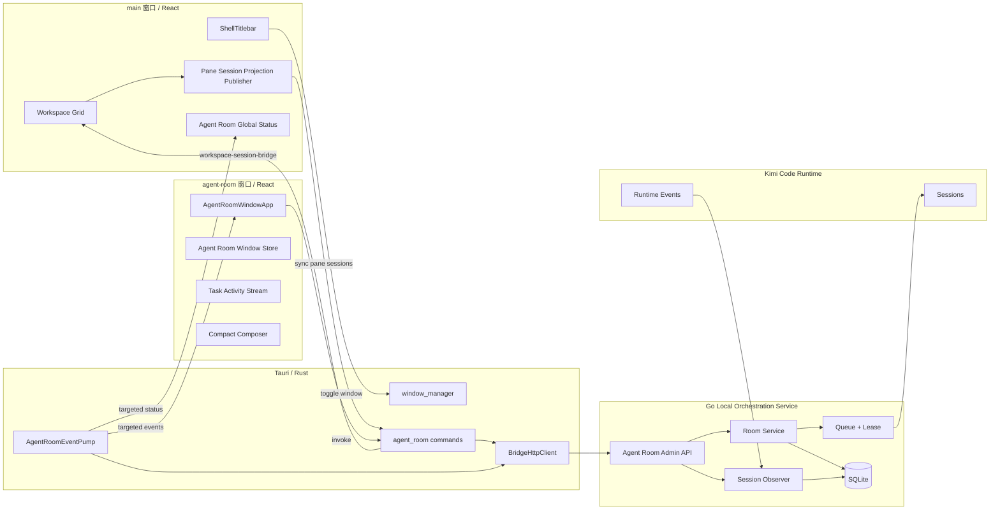

# Agent Room Redesign
## PRD · UX Specification · Technical Specification · Delivery Plan

- 仓库：`endearqb/kimi-app`
- 核对分支：`codex/agent-room-v1`
- 核对基线：`f7a89d8082486913d3dd77b0dfc1d03d6416502f`
- 核对日期：2026-07-22
- 文档状态：Proposed v1.0
- 目标平台：Windows 桌面端，Tauri v2 + React + 本机 Kimi Code Runtime
- 产品阶段：内部 Dogfood / Feature Flag 默认关闭
- 交付性质：产品与工程实施基线；本文不代表代码已实现或已验证

> 基线说明：附件中的实施计划记录基线为 `codex/agent-room-v1@c9d10d9`。本次核对时，`codex/agent-room-v1` 与 `main` 均指向 `f7a89d8`。实施前必须以实际开发分支重新跑一次路径、类型、命令注册和测试清单核对，不得直接假定附件中的行号与提交关系仍然成立。

---

# 0. 最终产品决策

## 0.1 一句话定义

> **Agent Room 是一个独立的多 Session 任务调度窗口：用户把多个正在工作的 Kimi Code Session 组织到一个房间中，向它们分派任务、查看进度、处理审批，并快速回到准确的 Session。**

Agent Room 的第一目标不是建立“AI 公司”“多人聊天室”或通用 Workflow 平台，而是解决一个明确、可验证的问题：

> 当用户同时打开多个 Kimi Code Session 时，如何少切换、少复制、少猜测地知道“谁在做什么”，并能从一个地方继续推进工作。

## 0.2 核心闭环

```text
打开 Agent Room 独立窗口
        ↓
创建或选择房间
        ↓
添加当前正在工作的 Session
        ↓
向一个、多个或全部执行成员发送任务
        ↓
在同一屏查看状态、回复与审批
        ↓
点击“打开 Session”回到准确的 Kimi Code Session
```

这个闭环必须在不进入 Agents、Connectors、Workflow、Diagnostics 等管理页面的情况下完成。

## 0.3 产品边界

| 项目 | 决策 |
|---|---|
| 首要用户 | 同时运行 2–6 个 Kimi Code Session 的个人开发者或高级用户 |
| 首要任务 | 分派任务、看进度、处理阻塞、回到准确 Session |
| 主界面 | 任务动态 + 执行成员 + 常驻输入区 |
| 窗口形态 | 单例、独立、可移动的工具窗口；默认不置顶 |
| Room 含义 | 一组执行 Session / Agent 的任务上下文，不代表多人在线 Presence |
| “打开房间” | 只切换当前窗口上下文，不自动添加成员、不启动任务 |
| “添加成员” | 显式添加 Agent、固定 Session 或跟随窗格 |
| Session 真相 | Kimi Code Runtime Session，Room 不复制完整 Transcript |
| MVP 高级能力 | 默认隐藏或延后，不阻塞核心闭环 |
| 是否继续投入 | 由真实 Dogfood 使用行为决定，而不是由已投入代码量决定 |

## 0.4 本文相对附件计划的关键收敛

附件中的“独立悬浮窗、10 Tab 收敛、房间切换器、设置抽屉、标题栏入口、内嵌审批、状态色统一”等方向全部保留；本文件新增并明确以下硬约束：

1. **先交付窄用途 MVP，再完成全能力迁移。** Workflow、Agents、Connectors、复杂队列策略不能阻塞第一条真实使用闭环。
2. **任务流优先于群聊感。** 界面可以采用对话式时间线，但数据结构和交互必须围绕“用户任务 → 多个 Run → 状态/结果/审批”，不能退化为消息气泡堆叠。
3. **“成员”统一为“执行成员”。** 不引入加入/离开、在线人数、人类 Presence 等尚不存在的协作语义。
4. **事件只定向投递到 `main` 与 `agent-room`。** 不使用全应用广播把 Agent Room 数据发送给 `prefill` 或 `workspace-import-picker`。
5. **新窗口采用独立最小权限。** 不允许 `agent-room` 窗口复用包含全部应用命令的 `main-command-access`。
6. **在 Grid V3 迁移前设置产品 Gate。** 先验证独立窗口真的有用，再跨越持久化单向门、删除 Pane 形态。
7. **新 UI 进入 `features/agent-room/`。** 独立窗口不继续生长在 `features/workspace-grid/` 中；Workspace Grid 只保留 Session 投影集成代码。
8. **窗口位置记忆不是 MVP 阻塞项。** 若仓库没有现成窗口状态持久化范式，不为本功能新增依赖或通用窗口管理框架。

---

# 1. 文档依据与事实基线

## 1.1 输入材料

本文综合以下材料：

1. 当前对话中确定的 Agent Room Redesign 方向；
2. 当前对话中“先给 Agent Room 一个非常窄的用途”的产品决策；
3. 附件 `agent-room-ui-redesign-PLAN.md`；
4. 附件 `agent-room-redesign-preview.html`；
5. 仓库现有 `.ai/plans/agent-room-2026-07-18/PRD.md`、`SPEC.md`、`PLAN.md` 与 `REVIEW.md`；
6. `.ai/CONSTITUTION.md` 与 `DESIGN.md`；
7. `codex/agent-room-v1` 当前代码实现。

## 1.2 冲突处理优先级

出现冲突时按以下顺序处理：

1. `.ai/CONSTITUTION.md` 的安全、单向门、验证与重构规则；
2. 已发布或已接受的持久化、Tauri、Bridge、Runtime 契约；
3. 当前仓库代码事实；
4. 本文的窄用途产品决策；
5. 附件实施计划与静态设计；
6. 需要实施验证的新推断。

## 1.3 当前实现事实

当前 V1 已经具备大量业务底座，但产品容器和信息架构不成立：

- `AgentRoomPane` 是 Workspace Grid 中的 `local` Pane；
- 一个组件同时承载房间选择和 10 个平级视图：观察、发送、Workflow、房间、Agents、Connectors、成员、Timeline、审批、诊断；
- 空窗格把 `Room` 与 `Code`、`Chat` 并列为 Pane 类型；
- 创建 Room 会持久化 Room 数据并把新 `roomId` 绑定到当前 Agent Room Pane；
- 所谓“进入房间”只是选择 Room 上下文，不存在用户 Presence、Join/Leave 或人类成员状态；
- “加入房间”实际创建的是 `agent`、`pinned_session` 或 `followed_pane` 类型的执行成员；
- Rust Event Pump 当前只向 `main` 窗口发送 `agent-room-events` 和 `agent-room-pump-status`；
- 主窗口的 Pane Session Registry 只有在 Grid 中存在 `agent_room` Pane 时才同步 Session 投影并订阅事件；
- Agent Room Tauri 命令目前全部位于 `main-command-access`；
- `agent_room_open_session` 已能把精确 Session 路由请求送回主窗口；
- `prefill`、`main`、`workspace-import-picker` 已提供可复用的独立窗口范式；
- Agent Room Feature Flag 由应用内 `AppSettings.agentRoomEnabled` 持久化，默认关闭；Shell 仅在启动 Bridge 子进程时显式映射为 `KIMI_AGENT_ROOM_ENABLED=1/0`；
- Go/Bridge 侧 Room、Member、Message、Run、Queue、Lease、Observer、Approval、Workflow 等业务模型已经实现，本次不以重写业务链路为目标。

## 1.4 当前问题诊断

| 问题 | 用户后果 | 根因 |
|---|---|---|
| Agent Room 占一个 Pane | 为观察执行 Pane，反而减少可执行 Pane 数量 | 产品层级错误 |
| 两层标题栏 + 10 个 Tab | 首屏拥挤，无法判断最常用动作 | 全局资源、房间配置、任务操作、诊断混在一层 |
| 发送与 Timeline 分离 | 发完任务必须切页才能看结果 | 核心闭环被拆开 |
| “加入房间”语义不清 | 用户无法理解加入的是自己、Agent 还是 Session | 数据模型术语直接暴露给产品文案 |
| 没有明确默认场景 | 功能越做越大，但不知道何时主动打开 | 产品目标过宽 |
| 新窗口会收不到事件 | 独立窗口方案表面可行，运行时却不完整 | Event Pump 固定投递 main |
| 移除 Pane 后不再同步 Session | 独立窗口无法发现当前 Pane Session | Registry demand 绑定 agent_room Pane 存在性 |
| 新窗口若复用 main 权限 | 扩大攻击面与误调用范围 | 权限边界未随窗口拆分 |

---

# Part I — PRD

# 2. 用户问题

## 2.1 核心问题

当用户同时打开多个 Kimi Code Session 时，现有体验要求用户：

- 逐个切换 Pane 判断状态；
- 手动记住哪个 Session 在做哪项工作；
- 把相似任务复制到多个 Session；
- 在任务被审批阻塞时逐个寻找对应 Pane；
- 完成后依靠窗口位置、工作目录或模糊标题寻找准确 Session；
- 通过多个低层技术页面理解 Queue、Lease、Observer 与 Connector 状态。

Agent Room 应减少这些协调成本，而不是增加一个需要管理的复杂控制台。

## 2.2 Job to Be Done

> 当我同时让多个 Kimi Code Session 处理同一项目的不同工作时，我希望在一个地方分派任务、判断进度和处理阻塞，并能立即进入对应 Session，这样我不需要反复切换和猜测。

## 2.3 典型使用故事

用户正在重构 Kimi 小助手，同时打开三个 Session：

- 前端重构：改独立 Agent Room 窗口；
- 架构审查：核对 Rust/Tauri 多窗口事件与权限；
- 回归测试：补测试和更新文档。

用户打开 Agent Room，创建“Agent Room 重构”，添加三个 Session，分别发送任务。随后只需在一个任务流中看到：

```text
前端重构    运行中
架构审查    已完成
回归测试    等待审批
```

用户批准测试命令，点击“打开 Session”进入回归测试 Session，完成必要人工介入。

如果这个场景不比手动切换三个 Pane 更顺畅，Agent Room 就没有达到 MVP 产品价值。

---

# 3. 用户与使用条件

## 3.1 主要用户

- 同时运行多个 Kimi Code Session 的个人开发者；
- 使用 Workspace Grid 管理多个项目或同一项目多个子任务的高级用户；
- 能理解 Session、Workspace、Agent 的基本区别，但不应被要求理解内部 Event Pump、Lease 或 Bridge 契约。

## 3.2 非主要用户

- 只使用单一 Session 的普通聊天用户；
- 需要多人在线协作、组织权限或云端共享的团队；
- 期望 Agent 自动无限互相对话的用户；
- 需要通用 BPMN / DAG 工作流平台的用户。

## 3.3 触发条件

Agent Room 最有价值的条件是：

- 当前有至少两个可识别的 Kimi Code Session；或
- 用户有一个长期 Room，需要恢复其中的多个执行成员；或
- 存在 Agent Room Run、Queue 或待审批需要处理。

标题栏入口只在 Feature Flag 开启且 Workspace 至少存在一个 Kimi Code Pane 时显示；空白 Workspace 或仅有 Chat/External Pane 时不显示。

---

# 4. 产品目标

## 4.1 核心目标

**G-RD-01：单屏闭环**  
用户在一个窗口内完成“添加执行成员 → 发送任务 → 查看进度 → 处理审批 → 打开准确 Session”。

**G-RD-02：准确 Session 身份**  
任何 Run 或执行成员的“打开 Session”必须使用明确 Session ID，不得猜测 `sessions[0]`、当前活动 Pane 或同 Workspace 的任意 Session。

**G-RD-03：不占 Workspace Pane**  
Agent Room 不消耗 6 个可见 Pane 或 12 个总 Pane 配额。

**G-RD-04：低认知负担**  
正常使用不需要理解 10 个 Tab、Connector Binding、Runtime Capability 或完整 Prompt Assembly。

**G-RD-05：安全与恢复不回退**  
Session 唯一性、Observer 先于 Forward、同 Session 单一执行所有者、React 无 Token、审批/Queue/Lease/归档只读等 V1 不变量保持。

**G-RD-06：可验证的产品价值**  
功能是否继续投资由真实 Dogfood 使用频率和协调成本下降决定。

## 4.2 次级目标

- 统一任务状态和颜色语义；
- 将全局 Agent / Connector 资源迁到 Control Center；
- 将房间低频配置收进设置抽屉；
- 为已有 Workflow 房间保留兼容访问；
- 允许标题栏显示全局待审批数量；
- 在窗口隐藏后保持运行任务与 Room 数据不受影响。

---

# 5. 非目标

MVP 不包含：

1. 多人云端协作、邀请、Presence、在线人数、角色权限；
2. 跨设备同步或云端 Room；
3. Agent 之间由普通回复无限递归触发；
4. 完整 Session Transcript 在 Room 中复制、搜索或编辑；
5. 通用 Workflow 设计器作为主流程；
6. 新的模型运行时、容器或安全沙箱；
7. Agent Marketplace；
8. 在 Agent Room 内配置 Connector 凭据；
9. 默认置顶或常驻遮挡主工作区；
10. 为窗口状态持久化引入新的 npm/crate 依赖；
11. 改写 Go 数据库 Schema 或重新设计现有执行链路；
12. 通过视觉特效掩盖信息架构问题。

---

# 6. 范围分层

## 6.1 MVP：必须完成

| 能力 | MVP 行为 |
|---|---|
| 独立窗口 | 标题栏或内部开发入口打开单例 `agent-room` 窗口 |
| 房间选择 | 搜索、切换活动房间；无房间时直接进入创建态 |
| 创建房间 | 只填名称，默认 `direct`，创建后立即打开 |
| Session 发现 | 显示主窗口当前可识别的 Code Pane Session |
| 添加执行成员 | 添加固定 Session；支持“添加并跟随此窗格” |
| 任务分派 | `@成员`、多选、`@all`；默认 `enqueue` |
| 状态查看 | 显示 queued/running/waiting approval/completed/failed/aborted |
| 回复摘要 | 在对应任务和 Run 下增量显示最后可见回复 |
| 审批 | 在发生位置显示“允许一次 / 拒绝” |
| 精确打开 | `focus_existing`，并提供“新窗格”次级动作 |
| 归档只读 | 归档房间可查看，不可发送或修改成员 |
| 健康状态 | 标题栏健康点；错误可展开查看方向性信息 |
| 安全 | 新窗口独立 Capability，React 不持有 Token |
| Feature Flag | 小助手设置中的应用内开关，持久化到 `AppSettings.agentRoomEnabled`，默认关闭；Shell 显式映射到 Bridge 子进程环境 |

## 6.2 P1：完成能力迁移后开放

- 房间设置抽屉：名称、说明、共享背景、编排方式、成员管理、归档、删除；
- 并行分派；
- 附件、共享完成结果、队列策略收进 Composer 的“更多选项”；
- Workflow 房间的模板、执行进度和继续/停止操作；
- 全局待审批角标；
- “保存为 Agent”跳转 Control Center 并预填；
- 健康详情 Popover；
- 自绘删除确认对话框；
- 从旧 Agent Room Pane 迁移上次房间引用。

## 6.3 P2：验证价值后再投资

- Agents、Connectors 全量迁入 Control Center；
- Custom Workflow JSON 编辑；
- 窗口几何位置持久化；
- 更丰富的任务筛选、搜索和历史归档；
- Session 级审批范围；
- 原生 Follow-up 能力在 Runtime 证实后的开放；
- 跨 Room 汇总视图。

---

# 7. 产品原则

1. **任务优先，不以 Tab 数量表达能力。**
2. **默认路径只展示当前决策所需信息。**
3. **技术细节可追查，但不常驻。**
4. **打开 Room 没有副作用。**
5. **添加执行成员必须显式。**
6. **发送成功必须由后端确认，不做虚假乐观完成。**
7. **任何不可恢复或不确定状态都明确标记，不猜测。**
8. **高级能力只增量解锁，不破坏简单路径。**
9. **窗口是工具，不是目的；关闭窗口不停止工作。**
10. **没有真实使用，就不跨越不可逆迁移。**

---

# 8. 关键用户流程

## 8.1 打开 Agent Room

1. 用户点击主窗口标题栏 Agent Room 图标。
2. 若窗口已存在：显示并聚焦。
3. 若窗口不存在：按 `agent-room` 配置创建，加载 `#/agent-room`。
4. 窗口选择：
   - 上次房间仍有效：打开上次房间；
   - 否则打开最近更新的活动房间；
   - 没有活动房间：直接显示创建态。
5. 不自动添加当前 Session，不自动启动 Run。

## 8.2 创建第一个房间

1. 用户输入房间名称；
2. 按 Enter 或点击“创建房间”；
3. 后端创建：`description=""`、`sharedBrief=""`、`orchestrationMode="direct"`；
4. 窗口进入新房间；
5. 主区显示唯一空状态：“还没有执行成员”；
6. 主按钮：“添加当前 Session”；次动作：“选择其他 Session”。

## 8.3 添加当前 Session

“当前 Session”定义为主窗口活动 Code Pane 的 `effectiveSessionId = activeSessionId || persistedSessionId`。

- 有准确 Session ID：创建 `pinned_session` 执行成员；
- 有 Pane 但尚未进入 Session：禁用并提示“当前窗格尚未进入会话”；
- 当前活动项不是 Code Pane：打开 Session 选择器；
- Session 已在房间中：聚焦已有成员，不重复创建；
- 用户选择“跟随此窗格”：创建 `followed_pane`，后续跟随该 Pane 的有效 Session。

## 8.4 分派任务

1. 用户选择一个或多个执行成员；
2. 输入任务；
3. 默认 `mode=direct`、`queuePolicy=enqueue`；
4. 后端返回 Message、Runs 与 Failures；
5. 只有请求成功后清空输入；
6. 任务立即出现在主时间线，并按目标显示 Run；
7. Queue、审批、错误不使用弹窗打断，直接显示在对应 Run 中。

## 8.5 查看进度与处理审批

- 任务按创建时间排序；
- 每个任务下展示目标 Run；
- Reply Delta 合并为可见摘要；
- 待审批显示在对应 Run 的发生位置；
- “允许一次”与“拒绝”动作必须显示处理中状态并防止重复提交；
- 解决后刷新该审批和 Run 状态。

## 8.6 打开准确 Session

- 默认动作：`focus_existing`；
- 若 Session 已在可见或 Shelf Pane 中：聚焦或换入；
- 若不存在 Pane：打开准确 Session Pane；
- 次级动作：“在新窗格打开”；
- 主窗口隐藏时，必须显示并聚焦主窗口后再路由；
- Session 不存在或 Workspace 不匹配时，保留当前页面并显示可执行错误。

## 8.7 关闭或隐藏窗口

- Agent Room 自绘关闭按钮执行 Hide，不删除 Room、不停止 Run；
- 再次点击标题栏图标恢复；
- 应用退出时按主应用退出流程销毁；
- 默认 `alwaysOnTop=false`，置顶是显式临时选择。

---

# 9. 信息架构

## 9.1 目标三层结构

```text
L0 独立 Agent Room 窗口
├─ 主工作面（默认）
│  ├─ 执行成员轨
│  ├─ 任务动态 / Run / 审批
│  └─ 常驻 Composer
├─ 房间设置抽屉（低频）
│  ├─ 房间信息与共享背景
│  ├─ 编排方式
│  ├─ 执行成员绑定
│  ├─ Workflow 兼容入口
│  └─ 归档 / 删除
└─ 全局资源（移出 Room）
   ├─ Agent Library → Control Center
   ├─ Connector Binding → Control Center
   └─ Diagnostics → 健康点 Popover
```

## 9.2 V1 Tab 迁移表

| V1 入口 | 新位置 | MVP 状态 |
|---|---|---|
| 观察 | “添加执行成员”对话框 + 左侧执行成员状态 | 保留核心 |
| 发送 | 主视图底部 Composer | 必须 |
| Timeline | 主视图中央任务动态 | 必须 |
| 审批 | 对应 Run 内嵌 + 全局角标 | 必须 / 角标 P1 |
| 房间 | 标题栏房间切换器 + 设置抽屉 | 必须 / 设置 P1 |
| 成员 | 左侧执行成员轨 + 设置抽屉 | 必须 |
| Workflow | 设置抽屉中的工作流区域 | P1 |
| Agents | Control Center | P2 |
| Connectors | Control Center | P2 |
| 诊断 | 标题栏健康点 Popover | P1 |

## 9.3 任务流而非普通聊天流

主时间线的基本单元是一个 `AgentRoomMessage`，其下关联多个 `AgentRun`：

```text
用户任务
├─ 前端重构 · 运行中 · 最后回复摘要
├─ 回归测试 · 等待审批 · 审批卡
└─ 文档同步 · 已完成 · 结果摘要
```

不把每个 Event 或 Reply Delta 渲染成独立聊天气泡；Event 只用于更新 Run 投影和展开详情。

---

# 10. 功能需求

## 10.1 窗口与入口

- **FR-WIN-001** Agent Room 使用单例 Tauri Webview Window，label 固定为 `agent-room`。
- **FR-WIN-002** 默认尺寸建议 `960×680`，最小 `820×560`；最终数值由真实 Tauri G3 视觉验证调整。
- **FR-WIN-003** 标题栏入口与 Layout / Pane Shelf 同属 Workspace 级工具区，且只在应用内开关开启并存在 Kimi Code Pane 时显示。
- **FR-WIN-004** 点击入口执行显示/聚焦；再次点击可隐藏，但窗口已聚焦时是否隐藏必须保持一致并有测试。
- **FR-WIN-005** 自绘关闭按钮隐藏窗口；默认不终止运行任务。
- **FR-WIN-006** 提供临时置顶 Toggle，默认关闭，应用重启后不要求保持。
- **FR-WIN-007** `Escape` 关闭当前 Popover/Sheet；在无浮层时不直接关闭整个窗口。
- **FR-WIN-008** 窗口隐藏或重显时必须刷新房间摘要、审批与观察快照，事件流不是唯一恢复来源。

## 10.2 房间选择与创建

- **FR-ROOM-001** 标题栏房间名称是唯一房间切换入口。
- **FR-ROOM-002** 切换器支持按标题和说明搜索。
- **FR-ROOM-003** 活动房间与归档房间分组；归档房间默认折叠。
- **FR-ROOM-004** 默认选择顺序：有效上次房间 → 最近更新活动房间 → 创建态。
- **FR-ROOM-005** 创建只要求 1–128 个 Unicode 字符的名称。
- **FR-ROOM-006** 创建成功后立即打开新房间，但不自动创建执行成员。
- **FR-ROOM-007** 房间切换不改变 Session、成员、Run 或 Pane。
- **FR-ROOM-008** 已删除或不可访问的上次房间进入修复态，不静默切换并掩盖错误；用户可选其他房间。

## 10.3 执行成员

- **FR-MEMBER-001** UI 统一称“执行成员”，持久化 wire 字段仍为 `AgentRoomMember`。
- **FR-MEMBER-002** 支持既有三类成员：Agent、固定会话、跟随窗格。
- **FR-MEMBER-003** 左轨只展示当前 Room 的正式执行成员，不展示所有观察到的 Session。
- **FR-MEMBER-004** 未加入 Room 的 Session 只在“添加执行成员”界面出现。
- **FR-MEMBER-005** 同一有效 Session 在同一 Room 中不得因重复操作创建不可辨识的重复成员。
- **FR-MEMBER-006** 执行成员行显示名称、状态、绑定摘要；完整路径只在 Tooltip 或详情中显示。
- **FR-MEMBER-007** 成员主要动作是“打开 Session”；移出、重绑、保存为 Agent 放入次级菜单或设置抽屉。
- **FR-MEMBER-008** 归档房间禁止新增、移出或重绑执行成员。

## 10.4 任务分派

- **FR-DISPATCH-001** 发送前必须至少选择一个具备有效 Session 的目标。
- **FR-DISPATCH-002** 支持 `@all`、单个和多个执行成员。
- **FR-DISPATCH-003** MVP 默认 `mode=direct`；房间为 parallel 时可默认 parallel，但用户可在更多选项中确认。
- **FR-DISPATCH-004** MVP 默认 `queuePolicy=enqueue`。
- **FR-DISPATCH-005** `abort_and_replace` 在 Runtime Abort 未可靠确认前不得出现在默认菜单。
- **FR-DISPATCH-006** `follow_up` 只在能力确认后开放；不支持时明确降级为 enqueue。
- **FR-DISPATCH-007** 只有后端成功返回后清空输入和附件。
- **FR-DISPATCH-008** 部分目标失败时仍展示成功 Runs 与逐目标 Failure，不把整次请求伪装成全失败或全成功。
- **FR-DISPATCH-009** 支持 Ctrl/Cmd+Enter 发送，Enter 默认换行。
- **FR-DISPATCH-010** 归档房间、无目标、空内容、发送中时禁用发送并给出具体原因。

## 10.5 任务动态与 Run

- **FR-ACT-001** Timeline 按 Message 分组，Run 作为 Message 子项。
- **FR-ACT-002** 默认读取最近 100 条投影并有界渲染；可加载更早内容。
- **FR-ACT-003** Run 展示执行成员、状态、运行时长或完成时间、最后回复摘要。
- **FR-ACT-004** Reply Delta 按 Run 合并，不重复渲染已应用 Sequence。
- **FR-ACT-005** orphan Run 放入“未关联任务”分区并明确标记，不丢弃。
- **FR-ACT-006** 失败展示脱敏错误码和用户可执行方向；完整安全诊断在展开区。
- **FR-ACT-007** `queued`、`running`、`waiting_approval`、`completed`、`failed`、`aborted` 必须有稳定中文映射。
- **FR-ACT-008** 打开详情可查看 Queue、来源、Session Policy、WorkDir 和白名单 Runtime Controls，但不显示完整 Prompt 或 Token。

## 10.6 审批

- **FR-APP-001** 审批卡出现在对应 Run 的时间线位置。
- **FR-APP-002** MVP 只提供“允许一次”和“拒绝”。
- **FR-APP-003** 命令或工具摘要使用等宽字体；敏感内容遵循既有脱敏规则。
- **FR-APP-004** 同一审批解决请求必须防重复提交，并处理已被其他入口解决的幂等结果。
- **FR-APP-005** 标题栏角标统计 `platform=agent_room && status=pending` 的全局数量，无待审批时不显示。

## 10.7 精确 Session 打开

- **FR-SESSION-001** 打开动作必须携带明确 `sessionId`。
- **FR-SESSION-002** 默认 `focus_existing`；次级动作 `new_pane`。
- **FR-SESSION-003** Session 已在 Shelf 时允许换入，不重复创建。
- **FR-SESSION-004** 主窗口不可见时先显示并聚焦主窗口。
- **FR-SESSION-005** `session_not_found`、`workspace_mismatch`、`feature_disabled` 使用不同错误文案。

## 10.8 设置与兼容

- **FR-SET-001** 设置抽屉承载名称、说明、共享背景、编排方式、成员管理、归档与删除。
- **FR-SET-002** 删除必须使用应用内确认对话框，不使用 `window.confirm`。
- **FR-SET-003** 已归档房间只读，恢复后才可修改。
- **FR-SET-004** 既有 Workflow 房间必须在最终 Pane 退场前获得功能等价入口。
- **FR-SET-005** 既有 Agents / Connectors 管理必须在最终 Pane 退场前迁到 Control Center 或保留兼容入口。

---

# 11. 状态与空状态

## 11.1 窗口级状态

| 状态 | 主区 | 用户动作 |
|---|---|---|
| Feature Flag 关闭 | “Agent Room 未启用” | 打开设置或隐藏入口 |
| Bridge 启动中 | 骨架 + “正在连接本地服务” | 等待 / 查看诊断 |
| 无 Room | 内联创建态 | 创建房间 |
| Room 加载中 | 保留框架，主区骨架 | 等待 |
| Room 不存在 | 明确修复态 | 选择其他房间 |
| Observer 降级 | 保留上次只读投影，健康点红 | 重试 / 查看原因 |
| `cursor_too_old` | 触发完整快照重同步 | 等待重同步 |

## 11.2 房间级空状态

同屏最多一个主空状态：

| 条件 | 文案 | 主动作 |
|---|---|---|
| 无执行成员 | 还没有执行成员 | 添加当前 Session |
| 有成员无任务 | 向执行成员发送第一个任务 | 聚焦输入框 |
| 归档房间 | 此房间已归档，只能查看历史 | 恢复房间 |
| 所有成员无有效 Session | 执行成员尚未绑定可用 Session | 修复绑定 |

## 11.3 错误原则

- 不使用“操作失败，请重试”作为唯一信息；
- 错误必须说明对象、结果和下一步；
- 不能确认是否发送成功时，保留输入并写“未确认任务已创建”；
- 事件刷新失败时保留上次投影，并明确它可能不是最新状态；
- 所有内部错误码在普通状态下隐藏，在诊断展开中可见。

---

# 12. 术语与文案

| Wire / 旧文案 | UI 文案 |
|---|---|
| Agent Room Member | 执行成员 |
| Join / 加入房间 | 添加为执行成员 |
| Enter Room / 进入房间 | 打开房间 |
| Mode / orchestrationMode | 编排方式 |
| Direct | 直接 |
| Parallel | 并行 |
| Workflow | 工作流 |
| Shared Brief | 共享背景 |
| followed_pane | 跟随窗格 |
| pinned_session | 固定会话 |
| Agent | Agent（专有名词保留） |
| Timeline | 任务动态 |
| Observe | 可用 Session / 观察状态，按场景命名 |
| Approval Inbox | 待审批 |
| Diagnostics | 诊断详情 |

文案规则：

- 按钮使用动词 + 宾语，如“创建房间”“添加 Session”“打开 Session”；
- 回执使用同一动词，如“已创建房间”“已添加 Session”；
- 不使用“智能体工作群”“AI 团队已就绪”等营销化描述；
- 不暗示模型具有人类身份、情绪、在线 Presence 或组织关系。

---

# 13. 成功指标与产品 Gate

## 13.1 可用性指标

- 从标题栏点击到窗口可交互：目标 ≤ 1 秒（本机后端已运行）；
- 创建房间并添加当前 Session：目标 ≤ 30 秒；
- 向两个既有执行成员发送不同任务：目标 ≤ 60 秒；
- Run 状态在 Event 到达后更新：目标 P95 ≤ 2 秒；
- 有效 Session 的“打开 Session”准确率：100%；
- 正常主流程不超过一个顶层视图，不需要切 Tab；
- 关键操作可使用键盘完成。

## 13.2 Dogfood 继续条件

在 7 天内部使用期内，以下三项满足至少两项才继续进入 Grid V3 迁移与全能力扩张：

1. 用户主动打开 Agent Room 至少 3 次，而不是只为开发测试；
2. 至少一次使用它管理 2 个以上真实 Session；
3. 至少一次明显减少手动复制、Pane 切换或状态确认。

同时必须满足：

- 没有 Session 身份错配；
- 没有任务被错误发往其他 Workspace；
- 没有审批解决错对象；
- 没有 Token 或敏感响应进入 React 持久化状态或日志。

## 13.3 停止条件

出现以下任一情况，可在不做 Grid V3 的情况下结束实验：

- 7 天内没有主动使用；
- 使用时仍主要依赖逐个 Pane 判断状态；
- 状态投影长期不可信；
- 维护多窗口事件和权限的成本明显高于减少的协调成本；
- 主要使用场景实际只有单 Session。

停止时应：

1. 保留分支或 Tag；
2. 写明已验证和未验证内容；
3. 保持 Feature Flag 关闭；
4. 不进行破坏性 Grid 迁移；
5. 将实验结论记录到 `.ai/changes/`。

---

# 14. 产品验收标准

- **AC-PROD-001** 用户无需创建 Agent Profile 即可把两个现有 Session 加入同一 Room。
- **AC-PROD-002** 用户在同一屏向两个成员发送任务并看到各自 Run 状态。
- **AC-PROD-003** 任务出现审批时，用户无需寻找对应 Pane 即可允许一次或拒绝。
- **AC-PROD-004** 点击任一 Run 的“打开 Session”进入准确 Session。
- **AC-PROD-005** 关闭 Agent Room 窗口后 Run 继续执行，再打开时状态可恢复。
- **AC-PROD-006** 空窗格不再显示 Room 入口，Agent Room 不占 Pane 配额。
- **AC-PROD-007** 普通主流程没有 10 个平级 Tab。
- **AC-PROD-008** 归档 Room 只读，删除有应用内确认。
- **AC-PROD-009** Agent / Connector 管理不出现在 Room 主工作面。
- **AC-PROD-010** Feature Flag 关闭时既有 Code、Chat、External Pane 无行为变化。

---

# Part II — UX Specification

# 15. 窗口结构

```text
┌────────────────────────────────────────────────────────────────────┐
│ Agent Room   [房间名称 ▾]  ●              [设置] [置顶] [隐藏]   │
├──────────────────┬─────────────────────────────────────────────────┤
│ 执行成员 · 3     │ 任务动态                                        │
│                  │                                                 │
│ ● 前端重构       │ 我 · 10:42                                      │
│   apps/kimi-shell│ ┌ 检查 Agent Room 多窗口实现…                   │
│                  │ │                                               │
│ ● 回归测试       │ ├ 前端重构   运行中   最后回复…                 │
│   跟随窗格 P3    │ ├ 回归测试   等待审批 [允许一次] [拒绝]        │
│                  │ └ 文档同步   已完成   结果摘要                  │
│ ○ 文档同步       │                                                 │
│                  ├─────────────────────────────────────────────────┤
│ + 添加执行成员   │ @前端重构  输入任务…             [⋯] [发送]   │
└──────────────────┴─────────────────────────────────────────────────┘
```

## 15.1 布局

- 窗口顶部自绘栏：38px；
- 执行成员轨：208–224px；
- 主区：`minmax(0, 1fr)`；
- Composer 固定在主区底部；
- 主区最小有效宽度约 580px；
- 窗口低于最小宽度时不继续压缩，避免目标 Chip、审批命令和 Run 摘要不可读；
- 后续如需窄屏，成员轨改为抽屉，不在 MVP 引入复杂响应式模式。

# 16. 组件规范

## 16.1 `AgentRoomWindowTitlebar`

包含：

- 产品名或图标；
- 房间切换器触发器；
- 健康点；
- 全局待审批角标（P1）；
- 设置；
- 置顶；
- 隐藏。

房间切换器触发器应显示当前房间名称，不再显示独立“房间”标签。

## 16.2 `AgentRoomRoomSwitcher`

- 宽约 300–340px；
- 顶部搜索；
- 活动房间列表；
- 已归档折叠分组；
- 底部固定“新建房间”；
- 键盘支持上/下选择、Enter 打开、Escape 关闭；
- 创建态内联替换列表，不打开第二层 Modal。

## 16.3 `ExecutionMemberRail`

每行最多显示：

- 状态点；
- 名称；
- 一个重要 Badge，例如“审批 1”；
- 一行绑定摘要。

状态优先级：

```text
错误 / 不可达
> 等待审批
> 运行中
> 排队
> 空闲 / 已完成
```

执行成员行主要点击行为是选择或聚焦其最近任务；“打开 Session”可作为行内动作或右键菜单第一项。

## 16.4 `TaskActivityStream`

- Message 是一级对象；
- Run 是 Message 的子行；
- 审批、错误、队列、产物均挂在 Run；
- 当前任务的回复增量更新，不把每个 delta 新增为条目；
- `autoFollow` 仅在用户接近底部时工作；用户向上滚动后不强制跳回底部；
- 新事件到达而用户不在底部时显示“有新动态”按钮。

## 16.5 `CompactComposer`

默认只显示：

- 目标 Chip；
- 文本输入；
- 附件按钮（可在 MVP 暂时隐藏）；
- 更多选项；
- 发送。

更多选项内可放：

- 直接 / 并行；
- enqueue / follow-up；
- 共享已完成结果；
- 附件列表；
- 白名单 Runtime Controls。

不得默认显示 `abort_and_replace`。

## 16.6 `RoomSettingsSheet`

右侧抽屉，建议 360–420px，包含：

1. 名称、说明、共享背景；
2. 编排方式；
3. 执行成员与绑定类型；
4. Workflow 兼容区；
5. 归档与删除。

设置修改采用明确保存或字段级自动保存，不能混合两种模式。建议 MVP 使用显式“保存设置”。

## 16.7 `AddExecutionMemberDialog`

分组展示：

- 当前活动 Session；
- 当前可见 Code Pane Session；
- 已收纳 / 已固定观察 Session；
- Agent Library（P2）。

每项展示 Workspace 名、Session 短 ID、Pane 可见性和当前状态；动作：

- 添加固定会话；
- 添加并跟随窗格；
- 已添加时显示“已在房间中”。

---

# 17. 状态色与视觉规范

沿用 `DESIGN.md`，不建立新视觉系统。

| 颜色 | 语义 |
|---|---|
| 绿 | 正常观察、运行中 |
| 琥珀 | 排队、等待审批、连接中 |
| 灰 | 空闲、已完成、已归档 |
| 红 | 失败、不可达、观察降级 |

视觉规则：

- 不使用渐变、玻璃态、大面积彩色背景；
- 阴影只给窗口、Popover、Sheet、Dialog；
- 静态内容区靠留白、字号和 1px 分隔线分层；
- 普通按钮和列表圆角 6–8px；
- 状态点 6–8px；
- 图标统一约 14px；
- 代码与命令使用 JetBrains Mono；
- 主按钮使用深色中性按钮，不把绿色当通用 CTA；
- 绿色只表达正常或运行状态。

# 18. 键盘与可访问性

- 房间切换器、目标选择器、更多菜单支持完整键盘导航；
- `Ctrl/Cmd+Enter` 发送；
- `Escape` 按浮层栈逐层关闭；
- 所有图标按钮有中文 `aria-label` 和 Tooltip；
- 状态不能只靠颜色，必须有文本或可访问名称；
- Timeline 新事件使用非打断式 `aria-live="polite"`；
- 审批结果和发送错误使用 `role="alert"` 或等价可访问反馈；
- 焦点返回触发器；
- 支持 `prefers-reduced-motion`，动画控制在 120–160ms；
- 命令内容可横向滚动，但操作按钮不能被滚动区域遮挡。

---

# Part III — Technical Specification

# 19. 技术不变量

以下 V1 契约保持不变：

1. Kimi Code Session 是完整对话与执行真相；
2. Room 只保存 Message、Run、Event 投影、引用与摘要；
3. Session ID 是 Room、Pane、Bridge、Runtime 的稳定关联键；
4. React 只调用 Tauri Command、接收 Tauri Event，不持有 Admin Token 或 Runtime Token；
5. 同一 Session 任意时刻只有一个明确执行所有者；
6. Queue、Lease、Abort、Approval 和恢复逻辑继续由 Go Sidecar 管理；
7. Agent Room 数据不属于 Connector 生命周期，不能被 Connector Prune 删除；
8. 事件按持久化 Sequence 幂等归并；
9. 无法确认的 Runtime 能力必须安全降级；
10. Feature Flag 默认关闭。

# 20. 目标架构



## 20.1 责任边界

| 层 | 责任 |
|---|---|
| Agent Room Window React | Room UI、派发、投影归并、用户交互 |
| Main React | Workspace Pane Session 投影、标题栏入口与全局 Badge |
| Rust | 窗口生命周期、权限、Token 隔离、Bridge Client、Event Pump、跨窗口路由 |
| Go | Room/Member/Message/Run、Queue/Lease、Observer、Approval、恢复 |
| Runtime | Session、完整历史、工具执行、原始事件 |

独立窗口不得读取主窗口 Zustand Store、DOM 或 Controller。主窗口只通过后端同步 Pane Session Projection，不向独立窗口直接暴露内部 Store。

# 21. 前端目录与组件边界

目标目录：

```text
apps/kimi-shell/src/features/agent-room/
  AgentRoomWindowApp.tsx
  AgentRoomWindowTitlebar.tsx
  AgentRoomRoomSwitcher.tsx
  AgentRoomTaskStream.tsx
  AgentRoomTaskCard.tsx
  AgentRoomRunRow.tsx
  AgentRoomCompactComposer.tsx
  AgentRoomExecutionMemberRail.tsx
  AgentRoomAddMemberDialog.tsx
  AgentRoomSettingsSheet.tsx
  AgentRoomHealthPopover.tsx
  agentRoomWindowStore.ts
  agentRoomSelectors.ts
  agentRoomCopy.ts
  README.md
```

Workspace Grid 集成保留在：

```text
apps/kimi-shell/src/features/workspace-grid/
  useAgentRoomPaneSessionPublisher.ts
  agentRoomPaneProjection.ts
```

服务与 wire types 继续位于：

```text
apps/kimi-shell/src/services/agentRoomService.ts
apps/kimi-shell/src/app/types.ts
```

迁移原则：

- Phase 1 可暂时复用现有 `AgentRoomTimelinePanel`、`AgentRoomComposer` 等组件；
- 新窗口壳和新组件不得继续新增到 `features/workspace-grid/`；
- 组件稳定后再移动旧文件，移动与功能变化分 PR；
- 不建立通用“多窗口框架”或“工作台插件系统”。

# 22. 前端状态模型

## 22.1 Window Store

建议独立 Zustand Slice，仅保存可恢复 UI 状态和后端投影：

```ts
interface AgentRoomWindowState {
  rooms: AgentRoom[];
  selectedRoomId?: string;
  room?: AgentRoom;
  members: AgentRoomMember[];
  timeline: AgentRoomTimeline;
  approvals: BridgeApprovalRecord[];
  observations: Record<string, SessionObservation>;
  paneSessions: PaneSessionObservation[];
  capabilities?: AgentRoomCapabilities;
  pump?: AgentRoomPumpStatus;
  loading: {
    rooms: boolean;
    room: boolean;
    timeline: boolean;
  };
  errors: {
    rooms?: string;
    room?: string;
    timeline?: string;
    sync?: string;
  };
}
```

不得存入：

- Token、Cookie、Admin URL；
- 完整 Prompt Assembly；
- 完整 Session Transcript；
- Connector Credential；
- 未脱敏 Runtime 原始错误体。

## 22.2 主窗口全局状态

标题栏只需要轻量独立 Slice：

```ts
interface AgentRoomGlobalStatusState {
  featureEnabled: boolean;
  pendingApprovalCount: number;
  health: "healthy" | "connecting" | "degraded" | "disabled";
  windowVisible: boolean;
}
```

不得把 Agent Room 全量 Timeline 混入 `useShellController`。

## 22.3 派生视图模型

不新增数据库表；UI 从现有数据派生：

```ts
interface AgentRoomTaskView {
  message: AgentRoomMessage;
  runs: AgentRoomRunView[];
  createdAt: string;
  aggregateStatus: string;
}

interface AgentRoomRunView {
  run: AgentRun;
  member?: AgentRoomMember;
  replyText: string;
  approvals: BridgeApprovalRecord[];
  artifacts: AgentRoomEvent[];
  lastEventSeq: number;
}

interface ExecutionMemberView {
  member: AgentRoomMember;
  effectiveSessionId?: string;
  status: "running" | "queued" | "waiting_approval" | "idle" | "failed" | "unreachable";
  pendingApprovalCount: number;
  lastRun?: AgentRun;
}
```

# 23. Room 与“打开”语义

当前后端不存在 Join/Leave API，本次不新增。

- `createAgentRoom`：创建 Room 元数据；
- `getAgentRoom`：返回 Room 和正式 Members；
- `open room`：前端设置 `selectedRoomId` 并加载详情；
- `addAgentRoomMember`：显式添加执行成员；
- `deleteAgentRoomMember`：移出执行成员；
- Window 隐藏：不改变任何后端状态。

因此 UI 禁止把 Room 选择称为“加入房间”。

# 24. 窗口生命周期契约

## 24.1 配置

`tauri.conf.json` 新增：

```json
{
  "label": "agent-room",
  "title": "Agent Room",
  "url": "index.html#/agent-room",
  "create": false,
  "visible": false,
  "center": true,
  "width": 960,
  "height": 680,
  "minWidth": 820,
  "minHeight": 560,
  "decorations": false,
  "transparent": false,
  "shadow": true,
  "resizable": true
}
```

具体尺寸在 G3 调整；配置字段以 Tauri v2 schema 为准。

## 24.2 Rust 函数

在既有 `window_manager.rs` 中新增薄函数，不创建通用 Manager 抽象：

```rust
pub const AGENT_ROOM_WINDOW_LABEL: &str = "agent-room";

pub fn show_agent_room_window(app: &AppHandle, room_id: Option<&str>) -> Result<(), String>;
pub fn hide_agent_room_window(app: &AppHandle) -> Result<(), String>;
pub fn toggle_agent_room_window(app: &AppHandle) -> Result<AgentRoomWindowState, String>;
```

若需要从主窗口调用，增加薄 Tauri Command：

```text
agent_room_toggle_window
agent_room_show_window
```

Command 只负责参数校验和调用 window_manager，不吸收 Room 业务逻辑。

## 24.3 Route 事件

可选新增：

```ts
interface AgentRoomWindowRoutePayload {
  roomId?: string;
  source: "titlebar" | "approval" | "control_center" | "restore";
}
```

事件名固定为 `agent-room-window-route`。已显示窗口收到后切换 Room；未显示窗口在创建完成后接收。该契约属于加法扩展，需记录到 changes 与 command/event registry 测试。

# 25. Event Pump 与多窗口同步

## 25.1 现状问题

当前 Event Pump：

- 固定 `emit_to(MAIN_WINDOW_LABEL, ...)`；
- demand 使用 `pane_refs`；
- Pane Session Registry 只有存在 `agent_room` Pane 时启动；
- 独立窗口订阅当前 Webview Window，因此不会收到 main-only 事件。

## 25.2 目标投递

禁止直接 `app.emit(...)` 广播到所有窗口。实现定向投递：

```text
agent-room-events      → main（若需要全局状态） + agent-room（若存在）
agent-room-pump-status → main + agent-room（若存在）
```

`prefill` 与 `workspace-import-picker` 不应收到 Agent Room Event。

建议实现一个局部 helper：

```rust
fn emit_agent_room_targets<T: Clone + Serialize>(
    app: &AppHandle,
    event: &str,
    payload: T,
) -> DeliverySummary;
```

该 helper 只服务 Agent Room，不扩张为通用事件总线。

## 25.3 投递与 Cursor 规则

- 目标窗口不存在不算错误；
- 对存在窗口执行 best-effort 定向 emit；
- 至少一个存在目标成功后可推进内存 Cursor；
- 单个窗口 emit 失败记录脱敏诊断，不让另一个窗口永久阻塞；
- 窗口每次 show/focus 都通过 Snapshot / Timeline API 恢复，因此 Tauri Event 是低延迟通道，不是唯一事实来源；
- React 继续按 `seq > lastAppliedSeq` 幂等归并；
- `cursor_too_old` 进入 `resync_required`，清理局部投影后重新读取 Snapshot 和当前 Room Timeline，不静默跳过。

## 25.4 Pane Session Projection

把 `usePaneSessionRegistry` 的 demand 从：

```ts
panes.some((pane) => pane.kind === "agent_room")
```

改为由 Feature Flag 和主窗口生命周期驱动：

```ts
const hasDemand = agentRoomFeatureEnabled;
```

MVP 默认 Feature Flag 关闭，因此不会给普通用户增加长期开销。启用后，主窗口持续把当前 Code Pane 的有效 Session Snapshot 同步到 Go Observer；Agent Room 窗口只消费后端 Observation，不读取主窗口 Store。

后续如确有性能压力，再以真实数据证明需要 `windowVisible / activeRuns / pinnedSessions` 的精细 demand 模型，不在首版预建复杂订阅协议。

# 26. Tauri Command 与权限

## 26.1 最小权限原则

新增 Capability：

```text
identifier: agent-room
windows: ["agent-room"]
permissions:
- core:default
- dialog:allow-open（仅附件功能启用时）
- agent-room-command-access
- 必需的当前窗口显示/隐藏/拖拽/置顶权限
```

Windows 自绘窗口控制 Capability 的 `windows` 列表加入 `agent-room`，但只开放实际使用的动作。

## 26.2 `agent-room-command-access`

仅允许：

```text
agent_room_list_rooms
agent_room_get_room
agent_room_create_room
agent_room_update_room
agent_room_delete_room
agent_room_list_members
agent_room_add_member
agent_room_update_member
agent_room_delete_member
agent_room_get_timeline
agent_room_get_run
agent_room_post_message
agent_room_abort_run
agent_room_retry_run
agent_room_resolve_workflow
agent_room_resolve_approval
agent_room_get_capabilities
agent_room_list_observations
agent_room_set_observation_pin
agent_room_open_session
list_bridge_approvals
```

若 P2 将 Agent / Connector 管理移入 Control Center，则这些 CRUD 继续由 `main` 调用，不需要开放给 Agent Room Window：

```text
agent_room_list_agents
agent_room_create_agent
agent_room_update_agent
agent_room_delete_agent
agent_room_list_connector_bindings
agent_room_put_connector_binding
agent_room_delete_connector_binding
```

`agent_room_sync_pane_sessions` 只允许 `main`，因为只有主窗口拥有 Grid 投影。

## 26.3 权限验证

- command registry 检查 main 与 agent-room allow-list；
- prefill 与 workspace-import-picker 调用任何 Agent Room command 必须被拒绝；
- Agent Room Window 调用安装、Bridge Secret、Workspace 文件读写等非必要命令必须被拒绝；
- Bundle 和源码 Token Scan 继续通过。

# 27. 数据刷新策略

| 数据 | 初始加载 | 实时更新 | 恢复 |
|---|---|---|---|
| Rooms | `listAgentRooms` | Room mutation 后刷新 | show/focus 刷新 |
| Current Room + Members | `getAgentRoom` | member/room mutation 后刷新 | 切换/重显刷新 |
| Timeline | `getAgentRoomTimeline` | Event debounce 100–250ms 后增量或刷新 | 重显/重同步刷新 |
| Observations | `listAgentRoomObservations` | Event 后刷新 Snapshot | Pump resync |
| Approvals | `listAgentRoomApprovals` | approval event / resolution 后刷新 | 重显刷新 |
| Capabilities | `getAgentRoomCapabilities` | Bridge generation 变化后刷新 | 重连刷新 |
| Pump Status | Tauri Event | Tauri Event | 初始为空时显示 connecting |

避免每个 Event 都完整读取所有 Room Timeline；只刷新当前 Room，且使用 debounce 合并批次。

# 28. 持久化偏好

## 28.1 Agent Room Window Preference

如需跨重启恢复上次 Room，新增独立版本化前端 key：

```text
kimi-agent-room-window-state-v1
```

允许字段：

```ts
interface AgentRoomWindowPreferenceV1 {
  version: 1;
  lastRoomId?: string;
  memberRailCollapsed?: boolean;
}
```

禁止字段：Token、URL Fragment、Prompt、完整路径列表、审批 payload。

该 key 属于持久化数据结构单向门，应有 accepted ADR 或纳入 Grid V3 ADR 的独立章节。窗口几何不作为 MVP 字段。

# 29. Grid V3 迁移

## 29.1 触发前提

只有通过 §13 Dogfood 产品 Gate 后才实施。

## 29.2 迁移规则

- 新 key：`kimi-workspace-grid-state-v3`；
- Saved Layout key：`kimi-workspace-grid-saved-layouts-v3`；
- V2 key 永不回写、删除或改写；
- 加载顺序：有效 V3 → 迁移 V2 → 迁移 V1 / legacy → default；
- V2→V3 纯函数删除全部 `kind="agent_room"` / `carrier="local"` Pane；
- 被删除 Pane 的 Slot 置空；
- 其他 Pane 的 ID、顺序、Session、WorkDir、URL、Theme、Storage Namespace、Mount Policy、Track Size 与时间戳逐字段保留；
- `activePaneId` 若指向被删除 Pane，改为首个可见 Pane或 `null`；
- `maximizedPaneId` 若指向被删除 Pane，改为 `null`；
- 从稳定顺序中的第一个有效 `agent_room.roomId` 迁移到 `lastRoomId`，但 Room 不存在时不伪造成功；
- Saved Layout 同样删除 Agent Room Pane；
- V3 当前类型移除 `agent_room`、`local` 和 `roomId`，V2 输入类型保留用于迁移。

## 29.3 迁移后代码清理

- 空窗格移除 Room 按钮；
- `PaneFrame` 移除 Agent Room 渲染分支；
- `WorkspaceGridView` 移除 Agent Room default/configure 分支；
- Grid Store 移除 Room 唯一 Pane 逻辑；
- Shelf 不再处理 Agent Room；
- 旧 AgentRoomPane 仅在一个发布周期内保留为未引用兼容代码，或在所有能力等价后删除；
- 兼容层在 `.ai/architecture/current-state.md` 登记退出条件。

# 30. 错误与恢复

## 30.1 错误映射

| Code | 用户文案 | 动作 |
|---|---|---|
| `feature_disabled` | Agent Room 尚未启用 | 打开设置 / 关闭窗口 |
| `bridge_unavailable` | 本地 Agent Room 服务不可用 | 重试连接 / 查看日志 |
| `room_not_found` | 这个房间已不存在 | 选择其他房间 |
| `room_archived` | 已归档房间只能查看 | 恢复房间 |
| `session_not_found` | 找不到对应 Session | 修复绑定 / 移出成员 |
| `workspace_mismatch` | Session 与 Workspace 不匹配 | 查看绑定详情 |
| `session_busy` | Session 正忙，任务已排队 | 查看队列 / 取消排队 |
| `observer_not_running` | 观察服务尚未就绪，未发送任务 | 重试连接 |
| `cursor_too_old` | 状态已过期，正在重新同步 | 等待重同步 |
| `approval_not_found` / 已解决 | 审批已由其他入口处理 | 刷新状态 |
| `abort_unconfirmed` | Runtime 未确认中止，替代任务未执行 | 保持安全阻塞 |

## 30.2 恢复原则

- Window React 崩溃或重载：从后端重新加载；
- main Window 暂时不可见：Session 打开请求排队或显示主窗口后发送；
- Sidecar 重启：Pump 保持单调 Cursor，必要时完整 resync；
- Runtime Generation 变化：重新读取 Capability、Observation 和当前 Room Timeline；
- 窗口事件漏投：show/focus 快照恢复；
- Room 删除：保留 Room 选择器和修复态，不自动选中错误 Room。

# 31. 安全与隐私

- Agent Room Window 不读取 Token 文件；
- React 不接收 Bridge Admin Token、Runtime Token、Connector Credential；
- 事件 payload 不扩张为完整 Prompt 或原始响应体；
- Error、日志、诊断继续经过既有 Redactor；
- 审批命令展示遵循既有安全模型，不新增“始终允许”等高风险默认动作；
- `localStorage` 只保存无秘密的版本化 UI 偏好；
- Event 只定向发送允许接收的窗口；
- `agent_room_open_session` 继续由 Rust 校验 Session 存在性；
- Attachments 本地路径只在用户显式选择后进入当前发送请求，不进入全局诊断；
- 新窗口 Capability 采用 allow-list，拒绝一切非必要命令。

# 32. 性能与可靠性

- 首屏只加载 Room 列表、当前 Room、最近 Timeline、Observation、Approval、Capability；
- Timeline 有界渲染，默认最近 40–100 个 Message；
- Reply Delta 合并，避免每个字符触发新 DOM 节点；
- Event 批次按 Sequence 排序和去重；
- Timeline/Observation 刷新 debounce；
- 不复制完整 Transcript；
- 隐藏窗口可暂停纯 UI 定时器，但不能中止 Run；
- Event Pump 的 Runtime 轮询和 backoff 保持现有有界策略；
- Agent Room Feature Flag 关闭时不启动额外 Session Projection 同步。

# 33. 测试规格

## 33.1 前端单元与组件测试

- Room 默认选择与失效 `lastRoomId`；
- 空房间创建态；
- 创建只传默认 direct 输入；
- 执行成员状态优先级；
- Message → Runs → Approvals 分组；
- orphan Run；
- Event seq 去重；
- Composer 目标、禁用与失败保留输入；
- @mention；
- 审批 Busy 去重；
- archived 只读；
- Room Switcher 键盘导航；
- Focus Return 与 aria 属性；
- `AgentRoomWindowPreferenceV1` sanitizer。

## 33.2 Rust 测试

- `agent-room` 窗口存在时 show/focus，缺失时从配置创建；
- hide/toggle 幂等；
- targeted event 只投递 `main` / `agent-room`；
- 目标不存在不降级；
- 部分 emit 失败的 Cursor 规则；
- Agent Room Capability allow-list；
- prefill/import 权限拒绝；
- `agent_room_open_session` 从独立窗口触发主窗口事件；
- Command registry 与 Window label 稳定性。

## 33.3 Grid 迁移测试

- V3 优先；
- V3 损坏回退 V2；
- V2 中单个/多个 Agent Room Pane 全部丢弃；
- 其他 Pane 逐字段等价；
- active/maximized 修复；
- 空 Slot；
- Saved Layout 迁移；
- 不写不删 V2 key；
- 6/12 上限不变；
- lastRoomId 迁移。

## 33.4 Go 无回归

本轮原则上不改 Go；执行现有 `go test ./...`。若因 UI 需要新增 API，必须先证明现有 API 不足，并单独更新 V1 SPEC 与 Admin 契约 ADR。

## 33.5 手工 G3 矩阵

- 双窗口开合、拖拽、置顶；
- 主窗口最小化/隐藏时打开 Session；
- 2、3、6 个真实 Session；
- Pane 收纳和恢复；
- 固定会话与跟随窗格；
- 任务排队；
- 实际审批；
- Sidecar/Runtime 重启；
- Cursor resync；
- 暗色模式；
- 820×560 最小尺寸；
- 旧 V2 布局迁移；
- Feature Flag 关闭；
- Token / 日志脱敏。

---

# Part IV — Delivery Plan

# 34. 交付策略

## 34.1 两类 Gate

- **技术 Gate**：证明独立窗口、权限、事件、Session 打开链路成立；
- **产品 Gate**：证明用户真的会用它管理多个真实 Session。

不得只通过技术 Gate 就执行 Grid V3。

## 34.2 PR 原则

- 每个 Phase 拆成小 PR；
- 窗口/权限/事件、核心 UI、Grid 迁移、全局资源迁移分离；
- 重构移动文件与行为变化分离；
- 每个 PR 更新当日 `.ai/changes/`；
- 跨持久化或序列化单向门前先 accepted ADR；
- Feature Flag 保持默认关闭，直到 G2 与内部 Dogfood 条件满足。

---

# 35. Phase 0 — 决策冻结与基线复核

## 目标

把产品范围、单向门、当前基线和测试入口冻结，避免在旧附件基线上直接编码。

| ID | 任务 | 产物 | Gate |
|---|---|---|---|
| ARR-000 | 重新比较 `main` 与开发分支 | 基线 SHA、差异清单 | 文档 |
| ARR-001 | 更新 Redesign 主文档 | 本文件进入仓库 `.ai/plans/...` | Review |
| ARR-002 | 建立独立窗口/权限 ADR | Window label、targeted event、capability | Accepted |
| ARR-003 | 建立 Window Preference ADR | `kimi-agent-room-window-state-v1` | Accepted 或移出 MVP |
| ARR-004 | 预写 Grid V3 ADR，但不执行 | 迁移规则、退出与回滚 | Draft |
| ARR-005 | 建立 Dogfood 记录模板 | 使用次数、Session 数、节省动作、错误 | Ready |
| ARR-006 | 核对 `pnpm verify`、Rust、Go Gate | 可执行命令清单 | G0 ready |

### Phase 0 Gate

- 产品一句话定义和 MVP Scope 已确认；
- 所有单向门已识别；
- 附件基线与当前分支差异已记录；
- 不存在“先删 Pane 再验证窗口”的任务顺序。

---

# 36. Phase 1 — 技术纵切：只读独立窗口

## 目标

证明多窗口承重结构，不迁入口、不删除 Pane、不开放发送。

| ID | 任务 | 主要文件 | Size |
|---|---|---|---|
| ARR-100 | 新增 `agent-room` Window 配置 | `tauri.conf.json` | S |
| ARR-101 | 新增 Window label 与 show/hide/focus | `window_manager.rs` | M |
| ARR-102 | 新增 `#/agent-room` Route | `App.tsx`、`AgentRoomWindowApp.tsx` | M |
| ARR-103 | 新增独立 Capability | `capabilities/default.json`、`command-access.toml` | M |
| ARR-104 | Event Pump 定向多窗口投递 | `agent_room_event_pump.rs` | M |
| ARR-105 | 主窗口 Session Projection 与 Pane 解耦 | `usePaneSessionRegistry.ts` 或替代文件 | M |
| ARR-106 | 独立窗口加载 Room/Timeline/Observation | `features/agent-room/*` | M |
| ARR-107 | 独立窗口调用精确打开 Session | 既有 service + Window app | S |
| ARR-108 | 技术测试与诊断 | TS/Rust tests | M |

### Phase 1 Gate

- 可手工打开、隐藏、聚焦独立窗口；
- 独立窗口只读展示 Room、Members、Timeline、Approvals；
- 主窗口与 Agent Room 窗口都能接收正确事件；
- 独立窗口无 main 全权限；
- 点击已有 Run 可打开准确 Session；
- 旧 Agent Room Pane 仍可用；
- Feature Flag 默认关闭；
- 未执行 Grid V3。

---

# 37. Phase 2 — 产品纵切：窄用途 MVP

## 目标

完成真正可用的核心闭环，而不迁移所有高级管理功能。

| ID | 任务 | 主要文件 | Size |
|---|---|---|---|
| ARR-200 | 房间切换器与空列表创建态 | `AgentRoomRoomSwitcher.tsx` | M |
| ARR-201 | 名称-only 创建 | switcher + service | S |
| ARR-202 | 执行成员轨 | `ExecutionMemberRail.tsx` | M |
| ARR-203 | 添加当前/其他 Session | `AddExecutionMemberDialog.tsx` | M |
| ARR-204 | 任务分组 Timeline | `TaskActivityStream.tsx`、selectors | L |
| ARR-205 | 常驻 Compact Composer | `CompactComposer.tsx` | M |
| ARR-206 | 内嵌审批 | task/run components | M |
| ARR-207 | Run 打开、Abort、Retry 基础动作 | task/run components | M |
| ARR-208 | 健康点与恢复态 | titlebar + store | M |
| ARR-209 | MVP 文案与可访问性 | copy + tests | M |
| ARR-210 | 真实双 Session Dogfood 脚本 | 手工矩阵 | S |

### Phase 2 Gate

必须真实完成：

```text
创建 Room
→ 添加两个真实 Session
→ 分别发送任务
→ 看到运行状态和回复
→ 处理一次真实审批
→ 打开准确 Session
```

未通过时不进入 Pane 退场。

---

# 38. Product Gate — 7 天 Dogfood

## 执行方式

- 只在内部启用 Feature Flag；
- 用 Agent Room 完成 Kimi 小助手本身至少一项真实开发任务；
- 每次记录打开原因、Session 数、发送任务数、审批数、打开 Session 次数、失败和绕回 Pane 的原因；
- 不在这 7 天追加 Workflow、Connector 或视觉装饰。

## 通过

满足 §13.2，并且没有身份错配、安全或恢复 P0 问题。

## 未通过

- 将状态标记为“产品实验未通过”；
- Feature Flag 继续关闭；
- 不执行 ARR-400 之后的破坏性迁移；
- 保留技术纵切作为未来可恢复资产；
- 写清停止原因，而不是继续堆功能寻找价值。

---

# 39. Phase 3 — 能力等价与信息架构完成

## 前提

Product Gate 通过。

| ID | 任务 | 说明 |
|---|---|---|
| ARR-300 | 设置抽屉 | 名称、说明、共享背景、模式、成员、归档、删除 |
| ARR-301 | 自绘确认对话框 | 替换 `window.confirm` |
| ARR-302 | 更多发送选项 | parallel、附件、共享 Run、支持的 queue policy |
| ARR-303 | Workflow 兼容迁移 | 模板、进度、继续/停止；不设顶层 Tab |
| ARR-304 | Diagnostics Popover | capability、pump、degradation code |
| ARR-305 | 保存为 Agent 路由 | 跳转 Control Center 并预填 |
| ARR-306 | Agent Library 迁入 Control Center | 全局资源，不在 Room 主界面 |
| ARR-307 | Connector Binding 迁入 Control Center | 凭据边界保持 |
| ARR-308 | 全局待审批 Badge | main 轻量状态 Slice |
| ARR-309 | 删除 10-Tab IA | 新窗口主流程无 Tab |

### Phase 3 Gate

- 旧 Pane 中可达的所有已发布能力在新窗口或 Control Center 有明确去向；
- Workflow Room 不因 Pane 退场失去操作能力；
- Agents / Connectors 不再依赖 AgentRoomPane；
- 主工作面仍保持窄用途，不把低频表单重新铺回首屏。

---

# 40. Phase 4 — 入口迁移与 Grid V3

## 前提

- Product Gate 通过；
- Phase 3 能力等价通过；
- Grid V3 ADR accepted；
- V2 迁移 fixtures 完成。

| ID | 任务 | 说明 |
|---|---|---|
| ARR-400 | 主标题栏 Agent Room 入口 | 显示/隐藏单例窗口 |
| ARR-401 | 空窗格移除 Room | 只保留 Code / Chat |
| ARR-402 | Grid V3 state migration | 丢弃 Agent Room Pane，保留其他 Pane |
| ARR-403 | Saved Layout V3 migration | 同步移除 Agent Room Pane |
| ARR-404 | lastRoomId 迁移 | 从首个有效旧 Room Pane 提取 |
| ARR-405 | Grid 当前类型移除 agent_room/local | V2 输入类型保留 |
| ARR-406 | PaneFrame/Store/Shelf 清理 | 删除 Agent Room 分支 |
| ARR-407 | 迁移与回滚手工验证 | 真实旧 state / layouts |

### Phase 4 Gate

- Agent Room 不再占 Pane；
- V2 key 完整保留；
- 其他 Pane 逐字段无损；
- 标题栏入口可用；
- 回滚旧版本可读取原 V2；
- Code、Chat、External 无回归。

---

# 41. Phase 5 — 清理、文档与发布准备

| ID | 任务 |
|---|---|
| ARR-500 | 删除或登记 Legacy AgentRoomPane 兼容层 |
| ARR-501 | 将稳定组件移动到 `features/agent-room/` |
| ARR-502 | 更新 Feature README 与职责边界 |
| ARR-503 | 更新 `.ai/architecture/current-state.md` |
| ARR-504 | 更新 ADR 状态与退出条件 |
| ARR-505 | 更新 Release Notes |
| ARR-506 | 完整 G0/G1/G2 |
| ARR-507 | G3 真实 Tauri 手工矩阵 |
| ARR-508 | 决定是否默认开放 Feature Flag |

---

# 42. 建议 PR 拆分

| PR | 内容 | 禁止混入 |
|---|---|---|
| PR-1 | Window config + route + minimal shell | Grid migration、UI redesign |
| PR-2 | Dedicated capability + command registry | Timeline UI |
| PR-3 | Targeted Event Pump + pane publisher | Room CRUD UI |
| PR-4 | Read-only window | 发送、Grid removal |
| PR-5 | Narrow MVP room/member/composer/activity | Control Center migration |
| PR-6 | Inline approval + exact session UX | Grid V3 |
| PR-7 | Settings/Workflow parity | Type migration |
| PR-8 | Agents/Connectors Control Center | Grid migration |
| PR-9 | Titlebar entry + Grid V3 | 视觉大改 |
| PR-10 | Cleanup/docs/release | 新功能 |

---

# 43. 验证命令与 Gate

以仓库 `.ai/architecture/verification-gates.md` 为权威。实施时至少执行：

## G0

```text
pnpm -C apps/kimi-shell exec tsc --noEmit
cargo check --manifest-path apps/kimi-shell/src-tauri/Cargo.toml
go vet ./...
```

## G1

```text
pnpm -C apps/kimi-shell test
pnpm -C apps/kimi-shell verify
cargo test --manifest-path apps/kimi-shell/src-tauri/Cargo.toml
go test ./...
```

若 Windows 本机 Rust 测试仍受环境错误阻塞，必须记录具体错误、已通过的 `cargo check` / `--no-run` 范围和 CI 补跑条件，不得宣称 Rust G1 已通过。

## G2

- 仓库 CI 的 TypeScript、Rust、Go、command registry、capability、bundle 与 security scan；
- Grid migration、Tauri command/event 变更最低要求 G1，不得只过 G0 合入。

## G3

- 真实 Tauri 窗口；
- 真实 Runtime Session；
- 真实审批；
- 真实旧 Grid State；
- 日志与诊断脱敏；
- 安装包环境中的窗口与权限。

---

# 44. Definition of Done

## 44.1 MVP DoD

- 独立窗口可开合；
- 可以创建 Room；
- 可以添加两个真实 Session；
- 可以定向发送任务；
- 可以看到 Run 状态和可见回复；
- 可以内嵌处理审批；
- 可以准确打开 Session；
- 窗口隐藏后状态可恢复；
- 独立 Capability 生效；
- Feature Flag 关闭无回归；
- G0/G1 记录完整；
- 完成至少一次真实 Dogfood。

## 44.2 Redesign DoD

- 10 个 Tab 已收敛；
- Room 主界面只保留高频闭环；
- 设置、Workflow、全局资源均有明确去向；
- 空窗格无 Room；
- Agent Room 不占 Pane；
- Grid V3 可回滚；
- 文案术语统一；
- 无 `window.confirm` / `window.prompt`；
- 关键操作可键盘使用；
- DESIGN.md 视觉规范遵守；
- current-state、decisions、changes、README 同步。

## 44.3 发布 DoD

- Product Gate 通过；
- G2 通过；
- G3 真实窗口、Session、审批、迁移和脱敏通过；
- Feature Flag 默认值经产品决策确认；
- Release Notes 说明旧 Agent Room Pane 的迁移和回滚；
- 不存在未登记兼容层。

---

# 45. 风险与缓解

| 风险 | 级别 | 缓解 |
|---|---|---|
| 独立窗口事件漏投 | P0 | Snapshot 恢复 + targeted emit + seq 幂等 |
| 移除 Pane 后不再发现 Session | P0 | 主窗口 Publisher 由 Feature Flag 驱动 |
| 新窗口权限过大 | P0 | Dedicated Capability allow-list |
| 打开错误 Session | P0 | 明确 Session ID；禁止 Workspace 猜测 |
| Grid V3 破坏用户布局 | P0 | 产品 Gate 后实施；独立 key；V2 不回写 |
| Workflow / Agents 能力丢失 | P1 | Pane 退场前完成能力等价 |
| Timeline 仍像信息噪声 | P1 | Message 分组、Run 聚合、Event 折叠 |
| Window 常驻资源开销 | P1 | Feature Flag；隐藏时停 UI timer；有界刷新 |
| 主窗口标题栏状态需要全量 Store | P1 | 独立轻量 Global Status Slice |
| 产品没有真实使用 | P0 产品风险 | 7 天 Dogfood Kill Gate，不以沉没成本继续 |
| 附件基线过期 | P1 | Phase 0 重跑 branch/code contract 核对 |
| 为窗口状态引入过度抽象 | P2 | 复用 window_manager 薄函数，不新增通用框架 |

---

# 46. 已决定与开放问题

## 46.1 已决定

- 独立单例窗口；
- 标题栏入口；
- 关闭=隐藏；
- 默认不置顶；
- 主流程无 Tab；
- 任务流按 Message / Run 分组；
- UI 称“执行成员”；
- 默认 direct + enqueue；
- MVP 审批只有允许一次 / 拒绝；
- targeted event，不全局广播；
- dedicated capability；
- Product Gate 先于 Grid V3；
- Agents / Connectors 移出 Room；
- Session 是唯一执行真相。

## 46.2 开放问题及默认处理

| 问题 | 默认处理 | 关闭条件 |
|---|---|---|
| 窗口准确默认尺寸 | 960×680 / min 820×560 | G3 视觉验证 |
| 点击已聚焦标题栏入口是否隐藏 | 隐藏 | 可用性测试 |
| Window geometry 是否持久化 | MVP 不持久化 | 证明频繁重排造成明显成本 |
| Parallel 是房间级还是消息级默认 | 房间级默认，消息级可覆盖 | Composer 测试 |
| Approval Badge 刷新频率 | Event 驱动 + show/focus 刷新 | 性能测试 |
| Follow Pane 在窗口中如何命名 | 显示用户可识别 Pane 标题，ID 仅详情 | 主窗口投影提供标题后关闭 |
| Existing Workflow Room 的首期展示 | 在设置中保留兼容入口 | Phase 3 等价验证 |
| Agent Room 隐藏时是否继续接收事件 | Rust Pump 继续；React show 时快照恢复 | 资源测试 |

---

# 47. 需求追踪矩阵

| 产品目标 | 主要需求 | 技术任务 | 验收 |
|---|---|---|---|
| 单屏闭环 | FR-DISPATCH、FR-ACT、FR-APP | ARR-204–208 | AC-PROD-002/003 |
| 准确 Session | FR-SESSION | ARR-107、207 | AC-PROD-004 |
| 不占 Pane | FR-WIN、Grid V3 | ARR-400–407 | AC-PROD-006 |
| 低认知负担 | IA、Compact Composer、Settings | ARR-200–209、300–309 | AC-PROD-007/009 |
| 安全恢复 | 权限、Pump、Snapshot | ARR-103–105、208 | AC-PROD-005/010 |
| 产品价值 | Dogfood Gate | ARR-210 + §38 | §13.2 |

---

# 48. 最小演示脚本

发布或评审演示只使用以下场景，不展示全功能目录：

1. 主窗口打开三个真实 Kimi Code Session；
2. 点击标题栏 Agent Room；
3. 创建“Agent Room 重构”；
4. 添加三个 Session；
5. 向前端、架构、测试分别发送任务；
6. 同屏看到运行、完成和等待审批；
7. 允许一次测试命令；
8. 点击测试 Run 的“打开 Session”；
9. 主窗口准确进入该 Session；
10. 隐藏再恢复 Agent Room，状态仍在。

演示若必须进入 Agents、Connectors、Workflow 或 Diagnostics 才能说明价值，说明 MVP 信息架构仍未收敛。

---

# 49. 最终决策摘要

这次 Redesign 不应被定义为“把 V1 的所有功能重新画一遍”，而应被定义为：

> **从已经实现的大量底层能力中，抽出一个用户明天就能使用的多 Session 调度闭环。**

实施顺序必须是：

```text
技术纵切
→ 窄用途 MVP
→ 真实 Dogfood
→ 决定继续或停止
→ 完成能力等价
→ 迁入口和 Grid V3
→ 清理与发布
```

这样即使 Product Gate 未通过，项目也能以“有证据的实验结论”收口，而不是继续被沉没成本拖入一个大而全、难以解释的 Agent 平台。
