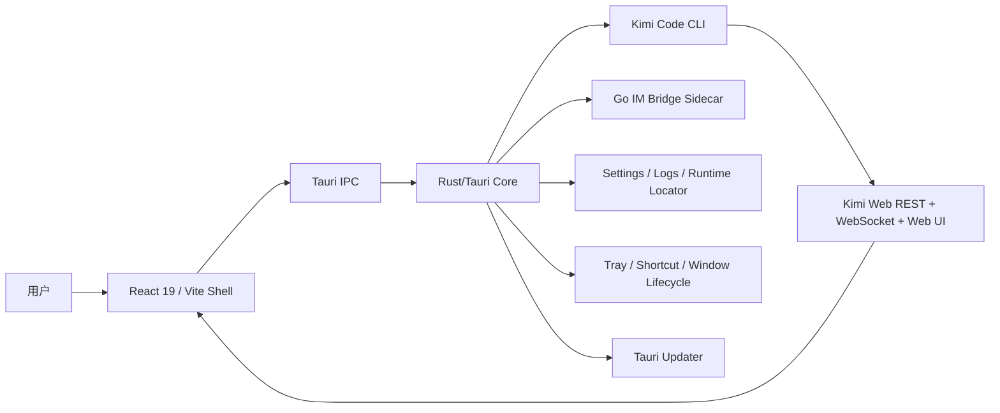
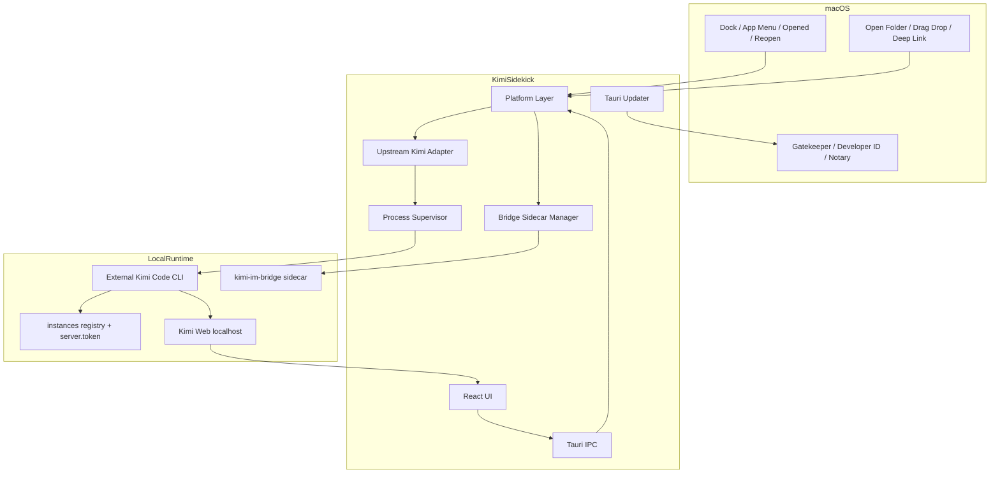

# Kimi App macOS 版本开发 Research

## 0. 结论先行

Kimi App 当前并不是一个“只能运行在 Windows、必须重写”的项目。它已经具备可复用的 Tauri 2、React 19、Rust 后端管理、状态持久化、日志、Updater、全局快捷键、托盘、Kimi Code Web 嵌入和 IM Bridge 管理等主体能力。**约 65%–75% 的业务与运行时核心可复用**，但当前产品形态、安装器、构建脚本和发布链明显是 Windows-first。

真正的工作不是简单增加一个 `macos` target，而是完成四层收敛：

1. **构建层平台化**：移除公共构建链对 PowerShell、`.cmd`、`.exe`、Windows 路径和 MSI/NSIS 的硬依赖。
2. **Kimi Code 上游兼容层升级**：当前代码仍读取旧版 `~/.kimi-code/server/lock`，而 Kimi Code 0.33.0 已使用多实例注册目录 `~/.kimi-code/server/instances/*.json`。这是比 macOS 编译本身更优先的兼容性问题。
3. **macOS 原生应用语义**：使用原生 traffic lights、App Menu、Dock reopen、`Cmd+Q` 退出、关闭窗口隐藏、Finder 启动 PATH 处理，并停止复刻 Windows 标题栏按钮。
4. **可交付发布链**：Apple Silicon 构建、Developer ID 签名、Hardened Runtime、公证、stapling、DMG、sidecar 嵌套签名和跨平台 updater manifest 必须作为一个整体完成。

### 推荐首发基线

| 决策项 | 推荐决策 |
|---|---|
| 首发架构 | Apple Silicon，`aarch64-apple-darwin` |
| 最低系统 | macOS 13 Ventura |
| 分发渠道 | GitHub Release / 官网直链的签名、公证 DMG |
| App Store | V1 不做；保留以后评估空间 |
| Kimi Code | 外置、用户管理；V1 不捆绑进 App |
| Kimi Code 最低支持 | 0.33.0；后续通过协议探测扩大兼容范围 |
| Kimi Code 安装引导 | 展示官方安装命令、复制命令、打开 Terminal；不静默执行 `curl | bash` |
| 窗口标题栏 | `decorations: true` + macOS 原生 traffic lights；隐藏自制 Windows 控件 |
| Finder 集成 | V1 使用“打开文件夹”、拖放和可选深链；Finder Extension/Quick Action 延后 |
| IM Bridge | 作为 Tauri `externalBin` sidecar，按 target triple 命名和签名 |
| Updater | 保留 Tauri Updater；由最终聚合 Job 生成唯一 `latest.json` |

> 本研究属于静态仓库审查、上游源码核对和官方文档研究。尚未在实体 macOS 设备上完成编译、签名、公证、WKWebView、Dock 生命周期和 sidecar 实测；这些必须在 Plan 的 M0 feasibility spike 中验证。

---

## 1. 研究范围与基线

### 1.1 审查对象

- Kimi App：`endearqb/kimi-app@1ed10dac0bc19ffb828bfffbe6581c7a2c0211d0`
- Kimi App 版本：`0.1.22`
- Kimi Code：`MoonshotAI/kimi-code@68ba740ebfb3e32ad9abdb8607f48d4387cf6f69`
- Kimi Code 包版本：`0.33.0`
- Tauri：项目使用 Tauri 2，依赖当前以 `^2` / `2.x` 方式声明，由 lockfile 固定实际版本
- 研究日期：2026-08-05

### 1.2 审查方法

1. 审查应用配置、前端脚本、Rust/Tauri 依赖和 release workflow。
2. 审查 Kimi Code 定位、启动、端口发现、token、停止、安装与升级实现。
3. 审查窗口、托盘、快捷键、右键菜单、文件打开、sidecar 与多实例行为。
4. 对照 Kimi Code 当前官方 CLI 文档与实例注册源码。
5. 对照 Tauri 2 官方 macOS 配置、sidecar、Updater、签名、公证、DMG、菜单和窗口最佳实践。
6. 对照 Apple Developer 的 Developer ID、Gatekeeper、Hardened Runtime 与 notarization 要求。

---

## 2. 当前仓库架构画像



### 2.1 已具备的跨平台基础

以下能力可以直接复用或只需局部调整：

- Tauri 2 + Rust + React 的总体架构。
- `app_config_dir`、`app_log_dir`、文件锁与 JSON 设置存储。
- `KIMI_CODE_HOME`、`~/.kimi-code/server.token` 和 token 脱敏逻辑。
- `kimi web --no-open --port ...` 的基本启动方式。
- loopback REST/WebSocket 嵌入模型。
- 后端状态机、启动监视、诊断、日志和错误分类的大部分框架。
- Unix 下 `SIGTERM` / `SIGKILL` 的初步分支。
- `open` 命令的 macOS 分支。
- macOS 默认全局快捷键已使用 `Super + Shift + K`。
- capability 中的自定义窗口控制权限已限定为 Windows，说明权限模型已有平台意识。
- `.icns` 图标已存在。
- Go IM Bridge 使用 `modernc.org/sqlite`，具备构建无 CGO sidecar 的良好条件。

### 2.2 明显的 Windows-first 区域

- `package.json` 的公共 build、verify、clean、NFR 和 sidecar 脚本大量依赖 PowerShell。
- `verify` 直接执行 `.\\node_modules\\.bin\\tsc.cmd`。
- sidecar 输出硬编码为 `kimi-im-bridge.exe`。
- release workflow 仅运行 `windows-latest`，只生成 MSI/NSIS。
- 安装管理器围绕 `powershell.exe`、Execution Policy、GBK、winget、Git for Windows、Windows Python 安装器设计。
- 主窗口、prefill、导入窗口全部 `decorations: false`，前端固定显示 Windows 风格最小化/最大化/关闭按钮。
- “在 Kimi 小助手中打开”使用 Windows Registry / Explorer shell verb；非 Windows 直接标记 unsupported。
- 关闭行为和文案围绕“最小化到托盘”。
- Finder 启动时 CLI PATH、Dock reopen、App Menu、`RunEvent::Opened` 尚未处理。

---

## 3. 工程就绪度评估

以下百分比是工程估算，不是测试覆盖率。

| 层级 | 就绪度 | 判断 |
|---|---:|---|
| React 业务 UI | 75% | 页面、状态与 IPC 多数可复用；标题栏和平台文案需调整 |
| Rust 业务核心 | 70% | 状态、日志、设置、API 客户端可复用；平台入口需抽象 |
| Kimi Code runtime | 45% | 启动方式可复用，但实例发现协议已落后于上游 |
| macOS 窗口/生命周期 | 30% | 有 Tauri 基础，但缺原生菜单、Dock、打开资源事件和 traffic lights |
| 安装/升级 | 15% | 当前实现基本是 Windows 安装器 |
| sidecar 打包 | 35% | Go 程序可移植，但当前不是 target-triple externalBin |
| CI/CD 与分发 | 10% | 无 macOS 构建、签名、公证、DMG 和 mac updater manifest |
| 综合 V1 就绪度 | 约 50% | 不需重写，但需要一次结构性平台化迭代 |

---

## 4. 兼容差距矩阵

| 领域 | 当前实现 | macOS 要求 | 严重度 | 推荐处理 |
|---|---|---|---:|---|
| 构建脚本 | PowerShell 为主 | Node/Rust 跨平台脚本 | P0 | 将公共脚本迁移到 `.mjs` 或 Rust `xtask` |
| TypeScript verify | `.cmd` 路径 | `pnpm exec tsc` | P0 | 改为平台无关命令 |
| Tauri 配置 | 单一 Windows 偏向配置 | base + `tauri.macos.conf.json` | P0 | 按 JSON Merge Patch 规则拆分并校验 |
| Bundle ID | `com.kimi.shell` | 稳定、可归属的 reverse-DNS ID | P0 | 首个 mac 发布前确定；推荐 `io.github.endearqb.kimi-sidekick`，并评估 Windows 数据迁移 |
| Product name | `kimi sidekick` | Finder/Dock 规范显示名 | P1 | 统一为 `Kimi Sidekick`，中文 UI 使用“Kimi 小助手” |
| CLI 定位 | configured path + `which` | Finder 无登录 shell PATH | P0 | 先查官方路径与常见路径，再受控运行 login shell 探测 |
| Kimi 安装 | npm/Node/PowerShell 主路径 | 官方 mac 脚本/原生二进制 | P0 | 外置 CLI；展示官方命令，不静默执行 |
| Kimi 版本 | 宽松探测 | 上游 0.x 快速变更 | P0 | semver + capability probe + tested matrix |
| 服务复用 | 旧 `server/lock` | `server/instances/*.json` 多实例 | P0 | 新建 upstream runtime adapter |
| 端口发现 | 旧 lock + probe | 注册文件、PID、heartbeat | P0 | 以 child PID 为主关联实例注册记录 |
| token | `server.token` | 同上游共享 token | 可复用 | 保留并加强权限/脱敏测试 |
| 子进程停止 | Unix 只针对 child PID | 必须覆盖进程组/后代 | P0 | 新 session/process group；TERM 后 KILL |
| 外部实例 | 可复用 | 不得误杀用户启动的 Kimi | P0 | `Owned` 与 `ExternalReused` 明确分离 |
| 标题栏 | 全自定义 Windows 按钮 | 原生 traffic lights | P0 | mac 使用 decorated/transparent titlebar |
| Dock reopen | 无 | 点击 Dock 应恢复窗口 | P0 | 处理 `RunEvent::Reopen` |
| 打开资源 | argv/single instance | mac 使用 `RunEvent::Opened` | P1 | 统一转换为现有 `OpenRequest` |
| 菜单栏 | tray 菜单 | macOS App Menu/File/Edit/Window | P0 | 使用 Tauri 原生菜单，首个 submenu 为 App Menu |
| 关闭/退出 | 关闭到托盘或退出 | 红点关闭、Cmd+Q 退出 | P0 | 关闭隐藏；Cmd+Q 停服务并退出 |
| Finder 右键 | Windows Registry | Finder Extension/Quick Action | P1/P2 | V1 不复制 Explorer 方案；先提供 Open Folder/拖放 |
| Tray | Windows 风格 | menu bar icon 可选 | P1 | 保留，但不能替代 App Menu/Dock |
| sidecar | resource 中的 `.exe` | `externalBin` + target triple + 签名 | P0 | `kimi-im-bridge-aarch64-apple-darwin` |
| sidecar 权限 | Windows console hide | executable bit、nested signing | P0 | CI 验证 mode、codesign、notary |
| Updater | Windows job 产出 latest.json | 多平台统一 manifest | P0 | 最终 manifest aggregator，避免并发覆盖 |
| 分发 | MSI/NSIS | `.app`、`.dmg`、`.app.tar.gz.sig` | P0 | Developer ID + notarization + stapling |
| App Store | 未考虑 | sandbox/review | P2 | V1 direct DMG；以后单独立项 |
| NFR 测试 | 多为 PowerShell | mac clean-account smoke | P0 | 增加 arm64 CI 与实体机验收 |

---

## 5. Kimi Code 上游研究

### 5.1 官方安装路径已经改变

Kimi Code 当前官方文档提供两种方式：

1. macOS / Linux 推荐使用官方安装脚本，自动下载最新原生版本、校验 checksum 并将 `kimi` 放入 PATH。
2. npm/pnpm 仍可用，但需要 Node.js 22.19.0 或更高版本。

这意味着 Kimi App macOS 版不应继续把“安装 Node.js + npm 全局安装”作为唯一或默认路径。更合理的产品边界是：

- App 负责检测、验证、启动和诊断 Kimi Code。
- Kimi Code 由用户按官方机制管理。
- V1 只提供明确、可审计的安装引导；不在 GUI 内静默执行远程 shell。

### 5.2 `kimi web` 是正确的壳集成入口

官方当前定义：

- `kimi web` 在前台运行 REST、WebSocket 和 Web UI。
- `--no-open` 禁止自动打开浏览器。
- 默认只绑定 loopback。
- 默认使用 bearer token 鉴权，token 通过 URL fragment 交给 Web UI。
- 收到 `SIGINT` / `SIGTERM` 后干净退出。
- 同一 Kimi home 支持多实例。

因此当前 Kimi App 选择 `kimi web --no-open` 是正确方向；需要修复的是实例发现、进程所有权和平台生命周期，而不是换回旧 `kimi server`。

### 5.3 当前最大上游兼容缺陷：仍依赖 legacy lock

Kimi Code 0.33.0 的实例机制是：

```text
<KIMI_CODE_HOME>/server/instances/<serverId>.json
```

单个记录包含：

```json
{
  "server_id": "...",
  "pid": 12345,
  "host": "127.0.0.1",
  "port": 58627,
  "started_at": 0,
  "heartbeat_at": 0,
  "host_version": "0.33.0"
}
```

- heartbeat 默认每 15 秒刷新。
- 死 PID 的记录会被惰性清理。
- live instances 按启动时间排序。
- 旧 `server/lock` 仅用于 0.28.0 之前遗留服务的兼容清理。

Kimi App 当前复用逻辑仍读取 `server/lock`，会导致以下问题：

1. 新版 Kimi Code 已运行时，App 可能无法识别并错误启动重复实例。
2. 端口自动递增后，App 可能绑定错误端口。
3. runtime ownership 判断不可靠，退出时存在误停或残留风险。
4. Windows 和 macOS 都会受影响，不应把它当成单纯的 macOS issue。

### 5.4 推荐的上游适配策略

新建 `upstream_kimi` 兼容层：

- `version.rs`：解析版本并记录 tested matrix。
- `home.rs`：唯一解析 `KIMI_CODE_HOME`。
- `instance_registry.rs`：读取与校验 `server/instances/*.json`。
- `runtime.rs`：启动、关联、健康检查、token、ownership。
- `contract.rs`：探测 `/openapi.json`、`/asyncapi.json`、`/api/v1/healthz`、`/api/v1/auth`。

首发支持策略：

- 明确测试 Kimi Code 0.33.x。
- 最低版本设为 0.33.0，避免承担旧协议组合。
- 对更新的 0.x 版本不只看版本号，而是执行 capability probe；未测试版本显示 warning，而不是盲目硬阻断。
- Windows 可保留 legacy lock 的只读兼容，但新路径优先。

---

## 6. Tauri 与 Apple 官方约束

### 6.1 平台配置

Tauri 2 会自动读取 `tauri.macos.conf.json` 并按 RFC 7396 JSON Merge Patch 与基础配置合并。需要特别注意：**数组不会按窗口 label 合并，而是整体替换**。当前 `app.windows` 是数组，因此 macOS 配置若覆盖它，必须提供完整窗口定义，或者把窗口参数迁移到 Rust 的平台 window factory。

### 6.2 标题栏与窗口

Tauri 官方指出，macOS 全自定义标题栏会失去部分系统原生能力。推荐使用：

- `decorations: true`
- `titleBarStyle: "Transparent"`
- `hiddenTitle: true`
- 原生 traffic lights

`Overlay` 只有在内容必须绘制到标题栏下方时才使用，因为不同 macOS 版本高度不同，拖拽和非焦点窗口行为也有 caveat。透明 webview 需要 private API，会阻碍 App Store 接受，因此 V1 不应启用。

### 6.3 应用生命周期

macOS 需要显式实现：

- `RunEvent::Reopen`：Dock 图标被点击时显示并聚焦主窗口。
- `RunEvent::Opened`：系统要求 App 打开 URL 或资源时进入统一 OpenRequest 流程。
- 红色关闭按钮：关闭窗口但不退出应用。
- `Cmd+Q`：停止 owned Kimi runtime 和 sidecar 后退出。
- App Menu：About、Settings、Services、Hide、Hide Others、Quit。
- File/Edit/View/Window/Help 使用原生菜单语义和快捷键。

### 6.4 sidecar

Tauri 官方 `externalBin` 要求同名文件带 target triple 后缀：

```text
src-tauri/binaries/kimi-im-bridge-aarch64-apple-darwin
```

这比当前把整个 `binaries/` 当普通 resources 更适合，因为 Tauri bundler 能将 sidecar 作为可执行文件纳入 bundle 与签名过程。发布验收仍应单独验证 sidecar 的签名与权限，不能只验证顶层 `.app`。

### 6.5 分发与签名

对于 App Store 外直接分发：

- 使用 `Developer ID Application` 证书签名。
- 启用 Hardened Runtime。
- 只添加确实需要的 entitlements。
- 提交 Apple notarization。
- 将 ticket staple 到 App/DMG。
- 使用 Gatekeeper、codesign、stapler 和 DMG 校验命令做 release gate。

Ad-hoc 签名只能用于开发验证，不能作为用户发行方案。

### 6.6 Updater

Tauri Updater 的签名不可关闭。macOS 会生成：

- `Kimi Sidekick.app`
- `Kimi Sidekick.app.tar.gz`
- `Kimi Sidekick.app.tar.gz.sig`

静态 manifest 的平台键应包含 `darwin-aarch64`。当前 release workflow 只有 Windows job；若直接再增加 macOS job并让两个 `tauri-action` 都上传 `latest.json`，存在后写覆盖前写的风险。推荐由一个最终聚合 job 基于所有平台的 bundle 与 `.sig` 生成唯一 manifest。

---

## 7. 方案比较

### 7.1 Kimi Code：捆绑还是外置

| 方案 | 优点 | 缺点 | 结论 |
|---|---|---|---|
| 捆绑 Kimi Code | 一键安装、版本固定 | 包体增大、双重更新、许可证/供应链、嵌套签名、公证复杂、上游高频更新 | V1 不选 |
| App 管理下载 | 可自动化、版本可控 | 要维护 manifest/checksum/回滚与安全 UX | V1.1 评估 |
| 用户外置安装 | 边界清晰、跟随官方升级、App 包更小 | 首次安装多一步 | **V1 选择** |

### 7.2 DMG 还是 App Store

| 方案 | 优点 | 缺点 | 结论 |
|---|---|---|---|
| Developer ID + DMG | 支持本地 server、CLI、任意工作区、快速发布 | 自管更新与分发 | **V1 选择** |
| Mac App Store | 分发信任更强 | sandbox 必需；CLI/child process/广泛文件访问和更新模型需重构 | P2 单独评估 |

### 7.3 Apple Silicon 还是 Universal

| 方案 | 优点 | 缺点 | 结论 |
|---|---|---|---|
| arm64 only | 与 M5 目标一致；构建、sidecar、测试简单 | 不支持 Intel Mac | **V1 选择** |
| arm64 + x64 分包 | 覆盖广，定位问题较清晰 | 双构建、双 sidecar、双 QA | P1 |
| Universal | 单包覆盖两架构 | 合并、签名、包体与 sidecar 复杂 | P1/P2 |

### 7.4 Finder 集成

| 方案 | 风险 | 结论 |
|---|---|---|
| 注册为所有文件/文件夹处理器 | 过度声明、污染 Open With、行为不符合用户预期 | 不选 |
| Finder Sync Extension | 原生但开发、签名、sandbox 与维护成本高 | P2 |
| Automator/Quick Action | 较轻，但安装与更新体验需要额外设计 | P1 |
| App 内 Open Folder + 拖放 + deep link | 简单、可控、可测试 | **V1 选择** |

---

## 8. 推荐目标架构



### 架构原则

1. 平台差异集中在 `platform/`，不把 `#[cfg]` 散落到业务状态机。
2. Kimi Code 版本差异集中在 `upstream_kimi/`。
3. owned process 与 external reused process 永远分离。
4. App 更新与 Kimi Code 更新是两个独立域。
5. 默认 loopback、默认鉴权、永不启用 `--dangerous-bypass-auth`。
6. 所有 shell 交互使用 executable + argv；不拼接任意命令字符串。
7. macOS 优先保留原生行为，而不是追求 Windows 像素级一致。
8. release artifact 必须可复现、可验证、可回滚。

---

## 9. 风险登记

| ID | 风险 | 概率 | 影响 | 应对 |
|---|---|---:|---:|---|
| R-01 | Kimi Code 0.x 协议继续快速变化 | 高 | 高 | capability probe、contract test、版本矩阵、适配层 |
| R-02 | Finder 启动找不到 `kimi` | 高 | 高 | 官方路径优先、common path、受控 login shell probe、手动选择 |
| R-03 | 只 kill child PID 导致 Node/子 shell 残留 | 中 | 高 | Unix process group/session + TERM/KILL 验收 |
| R-04 | sidecar 未正确嵌套签名导致 notarization 失败 | 中 | 高 | externalBin、codesign deep/strict、notary log gate |
| R-05 | Windows/macOS 并发覆盖 latest.json | 高 | 高 | 最终 manifest aggregator |
| R-06 | 自定义标题栏破坏 traffic lights/拖拽/全屏 | 高 | 中 | native decorated titlebar、mac 隐藏自制控件 |
| R-07 | 当前 Bundle ID 不适合长期发行 | 中 | 高 | 首发前定版；若修改则提供设置迁移 |
| R-08 | Apple Developer 证书或 API key 未准备 | 中 | 高 | M0 前置检查；unsigned dev 与 signed release 分离 |
| R-09 | App Store 未来目标与当前 direct build 冲突 | 中 | 中 | 禁用 private API、最小 entitlement、保留平台边界 |
| R-10 | macOS WebKit 与 WebView2 表现差异 | 中 | 中 | WKWebView 专项回归：下载、键盘、粘贴、iframe、主题、全屏 |
| R-11 | Go 1.26 /依赖在 runner 上不可用 | 低到中 | 高 | setup-go 读取 go.mod、显式 smoke、必要时固定 runner image |
| R-12 | context menu 功能在 macOS 缺失影响预期 | 中 | 中 | PRD 明确 V1 替代流程，Quick Action 后续立项 |

---

## 10. 需要在 M0 验证的假设

1. `kimi web` 原生 macOS binary 的 PID 与实例注册记录 `pid` 可直接关联。
2. Kimi Code 0.33.0 在 macOS arm64 上能从 GUI child process 正常启动并收到 TERM。
3. bridge 在 `CGO_ENABLED=0 GOARCH=arm64` 下完整通过 SQLite、WebSocket 与 IM adapter smoke。
4. Tauri `externalBin` 能将 bridge 正确放入 `.app`、签名并通过 notarization。
5. 当前 CSP、loopback iframe/WebView 嵌入在 WKWebView 下没有 mixed-content 或 cookie/storage 阻断。
6. `titleBarStyle: Transparent` 能满足现有 UI 顶部布局且不需要 private API。
7. Tauri updater 在 notarized app 上可完成 `.app.tar.gz` 更新并保持 sidecar 签名有效。
8. 当前多窗口关闭状态机在 macOS 的 App Menu、Dock 和 traffic lights 下不会进入无法恢复状态。

任一假设失败，都应在进入完整开发前修正架构，而不是在 release 阶段打补丁。

---

## 11. 官方资料与源码索引

### Kimi App 当前实现

- `apps/kimi-shell/package.json`
  https://github.com/endearqb/kimi-app/blob/1ed10dac0bc19ffb828bfffbe6581c7a2c0211d0/apps/kimi-shell/package.json
- `apps/kimi-shell/src-tauri/tauri.conf.json`
  https://github.com/endearqb/kimi-app/blob/1ed10dac0bc19ffb828bfffbe6581c7a2c0211d0/apps/kimi-shell/src-tauri/tauri.conf.json
- `.github/workflows/release.yml`
  https://github.com/endearqb/kimi-app/blob/1ed10dac0bc19ffb828bfffbe6581c7a2c0211d0/.github/workflows/release.yml
- `backend_manager/lifecycle.rs`
  https://github.com/endearqb/kimi-app/blob/1ed10dac0bc19ffb828bfffbe6581c7a2c0211d0/apps/kimi-shell/src-tauri/src/backend_manager/lifecycle.rs
- `kimi_locator.rs`
  https://github.com/endearqb/kimi-app/blob/1ed10dac0bc19ffb828bfffbe6581c7a2c0211d0/apps/kimi-shell/src-tauri/src/kimi_locator.rs
- `install_manager.rs`
  https://github.com/endearqb/kimi-app/blob/1ed10dac0bc19ffb828bfffbe6581c7a2c0211d0/apps/kimi-shell/src-tauri/src/install_manager.rs
- `bridge_manager.rs`
  https://github.com/endearqb/kimi-app/blob/1ed10dac0bc19ffb828bfffbe6581c7a2c0211d0/apps/kimi-shell/src-tauri/src/bridge_manager.rs
- `ShellTitlebar.tsx`
  https://github.com/endearqb/kimi-app/blob/1ed10dac0bc19ffb828bfffbe6581c7a2c0211d0/apps/kimi-shell/src/features/window/ShellTitlebar.tsx

### Kimi Code 官方仓库与文档

- Getting Started
  https://github.com/MoonshotAI/kimi-code/blob/68ba740ebfb3e32ad9abdb8607f48d4387cf6f69/docs/zh/guides/getting-started.md
- `kimi web` CLI Reference
  https://github.com/MoonshotAI/kimi-code/blob/68ba740ebfb3e32ad9abdb8607f48d4387cf6f69/docs/zh/reference/kimi-command.md
- Instance Registry implementation
  https://github.com/MoonshotAI/kimi-code/blob/68ba740ebfb3e32ad9abdb8607f48d4387cf6f69/packages/kap-server/src/instanceRegistry.ts
- Kimi Code package metadata
  https://github.com/MoonshotAI/kimi-code/blob/68ba740ebfb3e32ad9abdb8607f48d4387cf6f69/apps/kimi-code/package.json

### Tauri 官方文档

- Configuration files / platform merge
  https://v2.tauri.app/develop/configuration-files/
- Window customization
  https://v2.tauri.app/learn/window-customization/
- Configuration reference
  https://v2.tauri.app/reference/config/
- Sidecar / external binary
  https://v2.tauri.app/develop/sidecar/
- macOS code signing and notarization
  https://v2.tauri.app/distribute/sign/macos/
- macOS App Bundle
  https://v2.tauri.app/distribute/macos-application-bundle/
- DMG
  https://v2.tauri.app/distribute/dmg/
- Updater
  https://v2.tauri.app/plugin/updater/
- GitHub pipeline
  https://v2.tauri.app/distribute/pipelines/github/
- Window menu
  https://v2.tauri.app/learn/window-menu/
- Deep linking
  https://v2.tauri.app/plugin/deep-linking/

### Apple 官方资料

- Developer ID
  https://developer.apple.com/support/developer-id/
- Signing apps for Gatekeeper
  https://developer.apple.com/developer-id/
- Distribution overview
  https://developer.apple.com/documentation/technologyoverviews/distribution
- Hardened Runtime
  https://developer.apple.com/documentation/security/hardened-runtime
- Customizing notarization workflow
  https://developer.apple.com/documentation/security/customizing-the-notarization-workflow
- Resolving common notarization issues
  https://developer.apple.com/documentation/security/resolving-common-notarization-issues

---

## 12. 最终研究判断

macOS 版本值得做，并且不需要 fork 出第二套应用。正确方向是把 Kimi App 从“Windows 壳”升级成“共享业务核心 + 明确平台适配层”的双平台桌面产品。

首个可交付版本的成功标准不是“在 M5 上能打开一个窗口”，而是：

- Finder 启动可稳定找到并启动 Kimi Code；
- 新版多实例注册协议正确；
- 关闭、Dock reopen、Cmd+Q 和子进程清理符合 macOS 习惯；
- IM Bridge 能被正确打包、签名和公证；
- DMG 不需要用户绕过 Gatekeeper；
- Windows 与 macOS 的 updater manifest 能同时工作；
- macOS 的实现不破坏现有 Windows 版本。

这应作为后续 PRD、SPEC 和 PLAN 的共同边界。
