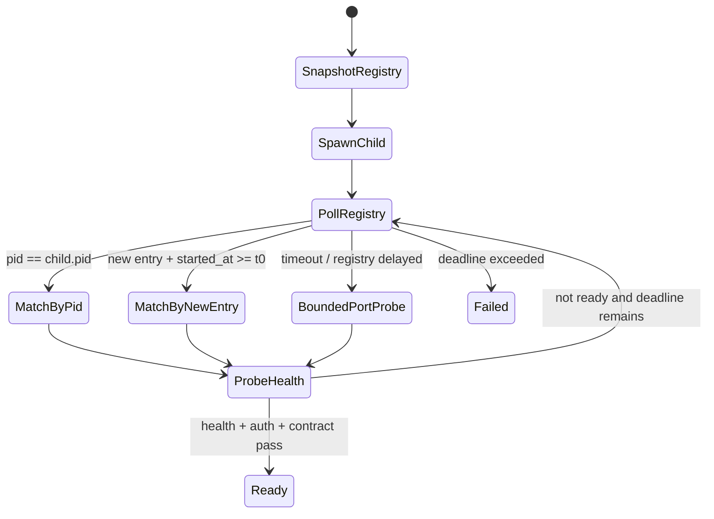
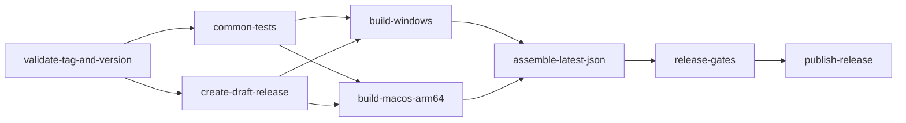

# Kimi App macOS V1 Technical Specification

## 0. 规范目标

本 SPEC 规定 Kimi App macOS V1 的架构、模块边界、接口、状态机、构建、签名、公证、更新和测试实现。所有示例代码均为实施约束的表达，最终代码应以仓库实际类型和编译结果为准。

### 0.1 首发技术基线

| 项 | 基线 |
|---|---|
| App 架构 | Tauri 2 + Rust + React 19 + Vite 7 |
| macOS 架构 | `aarch64-apple-darwin` |
| 最低系统 | macOS 13.0 |
| Kimi Code | 外置 binary；最低 0.33.0；0.33.x 必测 |
| Kimi Web | loopback + bearer token；不使用 bypass auth |
| Sidecar | Go `kimi-im-bridge-aarch64-apple-darwin` |
| 分发 | Developer ID signed/notarized `.app` + `.dmg` |
| 更新 | Tauri Updater `.app.tar.gz` + `.sig` |
| CI | GitHub Actions `macos-15` arm64，构建时断言 `uname -m=arm64` |

### 0.2 不变量

1. Windows 和 macOS 共用一套业务核心、IPC contract 和前端页面。
2. 平台差异集中在 `platform/` 和平台 installer backend。
3. Kimi Code 上游差异集中在 `upstream_kimi/`。
4. App 只停止由自己拥有或可证明为自己遗留的进程。
5. 不记录 bearer token、API key 或完整带 token URL。
6. 不通过 shell 拼接执行用户可控字符串。
7. macOS release 必须 signed + notarized；ad-hoc build 只用于开发。
8. 不使用 macOS private API，不启用透明 webview。

---

## 1. 架构决策记录

### ADR-MAC-001：同仓库、同应用，不创建 macOS fork

**决策**：继续使用 `apps/kimi-shell`，通过平台模块和配置分层支持 Windows/macOS。

**原因**：业务核心高度共享；fork 会造成 IPC、Updater、工作区模型和修复长期分叉。

### ADR-MAC-002：V1 采用 Developer ID + DMG，不进入 App Store

**决策**：App Store 作为 P2 独立项目。

**原因**：当前产品需要启动外部 CLI、本地 server、sidecar 并访问用户任意工作区；App Store sandbox 会引入另一套权限与更新架构。

### ADR-MAC-003：Kimi Code 外置

**决策**：V1 不把 Kimi Code binary 放入 App bundle。

**原因**：降低包体、上游更新、nested signing、许可证与供应链复杂度。App 负责检测、验证、启动和诊断。

### ADR-MAC-004：以当前 instance registry 作为主发现机制

**决策**：实现 `server/instances/*.json` adapter；legacy `server/lock` 只在 Windows compatibility adapter 中保留。

### ADR-MAC-005：macOS 使用原生 window controls

**决策**：macOS `decorations=true`，优先 `TitleBarStyle::Transparent`；前端隐藏 Windows 控件。

### ADR-MAC-006：Kimi 与 Bridge 使用不同的进程启动策略

- 外置 Kimi Code：`std::process::Command` + Unix process group/session，便于精确管理后代进程。
- Bundled IM Bridge：Tauri `externalBin`，优先通过 `tauri-plugin-shell` sidecar API 启动；不向前端暴露任意 shell 执行权限。

### ADR-MAC-007：Updater manifest 由最终聚合 Job 生成

**决策**：各平台 build 不单独发布 `latest.json`；最终 job 生成唯一多平台 manifest。

### ADR-MAC-008：V1 不注册所有文件/文件夹 handler

**决策**：使用 File > Open Folder、拖放、现有 OpenRequest 和 `RunEvent::Opened` 入口；Finder Quick Action 延后。

### ADR-MAC-009：窗口定义迁移到 Rust window factory

**决策**：不依赖平台配置文件对 `app.windows` 数组做局部合并。窗口 label、尺寸和平台 chrome 由 Rust 工厂创建。

### ADR-MAC-010：自定义 entitlement 默认空集

**决策**：先使用 Hardened Runtime 默认限制，不添加例外 entitlement。只有实体构建证明需要时才新增最小项，并附风险说明与测试证据。

---

## 2. 目标模块结构

```text
apps/kimi-shell/
├─ scripts/
│  ├─ build_bridge_sidecar.mjs
│  ├─ clean_public_build_artifacts.mjs
│  ├─ check_release_inputs.mjs
│  ├─ generate_updater_manifest.mjs
│  └─ verify_public_artifacts.mjs
├─ src/
│  ├─ app/platformCapabilities.ts
│  ├─ features/platform/
│  │  ├─ usePlatformCapabilities.ts
│  │  └─ PlatformOnly.tsx
│  └─ features/window/
│     ├─ ShellTitlebar.tsx
│     └─ NativeWindowHeader.tsx
└─ src-tauri/
   ├─ tauri.conf.json
   ├─ tauri.windows.conf.json
   ├─ tauri.macos.conf.json
   ├─ capabilities/
   │  ├─ default.json
   │  └─ sidecar.json
   ├─ binaries/
   │  ├─ kimi-im-bridge-x86_64-pc-windows-msvc.exe
   │  └─ kimi-im-bridge-aarch64-apple-darwin
   └─ src/
      ├─ platform/
      │  ├─ mod.rs
      │  ├─ common.rs
      │  ├─ windows.rs
      │  └─ macos.rs
      ├─ upstream_kimi/
      │  ├─ mod.rs
      │  ├─ version.rs
      │  ├─ home.rs
      │  ├─ instance_registry.rs
      │  ├─ contract.rs
      │  └─ runtime.rs
      ├─ process_supervisor.rs
      ├─ window_factory.rs
      ├─ menu_manager.rs
      ├─ install_manager/
      │  ├─ mod.rs
      │  ├─ common.rs
      │  ├─ windows.rs
      │  └─ macos.rs
      └─ ... existing modules
```

### 2.1 模块职责

#### `platform/`

- 返回当前平台 capabilities。
- 提供平台默认快捷键标签。
- 提供 application menu/window chrome policy。
- 提供 open/reveal、Dock、close/reopen 处理。
- 不包含 Kimi 协议细节。

#### `upstream_kimi/`

- 解析 Kimi home、binary 和 version。
- 读取当前 instance registry。
- 进行 health/auth/OpenAPI capability probe。
- 选择或启动 runtime。
- 不包含 macOS UI 语义。

#### `process_supervisor.rs`

- 平台化 spawn/stop/wait。
- Windows process tree 与 Unix process group。
- 记录 ownership、PID/PGID、timeout 和退出原因。

#### `window_factory.rs`

- 唯一创建 main、prefill、workspace picker、Agent Room 窗口。
- 按平台应用 decorations/titlebar/size/position。
- 防止每个 feature 自行复制 window builder。

#### `menu_manager.rs`

- macOS App Menu/File/Edit/View/Window/Help。
- Windows 可继续使用现有 tray/前端命令，必要时共享 command dispatch。

---

## 3. PlatformCapabilities contract

### 3.1 Rust 类型

```rust
#[derive(Debug, Clone, serde::Serialize)]
#[serde(rename_all = "camelCase")]
pub struct PlatformCapabilities {
    pub os: PlatformOs,
    pub arch: PlatformArch,
    pub native_window_controls: bool,
    pub window_control_placement: WindowControlPlacement,
    pub supports_app_menu: bool,
    pub supports_dock_reopen: bool,
    pub supports_explorer_context_menu: bool,
    pub supports_finder_quick_action: bool,
    pub supports_opened_event: bool,
    pub supports_tray: bool,
    pub hotkey_label: String,
    pub kimi_install_mode: KimiInstallMode,
    pub release_channel: ReleaseChannel,
}
```

建议 enum：

```rust
pub enum PlatformOs { Windows, Macos }
pub enum PlatformArch { Aarch64, X86_64 }
pub enum WindowControlPlacement { LeftNative, RightCustom }
pub enum KimiInstallMode { ExternalGuided, WindowsManaged }
pub enum ReleaseChannel { Development, AdHoc, DeveloperId }
```

### 3.2 IPC

新增：

```text
get_platform_capabilities() -> PlatformCapabilities
```

要求：

- App 启动时只调用一次并缓存。
- 不将安全敏感环境变量返回前端。
- 前端任何 platform-only control 必须基于该 contract，而非 user-agent 字符串。

### 3.3 macOS 返回示例

```json
{
  "os": "macos",
  "arch": "aarch64",
  "nativeWindowControls": true,
  "windowControlPlacement": "leftNative",
  "supportsAppMenu": true,
  "supportsDockReopen": true,
  "supportsExplorerContextMenu": false,
  "supportsFinderQuickAction": false,
  "supportsOpenedEvent": true,
  "supportsTray": true,
  "hotkeyLabel": "⌘⇧K",
  "kimiInstallMode": "externalGuided",
  "releaseChannel": "developerId"
}
```

---

## 4. Kimi Code binary locator

### 4.1 输入

```rust
pub struct KimiLocateInput {
    pub configured_path: Option<PathBuf>,
    pub kimi_code_home: PathBuf,
    pub allow_login_shell_probe: bool,
}
```

### 4.2 输出

```rust
pub struct LocatedKimiBinary {
    pub path: PathBuf,
    pub canonical_path: PathBuf,
    pub source: KimiBinarySource,
    pub version: semver::Version,
    pub warnings: Vec<KimiLocatorWarning>,
}
```

`KimiBinarySource` 至少包括：

- `Configured`
- `OfficialNativeHome`
- `HomebrewAppleSilicon`
- `HomebrewIntel`
- `UserLocalBin`
- `PackageManagerBin`
- `InheritedPath`
- `LoginShell`

### 4.3 macOS 查找顺序

1. `settings.kimi_binary_path`。
2. 显式环境变量（若项目已有受支持字段，沿用；不得引入多个冲突变量）。
3. `$KIMI_CODE_HOME/bin/kimi`。
4. `~/.kimi-code/bin/kimi`。
5. `/opt/homebrew/bin/kimi`。
6. `/usr/local/bin/kimi`。
7. `~/.local/bin/kimi`。
8. 当前 inherited PATH 的 `which::which("kimi")`。
9. 已知 pnpm/npm/Volta 用户目录候选。
10. 受控 login-shell probe。

### 4.4 候选验证

每个候选必须：

- canonicalize 成功。
- metadata 为 regular file。
- Unix mode 至少有一个 executable bit。
- 不是 symlink loop。
- `kimi --version` 在 3 秒内退出码 0。
- 输出可解析为 semver；保留原始短输出用于诊断但限制长度。

可选安全告警：如果 binary 位于 world-writable 目录，显示 warning 并要求用户确认，不直接静默运行。

### 4.5 Login shell probe

```text
$SHELL -l -c 'command -v kimi'
```

约束：

- shell 只允许来自 `/etc/shells` 或系统默认 `/bin/zsh`、`/bin/bash`。
- stdin = null。
- stdout/stderr 上限各 64 KiB。
- timeout = 3 秒。
- 从输出中只接受最后一个绝对路径行。
- 重新执行完整候选验证。
- shell init 输出、ANSI 序列和额外日志不能被当作路径。
- 不导入用户 shell 的全部环境到 App，只用于定位 binary。

### 4.6 版本策略

```text
minimum_supported = 0.33.0
tested = 0.33.x
```

判断：

1. `<0.33.0`：阻断并进入升级引导。
2. `0.33.x`：正常。
3. `>0.33.x`：执行 capability probe；通过则允许并记录 `untested_version` warning。
4. 无法解析：阻断。

因为 Kimi Code 仍处于 `0.x`，不能假设 minor 版本完全向后兼容。

---

## 5. Kimi home 与文件路径

### 5.1 Kimi home

唯一函数：

```rust
pub fn resolve_kimi_home() -> Result<PathBuf, KimiHomeError>
```

规则：

1. 有效 `KIMI_CODE_HOME` 优先。
2. 否则使用用户 home 下 `.kimi-code`。
3. 规范化但不要求目录已存在。
4. 所有 token、registry、config 和 log 路径均从该函数派生。

不得在不同模块分别拼 `~/.kimi-code`。

### 5.2 App 自身路径

继续使用 Tauri path resolver：

- `app_config_dir()`
- `app_log_dir()`
- `app_cache_dir()`（如需要）

不得硬编码 `~/Library/Application Support`。诊断页可显示解析后的实际路径。

### 5.3 文件权限

在 Unix/macOS 下：

- runtime ownership file：`0600`
- 管理 token 临时文件：`0600`
- bridge secret file：`0600`
- log：默认 `0600` 或继承安全 umask
- sidecar binary：`0755`

---

## 6. Kimi instance registry adapter

### 6.1 位置

```text
<KIMI_CODE_HOME>/server/instances/*.json
```

### 6.2 数据结构

```rust
#[derive(Debug, Clone, serde::Deserialize)]
pub struct KimiServerInstanceDisk {
    pub server_id: String,
    pub pid: u32,
    pub host: String,
    pub port: u16,
    pub started_at: u64,
    pub heartbeat_at: u64,
    #[serde(default)]
    pub host_version: Option<String>,
}
```

### 6.3 校验

- 文件名必须是 `.json`。
- 文件最大 64 KiB。
- `server_id` 非空且长度受限。
- PID > 0。
- port > 0。
- host 必须解析为 loopback：`127.0.0.1`、`::1` 或明确允许的 localhost 表达。
- `started_at <= heartbeat_at + tolerance`。
- 同机 PID 必须存活；`kill(pid, 0)` 的 EPERM 视为存在。
- external candidate 的 heartbeat age 默认不得超过 45 秒；若 PID 活但 heartbeat 过旧，必须先做 health probe。
- 解析失败的记录只忽略并记录诊断，不由 Kimi App 擅自删除。

### 6.4 External runtime 选择

```text
list valid instances
  -> sort by started_at asc
  -> for each candidate:
       GET /api/v1/healthz
       validate auth with server.token
       validate required API capability
  -> select first healthy candidate
```

选择后 ownership = `ExternalReused`，退出时不发送 signal。

### 6.5 Owned runtime 关联算法



详细步骤：

1. 在 spawn 前读取 registry snapshot，记录 server IDs。
2. 记录 `t0` 和预期 base port。
3. spawn child，取得 `child_pid` 和 `pgid`。
4. 最长 15 秒轮询 registry：前 2 秒每 100 ms，之后每 250 ms。
5. 首选 `record.pid == child_pid`。
6. 次选“不在旧 snapshot、started_at 接近 t0、host 为 loopback”的新记录。
7. 对候选执行 health/auth/contract probe。
8. 若 registry 未及时出现，对 `base_port..base_port+10` 做有界 probe；仅在 child 仍存活时使用。
9. 成功后写 runtime ownership locator。
10. 失败时停止 owned process group，保留脱敏诊断。

不得以 stdout banner 解析作为主路径；如必须增加 fallback，应隔离成版本化 parser 并有 fixture test。

### 6.6 Runtime ownership 文件

建议位置：

```text
<app_config_dir>/runtime-owned.json
```

Schema：

```json
{
  "schemaVersion": 2,
  "appPid": 1000,
  "runtimePid": 1001,
  "processGroupId": 1001,
  "serverId": "01...",
  "port": 58628,
  "startedAt": 1780000000000,
  "kimiHome": "/Users/user/.kimi-code",
  "kimiCanonicalPath": "/Users/user/.kimi-code/bin/kimi"
}
```

用途：

- App crash 后下次启动可识别自己遗留的 runtime。
- 必须联合 PID 存活、registry server ID、started_at、canonical path 和 health 验证，避免 PID reuse 误认。
- 验证成功可标记为 `AdoptedOwned`，新 App 退出时可管理。
- 无法证明所有权则降级为 `ExternalReused`，不得 kill。

---

## 7. Kimi runtime contract probe

### 7.1 必测端点

- `GET /api/v1/healthz`
- auth 验证接口或受保护 API
- `GET /openapi.json`
- `GET /asyncapi.json`

### 7.2 Probe 输出

```rust
pub struct KimiRuntimeContract {
    pub health_ok: bool,
    pub auth_ok: bool,
    pub openapi_available: bool,
    pub asyncapi_available: bool,
    pub required_routes: BTreeMap<String, bool>,
    pub warnings: Vec<String>,
}
```

### 7.3 兼容判断

- health/auth 任一失败：不可用。
- App 实际调用的 required route 缺失：不可用。
- OpenAPI/AsyncAPI 缺失但 required route 都通过：允许降级，仅适用于明确测试过的版本。
- 任何 token 只通过 Authorization header 使用，不写入日志。

### 7.4 Contract fixtures

将已测试上游版本的 OpenAPI/AsyncAPI 摘要保存在测试 fixture：

```text
src-tauri/tests/fixtures/kimi-code/0.33/openapi-required.json
src-tauri/tests/fixtures/kimi-code/0.33/instance-record.json
```

只保存 App 依赖的 route/schema 摘要，避免把整个上游文档复制进仓库并产生无意义 diff。

---

## 8. ProcessSupervisor

### 8.1 数据模型

```rust
pub enum RuntimeOwnership {
    OwnedChild,
    AdoptedOwned,
    ExternalReused,
    Unknown,
}

pub struct ManagedProcess {
    pub pid: u32,
    pub process_group_id: Option<i32>,
    pub ownership: RuntimeOwnership,
    pub started_at: SystemTime,
    pub executable: PathBuf,
}
```

### 8.2 macOS spawn

对 Kimi Code：

- `current_dir` 为选定 workspace 或稳定 app 工作目录。
- stdin = null。
- stdout/stderr 重定向到受控日志 pipe/file。
- 设置 `KIMI_CODE_NO_AUTO_UPDATE=1`，保持 App 启动过程可预测。
- 只传受控 env；不要复制未知 shell 输出。
- 在 `pre_exec` 中创建新 session/process group。

伪代码：

```rust
#[cfg(unix)]
unsafe {
    use std::os::unix::process::CommandExt;
    command.pre_exec(|| {
        nix::unistd::setsid()
            .map(|_| ())
            .map_err(std::io::Error::other)
    });
}
```

`pre_exec` 闭包必须保持最小，只调用 async-signal-safe 系统操作。

### 8.3 macOS stop

```text
if ownership is OwnedChild or AdoptedOwned:
  send SIGTERM to process group
  wait up to 2s
  if still alive: SIGKILL process group
  wait/reap if child handle exists
  clear ownership file only after confirmed exit
else:
  detach without signal
```

- 使用 `killpg`，不是只 kill child PID。
- 对 AdoptedOwned 无 child handle 时，通过 PID/PGID liveness probe 确认。
- 不允许对 PGID 0、负值或当前 App 自己的 process group 发信号。

### 8.4 Windows 保持

现有 `taskkill /T` 逻辑迁入 `platform/windows.rs` 或 `process_supervisor/windows.rs`，行为不变并增加回归测试。

---

## 9. Window factory 与 macOS chrome

### 9.1 迁移原则

当前 `tauri.conf.json` 中预声明三个 `create:false` window，Rust 再读取 config 创建。V1 将 window profile 移到 Rust，以避免平台 JSON array merge 陷阱并确保动态 Agent Room 使用同一策略。

### 9.2 WindowProfile

```rust
pub enum AppWindowKind {
    Prefill,
    Main,
    WorkspaceImportPicker,
    AgentRoom,
}

pub struct WindowProfile {
    pub label: &'static str,
    pub title: &'static str,
    pub route: &'static str,
    pub width: f64,
    pub height: f64,
    pub min_width: f64,
    pub min_height: f64,
    pub resizable: bool,
    pub center: bool,
}
```

### 9.3 macOS builder policy

```rust
#[cfg(target_os = "macos")]
fn apply_native_chrome(
    builder: tauri::WebviewWindowBuilder<'_, tauri::Wry>,
    kind: AppWindowKind,
) -> tauri::WebviewWindowBuilder<'_, tauri::Wry> {
    let builder = builder
        .decorations(true)
        .title_bar_style(tauri::TitleBarStyle::Transparent)
        .hidden_title(true)
        .shadow(true);

    match kind {
        AppWindowKind::WorkspaceImportPicker => {
            builder.title_bar_style(tauri::TitleBarStyle::Visible)
        }
        _ => builder,
    }
}
```

实施时以实际 Tauri builder API 为准。

### 9.4 前端标题栏

`ShellTitlebar.tsx` 修改：

- macOS 不渲染 Minimize/Maximize/Close 三个按钮。
- macOS 不对整条 header 强制 `startDragging`；使用原生 titlebar。
- Windows 保留现有按钮、drag region 与双击最大化。
- header 业务内容保持共享。
- 不在 traffic lights 区域放可点击业务控件。

### 9.5 窗口事件

- `CloseRequested`：macOS 主窗口 prevent close -> hide；附属窗口按类型真正 close 或 hide。
- `Destroyed`：清理 window registry，但不自动退出 App。
- `Focused`：更新 active window/session。
- fullscreen/zoom 状态由系统管理，不在 macOS 模拟 maximize。

### 9.6 Dock reopen

```rust
RunEvent::Reopen { has_visible_windows, .. } => {
    if !has_visible_windows {
        window_manager::show_and_focus_main(&app_handle)?;
    }
}
```

必须防止重新创建重复主窗口。

---

## 10. macOS application menu

### 10.1 菜单结构

```text
Kimi Sidekick
  About Kimi Sidekick
  Settings…                 ⌘,
  Services
  Hide Kimi Sidekick        ⌘H
  Hide Others               ⌥⌘H
  Show All
  Quit Kimi Sidekick        ⌘Q

File
  Open Folder…              ⌘O
  New Window / New Pane     product-specific shortcut
  Close Window              ⌘W

Edit
  Undo / Redo
  Cut / Copy / Paste
  Select All

View
  Reload current pane       product-specific
  Toggle Control Center
  Enter Full Screen         ⌃⌘F

Window
  Minimize                  ⌘M
  Bring All to Front
  list of app windows

Help
  Documentation
  Open Diagnostics
  Report an Issue
```

Tauri 在 macOS 会将第一个 submenu 作为 App Menu，因此构造顺序不可错。

### 10.2 事件分发

所有 menu item 使用稳定 ID：

```text
app.about
app.settings
app.quit
file.open-folder
file.close-window
view.control-center
help.diagnostics
help.report-issue
```

菜单事件调用共享 command dispatcher，不直接复制业务逻辑。

### 10.3 Tray/Menu Bar Icon

- 保留现有 tray 作为辅助入口。
- macOS icon 使用 template image（单色透明）。
- tray 菜单不能替代 App Menu。
- V1 默认仍显示 Dock icon，activation policy 为 Regular。
- “关闭到托盘”文案改为“关闭窗口后应用继续运行”。

---

## 11. OpenRequest 与系统资源打开

### 11.1 RunEvent::Opened

```rust
RunEvent::Opened { urls } => {
    for url in urls {
        if url.scheme() == "file" {
            let path = url.to_file_path()?;
            open_request::enqueue_path(path);
        } else {
            open_request::enqueue_url(url);
        }
    }
    window_manager::show_and_focus_main(&app_handle)?;
}
```

### 11.2 输入归一化

统一入口：

- CLI argv / single-instance。
- `RunEvent::Opened`。
- File > Open Folder dialog。
- drag/drop。
- P1 deep link。

都转换成：

```rust
pub enum OpenRequestItem {
    Directory(PathBuf),
    File(PathBuf),
    DeepLink(url::Url),
}
```

复用现有 batching、dedupe 和 workspace import picker。

### 11.3 文件关联策略

V1：

- 不声明 `public.item` / `public.folder` 的广泛 handler。
- 不改变用户默认编辑器。
- 可为未来引入 `.kimiworkspace` descriptor 预留 schema，但不作为首发阻塞项。

---

## 12. macOS 安装与升级 backend

### 12.1 重构现有 install_manager

当前单文件包含 PowerShell、winget、GBK 和 Windows 镜像逻辑。拆分为：

```text
install_manager/common.rs
install_manager/windows.rs
install_manager/macos.rs
```

公共状态机、日志 channel 和 snapshot 保留；task catalog 由平台 backend 生成。

### 12.2 macOS task catalog

V1 不执行远程安装，catalog 表达“引导动作”：

```text
DetectKimi
OpenTerminal
CopyOfficialInstallCommand
RecheckKimi
ChooseKimiBinary
CopyUpgradeCommand
```

现有 `InstallTaskDefinition` 若强制要求 command，应重构为：

```rust
pub enum InstallTaskAction {
    ManagedProcess { executable: PathBuf, args: Vec<String> },
    OpenExternal { target: String },
    CopyText { text: String },
    Probe,
    ManualInstruction,
}
```

禁止用字符串 command 在 shell 中执行。

### 12.3 官方命令

安装：

```sh
curl -fsSL https://code.kimi.com/kimi-code/install.sh | bash
```

升级优先：

```sh
kimi upgrade
```

App 只复制和展示命令。P1 若做 managed install，必须下载正式 artifact、验证官方 checksum、原子替换和回滚，不直接把上述 pipe 命令放到隐藏 shell 中执行。

### 12.4 更新域分离

UI 必须区分：

- `Kimi Sidekick 更新`：Tauri updater。
- `Kimi Code 更新`：外部 CLI 官方机制。

状态、错误和按钮不得混用。

---

## 13. IM Bridge sidecar

### 13.1 构建产物

```text
src-tauri/binaries/kimi-im-bridge-aarch64-apple-darwin
```

Windows 后续统一为：

```text
src-tauri/binaries/kimi-im-bridge-x86_64-pc-windows-msvc.exe
```

### 13.2 跨平台构建脚本

`build_bridge_sidecar.mjs` 输入：

```text
--target <rust-target-triple>
--profile debug|release
```

target 映射：

| Rust target | GOOS | GOARCH | 后缀 |
|---|---|---|---|
| `aarch64-apple-darwin` | darwin | arm64 | 无 `.exe` |
| `x86_64-apple-darwin` | darwin | amd64 | 无 `.exe` |
| `x86_64-pc-windows-msvc` | windows | amd64 | `.exe` |

流程：

1. `go test ./...`
2. `go build -trimpath`，release 可使用经验证的 `-ldflags`。
3. 输出到 target-triple 文件名。
4. Unix `chmod 0755`。
5. 执行 `--version` smoke；若 bridge 尚无该命令，新增稳定版本输出。
6. 记录 SHA-256 到 build metadata。

`CGO_ENABLED=0` 需在 M0 以完整 test 验证；`modernc.org/sqlite` 使其具备可行性，但不能仅凭依赖名称假设所有 adapter 都无 CGO。

### 13.3 Tauri 配置

基础或 mac 配置：

```json
{
  "bundle": {
    "externalBin": [
      "binaries/kimi-im-bridge"
    ]
  }
}
```

Tauri bundler 会按 target triple 选择实际文件。

### 13.4 启动

推荐使用 `tauri-plugin-shell` 的 sidecar API，仅后端调用。不得给任意前端 window `shell:allow-execute` 通配权限。

若 plugin-shell 不满足现有健康停止流程，可继续使用 Rust process API，但必须通过 Tauri 提供的 sidecar/resource resolver 获取 bundle 内路径，不得手工猜 `Contents/MacOS`。

### 13.5 签名要求

release gate 必须验证：

- sidecar 位于 `.app` 内。
- mode 可执行。
- `codesign -dv` 显示同一 Team/Developer ID。
- `codesign --verify --deep --strict` 对整个 app 成功。
- notarization log 不包含 unsigned nested executable。

---

## 14. Tauri 配置分层

### 14.1 `tauri.conf.json`：共享配置

建议保留：

- version、identifier、build、CSP。
- bundle icons、resources、externalBin、createUpdaterArtifacts。
- updater endpoint/pubkey。

移除：

- 直接依赖 platform window arrays，改由 Rust factory。
- Windows-only updater installMode，迁移到 `tauri.windows.conf.json`。

示意：

```json
{
  "$schema": "https://schema.tauri.app/config/2",
  "productName": "Kimi Sidekick",
  "version": "0.2.0",
  "identifier": "io.github.endearqb.kimi-sidekick",
  "build": {
    "beforeDevCommand": "pnpm dev",
    "devUrl": "http://localhost:1420",
    "beforeBuildCommand": "pnpm build:desktop-prerequisites",
    "frontendDist": "../dist"
  },
  "app": {
    "windows": [],
    "security": {
      "csp": "...existing reviewed CSP..."
    }
  },
  "bundle": {
    "active": true,
    "createUpdaterArtifacts": true,
    "resources": {
      "harnesses/": "harnesses/",
      "../../../skills/docx/": "skills/docx/",
      "../../../skills/pdf/": "skills/pdf/",
      "../../../skills/pptx/": "skills/pptx/",
      "../../../skills/xlsx/": "skills/xlsx/"
    },
    "externalBin": ["binaries/kimi-im-bridge"],
    "icon": [
      "icons/32x32.png",
      "icons/128x128.png",
      "icons/128x128@2x.png",
      "icons/icon.icns",
      "icons/icon.ico"
    ]
  },
  "plugins": {
    "updater": {
      "pubkey": "...",
      "endpoints": [
        "https://github.com/endearqb/kimi-app/releases/latest/download/latest.json"
      ]
    }
  }
}
```

### 14.2 `tauri.windows.conf.json`

```json
{
  "bundle": {
    "targets": ["nsis", "msi"]
  },
  "plugins": {
    "updater": {
      "windows": {
        "installMode": "passive"
      }
    }
  }
}
```

### 14.3 `tauri.macos.conf.json`

```json
{
  "bundle": {
    "targets": ["app", "dmg"],
    "macOS": {
      "minimumSystemVersion": "13.0"
    }
  }
}
```

自定义 entitlements 文件只有在验证需要时才增加：

```json
{
  "bundle": {
    "macOS": {
      "entitlements": "Entitlements.plist"
    }
  }
}
```

### 14.4 JSON Merge Patch 验证

新增脚本，在 CI 输出最终 resolved config 并断言：

- mac targets 只有 app,dmg。
- windows targets 只有 nsis,msi。
- mac 不出现 Windows `installMode`。
- identifier/version 在 package/Cargo/Tauri 中一致。
- externalBin 存在且 target 文件可执行。

---

## 15. CSP 与本地服务安全

### 15.1 保留原则

- `connect-src` / `frame-src` 只允许明确 loopback 与必要的 HTTPS。
- 不扩展到 `http://*` 或 `ws://*`。
- production 不允许 dev server origin。
- `object-src 'none'`、`base-uri 'self'` 保留。

### 15.2 Host 与 token

- Kimi launch 不使用 `--host 0.0.0.0`。
- 不使用 `--dangerous-bypass-auth`。
- URL fragment 中 token 进入前端后不得进入日志或 telemetry。
- 诊断只显示 `tokenPresent: true/false` 和 fingerprint 的短 hash（如确有必要），默认不显示 hash。

### 15.3 Registry spoof 防护

攻击者可写入同一用户目录中的伪 registry。选择实例时必须联合验证：

- loopback host。
- PID alive。
- bearer token auth。
- health/required API。
- 对 owned child，PID 与 child handle 一致。

不能只因为 JSON 语法正确就连接。

---

## 16. macOS 签名、公证与 entitlement

### 16.1 证书

直发 DMG 使用：

```text
Developer ID Application: <Organization> (<TEAM_ID>)
```

App Store 的 Apple Distribution 证书不用于 V1。

### 16.2 Hardened Runtime

release 必须开启 Hardened Runtime。默认不增加以下危险例外：

- allow unsigned executable memory
- disable library validation
- allow DYLD environment variables
- disable executable memory protection

如果 WKWebView 或依赖确实需要 entitlement，必须：

1. 给出失败日志。
2. 说明最小例外。
3. 增加安全测试。
4. 在 PR 中记录原因。

### 16.3 CI secrets

```text
APPLE_CERTIFICATE
APPLE_CERTIFICATE_PASSWORD
KEYCHAIN_PASSWORD
APPLE_SIGNING_IDENTITY
APPLE_API_ISSUER
APPLE_API_KEY
APPLE_API_KEY_P8
TAURI_SIGNING_PRIVATE_KEY
TAURI_SIGNING_PRIVATE_KEY_PASSWORD
```

`APPLE_API_KEY_P8` 在 job 中写入临时文件，再设置 `APPLE_API_KEY_PATH`。文件在 job 结束前删除，不作为 artifact 上传。

### 16.4 构建与公证

```sh
pnpm tauri build \
  --target aarch64-apple-darwin \
  --bundles app,dmg
```

在 Tauri 签名/公证流程之外，release gate 执行：

```sh
codesign --verify --deep --strict --verbose=2 "/path/Kimi Sidekick.app"
spctl --assess --type execute --verbose=4 "/path/Kimi Sidekick.app"
xcrun stapler validate "/path/Kimi Sidekick.app"
hdiutil verify "/path/Kimi Sidekick.dmg"
xcrun stapler validate "/path/Kimi Sidekick.dmg"
```

另外用 `codesign -dv --verbose=4` 检查 TeamIdentifier、runtime flag 和 nested sidecar。

---

## 17. Release workflow

### 17.1 Job 图



### 17.2 macOS runner

当前 GitHub runner label 中 `macos-15` 为 arm64。workflow 必须显式断言：

```sh
test "$(uname -m)" = "arm64"
sw_vers
xcodebuild -version
rustc -Vv
node --version
go version
```

不用 `macos-latest`，避免 label 迁移导致不可控变化。

### 17.3 Build job 要点

- `pnpm/action-setup@v4`，版本 10.34.4。
- `actions/setup-node@v4`，Node 22。
- `actions/setup-go@v5`，读取 `apps/kimi-im-bridge/go.mod`。
- `dtolnay/rust-toolchain@stable`，target `aarch64-apple-darwin`。
- `pnpm install --frozen-lockfile`。
- `cargo test --locked`。
- 构建 target-specific bridge。
- 导入 Developer ID 证书到临时 keychain。
- 写入 App Store Connect `.p8`。
- Tauri build/sign/notarize。
- 验证 app/dmg。
- 上传 artifacts 和 signatures。

### 17.4 唯一 updater manifest

各平台 build 设置：

```text
uploadUpdaterJson: false
```

最终脚本 `generate_updater_manifest.mjs` 输入：

- tag/version/notes/pub_date。
- Windows updater asset URL + `.sig` 内容。
- macOS `.app.tar.gz` URL + `.sig` 内容。

输出：

```json
{
  "version": "0.2.0",
  "notes": "...",
  "pub_date": "2026-08-05T00:00:00Z",
  "platforms": {
    "windows-x86_64": {
      "url": "https://github.com/endearqb/kimi-app/releases/download/v0.2.0/...exe",
      "signature": "..."
    },
    "darwin-aarch64": {
      "url": "https://github.com/endearqb/kimi-app/releases/download/v0.2.0/...app.tar.gz",
      "signature": "..."
    }
  }
}
```

生成器必须：

- 验证 semver。
- 验证每个平台 URL 非空。
- 读取 `.sig` 文件内容而不是路径。
- 拒绝缺少任一已发布平台。
- 对 JSON 做 schema test。
- 上传 manifest 后再发布 draft release。

### 17.5 Artifact 命名

统一使用稳定 ASCII 名称，避免 URL 编码不一致：

```text
Kimi-Sidekick_0.2.0_darwin_aarch64.dmg
Kimi-Sidekick_0.2.0_darwin_aarch64.app.tar.gz
Kimi-Sidekick_0.2.0_darwin_aarch64.app.tar.gz.sig
```

Finder 中 App 显示名仍可为 `Kimi Sidekick`。

---

## 18. package scripts

目标脚本示例：

```json
{
  "scripts": {
    "sync:version": "node scripts/sync_version.mjs",
    "dev": "pnpm sync:version && vite",
    "build": "pnpm sync:version && tsc && vite build",
    "build:bridge-sidecar": "node scripts/build_bridge_sidecar.mjs",
    "build:desktop-prerequisites": "pnpm build && pnpm build:bridge-sidecar",
    "verify": "pnpm sync:version && pnpm exec tsc --noEmit && pnpm test && pnpm check:nfr:security",
    "clean:public-build-artifacts": "node scripts/clean_public_build_artifacts.mjs",
    "verify:public-artifacts:no-abs-paths": "node scripts/verify_public_artifacts_no_abs_paths.mjs",
    "tauri": "pnpm sync:version && tauri"
  }
}
```

Windows-only NFR 可保留 `:windows` 后缀，但不得处于所有平台通用 build path。

`beforeBuildCommand` 需要知道 target。推荐 workflow 先显式执行：

```sh
pnpm build:bridge-sidecar -- --target aarch64-apple-darwin
pnpm tauri build --target aarch64-apple-darwin ...
```

然后 `beforeBuildCommand` 只负责前端 build，避免 target 信息在嵌套命令中丢失。也可使用经 M0 验证的 Tauri target env，但不能未经验证假设变量名。

---

## 19. 前端改动

### 19.1 初始化

App bootstrap：

1. 调用 `get_platform_capabilities`。
2. 放入 Zustand/platform context。
3. 在 capabilities 未就绪前不渲染 platform-specific control。

### 19.2 ShellTitlebar

```tsx
const platform = usePlatformCapabilities();

return (
  <header className="shell-header">
    <HeaderBusinessControls />
    {!platform.nativeWindowControls && <WindowsWindowControls />}
  </header>
);
```

### 19.3 设置与安装页面

- context menu setting 在 macOS 隐藏，不显示 disabled Windows 控件堆积。
- PowerShell preflight 整段在 macOS 不挂载。
- Kimi 安装 UI 使用 `ExternalGuidedInstallPanel`。
- 快捷键显示从 capability 取 `⌘⇧K`。
- “托盘”统一改为“后台运行/Menu Bar”并依据平台文案。

### 19.4 键盘

前端快捷键判断使用 `event.metaKey` 对 macOS，`event.ctrlKey` 对 Windows；封装成共享 helper，不能逐页面散落。

---

## 20. Settings schema 与迁移

### 20.1 新字段

建议：

```rust
pub struct AppSettings {
    // existing
    pub kimi_binary_path: Option<String>,
    pub close_behavior: CloseBehavior,
    pub show_menu_bar_icon: bool,
    pub runtime_reuse_policy: RuntimeReusePolicy,
}
```

`CloseBehavior`：

- macOS 默认 `HideWindow`
- Windows 保持现有行为

`RuntimeReusePolicy`：

- `PreferHealthyExternal`
- `AlwaysStartOwned`

V1 默认可延续当前产品意图使用 `PreferHealthyExternal`，但所有权规则不可改变。

### 20.2 不应持久化

- platform capabilities。
- resolved CLI path source。
- actual runtime port。
- token。

这些属于运行时状态。

### 20.3 Bundle ID 迁移

当前 identifier 为 `com.kimi.shell`。若改为 `io.github.endearqb.kimi-sidekick`：

- Windows/macOS app data path、single instance identity、Updater identity可能变化。
- 在首个 mac 发布前完成决定最便宜。
- Windows 需要一次配置迁移：启动时查旧目录，用户确认后复制非敏感 settings/workspace metadata；日志和 token 不迁移。
- 若暂时保留旧 identifier，必须记录品牌和长期归属风险，不得在发布后频繁改动。

---

## 21. 错误模型

新增稳定错误码：

```text
macos_kimi_not_found
macos_kimi_not_executable
macos_kimi_version_unsupported
macos_login_shell_timeout
kimi_registry_unavailable
kimi_registry_record_invalid
kimi_runtime_contract_mismatch
kimi_runtime_port_not_discovered
kimi_owned_process_stop_timeout
bridge_sidecar_missing
bridge_sidecar_not_executable
platform_feature_unsupported
release_signature_invalid
```

错误对象：

```json
{
  "code": "kimi_runtime_contract_mismatch",
  "message": "Kimi Code is running but does not provide the required local API.",
  "details": {
    "version": "0.34.0",
    "missingCapabilities": ["..."]
  },
  "recoveryActions": [
    "openDiagnostics",
    "chooseKimiBinary",
    "copyUpgradeCommand"
  ]
}
```

禁止把原始 token、完整环境或任意 stderr 全量直接送到前端。

---

## 22. 威胁模型

| 威胁 | 攻击面 | 控制 |
|---|---|---|
| 恶意 `kimi` 抢占 PATH | Finder/login shell | 官方路径优先、canonicalize、版本与 contract probe、world-writable warning |
| 伪造 registry JSON | 用户目录 | PID alive、loopback、auth、health、PID-child 关联 |
| token 泄露 | 日志/URL/诊断 | redaction、fragment 不落日志、诊断只显示存在性 |
| sidecar 被替换 | App bundle/更新 | Developer ID、nested codesign、Updater signature、notary |
| 更新清单被篡改 | GitHub/CDN | HTTPS + Tauri signature；private key 离线保护 |
| shell init 注入/挂起 | login shell probe | allowlisted shell、timeout、输出上限、绝对路径解析 |
| 误杀外部 Kimi | runtime stop | ownership state、locator proof、external 不 signal |
| localhost 暴露到局域网 | launch args | 固定 loopback，不使用裸 `--host`/bypass auth |
| 任意 shell IPC | 前端能力 | 不向前端开放通配 shell permission；sidecar 只在 Rust 启动 |
| 过宽 entitlement | mac release | 默认无例外、PR 证据、codesign inspection |

---

## 23. 测试策略

### 23.1 Rust unit tests

- mac path candidate order。
- executable mode validation。
- login shell noisy output parser。
- version boundary。
- registry decode/validation。
- heartbeat/PID liveness classification。
- owned candidate selection。
- ownership file adoption/PID reuse rejection。
- process stop state transitions。
- platform capabilities。
- menu command dispatch。

### 23.2 Go tests

- `go test ./...` on darwin/arm64 runner。
- SQLite open/migrate/read/write。
- admin health endpoint。
- graceful shutdown。
- `--version`。

### 23.3 Frontend tests

- macOS 不渲染 Windows window controls。
- macOS 不显示 PowerShell/Explorer settings。
- hotkey label 为 `⌘⇧K`。
- install guided flow。
- close behavior copy。
- platform capabilities loading/fallback。

### 23.4 Integration tests

使用可控 fake Kimi server fixture：

- registry file delayed creation。
- port auto-increment。
- invalid token。
- stale heartbeat。
- child exits before registry。
- multiple external instances。
- external reuse not killed。
- owned process group receives TERM/KILL。

### 23.5 macOS manual/E2E matrix

| OS | Arch | 场景 |
|---|---|---|
| macOS 13 | arm64 | 最低版本 smoke |
| macOS 14 | arm64 | 窗口、主题、更新 |
| macOS 15 | arm64 | CI 与主兼容 |
| macOS 26 | arm64 | 当前新系统 smoke |
| 用户 M5 | arm64 | 主验收设备 |

每个平台至少验证：

- clean DMG install。
- Finder launch。
- Kimi missing/installed/outdated。
- Kimi login。
- workspace open/restore。
- multiple panes。
- clipboard/keyboard/input method。
- dark/light mode。
- close/Dock reopen/Cmd+Q。
- bridge。
- update。
- sleep/wake、网络断开恢复。

### 23.6 Windows 回归

- `pnpm verify`。
- Rust tests。
- bridge build。
- MSI/NSIS release dry run。
- Explorer context menu。
- WebView2 download interception。
- custom titlebar。

---

## 24. 性能与可靠性测量

启动日志记录阶段耗时：

```text
app_setup_ms
prefill_visible_ms
kimi_locate_ms
kimi_version_probe_ms
registry_scan_ms
runtime_spawn_ms
runtime_registration_ms
runtime_health_ms
main_window_ready_ms
bridge_start_ms
```

仅保存在本地日志；不默认上传。

超时建议：

| 操作 | timeout |
|---|---:|
| `kimi --version` | 3 s |
| login shell locate | 3 s |
| external health probe/instance | 800 ms |
| owned runtime total start | 15 s |
| graceful Kimi stop | 2 s，再 KILL |
| bridge start | 20 s（沿用并实测） |
| Dock reopen | 不应阻塞 runtime probe |

App UI 线程不得同步等待外部进程；所有 probe 在后台线程/async task 执行并发送状态事件。

---

## 25. 文件级改动清单

| 文件/目录 | 改动 |
|---|---|
| `apps/kimi-shell/package.json` | 公共脚本跨平台化；去 `.cmd`/PowerShell 主路径 |
| `scripts/*.ps1` | 保留 Windows 专属或迁移为 `.mjs` |
| `src-tauri/tauri.conf.json` | 共享 config、externalBin、移出 Windows updater 设置 |
| `tauri.windows.conf.json` | MSI/NSIS、Windows updater mode |
| `tauri.macos.conf.json` | app/dmg、minimumSystemVersion |
| `Cargo.toml` | mac platform deps、可选 plugin-shell；保持 Windows deps target-scoped |
| `capabilities/default.json` | 审查 mac window/menu IPC；不放宽 shell |
| `platform/*` | 新增平台能力与生命周期实现 |
| `upstream_kimi/*` | 新实例协议、版本、contract probe |
| `backend_manager/lifecycle.rs` | 委托 upstream adapter 和 supervisor；移除 legacy lock 主逻辑 |
| `kimi_locator.rs` | 迁入/调用新 locator，支持 Finder PATH |
| `process_supervisor.rs` | Unix process group、ownership、adoption |
| `window_manager.rs` | 使用 window factory；mac close/reopen |
| `window_factory.rs` | 新增统一窗口创建 |
| `menu_manager.rs` | mac App Menu |
| `lib.rs` | 注册 menu、处理 `Opened`/`Reopen`/Quit |
| `install_manager/*` | Windows/mac backend 分离 |
| `bridge_manager.rs` | externalBin resolver/plugin-shell，mac executable/version |
| `ShellTitlebar.tsx` | mac 隐藏自制控件与 drag behavior |
| `app/types.ts` / Rust `types.rs` | PlatformCapabilities、错误码、runtime diagnostics |
| `.github/workflows/release.yml` | 多 job、mac sign/notary、manifest aggregator |
| README / docs | mac 安装、开发、签名、限制与排障 |

---

## 26. 实施质量门槛

任何 macOS PR 必须满足：

1. 不使用无解释的 fallback 吞掉错误。
2. 新平台分支有至少一个 test。
3. 不将 `#[cfg(target_os="macos")]` 大量散落在业务层。
4. 不把 Windows-only enum/文案强行复用于 mac。
5. 不扩大 Tauri capabilities 以“先跑起来”。
6. 不把安装命令作为 shell string 直接执行。
7. 不在没有 notarization 证据时宣称 release-ready。
8. 不把 external runtime 标成 owned。
9. 不让 mac 改动绕过 Windows CI。

---

## 27. 技术完成定义

macOS V1 technical complete 需要同时具备：

- `pnpm verify` 在 macOS 与 Windows 成功。
- Rust/Go/frontend tests 成功。
- Kimi Code 0.33.x contract tests 成功。
- arm64 sidecar 存在、可执行、可启动。
- App 从 Finder 启动可定位 Kimi。
- `server/instances` 端口发现成功。
- owned process group 可完全停止，external 不被停止。
- native titlebar、App Menu、Dock reopen、Cmd+Q 成功。
- signed/notarized/stapled app 与 DMG 通过全部 gate。
- updater manifest 同时含 Windows 与 macOS 条目并完成真实升级。
- clean account 和用户 M5 实机验收通过。
