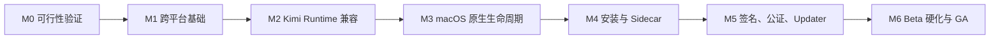

# Kimi App macOS V1 Implementation Plan

## 0. 实施原则

1. **先修上游 runtime 兼容，再做窗口美化。** 当前 legacy `server/lock` 问题同时影响 Windows 与 macOS，是首要技术风险。
2. **先完成可验证的 unsigned/ad-hoc build，再接签名公证。** 不在编译与运行时尚不稳定时调试 Apple release pipeline。
3. **一个 PR 只解决一个主要边界。** 不把脚本重构、runtime 重写、窗口迁移和 CI 全塞进单个超大 PR。
4. **Windows 作为每个里程碑的回归门。** 平台化不是 macOS 特例堆积。
5. **所有 release claim 必须有 artifact 证据。** “能构建”不等于“能交付”。
6. **使用 story point 表达相对工作量，不作为日历承诺。** 建议尺度：1、2、3、5、8、13。

---

## 1. 总体路线



### 里程碑总览

| Milestone | 目标 | Story Points | Gate |
|---|---|---:|---|
| M0 | 在实体 Apple Silicon Mac 上证明架构可行 | 13 | G0 |
| M1 | 建立不依赖 PowerShell 的共享构建与平台层 | 21 | G1 |
| M2 | 支持 Kimi Code 0.33 当前实例协议和可靠进程管理 | 34 | G2 |
| M3 | 完成原生窗口、菜单、Dock 与打开资源行为 | 21 | G3 |
| M4 | 完成 macOS 安装引导与 arm64 IM Bridge | 21 | G4 |
| M5 | 完成 Developer ID、notarization、DMG、Updater | 34 | G5 |
| M6 | 完成兼容矩阵、压力、回滚与正式发布 | 21 | G6 |

Story Points 只用于排序和拆分；不应被解释为固定工期。

---

## 2. 前置决策与阻塞项

进入 M1 前必须明确：

### DEC-01 Bundle ID

二选一：

- 保留 `com.kimi.shell`；接受长期命名与归属风险。
- 首发前迁移到推荐的 `io.github.endearqb.kimi-sidekick`，并为 Windows 设置提供一次迁移。

**推荐**：首个 mac release 前完成新 ID，避免 macOS 用户安装后再改变 identity。

### DEC-02 Apple Developer 资格

需要：

- Apple Developer Program membership。
- Developer ID Application certificate。
- App Store Connect API key 或 Apple ID notarization credentials。

M0 可以使用 ad-hoc 签名，M5 必须具备正式证书。

### DEC-03 最低系统

本计划固定 macOS 13+。如要改为 14+，必须更新 PRD、测试矩阵与 `minimumSystemVersion`，不能只改 config。

### DEC-04 首发架构

固定 Apple Silicon。Intel/universal 不进入 V1 critical path。

### DEC-05 Kimi Code 最低版本

固定 0.33.0，0.33.x 必测。兼容旧版本需要额外 fixture 和回归，不得拖入首发。

---

## 3. M0 — 可行性验证

### 目标

用最小改动在实体 Apple Silicon Mac 上验证所有高风险假设，形成可复查证据，避免完成大量重构后才发现签名、sidecar 或 WKWebView 的根本问题。

### M0-01 建立 macOS 开发环境 — 2 points

**工作**

- 安装 Xcode Command Line Tools 或 Xcode。
- 安装 Rust stable、Node 22、pnpm 10.34.4、Go 1.26。
- clone 仓库并使用 lockfile 安装依赖。
- 记录 `tauri info`、`rustc -Vv`、`node -v`、`pnpm -v`、`go version`。

**验收**

- `pnpm install --frozen-lockfile` 成功。
- `cargo check --locked` 的失败列表被完整记录，而不是只截首个错误。

### M0-02 原生 Tauri smoke — 2 points

**工作**

- 临时绕过 Windows-only `beforeBuildCommand`，不提交长期 hack。
- 生成 ad-hoc `.app`。
- 验证 WKWebView 可以加载前端、loopback iframe 和 WebSocket。

**验收**

- App 从 Finder 启动。
- CSP 下 Kimi Web 页面可加载。
- dark/light、输入、粘贴和基本 Pane 可用。

### M0-03 Kimi Code runtime spike — 3 points

**工作**

- 按官方方法安装 Kimi Code 0.33.x。
- 从终端运行 `kimi web --no-open --port 58627`。
- 检查 `~/.kimi-code/server/instances/*.json`、token、端口递增和 heartbeat。
- 从一个最小 Rust/Node harness spawn Kimi，记录 child PID 与 registry PID 关系。
- 发送 SIGTERM，确认干净退出。

**验收**

- child PID 可与 registry 记录关联，或明确记录差异及替代算法。
- 端口冲突后可识别实际端口。
- TERM/KILL 行为有证据。

### M0-04 Bridge arm64 spike — 3 points

**工作**

- 在 macOS arm64 执行 `go test ./...`。
- 尝试 `CGO_ENABLED=0` release build。
- 运行 SQLite、health、shutdown smoke。
- 临时作为 Tauri externalBin 打入 `.app`。

**验收**

- sidecar 可执行。
- App 能启动并停止 sidecar。
- 确定是否可以无 CGO。

### M0-05 Window/menu/signing spike — 3 points

**工作**

- 测试 `decorations=true + Transparent titlebar`。
- 测试 native traffic lights、全屏、拖动、关闭隐藏、Dock reopen。
- 创建最小 App Menu。
- 使用 ad-hoc 签名验证 bundle；若已有 Developer ID，可试一次 notarization。

**验收**

- 无需 private API。
- 现有 header 能适配原生 titlebar。
- 记录任何 notarization nested sidecar 错误。

### G0 出口条件

- 五项 spike 均有结果。
- 所有“未知”已转成明确实施任务或已否决方案。
- 输出建议文件：
  - `.ai/research/2026-08-05/macos-v1-feasibility-evidence.md`
  - 附构建日志、registry sample、codesign 信息和截图路径。
- 若 Kimi Web 无法在 WKWebView 安全加载、sidecar 无法签名或 runtime 无法关联，必须先修订 SPEC，不进入 M1。

---

## 4. M1 — 跨平台构建基础

### 目标

让仓库的公共 build/test 不再依赖 Windows shell，并建立明确的 platform capabilities/config 边界。

### M1-01 将公共脚本迁移到 Node `.mjs` — 8 points

迁移：

- `build_bridge_sidecar.ps1` 的公共部分。
- `clean_public_build_artifacts.ps1`。
- absolute path verifier。
- Kimi Web 同步脚本中可跨平台部分。

保留为 Windows-only 的脚本必须改名或加 `:windows`，不得进入 mac build path。

**验收**

- Windows 和 macOS 均可执行新脚本。
- 路径使用 `node:path`，不手拼分隔符。
- 错误码非零，日志明确。

### M1-02 修复 package scripts — 3 points

- `verify` 改为 `pnpm exec tsc --noEmit`。
- `beforeBuildCommand` 不隐式猜 target。
- 增加显式 `build:bridge-sidecar -- --target ...`。
- 删除公共命令中的 `.cmd`、`.exe` 假设。

**验收**

- `pnpm verify` 在 Windows 和 macOS 成功。

### M1-03 Tauri config 分层 — 3 points

- 新建 `tauri.windows.conf.json`。
- 新建 `tauri.macos.conf.json`。
- Windows updater `installMode` 迁出 base。
- macOS 配置设置 app/dmg 和 `minimumSystemVersion=13.0`。
- 增加 resolved config 检查。

**验收**

- Tauri CLI 能分别解析两平台 config。
- 不出现数组误合并。

### M1-04 PlatformCapabilities — 5 points

- Rust 类型与 command。
- 前端 store/hook。
- Windows/macOS contract tests。
- 安装中心、标题栏和设置页开始使用 capability。

**验收**

- macOS 不显示 Explorer/PowerShell UI。
- Windows 行为不变。

### M1-05 CI common verification — 2 points

- 增加 macOS non-release verify job。
- 使用 `macos-15` 并断言 arm64。
- 执行 frontend/Rust/Go tests，不签名发布。

### G1 出口条件

- 两个平台公共 verify 通过。
- Windows release dry run 未回归。
- macOS 可以生成 unsigned/ad-hoc `.app`。
- 公共 build path 无 PowerShell 硬依赖。

---

## 5. M2 — Kimi Runtime 兼容与进程管理

### 目标

建立 Kimi Code 当前协议适配层，解决 Finder PATH、多实例、端口、ownership 和进程残留。

### M2-01 Kimi home 单一解析 — 2 points

- 新建 `upstream_kimi/home.rs`。
- 替换 token、registry、config 路径的重复拼接。
- 添加 `KIMI_CODE_HOME` tests。

### M2-02 macOS binary locator — 8 points

- configured/official/Homebrew/user-local/PATH/login-shell candidates。
- executable mode 与 canonical path 验证。
- login shell timeout/noisy output parser。
- 诊断 source/warning。

**验收**

- 从 Finder 启动可定位官方脚本安装的 Kimi。
- shell init 卡住不会阻塞 App。
- 手动选择路径可用。

### M2-03 Version policy 与 capability probe — 5 points

- semver parser。
- 0.33.0 minimum。
- health/auth/OpenAPI/AsyncAPI required contract。
- untested newer version warning。

### M2-04 Instance registry adapter — 8 points

- JSON schema、大小限制、loopback/PID/heartbeat 验证。
- external instance selection。
- fixture tests。
- legacy lock 从主流程移除。

### M2-05 Owned runtime 关联 — 5 points

- pre-spawn snapshot。
- PID-first matching。
- new-entry matching。
- bounded port fallback。
- timeout/failure cleanup。

### M2-06 Unix process group supervisor — 5 points

- `setsid`/PGID。
- TERM -> wait -> KILL。
- guard 防止误杀当前 group。
- Windows taskkill 回归。

### M2-07 Runtime ownership/adoption — 5 points

- `OwnedChild`、`AdoptedOwned`、`ExternalReused`。
- atomic `runtime-owned.json`。
- PID reuse 与 stale locator tests。
- crash 后下一次启动处理。

### M2-08 Diagnostics 扩展 — 3 points

- version/path/source/home/server ID/PID/port/heartbeat/ownership。
- token 只显示 present，不显示值。

### G2 出口条件

- Kimi Code 0.33.x contract suite 通过。
- 默认端口占用时仍能启动。
- external runtime 复用后 App 退出不杀它。
- owned runtime 100 次启动/退出测试无残留。
- Windows 也使用新 registry adapter 或保留有测试的兼容路径。

---

## 6. M3 — macOS 原生窗口与生命周期

### 目标

让应用遵循 macOS 的 native window、App Menu、Dock、关闭和打开资源语义。

### M3-01 Window factory — 5 points

- 迁移 main/prefill/picker/Agent Room window profile。
- 平台 chrome 集中处理。
- 移除对 config window array 的运行时依赖。

### M3-02 macOS native titlebar — 3 points

- `decorations=true`。
- `TitleBarStyle::Transparent`。
- 隐藏 HTML Windows controls。
- Windows 控件与 drag behavior 保持。

**验收**

- traffic lights 可用。
- 全屏、最小化、拖动正常。
- header 无被遮挡或不可点击区域。

### M3-03 Close / Quit / Dock Reopen — 5 points

- 红点关闭隐藏。
- `RunEvent::Reopen` 恢复。
- `Cmd+Q` graceful shutdown。
- updater restart 走同一 shutdown coordinator。

### M3-04 Native App Menu — 5 points

- App/File/Edit/View/Window/Help。
- About、Settings、Services、Hide、Quit。
- Open Folder、Close Window、Diagnostics。
- 共享 command dispatch。

### M3-05 Opened / drag-drop / Open Folder — 3 points

- `RunEvent::Opened`。
- file URL -> OpenRequest。
- native folder dialog。
- drag/drop 入统一队列。

### G3 出口条件

- Dock reopen 不刷新 workspace。
- `Cmd+Q` 完整停止 owned runtime/bridge。
- `Cmd+W` 与红点行为符合定义。
- 菜单快捷键、中文输入、复制粘贴、全屏通过。
- Agent Room 等动态窗口使用相同 policy。

---

## 7. M4 — 安装引导与 IM Bridge

### 目标

清除 macOS 中的 Windows 安装器暴露，并完成可签名的 arm64 bridge sidecar。

### M4-01 InstallManager 平台拆分 — 8 points

- common state/channel 与 Windows backend 分离。
- `PowerShellDiagnostic` 仅 Windows 返回。
- mac task catalog 使用 action 类型，不使用 shell string。

### M4-02 macOS Kimi guided install UX — 5 points

- 缺失、过低、不兼容三个状态。
- 复制官方安装/升级命令。
- 打开 Terminal。
- 重新检测。
- 手动选择 binary。

**验收**

- 不显示 winget/Git for Windows/Execution Policy。
- 不静默执行 `curl | bash`。

### M4-03 externalBin sidecar build — 5 points

- Node target mapping build script。
- arm64 output + executable bit。
- `externalBin` config。
- bridge `--version`。
- SHA-256 build metadata。

### M4-04 Bridge spawn/stop integration — 3 points

- plugin-shell 或经验证的 resource resolver。
- 不向前端开放任意 shell。
- health/log/shutdown 回归。

### G4 出口条件

- clean mac 上 guided flow 可完成 Kimi 检测。
- bridge 在 arm64 App bundle 中可启动。
- bridge 所有功能 smoke 通过。
- unsigned/ad-hoc app 连续启停无 sidecar 残留。

---

## 8. M5 — 签名、公证、DMG 与 Updater

### 目标

建立可重复、可验证、不会覆盖多平台 manifest 的正式发布流水线。

### M5-01 Apple release credentials — 3 points

- 确认 Bundle ID。
- 创建 Developer ID Application certificate。
- 导出 `.p12`。
- 创建 App Store Connect API key。
- 配置 GitHub secrets。
- 文档化轮换与撤销流程，不记录 secret 值。

### M5-02 macOS release job — 8 points

- `macos-15` arm64。
- 临时 keychain 导入证书。
- 写入 `.p8` 临时文件。
- Tauri app,dmg build。
- updater artifact/signature。
- artifact naming。

### M5-03 Codesign/notary gates — 5 points

- `codesign --verify --deep --strict`。
- `spctl --assess`。
- `stapler validate`。
- `hdiutil verify`。
- 检查 nested bridge identity。
- notarization log 作为失败 artifact。

### M5-04 Draft release orchestration — 5 points

- validate tag/version。
- 创建 draft release。
- Windows/mac jobs 上传 assets。
- release 只在全部 gate 通过后 publish。

### M5-05 Multi-platform latest.json aggregator — 8 points

- 平台 jobs 禁止单独上传 latest.json。
- Node schema generator。
- `windows-x86_64` 与 `darwin-aarch64`。
- signature 内容校验。
- release URL 校验。
- manifest snapshot test。

### M5-06 Updater E2E — 5 points

- 安装 signed beta N。
- 发布 signed beta N+1。
- 从 App 内完成更新。
- 验证设置、workspace、bridge 与签名。
- 模拟下载失败、签名失败、重启失败。

### G5 出口条件

- 普通浏览器下载的 DMG 无需绕过 Gatekeeper。
- app/dmg 均有 valid stapled ticket。
- bridge 是 signed nested executable。
- updater 真机升级成功。
- Windows/macOS `latest.json` 同时有效。
- release 失败时 draft 不公开。

---

## 9. M6 — Beta 硬化与 GA

### 目标

完成系统版本、异常恢复、性能、文档、回滚和最终发布证据。

### M6-01 macOS compatibility matrix — 5 points

至少验证：

- macOS 13 arm64。
- macOS 14 arm64。
- macOS 15 arm64。
- macOS 26 arm64。
- 用户 M5 MacBook Pro。

允许部分由受控测试设备完成，但 M5 必须实机。

### M6-02 Reliability stress — 5 points

- 100 次启动/退出。
- 端口冲突。
- Kimi crash。
- App crash 后 adoption。
- sleep/wake。
- 网络断开/恢复。
- bridge crash/restart。

### M6-03 UX/A11y regression — 3 points

- 菜单、快捷键、中文输入法。
- Retina、dark/light、全屏。
- VoiceOver 基本导航或至少语义检查。
- traffic lights 不被遮挡。

### M6-04 Docs — 3 points

更新：

- root README 平台支持表。
- `apps/kimi-shell/README.md` mac 开发方式。
- mac 安装与卸载。
- Kimi Code 安装引导。
- 签名/公证维护文档。
- troubleshooting。
- release checklist。

### M6-05 Beta feedback closure — 3 points

- 所有 P0 bug 关闭。
- P1 bug 有明确 defer issue。
- crash/diagnostic evidence 可复查。

### M6-06 GA release — 2 points

- 版本同步。
- changelog/release notes。
- signed/notarized artifacts。
- final manifest。
- post-release smoke。

### G6 出口条件

满足 PRD 和 SPEC 的所有 GA gates；不存在以下问题：

- Gatekeeper 绕过要求。
- owned runtime/bridge 残留。
- external runtime 被误杀。
- mac updater 缺失/覆盖 Windows。
- 标题栏或 Dock 无法恢复。
- 安装页暴露 Windows-only 流程。

---

## 10. 推荐 PR 序列

### PR-01 `build: make shared desktop scripts cross-platform`

**范围**

- package scripts。
- Node `.mjs` utilities。
- 不包含 runtime 或 UI 重构。

**必须通过**

- Windows verify。
- macOS verify。

### PR-02 `refactor: add platform capabilities and config split`

- `platform/` skeleton。
- `PlatformCapabilities`。
- `tauri.windows.conf.json` / `tauri.macos.conf.json`。
- 前端隐藏 unsupported sections。

### PR-03 `refactor: add Kimi home and binary locator`

- Kimi home 单一解析。
- Finder-safe locator。
- version probe。

### PR-04 `fix: migrate Kimi runtime discovery to instance registry`

- registry adapter。
- external reuse。
- compatibility fixtures。
- legacy lock 降级为 Windows-only fallback。

### PR-05 `fix: supervise owned Kimi processes by process group`

- PGID。
- ownership locator/adoption。
- stop tests。

### PR-06 `feat: add native macOS window lifecycle and app menu`

- window factory。
- native titlebar。
- App Menu。
- Dock reopen/Opened/Close/Quit。

### PR-07 `refactor: split install manager by platform`

- Windows backend 保持。
- mac guided flow contract。

### PR-08 `feat: bundle macOS arm64 IM bridge sidecar`

- externalBin。
- build target mapping。
- spawn/stop/version。

### PR-09 `ci: add unsigned macOS arm64 build and smoke`

- verify/build artifact。
- 无正式 secret。

### PR-10 `ci: sign and notarize macOS app and DMG`

- Developer ID。
- notarization。
- codesign/stapler gates。

### PR-11 `ci: aggregate cross-platform updater manifest`

- draft release orchestration。
- latest.json generator。
- updater E2E tooling。

### PR-12 `release: harden and document macOS V1`

- test matrix fixes。
- docs、release notes、checklist。

### PR 约束

- PR-04 和 PR-05 不能合并成一次无法审查的 runtime rewrite。
- PR-06 不应顺便重做全部 UI。
- PR-10 不应包含业务代码修复；签名失败修复若需要代码改动，单独 PR。
- 每个 PR 在 `.ai/changes/YYYY-MM-DD.md` 写明行为变化与验证证据。

---

## 11. 首批应创建的 Issue

### Issue 1 — `[macOS][M0] Capture Apple Silicon feasibility evidence`

- 实机环境、Tauri smoke、Kimi registry、signals、bridge、titlebar。
- 输出 evidence 文档。

### Issue 2 — `[Build] Replace PowerShell from shared desktop build path`

- `.mjs` scripts。
- Windows/mac verify。

### Issue 3 — `[Platform] Introduce PlatformCapabilities contract`

- Rust/TS types。
- unsupported UI gating。

### Issue 4 — `[Kimi Runtime] Resolve Kimi binary from Finder-launched app`

- official path/common paths/login shell/manual chooser。

### Issue 5 — `[Kimi Runtime] Support 0.33 instance registry`

- schema、validation、selection、fixtures。

### Issue 6 — `[Runtime] Add owned/external process ownership model`

- PGID、adoption、no accidental kill。

### Issue 7 — `[macOS UX] Use native titlebar and traffic lights`

- ShellTitlebar platform split。

### Issue 8 — `[macOS Lifecycle] App Menu, Dock reopen, Close and Quit`

- RunEvent、menu、graceful shutdown。

### Issue 9 — `[Bridge] Build and bundle aarch64 externalBin`

- Go build、version、signing readiness。

### Issue 10 — `[Release] Add signed and notarized macOS DMG pipeline`

- keychain、notary、gates。

### Issue 11 — `[Updater] Generate deterministic multi-platform latest.json`

- Windows + darwin manifest。

### Issue 12 — `[QA] macOS V1 compatibility and stress matrix`

- clean install、100 cycles、update、sleep/wake。

每个 Issue 应链接 PRD/SPEC 对应需求 ID，而不是重复粘贴全部文档。

---

## 12. 依赖关系与并行策略

### Critical path

```text
M0
 -> cross-platform scripts/config
 -> Kimi locator
 -> instance registry
 -> process ownership
 -> native lifecycle
 -> bridge externalBin
 -> signed/notarized release
 -> updater E2E
 -> beta hardening
```

### 可并行工作

- M2 registry adapter 与 M3 前端 native titlebar 可在接口稳定后部分并行。
- Release secret 准备可与 M2/M3 并行，但正式 M5 构建必须等 bridge 与 lifecycle 稳定。
- 文档骨架可早建，但最终命令与截图必须在 M5 后更新。
- Windows installer backend 拆分与 mac guided UI 可并行。

### 不应并行的组合

- 在 process ownership 未完成前做 updater E2E：更新重启会残留进程。
- 在 sidecar externalBin 未完成前做 final notarization：会产生错误的 release confidence。
- 在 Bundle ID 未定前发布任何可自动更新的 mac beta。

---

## 13. Definition of Ready

一个开发任务进入实现前必须具备：

- 对应 PRD requirement ID。
- 对应 SPEC 模块或接口。
- 明确的平台范围。
- 可验证的 acceptance criteria。
- 至少一个失败场景。
- 是否影响 Windows 的说明。
- 是否需要 Apple secret/实体 Mac 的说明。

没有这些内容的“让 Mac 能跑起来”任务不得直接进入主分支。

---

## 14. Definition of Done

单个 PR 完成需满足：

1. 实现与文档范围一致。
2. 新增或更新 tests。
3. `pnpm verify` 通过。
4. `cargo test --locked` 通过。
5. `go test ./...`（相关 PR）通过。
6. macOS smoke 或可接受的 fixture evidence。
7. Windows 回归说明。
8. 无新增 token/path 泄露。
9. `.ai/changes` 有记录。
10. reviewer 能独立复现关键验收。

---

## 15. 测试执行表

| 测试 | PR 阶段 | Beta | GA |
|---|---:|---:|---:|
| Frontend unit | 每 PR | 必须 | 必须 |
| Rust unit | 每 PR | 必须 | 必须 |
| Go unit | bridge PR 起 | 必须 | 必须 |
| macOS unsigned build | M1 起 | 必须 | 必须 |
| Windows release dry run | 每个 milestone | 必须 | 必须 |
| Kimi 0.33 contract | M2 起 | 必须 | 必须 |
| Clean account install | M5 | 必须 | 必须 |
| Gatekeeper/codesign/notary | M5 | 必须 | 必须 |
| Updater E2E | M5 | 必须 | 必须 |
| 100-cycle process cleanup | M2/M6 | 必须 | 必须 |
| OS version matrix | M6 | 抽样 | 全部 |
| M5 MacBook Pro primary device | M6 | 必须 | 必须 |

---

## 16. 风险燃尽计划

| 风险 | 首次处理 | 关闭证据 |
|---|---|---|
| WKWebView 无法安全加载 Kimi Web | M0-02 | 实机 iframe/WS smoke |
| registry PID 无法关联 child | M0-03 | registry sample + algorithm test |
| Finder PATH 找不到 Kimi | M2-02 | Finder launch E2E |
| process orphan | M2-06/07 | 100-cycle no-residue report |
| native titlebar 布局冲突 | M0-05/M3-02 | screenshot + interaction checklist |
| sidecar arm64/CGO | M0-04/M4-03 | Go tests + bundled run |
| sidecar notarization | M5-03 | accepted notary log + codesign evidence |
| latest.json 覆盖 | M5-05 | deterministic manifest snapshot |
| Windows 回归 | 每 milestone | Windows CI artifacts |
| Bundle ID 迁移 | DEC-01/M1 | migration test or explicit keep decision |

---

## 17. Release checklist

### 17.1 Release 前

- [ ] version 在 package、Cargo、Tauri 一致。
- [ ] tag 与 version 一致。
- [ ] Bundle ID 已锁定。
- [ ] Kimi Code tested matrix 已更新。
- [ ] macOS minimum version 明确。
- [ ] Windows/macOS verify 通过。
- [ ] bridge source commit 与 hash 已记录。
- [ ] updater signing private key 可用且未输出日志。
- [ ] Developer ID certificate 有效。
- [ ] notarization API key 有效。

### 17.2 Artifact gate

- [ ] `.app` 存在。
- [ ] `.dmg` 存在。
- [ ] `.app.tar.gz` 与 `.sig` 存在。
- [ ] bridge 位于 bundle 且 executable。
- [ ] 主 binary 与 bridge codesign identity 一致。
- [ ] Hardened Runtime flag 存在。
- [ ] 无不必要 entitlement。
- [ ] `codesign --verify --deep --strict` 通过。
- [ ] `spctl --assess` 通过。
- [ ] app/dmg stapler validate 通过。
- [ ] DMG integrity 通过。

### 17.3 Updater gate

- [ ] `latest.json` schema 通过。
- [ ] `windows-x86_64` URL/signature 有效。
- [ ] `darwin-aarch64` URL/signature 有效。
- [ ] 旧版到新版真实更新成功。
- [ ] 更新失败不破坏旧版。

### 17.4 Product smoke

- [ ] Clean user install。
- [ ] Kimi missing onboarding。
- [ ] Kimi installed Finder launch。
- [ ] login/session/workspace。
- [ ] close/Dock reopen/Cmd+Q。
- [ ] Agent Room/window picker。
- [ ] bridge。
- [ ] dark/light/fullscreen/IME。
- [ ] diagnostics export 脱敏。

### 17.5 发布后

- [ ] 从公开 release URL 重新下载并安装。
- [ ] 校验公开 `latest.json`。
- [ ] 在 M5 设备完成一次 cold launch。
- [ ] 检查 release assets 命名和说明。
- [ ] 检查 Windows updater 未受影响。

---

## 18. 回滚策略

### 18.1 发布前失败

- release 保持 draft。
- 不上传/不替换 public `latest.json`。
- 保留失败 notarization log 供修复。

### 18.2 发布后发现 P0 问题

- 立即暂停 latest release 的 updater exposure；若已有客户端检测到更新，不能依赖静态 updater 自动降级。
- 保留前一版 DMG 供手动回退。
- 发布更高 patch version 的 hotfix，而不是尝试用低版本覆盖。
- 数据 schema 在 V1 应保持向后兼容，确保用户可手动回前一版。
- 若涉及证书或恶意 artifact，按 Apple Developer ID/notarization 撤销流程处理。

### 18.3 Runtime adapter 回滚

- 保留 feature flag 允许临时关闭 external runtime reuse，改为 `AlwaysStartOwned`。
- 不回退到 legacy `server/lock` 作为 macOS 主路径。

---

## 19. 版本建议

当前 App 为 0.1.22。macOS 首个公开 beta 建议进入新的 minor line：

```text
0.2.0-beta.1
0.2.0-beta.2
...
0.2.0
```

原因：

- 新平台支持。
- runtime discovery 架构变化。
- Bundle/Updater 平台矩阵变化。
- 安装中心平台化。

不要把完整 macOS 首发压在 `0.1.23` patch 中，避免低估兼容面。

---

## 20. 建议的仓库文档落位

在正式实施时，将这些文档或精简后的仓库版本放入：

```text
.ai/research/2026-08-05/kimi-app-macos-v1-research.md
.ai/prd/2026-08-05/kimi-app-macos-v1-prd.md
.ai/specs/2026-08-05/kimi-app-macos-v1-spec.md
.ai/plans/2026-08-05/kimi-app-macos-v1-plan.md
```

每个实施 PR 在：

```text
.ai/changes/YYYY-MM-DD.md
```

记录：

- requirement / spec ID。
- 修改文件。
- 平台影响。
- 验证命令。
- 实机证据。
- 未解决风险。

---

## 21. 首个执行批次

第一批只应包含以下三项：

1. M0 feasibility evidence。
2. PR-01 跨平台脚本。
3. PR-02 platform capabilities/config split。

这三项完成后再进入 Kimi runtime adapter。不要先从标题栏 CSS 或 DMG 美化开始，因为它们不会消除真正阻塞 macOS 可靠性的 PATH、instance registry、process ownership 与签名问题。

---

## 22. 最终完成标准

Kimi App macOS V1 发布完成必须证明：

- 用户从 DMG 安装后无需绕过 Gatekeeper。
- Finder 启动能找到 Kimi Code。
- Kimi Code 0.33.x 当前实例协议工作。
- 端口冲突、多实例和 token 鉴权工作。
- owned 进程退出无残留，external 进程不被误杀。
- native titlebar、App Menu、Dock reopen 和 Cmd+Q 工作。
- IM Bridge 是 arm64、可执行、已签名、公证可接受。
- updater 同时服务 Windows 和 macOS。
- 用户 M5 MacBook Pro 上完成完整 cold install、workspace、bridge、update 与 quit 验收。
- Windows 版本仍可正常构建和发布。
