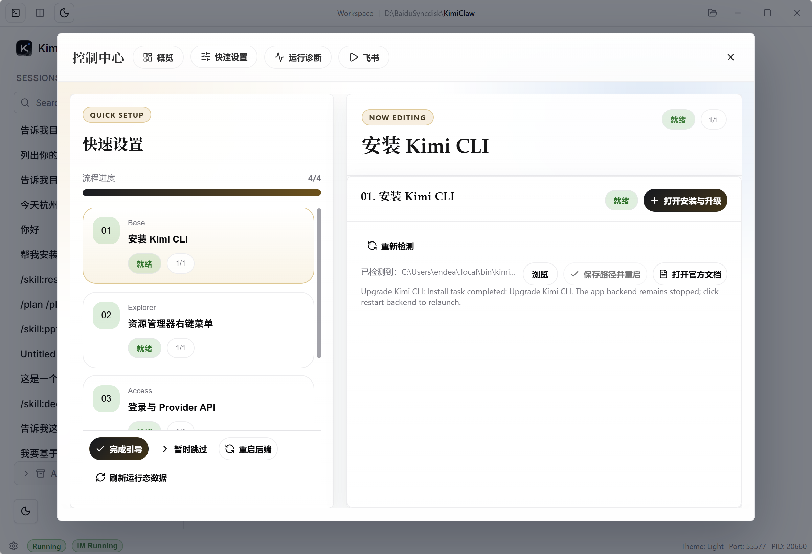
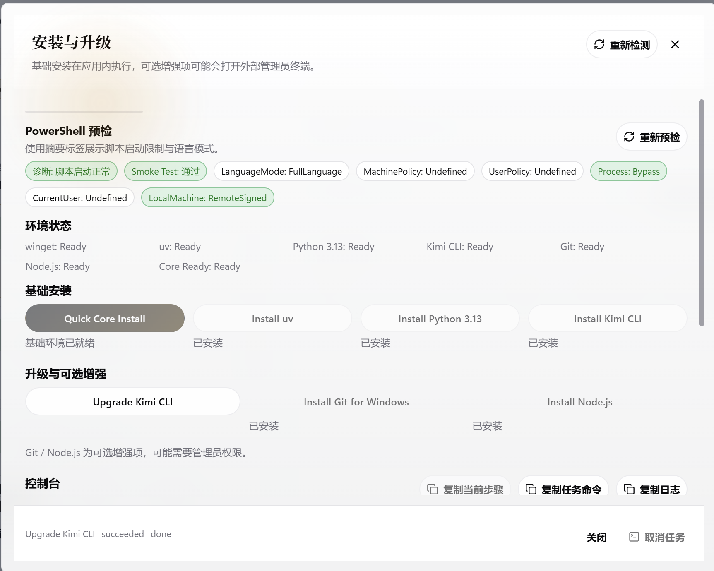
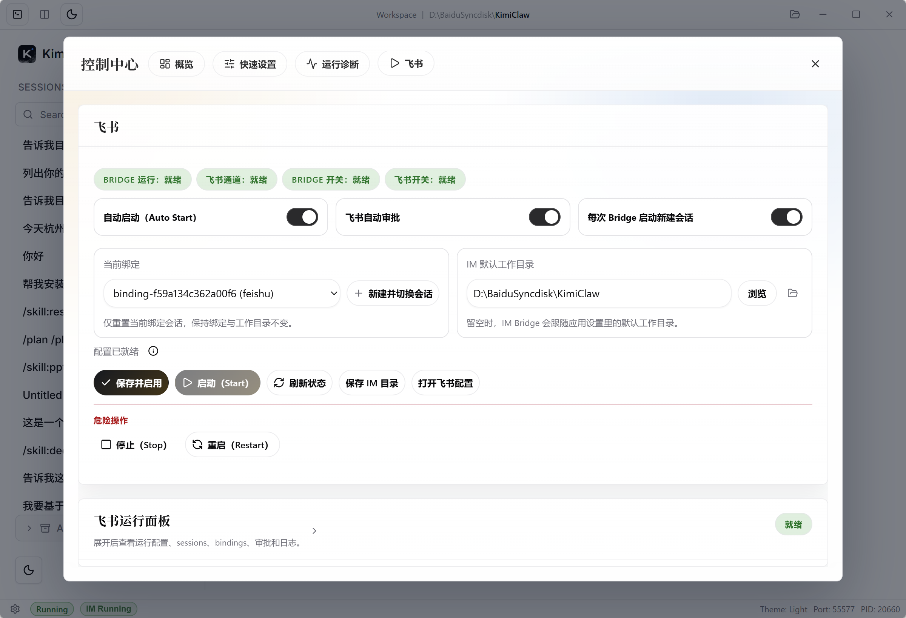

# Kimi App

[中文说明](README_zh.md)

Kimi App is an MIT-licensed repository for the Windows desktop shell around Kimi Web.
The main deliverable is `apps/kimi-shell`, a `Tauri v2 + React` desktop application that
combines startup handoff, install and upgrade flows, a multi-tab control center, IM Bridge
operations, diagnostics, and Windows packaging into one workspace-oriented app.

## Repository Layout

- `apps/kimi-shell`: desktop app source, packaging config, screenshots, and release notes
- `tasks`: local task tracking, investigation notes, and engineering review materials

## Key Highlights

- Persistent desktop shell for `Kimi Code Web` and `Kimi Chat`, with split panes and view switching
- Windows Explorer context-menu launch for folders, single files, and multi-file selections, with folder handoff and file-to-workspace import
- Guided Quick Setup flow for first-run onboarding and everyday recovery tasks
- Built-in install and upgrade center with PowerShell preflight checks and dependency status
- Unified Control Center for overview, quick setup, runtime diagnostics, and IM Bridge operations
- IM Bridge workspace with Feishu-focused controls for channel status, work directory, approvals, and session switching
- Windows-native tray behavior, close-to-tray flow, diagnostics access, and NSIS/MSI installer outputs

## What The App Does

- Launches and monitors the local Kimi Web backend
- Shows a prefill/startup surface before handing off to the main workspace
- Keeps `Kimi Code Web` and `Kimi Chat` mounted inside one shell, reducing refresh-heavy workflow switching
- Handles workspace bootstrap from normal launch, plus Windows Explorer open requests for folders, single files, and multi-file selections
- Hands off folders directly as the active work directory, and copies selected files into a fresh workspace before launching the shell
- Provides onboarding, install and upgrade actions, diagnostics, logs, and runtime operations from one control surface
- Exposes IM Bridge controls for Feishu channel management, session rotation, approvals, and working-directory mapping
- Produces Windows installer artifacts in NSIS and MSI formats

## App Preview

Main workspace with the persistent Code/Chat shell and desktop-level navigation:


Quick Setup guides first-run tasks and common environment fixes from a focused onboarding flow:



Install and Upgrade keeps PowerShell preflight, dependency readiness, and upgrade entry points in one place:



Control Center brings overview, quick setup, diagnostics, and operational entry points into one tabbed workspace:


IM Bridge provides channel controls, current binding/session switching, and working-directory management for bridge-driven workflows:



## Local Development

Requirements:

- Node.js 18+
- pnpm 8+
- Rust stable
- WebView2 Runtime on Windows

Common commands:

```bash
pnpm -C apps/kimi-shell install
pnpm -C apps/kimi-shell tauri dev
pnpm -C apps/kimi-shell build
pnpm -C apps/kimi-shell tauri build
```

## Release Outputs

Production installer artifacts are generated under:

- `apps/kimi-shell/src-tauri/target/release/bundle/nsis`
- `apps/kimi-shell/src-tauri/target/release/bundle/msi`

Release notes are stored under:

- `apps/kimi-shell/docs`

## License

This repository is released under the MIT License. See `LICENSE`.
