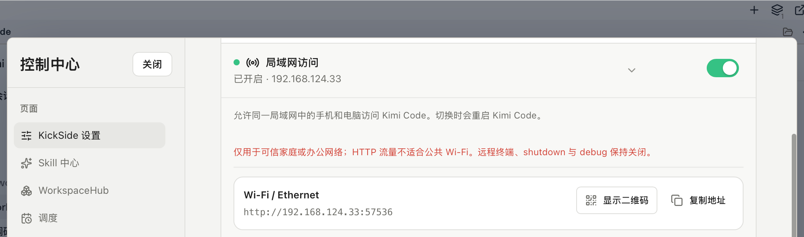

# KickSide

[English](README_EN.md)

[](https://github.com/endearqb/kickside/releases)
[](https://github.com/endearqb/kickside/releases)
[](https://github.com/endearqb/kickside/releases)
[](LICENSE)

**把 Kimi Code 与 DeepSeek Harness 放进同一个可分栏、可持久化的桌面工作台。**

KickSide 是面向 Windows x64 与 Apple Silicon macOS 13+ 的开源桌面应用。它以 `Tauri v2 + React` 构建，在一个窗口中编排多个 AI 编程会话、工作区和运行时，并提供安装升级、诊断、Skill、IM 通道与桌面生命周期管理。

[下载最新版本](https://github.com/endearqb/kickside/releases) · [观看高清 30 秒演示](apps/kimi-shell/public/readme/kickside-demo.mp4) · [参与开发](#本地开发)


## 为什么使用 KickSide

- **一个窗口，多套智能体**：Kimi Code、DeepSeek Harness 和外部页面可以并排工作，无需反复切换应用。
- **Workspace Grid**：支持 1–6 个可见窗格、最多 12 个总窗格、拖拽交换、逐缝缩放、最大化和布局持久化。
- **会话始终在场**：Pane Shelf 收纳暂时不可见的会话；重新排列窗格不会让长任务丢失上下文。
- **桌面级运行管理**：统一管理 Kimi Code、DSH、应用更新、默认工作目录、日志与诊断。
- **跨平台原生体验**：macOS 使用原生 traffic lights、菜单与 Dock 生命周期；Windows 支持托盘、WebView2 和 Explorer 打开入口。
- **安全边界明确**：运行时默认只接受受控 loopback；用户可临时把 KickSide-owned Kimi 开放到可信局域网，令牌不进入持久化布局或诊断输出。

## 两种智能体，一个工作台

### DeepSeek Harness

DeepSeek Harness 可作为独立窗格或主工作区运行。KickSide 提供工作区列表、会话入口和可选的受管 DSH 运行时；安装过程会实时显示经过脱敏的阶段与日志。


### Kimi Code

Kimi Code 保留原生会话侧栏、消息交互和附件能力。KickSide 为长对话增加左侧常驻 TOC 短条：鼠标悬停或键盘聚焦时，以半透明浮层展开目录，并可快速跳转到对应消息。


## 统一控制中心

控制中心集中呈现应用与运行时状态，提供更新检查、Kimi Code 健康状态、临时局域网访问、DeepSeek Harness 开关、默认工作目录、外部 IM 通道、Skill、WorkspaceHub、调度和诊断入口。


## 可信局域网访问

需要临时离开电脑时，可以在控制中心开启“局域网访问”，让同一可信家庭或办公网络中的手机、平板和其他电脑继续使用当前由 KickSide 启动的 Kimi Code。界面会显示局域网地址，并可按需生成二维码；关闭功能或退出 KickSide 后，本次访问地址与二维码会从界面内存中清除。



- 默认关闭，每次启动 KickSide 都需要重新开启；外部复用的 Kimi 实例不会被切换或重启。
- 仅适合可信家庭或办公网络。连接使用 HTTP，不适合公共 Wi-Fi，也不提供公网、跨 VLAN 或 NAT 穿透。
- Kimi Code 的 Bearer 认证始终开启；远程终端、远程关机和 debug 接口保持关闭。
- 开关会重启当前由 KickSide 管理的 Kimi Code，请先确认没有正在运行的任务。

## 核心能力

| 领域 | 能力 |
|---|---|
| 工作区 | 多窗格布局、Pane Shelf、拖拽交换、缩放、主题和会话恢复 |
| Kimi Code | 本地 Web runtime、会话路由、消息 TOC、附件拖放、安装与升级引导 |
| 局域网访问 | 将 KickSide 管理的 Kimi Code 临时开放给同一可信网络中的手机与电脑，支持地址复制和按需二维码 |
| DeepSeek Harness | 私有前缀安装、受支持 Node 工具链校验、实时安装日志、多个共享 runtime 的窗格 |
| 控制中心 | 应用更新、Runtime 状态、Skill、WorkspaceHub、调度、诊断与日志 |
| IM Bridge | 飞书等通道管理、会话切换、审批与工作目录映射 |
| 桌面集成 | Windows Explorer/托盘；macOS 原生窗口菜单、关闭隐藏、Dock reopen 与 Cmd+Q 收口 |

## 安装与运行

从 [GitHub Releases](https://github.com/endearqb/kickside/releases) 或中国大陆访问更稳定的 [Gitee Releases](https://gitee.com/endearqb/kickside/releases) 下载对应平台的安装包：

- Windows 10/11 x64，需要 WebView2 Runtime。
- Apple Silicon macOS 13+。签名与公证状态以对应 Release 说明为准。
- Kimi Code 可由 KickSide 检测并引导安装或升级。
- 可选的 DeepSeek Harness 需要 Node.js 22.19+ 的 22.x，或 Node.js 24+；不支持 Node 23。

> KickSide 当前处于快速迭代阶段。公开版本的已知限制、签名状态和升级说明以 Release 页面为准。

## 本地开发

环境要求：Node.js 22.19+（22.x）或 24+、pnpm 10.34.4、Rust stable、Go，以及目标平台的 WebView 工具链。

```bash
pnpm -C apps/kimi-shell install
pnpm -C apps/kimi-shell tauri dev
pnpm -C apps/kimi-shell test
pnpm -C apps/kimi-shell build
pnpm -C apps/kimi-shell tauri:build:macos:local
```

主要目录：

- `apps/kimi-shell`：Tauri/React 桌面应用、运行时管理与平台打包。
- `apps/kimi-im-bridge`：外部 IM Bridge sidecar。
- `.ai/architecture`：当前架构事实、边界和验证入口。
- `tasks`：工程任务与复盘记录。

完整验证命令见 [Verification Gates](.ai/architecture/verification-gates.md)。

## 许可证

KickSide 以 [MIT License](LICENSE) 发布。Kimi Code、DeepSeek Harness 及其他第三方组件的权利归各自所有者，详见 [Third-party notices](apps/kimi-shell/docs/third-party-notices.md)。
