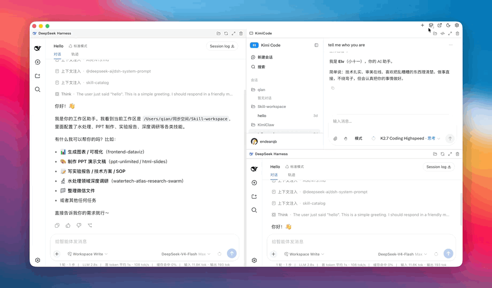
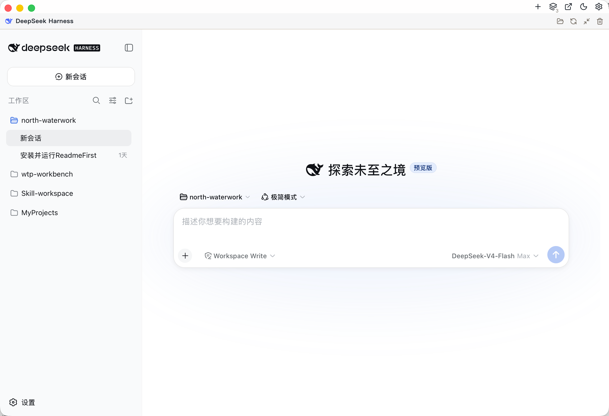
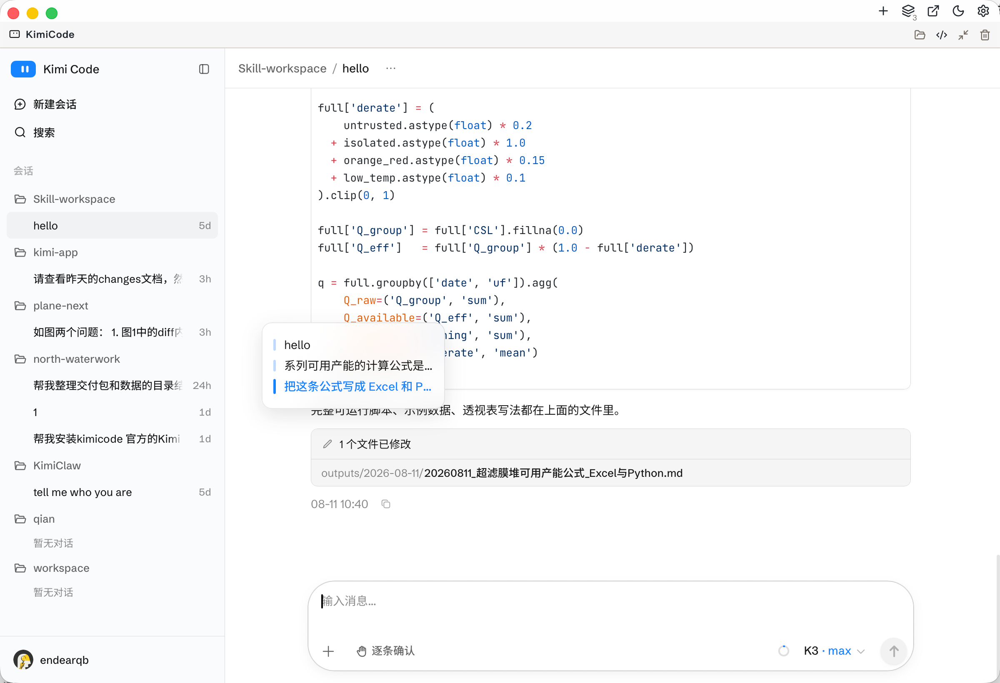
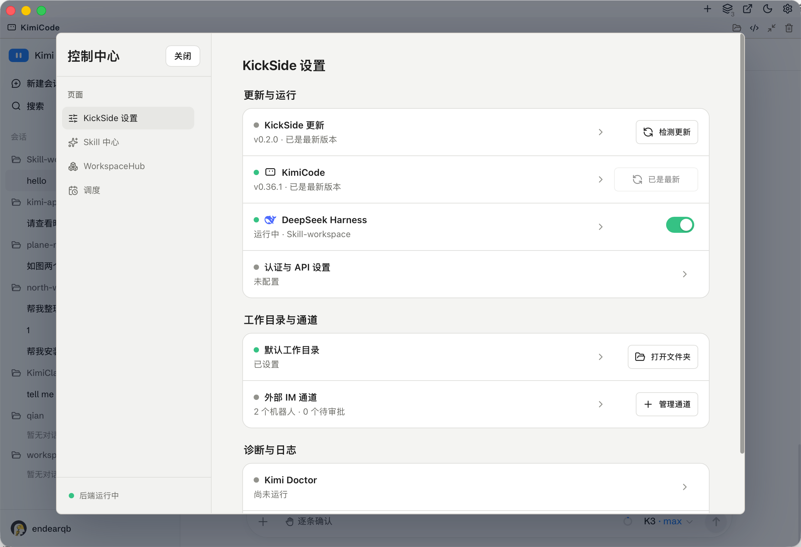

# KickSide

[中文](README.md)

[](https://github.com/endearqb/kickside/releases)
[](https://github.com/endearqb/kickside/releases)
[](https://github.com/endearqb/kickside/releases)
[](LICENSE)

**Run Kimi Code and DeepSeek Harness together in one persistent, resizable desktop workspace.**

KickSide is an open-source desktop application for Windows x64 and Apple Silicon macOS 13+. Built with `Tauri v2 + React`, it organizes multiple AI coding sessions, workspaces, and runtimes in one window, with integrated upgrades, diagnostics, skills, IM channels, and desktop lifecycle management.

[Download the latest release](https://github.com/endearqb/kickside/releases) · [Watch the 30-second HD demo](apps/kimi-shell/public/readme/kickside-demo.mp4) · [Develop locally](#local-development)



## Why KickSide

- **Multiple agents, one window:** run Kimi Code, DeepSeek Harness, and external pages side by side.
- **Workspace Grid:** 1–6 visible panes, up to 12 total panes, drag-to-swap, per-track resizing, maximization, and persistent layouts.
- **Sessions stay alive:** Pane Shelf keeps temporarily hidden sessions mounted so long-running work keeps its context.
- **Desktop runtime operations:** manage Kimi Code, DSH, app updates, the default work directory, logs, and diagnostics in one place.
- **Platform-native behavior:** native macOS traffic lights, menus, and Dock lifecycle; Windows tray behavior, WebView2, and Explorer entry points.
- **Explicit security boundaries:** runtimes are restricted to controlled loopback origins, while tokens stay out of README files, persisted layouts, and diagnostics.

## Two Agents, One Workspace

### DeepSeek Harness

DeepSeek Harness can run as a dedicated pane or the primary workspace. KickSide provides workspace and session navigation plus an optional managed DSH runtime whose installation stages and redacted logs stream into the UI.



### Kimi Code

Kimi Code keeps its native sessions sidebar, conversation behavior, and attachments. KickSide adds a persistent message-outline rail for long conversations; hover or keyboard focus expands a translucent menu for fast navigation between user turns.



## Unified Control Center

The Control Center brings together app and runtime status, update checks, Kimi Code health, the DeepSeek Harness switch, the default work directory, external IM channels, skills, WorkspaceHub, scheduling, diagnostics, and logs.



## Core Capabilities

| Area | Capabilities |
|---|---|
| Workspace | Multi-pane layouts, Pane Shelf, drag-to-swap, resizing, themes, and session restoration |
| Kimi Code | Local Web runtime, session routing, message outline, attachment drop, install and upgrade guidance |
| DeepSeek Harness | Private-prefix install, supported Node toolchain validation, live install logs, and multiple panes sharing one runtime |
| Control Center | App updates, runtime status, Skills, WorkspaceHub, scheduling, diagnostics, and logs |
| IM Bridge | Channel management, session switching, approvals, and working-directory mapping |
| Desktop | Windows Explorer/tray integration; native macOS menus, close-to-hide, Dock reopen, and graceful Cmd+Q |

## Install and Run

Download the installer for your platform from [GitHub Releases](https://github.com/endearqb/kickside/releases):

- Windows 10/11 x64 with the WebView2 Runtime.
- Apple Silicon macOS 13+. Check each Release for its signing and notarization status.
- KickSide can detect Kimi Code and guide its installation or upgrade.
- Optional DeepSeek Harness support requires Node.js 22.19+ on the 22.x line, or Node.js 24+; Node 23 is unsupported.

> KickSide is evolving quickly. See the relevant Release for known limitations, signing status, and upgrade notes.

## Local Development

Requirements: Node.js 22.19+ on the 22.x line or 24+, pnpm 10.34.4, Rust stable, Go, and the target platform's WebView toolchain.

```bash
pnpm -C apps/kimi-shell install
pnpm -C apps/kimi-shell tauri dev
pnpm -C apps/kimi-shell test
pnpm -C apps/kimi-shell build
pnpm -C apps/kimi-shell tauri:build:macos:local
```

Main directories:

- `apps/kimi-shell`: Tauri/React desktop app, runtime management, and platform packaging.
- `apps/kimi-im-bridge`: external IM Bridge sidecar.
- `.ai/architecture`: current architecture facts, boundaries, and verification entry points.
- `tasks`: engineering tasks and review records.

See [Verification Gates](.ai/architecture/verification-gates.md) for the complete validation commands.

## License

KickSide is available under the [MIT License](LICENSE). Kimi Code, DeepSeek Harness, and other third-party components remain the property of their respective owners; see the [third-party notices](apps/kimi-shell/docs/third-party-notices.md).
