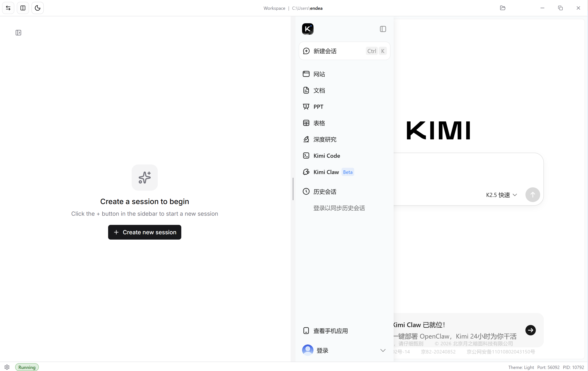
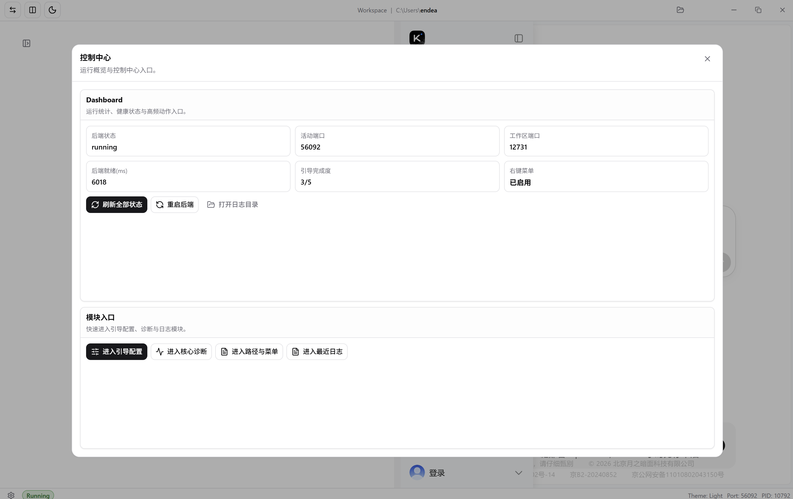

# Kimi 小助手（中文说明）

Kimi 小助手是基于 `Tauri v2 + React` 的 Windows 桌面壳程序，用于托管 `Kimi Code Web`，把启动监控、workspace 壳层、控制中心、日志诊断和安装包输出整合进同一个桌面应用。

## 项目简介

- 应用名称：`kimi小助手` / `kimi sidekick`
- 当前版本：以 `package.json`、`src-tauri/Cargo.toml` 与 `src-tauri/tauri.conf.json` 为准
- 目标平台：Windows（当前发布产物为 MSI / NSIS）
- 核心目标：把 `kimi server run` 的启动、恢复、安装引导、右键入口与桌面体验统一在一个桌面应用中

## 核心能力

- 启动前置页（prefill）：显示启动状态、随机 Tips、失败恢复入口
- Workspace Grid 壳层：常驻 `Kimi Code Web` 与 `Kimi Chat`，支持 1/2/3/4/5/6 个可见窗格、最多 12 个总窗格与 Pane Shelf 收纳、窗格切换、最大化、拖拽调宽/调高、命名布局保存/恢复、外部页降级、嵌入式子 Webview 承载、native Webview per-pane 存储目录与独立应用 WebviewWindow 打开
- 后端守护与健康探测：拉起 `kimi server run --foreground --port <port>`，读取 `KIMI_CODE_HOME/server.token`，并用 `#token=` 接入 workspace
- 会话与 workspace 映射：Shell 后端通过 `/api/v1` Bearer 客户端创建/读取 workspace 与 session，Workspace Grid 只使用真实 server session id
- 控制中心：小助手设置以 6 个互斥展开项承载小助手更新、安装/升级、右键菜单、API 配置、默认工作目录和外部 IM 通道；API 配置与微信/飞书扫码均在设置项内完成，侧边栏底部提供纯后端重启
- Skill Center 与 WorkspaceHub：主视图使用可搜索、可筛选的卡片目录；Skill、Harness 模板和已注册工作区详情使用只读文件树与文件预览，工作区文件读取仅允许已注册 workspace id 并受路径、数量和大小限制
- Chat 集成收口：跨站链接跳系统浏览器，Windows 安装版下载使用原生“另存为”
- 右键菜单集成：支持目录空白处、文件、文件夹入口，默认使用“Kimi 小助手”中文名称并可编辑；打开请求创建独立 session，不重启运行中的后端
- 诊断与日志：后端 stdout/stderr 在落盘前脱敏，诊断读取再次脱敏，并提供 Kimi Code Doctor、启动失败原因与恢复操作
- API 配置：异步保存 `config.toml`，通过可选 opaque revision 拒绝覆盖 Kimi Code 或编辑器产生的外部更新
- 安全退出流程：退出读秒窗 + 状态反馈
- 本体更新：安装版启动后后台检测一次，设置页可手动重检并在用户确认后下载签名更新；安装前停止 Kimi 后端与 IM Bridge

## 界面预览

主 workspace：



控制中心：



## 运行环境

- Node.js 22.19+（Kimi Code 首次安装使用 npm；升级跟随当前命中的 npm 或 pnpm 全局安装）
- pnpm 10.34.4
- Rust stable
- Windows WebView2 Runtime（Tauri 桌面运行时依赖）

## 开发命令

在 `apps/kimi-shell` 目录执行：

```bash
pnpm install
pnpm tauri dev
pnpm build
pnpm tauri build
```

可选检查命令：

```bash
pnpm test
pnpm check:nfr:security
pnpm check:nfr:port-conflict
pnpm check:nfr:reliability
```

## 代码组织

- `src/app/useShellController.ts` 保留窗口、workspace、prefill、Skill 动作 handler 与主壳层编排；安装流状态和 handler 放在 `src/app/useInstallController.ts`，轮询放在 `src/app/useShellPollingController.ts`，Bridge 运行态刷新放在 `src/app/useBridgeRuntimeController.ts`，Skill Center 状态和刷新放在 `src/app/useSkillCenterController.ts`，workspace embed URL 与 import picker 状态分别放在 `src/app/useWorkspaceEmbedUrl.ts`、`src/app/useWorkspaceImportController.ts`，默认值/纯转换 helper 放在 `src/app/shellControllerDefaults.ts`。
- `src/features/control-center/ControlCenterView.tsx` 保留控制中心 JSX 编排；props 类型、导航项和纯展示 helper 放在 `src/features/control-center/controlCenterViewModel.tsx`。
- `src-tauri/src/install_manager.rs` 保留 Tauri install command 入口与运行状态管理；安装 catalog、task 和 step 构造放在 `src-tauri/src/install_manager/catalog.rs`。
- `src-tauri/src/commands.rs` 是 Tauri command 注册表；`src-tauri/src/commands/bridge.rs`、`src-tauri/src/commands/install.rs`、`src-tauri/src/commands/skills.rs`、`src-tauri/src/commands/workspace_grid.rs`、`src-tauri/src/commands/context_menu.rs` 和 `src-tauri/src/commands/workspace_import.rs` 承载对应域的 command 实现；`scripts/check_command_registry.mjs` 校验注册命令、owner、窗口 capability、用途说明和 install compat 退出登记。
- `src-tauri/src/workspaces.rs` 管理已注册工作区，并通过 `workspace_list_file_entries` / `workspace_read_file` 提供受根目录约束的只读文件预览；前端复用 Skill/Harness 的 `SkillFileEntry` 与 `SkillFileContent` 契约。

## 安全约定

- Tauri CSP、capability 分层、打包资源 allowlist 与 command registry 由 `pnpm check:nfr:security` 守护。
- 自定义 Tauri commands 通过应用 manifest 和分组 permission 显式授权：`main` 使用完整注册表，`prefill` 只使用启动监控与恢复命令，`workspace-import-picker` 只使用导入请求命令。
- `main` 窗口保留 webview 创建权限；`prefill` 与 `workspace-import-picker` 不共享这组权限，Picker 仅额外持有目录选择所需的 `dialog:allow-open`。
- 外部 iframe 只允许内置 Kimi origin 和 `VITE_KIMI_EXTERNAL_FRAME_ALLOWLIST` 中的精确 origin；任意外部 URL 应通过显式“在浏览器打开”或“在应用窗口打开”动作承载。
- `workspaceUrl` 展示面只能使用 redacted 值；带 `#token=` 的 URL 只用于 iframe/embed 导航，不进入诊断、日志或可见文本。
- Kimi 后端 stdout/stderr 必须先脱敏再写入 `backend.log`；日志读取和诊断导出仍需二次脱敏。

## 打包命令

```bash
pnpm tauri build
```

语言定制安装包：

```bash
pnpm tauri build --config src-tauri/tauri.conf.bundle.zh-CN.json
pnpm tauri build --config src-tauri/tauri.conf.bundle.en-US.json
```

默认会同步版本号到 `Cargo.toml` 和 `tauri.conf.json`，并构建前端与 Tauri 安装包。

推送与 `package.json` 版本一致的 `vX.Y.Z` tag 会触发 `.github/workflows/release.yml`，自动发布 NSIS/MSI、对应签名与 `latest.json`。发布前必须在 GitHub Actions Secrets 配置 Tauri 签名私钥及其密码；缺失时 workflow 会在构建前失败。`0.1.12` 及更早版本需先手动安装一次支持 Updater 的版本。

## 安装包位置

构建完成后可在以下目录找到安装包：

- `src-tauri/target/release/bundle/nsis/kimi小助手_<version>_x64-setup.exe`
- `src-tauri/target/release/bundle/nsis/kimi sidekick_<version>_x64-setup.exe`
- `src-tauri/target/release/bundle/msi/kimi小助手_<version>_x64_zh-CN.msi`
- `src-tauri/target/release/bundle/msi/kimi sidekick_<version>_x64_en-US.msi`

## 发布资料

- 发布说明：`docs/release-notes-*.md`
- 设计文档：`docs/startup-dual-window-handoff.md`

## 常见问题

### 1) 打开应用后停在前置页

- 先点击右上角“打开日志”检查 `backend.log`
- 在失败态尝试“重试启动”或“恢复主窗口”
- 确认本机 `kimi` 可执行文件可被找到，或已在控制中心完成安装

### 2) 保存工作目录或点击“重启后端”后会不会重建窗口

- `0.0.17` 起，主壳层内的 plain “重启后端”已统一为纯后端重启
- 控制中心、loading 页、标题栏和 workspace 空态里的普通重启不会再主动重建 prefill/main 窗口
- 只有启动恢复类场景才会继续走主窗口恢复链路

### 3) Chat 页面下载如何处理

- Windows 安装版会弹原生“另存为”对话框
- 取消或保存都不应该再导致应用卡死
- 若下载异常，可先查看应用日志与系统浏览器行为是否正常

### 4) 右键菜单入口不可用

- 在控制中心检查右键菜单状态
- 如状态异常，执行“应用右键菜单”重新注册
- 重新打开资源管理器后再验证
