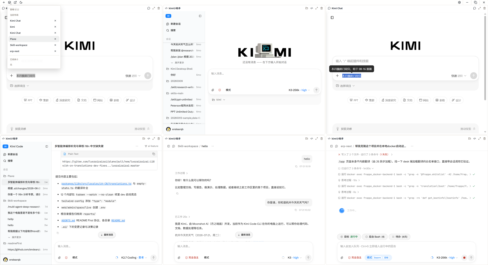
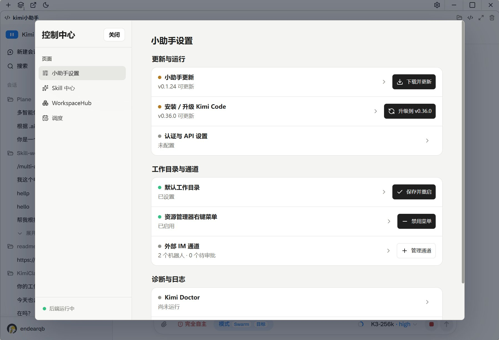
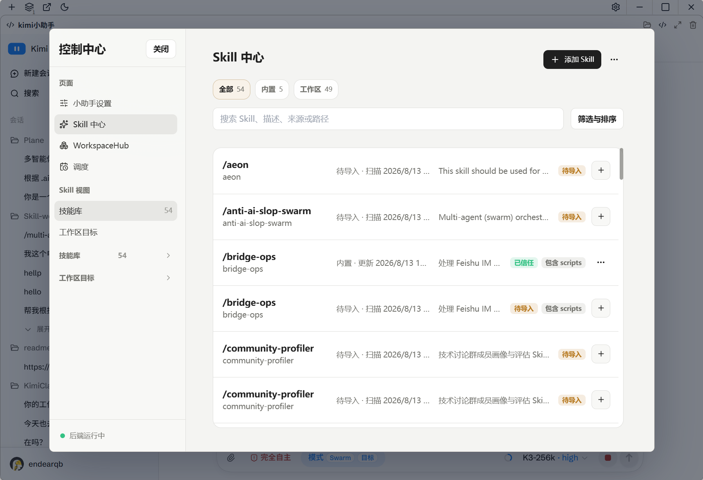
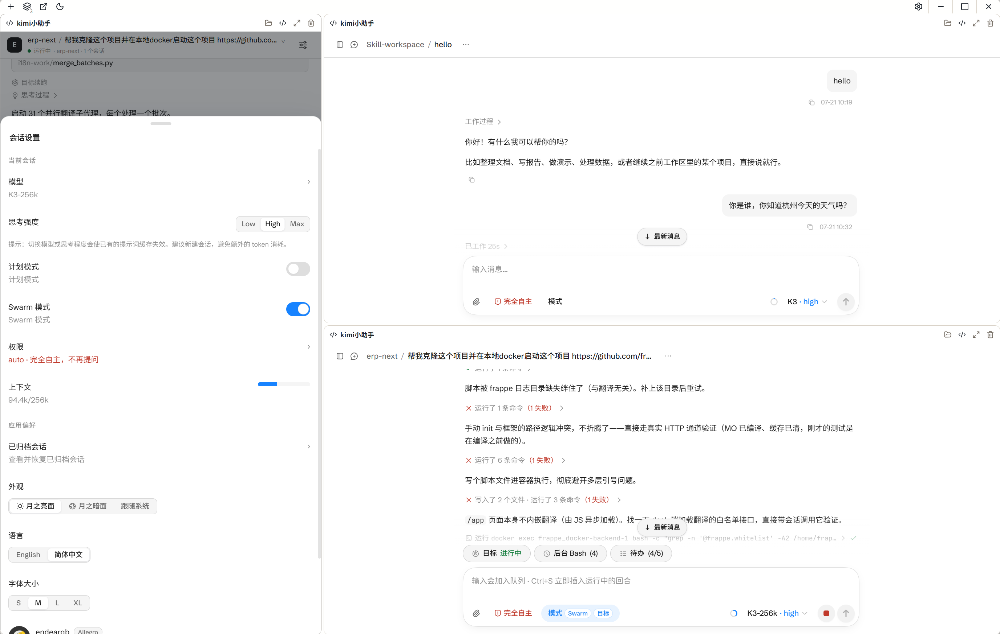

# KickSide 启伴（中文说明）

KickSide 启伴是基于 `Tauri v2 + React` 的 Windows / macOS 桌面工作台，用于托管 `Kimi Code Web` 与 DeepSeek Harness，把启动监控、workspace 壳层、控制中心、日志诊断和安装包输出整合进同一个桌面应用。

## 项目简介

- 应用名称：中文界面 `KickSide 启伴`，系统与英文界面 `KickSide`
- 当前版本：以 `package.json`、`src-tauri/Cargo.toml` 与 `src-tauri/tauri.conf.json` 为准
- 目标平台：Windows x86_64 与 Apple Silicon macOS 13+（NSIS / MSI / app / DMG）
- 核心目标：把 `kimi web --no-open` 的启动、恢复、安装引导、右键入口与桌面体验统一在一个桌面应用中

## 核心能力

- 启动前置页（prefill）：显示启动状态、随机 Tips、失败恢复入口
- Workspace Grid V2 壳层：常驻 `KimiCode` 与 `KimiChat`，标题栏通过纵向 `+` 菜单直接新建带官方品牌图标的窗格；开启 DSH 并完成固定版本安装后，每次点击都会用默认工作目录新增一个 DeepSeek Harness pane，多个 pane 共享同一个受管 DSH 后端。每个 DSH pane 独立观测本窗格当前会话，通过固定版本官方 `session.list` 契约解析绝对 `cwd`，用于 pane header 打开目录及 Pane Shelf 动态目录名；不会用跨窗格 storage 事件串联选择状态。DSH URL/PID/状态不进入 Grid 持久化，关闭任意 pane（包括最后一个）只移除视图；DSH 仅在退出应用或用户在控制中心显式关闭时停止。旧 Agent Room Pane 在加载 state/saved layout 时被移除并修复布局引用。
- 后端守护与健康探测：优先按 `<KIMI_CODE_HOME>/server/instances/*.json` 发现并复用健康的既有 loopback Kimi Server，旧 `server/lock` 仅作兼容 fallback；否则拉起 `kimi web --no-open --port <port>`。用户可临时把 KickSide-owned Kimi 以 `--host 0.0.0.0` 重启用于可信局域网，外部实例永不切换；owned wildcard registry 仍只映射为 loopback health/Bearer probe。应用进程重启后恢复关闭。DSH 始终保持精确 loopback。
- 会话与 workspace 映射：Shell 后端通过 `/api/v1` Bearer 客户端创建/读取 workspace 与 session，Workspace Grid 只使用真实 server session id
- 控制中心：KickSide 设置承载更新、安装/升级、Kimi 原生局域网访问、右键菜单、认证与 API 状态、默认工作目录、外部 IM 通道、Kimi Doctor 和日志；LAN 开关只存在于当前进程，切换 owned Kimi 时先拒绝 running session、失败自动回滚，完整 token URL/二维码只按需存在于内存。DSH 不提供局域网访问。
- Skill Center 与 WorkspaceHub：主视图使用可搜索、可筛选的紧凑目录；Skill 工作区目标合并 discovery index 与 WorkspaceHub 完整注册表并按路径去重；Skill、Harness 模板和已注册工作区详情使用只读文件树与文件预览，工作区文件读取仅允许已注册 workspace id 并受路径、数量和大小限制
- Web 集成收口：Kimi Code 登录验证与 Chat 跨站链接跳系统默认浏览器；Windows 安装版下载使用原生“另存为”。macOS 13 使用 WKWebView 共享 data store，不传仅 Windows 支持的 `dataDirectory`。
- 平台原生体验：macOS 使用原生 traffic lights、App/Edit/View/Window 菜单、关闭主窗口隐藏、Dock reopen 恢复与 Cmd+Q graceful exit；Windows 保持自定义标题栏和 close-to-tray。
- Windows 右键菜单集成：支持目录空白处、文件、文件夹入口，默认使用“KickSide 启伴”名称并可编辑；macOS 不渲染 Explorer 设置项。
- 安装边界：Windows 保留受管安装任务；KickSide NSIS 安装器会精确识别历史 `kimi sidekick` / `Kimi Sidekick` / `kimi小助手` / `Kimi Desktop Shell` 的 NSIS 或 MSI 注册项，交互安装先提示、确认后以保留应用数据的方式卸载旧产品，静默/更新安装自动迁移，失败则停止安装而不产生双份应用；MSI UpgradeCode 显式固定为改名前 `kimi sidekick` 的身份，避免品牌改名让 MSI 被 Windows 识别为第二个产品。macOS 首次安装继续展示/复制官方 native install 命令并可调用系统打开 Terminal.app，但不会自动粘贴或执行远程 pipe；已安装后的升级由原生确认对话框授权，小助手停止 owned `kimi web` 后读取官方 manifest、下载匹配架构的 native binary、校验 SHA-256 并原子替换已验证的 executable，成功复检目标版本后自动重启后端；外部复用实例保持 never-kill。
- 诊断与日志：后端 stdout/stderr 在落盘前脱敏，诊断读取再次脱敏，并提供 Kimi Code Doctor、启动失败原因与恢复操作
- 认证与 API 诊断：控制中心只读展示当前认证模式、Kimi 登录和 Provider API 健康状态；API、模型与 Search / Fetch 服务编辑由 Kimi Code Web 内置设置负责
- 安全退出流程：退出读秒窗 + 状态反馈
- 本体更新：安装版启动后后台检测一次，设置页可选择自动、Gitee（中国大陆）或 GitHub 更新源并手动重检；自动模式并行比较两个源，同版本优先 Gitee。用户确认后下载签名更新，安装前停止 Kimi 后端、DSH owned 实例与 IM Bridge

## 界面预览

六窗格 Workspace Grid：



KickSide 设置：



Skill 中心：



会话设置与并行工作：



## 运行环境

- Node.js 22.19+
- pnpm 10.34.4
- Rust stable
- Go（版本以 `../kimi-im-bridge/go.mod` 为准）
- Windows WebView2 Runtime（Tauri 桌面运行时依赖）
- Apple Silicon macOS 13+；公开签名/公证构建需要完整 Xcode 与 Apple Developer 凭据
- 首个 macOS 验证基线为 Kimi Code 0.34.0；官方默认路径 `~/.kimi-code/bin/kimi`

## 开发命令

在 `apps/kimi-shell` 目录执行：

```bash
pnpm install
pnpm tauri dev
pnpm build
pnpm tauri:build:macos:local
pnpm tauri build
```

可选检查命令：

```bash
pnpm test
pnpm check:nfr:security
pnpm check:nfr:port-conflict
pnpm check:nfr:reliability
pnpm check:kimi-web:visual
```

## 代码组织

- `src/app/useShellController.ts` 保留窗口、workspace、prefill、Skill 动作 handler 与主壳层编排；安装流状态和 handler 放在 `src/app/useInstallController.ts`，轮询放在 `src/app/useShellPollingController.ts`，Bridge 运行态刷新放在 `src/app/useBridgeRuntimeController.ts`，Skill Center 状态和刷新放在 `src/app/useSkillCenterController.ts`，workspace embed URL 与 import picker 状态分别放在 `src/app/useWorkspaceEmbedUrl.ts`、`src/app/useWorkspaceImportController.ts`，默认值/纯转换 helper 放在 `src/app/shellControllerDefaults.ts`。
- DSH 前端状态切片位于 `src/app/useDshController.ts`，IPC 契约位于 `src/services/dshService.ts`；Rust `src-tauri/src/dsh_manager.rs` 负责固定 pin、私有安装、精确 loopback URL、owned process group 和日志，不推广为通用 AgentBackend registry。preflight 分别投影运行就绪与安装就绪：已安装 DSH 只需受支持 Node 即可启动，安装/重装必须选择 Node 与 npm 同目录、launcher 可验证的完整工具链。Windows 优先用同工具链 `node.exe + npm-cli.js`，shim 布局缺少真实 CLI 时才通过已校验的系统 `cmd.exe` 执行固定 npm 命令。安装 UI 通过 Tauri Channel 实时显示阶段与脱敏日志，不称为交互式终端。`src-tauri/src/nodejs_locator.rs` 覆盖 PATH、NVM、Volta、asdf、nodenv、mise、fnm 与平台常见安装路径，但不会把其他 PATH 来源的 npm 配给当前 Node。
- `scripts/dsh_runtime_smoke.mjs` 使用隔离临时前缀与 `DSH_HOME` 验证真实 npm 包、固定入口、精确 loopback HTTP 状态与 DSH 启动页标记 `__DSH_BOOT__`、有界响应/输出、整树停止和端口释放；`--samples 1..10` 可在同一次安装后连续采样并输出 ready/stop 中位数。KickSide 的 DSH 支持矩阵为 Node 22.19+ 的 22.x 或 24+，同时要求 `util.parseEnv` 能力；Node 20.12 仅保留观察性兼容采样。`.github/workflows/dsh-runtime-canary.yml` 在 PR 上阻断 Windows/macOS × Node 22.19/24 的固定 pin smoke，每周/手动再运行 Node 20.12 与 latest 告警。它不覆盖 Rust 生产 launcher 或 WebView2/WKWebView 人工发布门禁。
- DSH 推荐版本固定为 `0.1.0-rc.7`，已验证的 `0.1.0-rc.6` 仍可继续运行，是否升级由用户决定。Shell 启动与 DSH 设置页通过官方 npm metadata 检测本地/推荐/上游版本；发现更新只提示并提供按钮，不改变既有兼容安装的运行资格。一键升级只能安装编译期推荐版本并核对 sha512 integrity；激活后必须通过真实 loopback readiness 与页面身份验证才删除 backup，失败恢复旧安装。上游 `latest` 只作提示，不自动成为安装目标。
- `src/platform/` 只负责加载 additive `PlatformCapabilities` 并提供 fail-closed 平台状态；产品组件不得自行解析 user agent 决定原生能力。
- `src/features/control-center/ControlCenterView.tsx` 保留控制中心 JSX 编排；props 类型、导航项和纯展示 helper 放在 `src/features/control-center/controlCenterViewModel.tsx`；更新与运行等折叠设置行统一复用 `src/components/control-center/ControlCenterSettingsRow.tsx`，业务动作作为独立 trailing control 注入，避免点击更新或开关时误触发展开。
- Kimi 局域网前端状态切片位于 `src/app/useLanAccessController.ts`，IPC 位于 `src/services/lanAccessService.ts`；Rust `src-tauri/src/lan_access.rs` 只投影私有 IPv4 与按需 URL/QR，事务式 owned runtime 切换仍由 `backend_manager` 持有。
- `src-tauri/src/install_manager.rs` 保留 Tauri install command 入口与运行状态管理；安装 catalog、task 和 step 构造放在 `src-tauri/src/install_manager/catalog.rs`；`src-tauri/src/macos_kimi_upgrade.sh` 只负责按 Rust 传入的固定官方 origin、目标版本和已验证路径下载/校验/原子替换 macOS native binary，不执行远程脚本。`src-tauri/windows/nsis-hooks.nsh` 是品牌迁移兼容层，只能匹配已登记的历史产品名并调用其正式卸载器，不得递归删除安装目录或用户数据；`tauri.windows.conf.json` 中的 WiX UpgradeCode 是发布兼容常量，不得随公开品牌名修改。
- `src-tauri/src/commands.rs` 是 Tauri command 注册表；`src-tauri/src/commands/agent_room.rs`、`bridge.rs`、`install.rs`、`skills.rs`、`workspace_grid.rs`、`context_menu.rs` 和 `workspace_import.rs` 承载对应域的 command 实现；`scripts/check_command_registry.mjs` 校验注册命令、owner、窗口 capability、用途说明和 install compat 退出登记。
- Agent Room 已下线并冻结：无设置、标题栏入口、独立窗口、Grid Pane 或可启用 Bridge 路径。旧 command/type 和 V2 输入解析仅作为一个发布周期的兼容墓碑，不得新增功能。
- `src-tauri/src/workspaces.rs` 管理已注册工作区，并通过 `workspace_list_file_entries` / `workspace_read_file` 提供受根目录约束的只读文件预览；前端复用 Skill/Harness 的 `SkillFileEntry` 与 `SkillFileContent` 契约。
- `src-tauri/src/platform.rs`、`menu_manager.rs` 与平台分层 Tauri config 管理原生窗口/菜单能力；`backend_manager/instance_registry.rs` 是 Kimi 新版实例发现入口；`scripts/build_bridge_sidecar.mjs` 生成 Tauri target-triple external binary。
- `src-tauri/src/frame_workspace_bridge.js` 是 Kimi Web / DSH iframe 的唯一 all-frame 产品 bridge：在精确宿主消息契约下同步主题与会话，并对 Kimi Code 启用 fail-open 的窄 pane composer/工作区图标适配、所有宽度下原生消息 TOC 的左侧短条与 hover/focus 向右展开；Header 与左侧 Sessions sidebar 保持上游原样。Windows 文件拖放继续由 WebView2 HTML5 FileList 直达 Kimi；macOS Finder 由 `native_file_drop.rs` 接收 Tao 窗口事件并创建不含路径、30 秒 single-use 的文件句柄 grant，Shell 只在精确 Code pane 落点消费，再以 exact origin + nonce 把 raw bytes 交给 Kimi 自有 file input。旧 workspace HTML injection 不承载新产品行为；workspace proxy 仅在 owned LAN 模式作为随机 loopback CSP/传输适配器。
- `tests/kimi-web-layout/` 是从 Kimi Code `0.36.1` 生产 bundle DOM 契约裁剪的脱敏视觉夹具；`pnpm check:kimi-web:visual` 用本机 Chrome 比较 10 张关键断点截图，不替代 WKWebView/WebView2 的 G3。

## 安全约定

- Tauri CSP、capability 分层、打包资源 allowlist 与 command registry 由 `pnpm check:nfr:security` 守护。
- 自定义 Tauri commands 通过应用 manifest 和分组 permission 显式授权：`main` 使用完整注册表，`prefill` 只使用启动监控与恢复命令，`workspace-import-picker` 只使用导入请求命令。
- 冻结的 Agent Room 兼容代码不具备窗口 capability，Shell 与 Bridge 双端恒定关闭；历史 token/route 约束继续遵守，旧数据不得进入日志或诊断。
- `main` 窗口保留 webview 创建权限；`prefill` 与 `workspace-import-picker` 不共享这组权限，Picker 仅额外持有目录选择所需的 `dialog:allow-open`。
- 外部 iframe 只允许内置 Kimi origin 和 `VITE_KIMI_EXTERNAL_FRAME_ALLOWLIST` 中的精确 origin；任意外部 URL 应通过显式“在浏览器打开”或“在应用窗口打开”动作承载。
- DSH pane 不复用 external allowlist：iframe 与标题栏“在浏览器打开”都只接受 Rust 当前活状态返回的精确 `http://127.0.0.1:<port>`，不提供加载失败时的自动浏览器 fallback，也不持久化 URL/PID/端口；生产启动只执行私有前缀内已校验的固定入口，不使用运行时 npx fallback。
- DSH 当前目录 bridge 只接受精确 iframe window + 当前 DSH loopback origin 的消息，并校验 session id 与绝对目录；iframe 只上报当前会话 id/cwd，不上报 API 响应、凭据或 URL。目录最终仍由 Rust `open_folder` 做存在性与文件夹类型校验。
- `workspaceUrl` 展示面只能使用 redacted 值；带 `kimi_onboarded=1` 与 `#token=` 的 URL 只用于 iframe/embed 导航，其中 session URL 必须同时保留 query 与 fragment，token 不进入诊断、日志或可见文本。
- Kimi 后端 stdout/stderr 必须先脱敏再写入 `backend.log`；日志读取和诊断导出仍需二次脱敏。

## 打包命令

本机 Apple Silicon `.app`（不生成 updater artifact，不要求发布密钥）：

```bash
pnpm tauri:build:macos:local
```

公开 release bundle：

```bash
pnpm tauri build
```

语言定制安装包：

```bash
pnpm tauri build --config src-tauri/tauri.conf.bundle.zh-CN.json
pnpm tauri build --config src-tauri/tauri.conf.bundle.en-US.json
```

默认会同步版本号到 `Cargo.toml` 和 `tauri.conf.json`，并构建前端与 Tauri 安装包。

推送与 `package.json` 版本一致的 `vX.Y.Z` tag 会触发 `.github/workflows/release.yml`：先创建 draft，再并行生成 Windows x86_64 与 macOS arm64 资产，最后合成一个跨平台 `latest.json` 并发布。`0.1.24`、`0.2.0`、`0.2.1`、`0.2.2` 与经 Accepted 决策精确批准的 `0.2.3` 预览版本，其 macOS `.app` / DMG 只使用 Apple Silicon 运行所需的 ad-hoc identity，不包含 Developer ID 身份且不公证；Release 顶部必须标注“⚠️ macOS 版本未签名、未公证”，两端 updater artifact 仍使用 Tauri updater 私钥签名。例外按精确 tag fail-closed，后续版本必须恢复 Developer ID 签名、公证、stapling 及对应验证，或另立 accepted 决策。任一平台失败都不会发布 draft。`0.1.12` 及更早版本需先手动安装一次支持 Updater 的版本。

GitHub 是唯一构建与 canonical Release。发布完成后，workflow 使用 `GITEE_RELEASE_TOKEN` 将相同安装包与 `.sig` 以 prerelease 暂存到 Gitee，逐件匿名回下载校验 SHA-256，最后上传 Gitee 版 `latest.json` 并转为正式 Release；Gitee 不执行第二次构建，镜像失败不会回滚 GitHub Release。

## 安装包位置

构建完成后可在以下目录找到安装包：

- `src-tauri/target/release/bundle/nsis/KickSide_<version>_x64-setup.exe`
- `src-tauri/target/release/bundle/msi/KickSide_<version>_x64_<language>.msi`
- `src-tauri/target/aarch64-apple-darwin/release/bundle/macos/KickSide.app`
- `src-tauri/target/aarch64-apple-darwin/release/bundle/dmg/*.dmg`

`src-tauri/tauri.macos.unsigned.conf.json` 仅供获得 Accepted 决策的精确过渡 tag 使用；当前历史例外为 `v0.1.24`、`v0.2.0`、`v0.2.1`、`v0.2.2`，当前新增精确 `v0.2.3` 例外。它以 ad-hoc identity 保证 Apple Silicon 可运行，不是 Developer ID 签名配置，后续版本不得自动继续使用。

## 发布资料

- 发布说明：`docs/release-notes-*.md`
- 设计文档：`docs/startup-dual-window-handoff.md`

## 常见问题

### 1) 打开应用后停在前置页

- 先点击右上角“打开日志”检查 `backend.log`
- 在失败态尝试“重试启动”或“恢复主窗口”
- 确认本机 `kimi` 可执行文件可被找到，或已在控制中心完成安装

### 2) 保存工作目录或点击“重启后端”后会不会重建窗口

- `0.0.17` 起，主壳层内的 plain “重启后端”已统一为纯后端重启
- 控制中心、loading 页、标题栏和 workspace 空态里的普通重启不会再主动重建 prefill/main 窗口
- 只有启动恢复类场景才会继续走主窗口恢复链路

### 3) Chat 页面下载如何处理

- Windows 安装版会弹原生“另存为”对话框
- 取消或保存都不应该再导致应用卡死
- 若下载异常，可先查看应用日志与系统浏览器行为是否正常

### 4) 右键菜单入口不可用

- 在控制中心检查右键菜单状态
- 如状态异常，执行“应用右键菜单”重新注册
- 重新打开资源管理器后再验证
