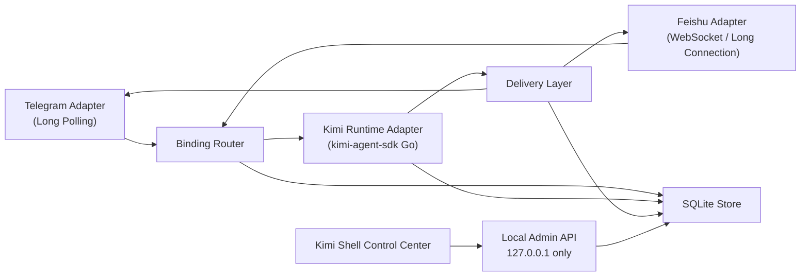

# Kimi IM Bridge 设计方案

## 1. 设计摘要

本方案固定采用以下架构：

- 桌面宿主：`apps/kimi-shell`
- Bridge 运行体：新增 `apps/kimi-im-bridge`
- 生产基线：Go sidecar + 官方 Go SDK
- MVP 渠道：Telegram + 飞书
- 主接入层：`kimi-agent-sdk`
- 协议备选：`kimi acp` 仅保留在备选方案比较中

核心分层如下：

`channel adapters -> binding router -> kimi runtime adapter -> delivery layer -> sqlite store -> tauri control center`

## 2. 设计原则

1. 壳层不接 IM SDK：Tauri 只负责配置、启停、状态、日志、审批兜底。
2. Bridge 独立运行：sidecar 可以无 UI 独立启动，但默认由 shell 托管。
3. 生命周期解耦：bridge 状态与 `kimi web` 状态分离，不复用现有 `BackendState`。
4. 本地优先：admin API 只监听 `127.0.0.1`，所有控制操作经 Rust 中转。
5. 可恢复优先：bindings、offsets、approvals、delivery events 必须持久化。
6. 先做结构，不做堆叠：首版只覆盖 Telegram + 飞书文本链路，不在设计阶段把语音、文件、多模态一并塞入。

## 3. 现有仓库约束

当前仓库已经具备以下可复用基础：

- [项目 README](../README_zh.md) 已明确 `apps/kimi-shell` 是 Windows 桌面壳。
- [settings_store.rs](../apps/kimi-shell/src-tauri/src/settings_store.rs) 已有本地 JSON 设置持久化能力。
- [app_state.rs](../apps/kimi-shell/src-tauri/src/app_state.rs) 已有 app config dir、logs dir 和进程级状态持有能力。
- [ControlCenterView.tsx](../apps/kimi-shell/src/features/control-center/ControlCenterView.tsx) 已有控制中心 UI 宿主。
- [useShellController.ts](../apps/kimi-shell/src/app/useShellController.ts) 已有 Tauri invoke + 前端状态汇总模式。

因此，本方案不新增第二个桌面壳，也不改变现有 `kimi web` 启动职责，而是在现有控制中心中挂接一个平行子系统。

## 4. 总体架构



### 4.1 逻辑职责

- `channel adapters`
  - 接收平台消息
  - 维护平台 offset / 长连接状态
  - 将平台消息转换为统一的 `InboundMessage`
- `binding router`
  - 根据 `BindingKey` 查找或创建 `SessionBinding`
  - 执行去重、恢复、重绑策略
- `kimi runtime adapter`
  - 管理 Kimi session 生命周期
  - 发送 prompt
  - 消费 turn/step 流
  - 提取 approval requests 并 resume
- `delivery layer`
  - typing / processing 提示
  - Markdown 降级
  - 长消息分片
  - outbound 幂等与重试
- `sqlite store`
  - 保存 bindings / offsets / approvals / delivery events / channel health
- `tauri control center`
  - 配置、启停、日志、状态、审批兜底

## 5. 仓库落位

### 5.1 新增目录

新增 `apps/kimi-im-bridge`，建议结构如下：

```text
apps/kimi-im-bridge/
├── cmd/kimi-im-bridge/main.go
├── go.mod
├── internal/
│   ├── admin/
│   ├── adapters/
│   │   ├── telegram/
│   │   └── feishu/
│   ├── binding/
│   ├── runtime/
│   ├── delivery/
│   ├── store/
│   ├── config/
│   ├── logging/
│   └── app/
├── migrations/
└── README.md
```

### 5.2 `apps/kimi-shell` 侧最小改动

`apps/kimi-shell` 只扩展桥接控制面，不嵌入渠道逻辑。建议新增：

- Rust：
  - `src-tauri/src/bridge_manager.rs`
  - `src-tauri/src/bridge_settings_store.rs`
  - `src-tauri/src/bridge_http_client.rs`
  - 在 `types.rs` 中新增 bridge 相关类型
- Frontend：
  - `src/features/bridge/`
  - Control Center 中新增 `IM Channels` 面板

### 5.3 打包落位

发布包中的 sidecar 二进制建议通过 Tauri 资源路径分发到：

```text
apps/kimi-shell/src-tauri/binaries/kimi-im-bridge-x86_64-pc-windows-msvc.exe
```

打包后由 `kimi-shell` 在 runtime 中解析资源路径并托管进程。

## 6. 宿主与 sidecar 边界

### 6.1 Shell 负责

- 保存 `bridge_settings.json`
- 保存 secret 文件
- 启动 / 停止 / 重启 sidecar
- 轮询 sidecar `health/status`
- 展示渠道状态、bindings、approvals、日志
- 提供审批兜底入口

### 6.2 Sidecar 负责

- IM 平台连接与认证
- 消息接收、去重、分发、恢复
- Kimi session 驱动
- SQLite 持久化
- 本地 admin API

### 6.3 明确不做

- 前端浏览器上下文直接访问 Telegram / 飞书网络
- 将 bridge 状态混入现有 `AppStatus.state`
- 将 IM 逻辑合并进 `backend_manager.rs` 现有 `kimi web` 生命周期

## 7. 配置设计

### 7.1 文件布局

Bridge 配置存放在应用配置目录内，与当前 `settings.json` 平行：

```text
<app_config_dir>/
├── settings.json
├── bridge_settings.json
├── bridge_secrets.json
├── bridge.db
└── logs/
    └── bridge.log
```

### 7.2 配置对象

```ts
type BridgeSettings = {
  enabled: boolean;
  adminPort: number;
  autoStart: boolean;
  channels: ChannelConfig[];
  defaultWorkDir?: string;
  logLevel: "info" | "debug";
};

type ChannelConfig = {
  platform: "telegram" | "feishu";
  enabled: boolean;
  accountLabel: string;
  mode: "polling" | "websocket";
};
```

Secret 文件单独存储：

```ts
type BridgeSecrets = {
  telegram?: { botToken: string };
  feishu?: { appId: string; appSecret: string };
};
```

### 7.3 `settings.json` 仅新增轻量引用

现有 `settings.json` 只增加 bridge 入口级字段，不存平台 secret：

- `bridge_enabled`
- `bridge_auto_start`
- `bridge_admin_port_override`（可选）

## 8. 状态与公开接口

### 8.1 Shell 公开类型

```ts
type BridgeRuntimeState =
  | "stopped"
  | "starting"
  | "running"
  | "degraded"
  | "stopping"
  | "crashed";

type BridgeStatus = {
  state: BridgeRuntimeState;
  startedAt?: string;
  pid?: number;
  adminPort?: number;
  version?: string;
  channels: ChannelStatus[];
  pendingApprovals: number;
  bindings: number;
  lastError?: string;
};

type ChannelStatus = {
  platform: "telegram" | "feishu";
  enabled: boolean;
  state: "idle" | "connecting" | "ready" | "degraded" | "error";
  lastInboundAt?: string;
  lastOutboundAt?: string;
  lastOffset?: string;
  lastError?: string;
};

type BindingRecord = {
  bindingId: string;
  platform: "telegram" | "feishu";
  accountId?: string;
  chatId: string;
  threadId?: string;
  kimiSessionId: string;
  workDir?: string;
  createdAt: string;
  updatedAt: string;
  lastInboundMessageId?: string;
};

type ApprovalRecord = {
  approvalId: string;
  kimiSessionId: string;
  platform: "telegram" | "feishu";
  chatId: string;
  threadId?: string;
  requestKind: string;
  prompt: string;
  status: "pending" | "approved" | "denied" | "expired" | "failed";
  createdAt: string;
  resolvedAt?: string;
};
```

### 8.2 Tauri 命令

为避免前端直连 sidecar，Tauri 层暴露以下命令：

- `get_bridge_settings`
- `save_bridge_settings`
- `get_bridge_status`
- `start_bridge`
- `stop_bridge`
- `restart_bridge`
- `list_bridge_bindings`
- `clear_bridge_binding`
- `list_bridge_approvals`
- `resolve_bridge_approval`
- `get_bridge_log_tail`

### 8.3 Sidecar Admin API

Shell 通过 loopback 调用 sidecar admin API，前端不直连。建议接口如下：

- `GET /healthz`
- `GET /api/v1/status`
- `POST /api/v1/runtime/start`
- `POST /api/v1/runtime/stop`
- `POST /api/v1/runtime/restart`
- `GET /api/v1/bindings`
- `DELETE /api/v1/bindings/{binding_id}`
- `GET /api/v1/approvals`
- `POST /api/v1/approvals/{approval_id}/resolve`
- `GET /api/v1/logs/tail?lines=200`

所有请求携带宿主进程启动时生成的 `X-Bridge-Admin-Token`。

## 9. 内部消息模型

### 9.1 InboundMessage

```ts
type InboundMessage = {
  platform: "telegram" | "feishu";
  accountId?: string;
  messageId: string;
  chatId: string;
  threadId?: string;
  senderId: string;
  senderName?: string;
  text: string;
  mentions: string[];
  attachments: InboundAttachment[];
  receivedAt: string;
  rawRef: string;
};
```

### 9.2 BindingKey

```ts
type BindingKey = {
  platform: "telegram" | "feishu";
  accountId?: string;
  chatId: string;
  threadId?: string;
};
```

BindingKey 规则：

- Telegram 私聊：`platform + chatId`
- Telegram forum topic：`platform + chatId + topicId`
- 飞书私聊：`platform + chatId`
- 飞书群线程：`platform + chatId + threadId`

### 9.3 SessionBinding

```ts
type SessionBinding = {
  bindingId: string;
  key: BindingKey;
  kimiSessionId: string;
  workDir?: string;
  source: "auto" | "manual_rebind";
  createdAt: string;
  updatedAt: string;
  lastInboundMessageId?: string;
  lastOutboundMessageId?: string;
};
```

### 9.4 ApprovalTicket

```ts
type ApprovalTicket = {
  approvalId: string;
  kimiSessionId: string;
  turnId: string;
  stepId: string;
  requestKind: string;
  prompt: string;
  platform: "telegram" | "feishu";
  chatId: string;
  threadId?: string;
  status: "pending" | "approved" | "denied" | "expired" | "failed";
  createdAt: string;
  resolvedAt?: string;
};
```

### 9.5 OutboundMessage

```ts
type OutboundMessage = {
  platform: "telegram" | "feishu";
  chatId: string;
  threadId?: string;
  replyToMessageId?: string;
  textChunks: string[];
  markdownMode: "native" | "html" | "plain";
  attachments: OutboundAttachment[];
  dedupeKey: string;
};
```

## 10. 核心流程设计

### 10.1 入站消息流程

1. adapter 接收平台消息
2. adapter 生成 `InboundMessage`
3. adapter 用平台 offset / message id 做第一层去重
4. binding router 生成 `BindingKey`
5. 若 binding 存在，命中对应 `kimiSessionId`
6. 若 binding 不存在，创建新的 Kimi session，并写入 `channel_bindings`
7. runtime adapter 调用 `Session.Prompt(...)`
8. 流式事件交给 delivery layer
9. delivery layer 分片后由 adapter 回发
10. 写入 `delivery_events`

### 10.2 审批流程

1. runtime adapter 从 Kimi turn 中识别 `ApprovalRequest`
2. 写入 `approval_requests`
3. delivery layer 生成平台审批消息：
   - Telegram：inline keyboard
   - 飞书：interactive card / action
4. 用户点击 approve / deny
5. adapter 将平台回调转换为统一的 approval resolve 事件
6. runtime adapter 对应 `resume(...)`
7. 结果更新 `approval_requests.status`
8. 若平台回调失败，Control Center 提供手动处理入口

### 10.3 重启恢复流程

1. sidecar 启动时读取 `bridge.db`
2. 恢复 `channel_offsets`
3. 恢复 `channel_bindings`
4. 恢复 `approval_requests` 中的 pending 项
5. 渠道 adapter 以最近 offset 继续接收
6. 对于未完成 turn，不恢复中间流式状态；仅恢复下次 prompt 仍可命中的 session 关系

## 11. Kimi Runtime Adapter 设计

### 11.1 选择 Go SDK

Go SDK 已明确提供：

- `NewSession(...)`
- `Session.Prompt(...)`
- `Turn.Steps`
- `ApprovalRequest`
- `turn.Err()` / `turn.Result()`

因此 runtime adapter 设计为：

- `SessionRegistry`
  - 保存内存中的活动 session handle
  - 失效时按 `kimiSessionId` 重新创建或恢复
- `TurnRunner`
  - 向 session 发 prompt
  - 消费 steps / messages
  - 输出统一事件流
- `ApprovalCoordinator`
  - 生成 approval ticket
  - 等待 IM 或 shell resolve
  - 调用 `resume(...)`

### 11.2 Session 策略

- 默认一个 `BindingKey` 对应一个 Kimi session
- shell 中允许手动把多个 binding 指向同一 `kimiSessionId`
- 不允许多个活动 turn 并发写入同一 session；同一 session 按队列串行处理

## 12. Delivery Layer 设计

Delivery layer 负责把 runtime 输出变成平台可发送的消息。

### 12.1 主要能力

- 首条 processing / typing 提示
- 文本流拼装
- 平台格式降级
- 长消息分片
- 幂等发送
- 平台速率限制保护

### 12.2 平台格式策略

- Telegram：
  - 首选 HTML / plain text
  - 超长文本按平台限制分片
- 飞书：
  - 首选纯文本或简单卡片
  - 首版不使用复杂富文本模板链路

### 12.3 首版不支持

- 图片上传
- 文件上传
- 语音转写 / 语音回复
- 多媒体 artifact 回传

## 13. SQLite Schema 设计

首版数据库使用 SQLite，启用 WAL。

### 13.1 `bridge_channels`

| 字段 | 类型 | 说明 |
| --- | --- | --- |
| `channel_id` | TEXT PK | 渠道实例 ID |
| `platform` | TEXT | `telegram` / `feishu` |
| `enabled` | INTEGER | 是否启用 |
| `account_id` | TEXT NULL | 平台账号标识 |
| `state` | TEXT | 当前运行状态 |
| `last_offset` | TEXT NULL | 最近位点 |
| `last_error` | TEXT NULL | 最近错误 |
| `last_heartbeat_at` | TEXT NULL | 最近心跳 |
| `created_at` | TEXT | 创建时间 |
| `updated_at` | TEXT | 更新时间 |

### 13.2 `channel_bindings`

| 字段 | 类型 | 说明 |
| --- | --- | --- |
| `binding_id` | TEXT PK | 绑定 ID |
| `platform` | TEXT | 平台 |
| `account_id` | TEXT NULL | 渠道账号 |
| `chat_id` | TEXT | 会话 ID |
| `thread_id` | TEXT NULL | 线程 / topic |
| `kimi_session_id` | TEXT | Kimi session |
| `work_dir` | TEXT NULL | 关联工作目录 |
| `source` | TEXT | `auto` / `manual_rebind` |
| `last_inbound_message_id` | TEXT NULL | 最近入站消息 |
| `last_outbound_message_id` | TEXT NULL | 最近出站消息 |
| `created_at` | TEXT | 创建时间 |
| `updated_at` | TEXT | 更新时间 |

唯一键：

- `UNIQUE(platform, account_id, chat_id, thread_id)`

### 13.3 `channel_offsets`

| 字段 | 类型 | 说明 |
| --- | --- | --- |
| `channel_id` | TEXT | 渠道实例 |
| `offset_kind` | TEXT | `telegram_update` / `feishu_checkpoint` |
| `offset_value` | TEXT | 平台位点 |
| `updated_at` | TEXT | 更新时间 |

主键：

- `PRIMARY KEY(channel_id, offset_kind)`

### 13.4 `bridge_sessions`

| 字段 | 类型 | 说明 |
| --- | --- | --- |
| `kimi_session_id` | TEXT PK | Kimi session ID |
| `work_dir` | TEXT NULL | 工作目录 |
| `last_turn_id` | TEXT NULL | 最近 turn |
| `last_message_at` | TEXT NULL | 最近消息时间 |
| `summary` | TEXT NULL | 可选摘要 |
| `created_at` | TEXT | 创建时间 |
| `updated_at` | TEXT | 更新时间 |

### 13.5 `approval_requests`

| 字段 | 类型 | 说明 |
| --- | --- | --- |
| `approval_id` | TEXT PK | 审批 ID |
| `kimi_session_id` | TEXT | 会话 ID |
| `platform` | TEXT | 平台 |
| `chat_id` | TEXT | 会话 |
| `thread_id` | TEXT NULL | 线程 |
| `request_kind` | TEXT | 审批类型 |
| `prompt` | TEXT | 审批文本 |
| `status` | TEXT | `pending/approved/denied/expired/failed` |
| `request_payload_json` | TEXT | 原始 payload |
| `resolution_payload_json` | TEXT NULL | 处理结果 |
| `dedupe_key` | TEXT | 去重键 |
| `created_at` | TEXT | 创建时间 |
| `updated_at` | TEXT | 更新时间 |
| `resolved_at` | TEXT NULL | 处理时间 |

唯一键：

- `UNIQUE(dedupe_key)`

### 13.6 `delivery_events`

| 字段 | 类型 | 说明 |
| --- | --- | --- |
| `event_id` | TEXT PK | 投递事件 ID |
| `platform` | TEXT | 平台 |
| `chat_id` | TEXT | 会话 |
| `thread_id` | TEXT NULL | 线程 |
| `direction` | TEXT | `outbound` |
| `delivery_key` | TEXT | 幂等键 |
| `source_message_id` | TEXT NULL | 来源消息 |
| `payload_json` | TEXT | 实际发送内容 |
| `status` | TEXT | `sent/failed/skipped` |
| `error_message` | TEXT NULL | 失败原因 |
| `created_at` | TEXT | 创建时间 |
| `updated_at` | TEXT | 更新时间 |

唯一键：

- `UNIQUE(delivery_key)`

## 14. 渠道边界

### 14.1 Telegram

- 接入方式：long polling
- 支持范围：
  - 私聊
  - 基础群聊
  - forum topic 映射到 `threadId`
  - inline approval buttons
- 首版不支持：
  - 语音
  - 图片 / 文件上传回传

### 14.2 飞书

- 接入方式：WebSocket / 长连接
- 支持范围：
  - 私聊
  - 基础群聊
  - thread 作为 `threadId`
  - interactive approval actions
- 首版不支持：
  - 图片 / 文件回传
  - 复杂卡片模板编排

## 15. 安全设计

1. admin API 仅监听 `127.0.0.1`
2. admin API 额外要求 `X-Bridge-Admin-Token`
3. secret 文件与普通配置文件分离
4. 日志默认脱敏：
   - token 只显示前后少量字符
   - approval payload 不原样落完整 secret
5. 前端不直接发平台请求
6. sidecar 不暴露公网 webhook 管理面

## 16. 日志与观测

### 16.1 Sidecar 日志分类

- `runtime`
- `adapter.telegram`
- `adapter.feishu`
- `binding`
- `approval`
- `delivery`
- `store`
- `admin`

### 16.2 Control Center 展示项

- bridge 总状态
- 每个渠道的连接状态
- 最近错误
- bindings 列表
- pending approvals
- 日志 tail

## 17. 备选方案与不采纳原因

### 17.1 把 IM SDK 直接塞进 Tauri UI

不采纳原因：

- UI 生命周期和长连接生命周期耦合
- 平台 SDK、重试和 offset 管理会污染桌面壳
- 错误隔离差，调试和打包更复杂

### 17.2 直接复用通用多 IM bot 平台作为基座

不采纳原因：

- MuseBot 更偏通用机器人平台，不是本地 Kimi runtime bridge
- cc-connect / golembot 很有参考价值，但会把本项目绑定到外部产品架构
- `kimi-app` 已经具备自己的控制中心和打包体系，更适合保留宿主权

### 17.3 首版以 `kimi acp` 为主接口

不采纳原因：

- ACP 更适合标准客户端对接
- IM bridge 是自控两端的本地集成，用 SDK 链路更短
- SDK 已覆盖 session、prompt、approval、streaming 等首版核心能力

## 18. 调研依据 / 参考链接

- [项目中文 README](../README_zh.md)
- [Kimi Desktop Shell README](../apps/kimi-shell/README.md)
- [settings_store.rs](../apps/kimi-shell/src-tauri/src/settings_store.rs)
- [app_state.rs](../apps/kimi-shell/src-tauri/src/app_state.rs)
- [ControlCenterView.tsx](../apps/kimi-shell/src/features/control-center/ControlCenterView.tsx)
- [useShellController.ts](../apps/kimi-shell/src/app/useShellController.ts)
- [OpenClaw Gateway Runbook](https://github.com/openclaw/openclaw/blob/main/docs/gateway/index.md)
- [OpenClaw 聊天渠道](https://github.com/openclaw/openclaw/blob/main/docs/zh-CN/channels/index.md)
- [OpenClaw 渠道路由](https://github.com/openclaw/openclaw/blob/main/docs/zh-CN/channels/channel-routing.md)
- [CodePilot ARCHITECTURE](https://github.com/op7418/CodePilot/blob/main/ARCHITECTURE.md)
- [CodePilot README_CN](https://github.com/op7418/CodePilot/blob/main/README_CN.md)
- [CodePilot Bridge 文档](https://www.codepilot.sh/zh/docs/bridge)
- [DeerFlow Architecture](https://github.com/bytedance/deer-flow/blob/main/backend/docs/ARCHITECTURE.md)
- [DeerFlow issue #1009](https://github.com/bytedance/deer-flow/issues/1009)
- [DeerFlow PR #1010](https://github.com/bytedance/deer-flow/pull/1010)
- [DeerFlow PR #1040](https://github.com/bytedance/deer-flow/pull/1040)
- [cc-connect README](https://github.com/chenhg5/cc-connect)
- [golembot README.zh-CN](https://github.com/0xranx/golembot/blob/main/README.zh-CN.md)
- [MuseBot README_ZH](https://github.com/yincongcyincong/MuseBot/blob/main/README_ZH.md)
- [Kimi Agent SDK README](https://github.com/MoonshotAI/kimi-agent-sdk/blob/main/README.md)
- [Kimi Agent SDK Go quickstart](https://github.com/MoonshotAI/kimi-agent-sdk/blob/main/guides/go/quickstart.md)
- [`kimi acp` 官方文档](https://moonshotai.github.io/kimi-cli/zh/reference/kimi-acp.html)
